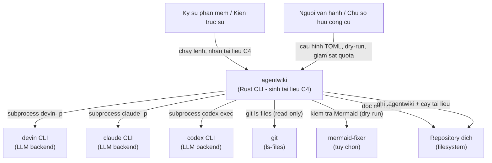
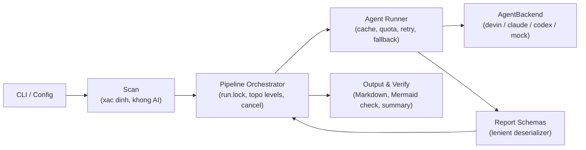

# System Context Overview — Project Overview

## 1. Project Introduction

**agentwiki** là một công cụ dòng lệnh (CLI tool) viết bằng Rust, được viết lại từ deepwiki-rs (Litho), với mục tiêu **tự động sinh tài liệu kiến trúc theo mô hình C4 cho bất kỳ repository mã nguồn nào**.

### Mục tiêu cốt lõi

Người dùng chỉ cần chạy một lệnh `agentwiki` trên một codebase; công cụ sẽ:

1. **Scan** — quét repository một cách xác định (không dùng AI): duyệt file, lọc loại trừ, chấm điểm mức độ quan trọng, trích xuất thống kê tĩnh bằng regex theo ngôn ngữ, dựng cây thư mục.
2. **Research** — chạy một DAG các agent phân tích (system context, domain modules, boundary, database, relationships, dir_summary fan-out) theo tầng topological song song.
3. **Compose** — các agent editor sinh nội dung Markdown (Overview, Architecture, Workflows, Deep-dive).
4. **Write & Verify** — ghi cây tài liệu ra đĩa, kiểm chứng file và cú pháp Mermaid, xuất báo cáo tổng kết.

Kết quả đầu ra là một cây tài liệu Markdown gồm `1.Overview.md`, `2.Architecture.md`, `3.Workflows.md`, `4.Deep-Exploration/*`, `5.Boundary-Interfaces.md`, `6.Database-Overview.md` cùng file tổng kết `__AgentWiki_Summary__.md` và `summary.json`.

### Giá trị kinh doanh

Điểm khác biệt then chốt của agentwiki: **không tốn chi phí API LLM**. Thay vì gọi HTTP API OpenAI-compatible (trả phí theo token), công cụ tận dụng các **agent CLI đã đăng nhập sẵn** trên máy (Devin CLI, Claude Code CLI với Max subscription, Codex CLI) làm backend suy luận, thông qua trait `AgentBackend`. Các cơ chế bảo vệ chi phí/quota gồm:

- **Cache theo hash prompt** (`sha256(prompt‖model‖backend‖SCHEMA_VERSION)`) — chạy lại không tốn cuộc gọi.
- **Daily cap** — giới hạn số cuộc gọi CLI mỗi ngày, kèm audit log `calls.jsonl`.
- **Mock backend** — test pipeline hoàn toàn offline.
- **Lọc biến môi trường billing** — chặn `ANTHROPIC_API_KEY` và tương đương khi spawn subprocess, tránh việc agent CLI lặng lẽ chuyển sang API trả phí.
- **Dry-run** — xem cấu hình hiệu lực và DAG trước khi tiêu quota thật.

Chất lượng đầu ra được đảm bảo bằng JSON schema validation, retry kèm feedback, fallback giữa các model tier, và bộ quy tắc an toàn Mermaid nhúng trong mọi prompt editor.

### Đặc điểm kỹ thuật

- **Ngôn ngữ**: Rust (tokio async, `tokio::process::Command` cho subprocess, `JoinSet` + `Semaphore` cho song song theo tầng topo).
- **Kiến trúc**: pipeline phân tầng một chiều Scan → Research → Compose → Write → Verify; tầng backend theo mẫu **ports-and-adapters** (`AgentBackend` trait + impl devin/claude/codex/mock); tầng `agent/reports` là **anti-corruption layer** với lenient deserializer cách ly JSON "bẩn" của LLM.
- **Không chứa LLM**: toàn bộ reasoning được ủy cho CLI bên ngoài qua subprocess.

## 2. Target Users

### 2.1 Kỹ sư phần mềm / Kiến trúc sư

**Bối cảnh**: cần hiểu nhanh cấu trúc và thiết kế của một codebase — onboard dự án mới, code review, audit kiến trúc, hoặc bàn giao tài liệu.

**Nhu cầu chính**:

- Sinh bộ tài liệu C4 đầy đủ (System Context, Architecture, Workflows, Boundary Interfaces, Database Overview, Deep-dive theo domain module) từ một repository bất kỳ.
- Một lệnh duy nhất, cấu hình linh hoạt qua file TOML, CLI flag và named profile.
- Đầu ra Markdown đọc được ngay, sơ đồ Mermaid hợp lệ cú pháp.

### 2.2 Người vận hành / Chủ sở hữu công cụ

**Bối cảnh**: chạy agentwiki trên VPS hoặc máy cá nhân, chịu trách nhiệm về quota subscription của các agent CLI và chi phí vận hành.

**Nhu cầu chính**:

- Giới hạn số cuộc gọi agent CLI mỗi ngày (`daily cap`) và audit log `calls.jsonl` ghi lại mọi cuộc gọi thật (`CallRecord`).
- Cache kết quả theo nội dung prompt để chạy lại tiết kiệm.
- Chế độ `--dry-run` để kiểm tra cấu hình hiệu lực, danh sách file sẽ quét và DAG agent trước khi chạy thật.
- Đảm bảo biến môi trường billing bị lọc khi spawn CLI con, tránh phát sinh phí API ngoài ý muốn.

### 2.3 Nhóm phụ: CI / Developer của chính agentwiki

Chạy `cargo test` với `MockBackend` (canned response, giả lập lỗi/độ trễ) để kiểm chứng pipeline offline — bao phủ cache, daily cap, cancellation, mutual exclusion và retry mà không cần CLI thật hay mạng.

## 3. System Boundaries

### 3.1 Phạm vi hệ thống

agentwiki bao trọn việc **quét một repository, điều phối DAG các tác vụ phân tích bằng agent CLI, validate output JSON, render và ghi tài liệu C4 dạng Markdown, kiểm chứng kết quả và quản lý cache/quota**. Hệ thống **không thực hiện suy luận LLM trong tiến trình** — toàn bộ reasoning được ủy cho các CLI bên ngoài.

### 3.2 Thành phần nằm TRONG ranh giới (in scope)

| Nhóm | Thành phần |
|---|---|
| Entry | CLI entry và parse tham số (`main.rs`, `cli.rs`) |
| Cấu hình | Nạp/merge cấu hình TOML + CLI overrides + named profiles (`config.rs`) |
| Scan | Duyệt file, lọc loại trừ, chấm điểm importance, trích xuất thống kê regex, cây thư mục (`scanner/`) |
| Agent | DAG spec/registry, runner với cache/quota/retry/fallback, `ResearchContext` chia sẻ, renderer materials (`agent/`) |
| Báo cáo | JSON schema + lenient deserializer cho output LLM (`agent/reports/`) |
| Backend | Trait `AgentBackend` + impl devin/claude/codex/mock, lọc env billing (`backend/`) |
| Pipeline | Điều phối research → compose → write → verify, run-lock chống chạy kép, cancellation, dry-run (`pipeline/`) |
| Output | Renderer Markdown cho boundary/database, ghi cây tài liệu, verify + kiểm tra Mermaid, summary (`output/`) |
| Vận hành | Cache sha256, quota daily cap + audit log, prompt template loader (`cache.rs`, `quota.rs`, `prompt.rs`) |
| Tri thức | Bộ prompt templates Markdown cho research và compose (`prompts/`) |
| Nền tảng | Kiểu lỗi chung (`error.rs`), logging bằng `tracing` |

### 3.3 Thành phần nằm NGOÀI ranh giới (out of scope)

- **Suy luận LLM và các model** — do CLI bên ngoài (devin, claude, codex) thực hiện.
- **Cài đặt, xác thực, quản lý tài khoản** của các agent CLI — người dùng tự đăng nhập trước.
- **Sửa/validate Mermaid chuyên dụng** — chỉ tích hợp `mermaid-fixer` nếu binary có sẵn; mặc định dùng heuristic nội bộ.
- **Giao diện web/UI hay dịch vụ lưu trữ tài liệu** — đầu ra chỉ là file Markdown trên đĩa.
- **Mã nguồn repository được phân tích** — chỉ đọc, tuyệt đối không sửa đổi.
- **Quản lý git history hay CI/CD** của repo đích — `git` chỉ được gọi read-only (`git ls-files`).

## 4. External System Interactions

| Hệ thống ngoài | Vai trò | Cơ chế tương tác |
|---|---|---|
| **devin CLI** | Backend LLM đã xác thực | Subprocess `devin -p` qua `tokio::process::Command`; prompt qua stdin/arg; đọc stdout/stderr; đo duration |
| **claude CLI** | Backend LLM đã xác thực | Subprocess `claude -p`; prompt ghi vào stdin qua `AsyncWriteExt`; đọc stdout |
| **codex CLI** | Backend LLM đã xác thực | Subprocess `codex exec`; prompt qua stdin; lấy last message qua cờ `-o` |
| **git** | Lọc file được track | Gọi `git ls-files` bằng `std::process::Command` trong scanner (tùy chọn, read-only) |
| **mermaid-fixer** | Kiểm tra cú pháp Mermaid | Binary ngoài tùy chọn, chạy dry-run trên thư mục output ở pha verify; vắng mặt thì dùng heuristic nội bộ |
| **Filesystem / repository đích** | Đầu vào và đầu ra | Đọc file bằng walkdir/glob/`include_str!`; ghi cây tài liệu Markdown và trạng thái (`.agentwiki/`: cache, quota state, `calls.jsonl`, `run.lock`) |

Điểm chung: mọi backend LLM đều đi qua **trait `AgentBackend` thống nhất**, được spawn với **môi trường đã lọc biến billing** (`sanitized_env`). Việc chọn backend/model cụ thể do config quyết định qua chuỗi dạng `<backend>:<model>` ánh xạ theo model tier.

## 5. System Context Diagram

**Thông tin chính của sơ đồ**:

- Hai actor con người: người tiêu thụ tài liệu (kỹ sư/kiến trúc sư) và người chịu trách nhiệm vận hành/quota.
- Ba agent CLI đóng vai trò **backend suy luận có thể thay thế lẫn nhau** qua trait `AgentBackend`; runner tự động fallback giữa model tier khi một backend lỗi.
- `git` và `mermaid-fixer` là phụ thuộc **tùy chọn, read-only/dry-run** — hệ thống vẫn hoạt động khi chúng vắng mặt.
- Repository đích vừa là **nguồn đọc** (mã nguồn, README) vừa là **đích ghi** (cây tài liệu + trạng thái `.agentwiki/`).

## 6. Technical Architecture Overview

### 6.1 Luồng pipeline tổng thể

Pipeline thực thi theo **tầng topological** của DAG (`run_level_order` qua `JoinSet`, giới hạn đồng thời bằng `Semaphore`, hủy hợp tác bằng `CancellationToken`). Pha research gồm các spec: `system_context`, `dir_summary` (fan-out theo thư mục), `domain_modules`, `boundary`, `database`, `relationships`. Pha compose gồm các editor: `overview`, `architecture_doc`, `workflow_doc`, `deep_dive`.

### 6.2 Các domain module chính

| Domain | Loại | Vai trò |
|---|---|---|
| Điều phối Pipeline (`src/pipeline`) | Core | Vòng đời sinh tài liệu: `PipelineCtx`, run-lock, lập lịch DAG, dry-run |
| Điều phối Agent & LLM loop (`src/agent`) | Core | AgentSpec/registry, runner engine, `ResearchContext`, prompt materials |
| Quét & Trích xuất (`src/scanner`) | Core | Phase 0 xác định: file walk, regex insights theo ngôn ngữ, cây thư mục |
| Xuất & Kiểm chứng (`src/output`) | Core | Renderer Markdown tất định, writer, verify + Mermaid check, summary |
| Backend CLI (`src/backend`) | Infrastructure | Ports-and-adapters cho devin/claude/codex/mock, `sanitized_env` |
| Báo cáo & anti-corruption (`src/agent/reports`) | Supporting | JSON schema + lenient deserializer cho output LLM |
| Cấu hình, Cache & Quota | Supporting | TOML/CLI merge, sha256 cache, daily cap + `calls.jsonl`, prompt loader |
| Tri thức Prompt (`prompts/`) | Supporting | Template Markdown cho research/compose, kèm quy tắc an toàn Mermaid |
| Kiểm thử & Fixture (`tests/`) | Generic | Offline test bằng MockBackend; E2E gate bởi `AGENTWIKI_E2E`; fixture-app Python |

### 6.3 Quyết định kiến trúc đáng chú ý

- **Không LLM trong tiến trình**: mọi reasoning đi qua subprocess CLI → chi phí API bằng 0, tận dụng subscription sẵn có; đổi lại phải xử lý output không ổn định bằng lenient deserializer và 3 chiến lược trích xuất JSON (strict / fenced / prose-wrapped).
- **Deterministic scan trước, LLM sau**: regex/insights không tốn quota và cho dữ liệu materials nhất quán để nhét vào prompt.
- **Bảo vệ quota là mục tiêu xuyên suốt**: cache → quota check → backend call → `CallRecord` audit, áp dụng ở mọi node của DAG.
- **Run-lock (`run.lock`)** chống hai tiến trình agentwiki chạy đồng thời trên cùng output dir, tự thu hồi lock của pid đã chết.
- **Rủi ro đã biết**: `pipeline/mod.rs` tích tụ nhiều trách nhiệm (context, scheduler, lock, dry-run) — điểm nóng khi mở rộng; độ tin cậy đầu ra phụ thuộc chất lượng agent CLI và prompt template.