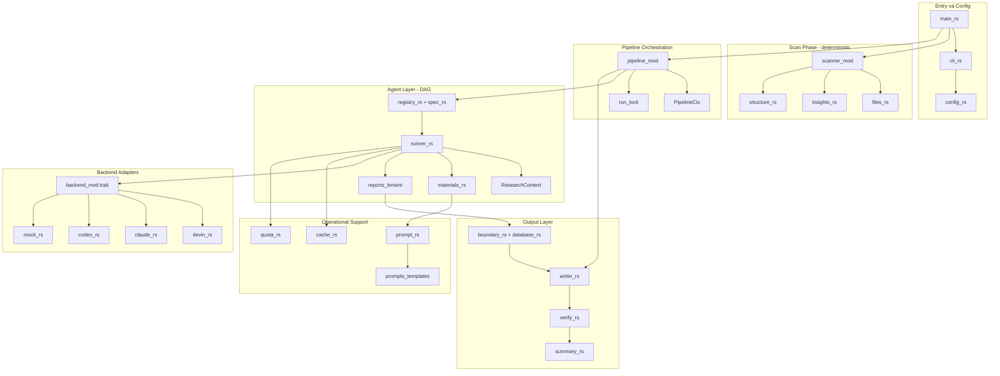
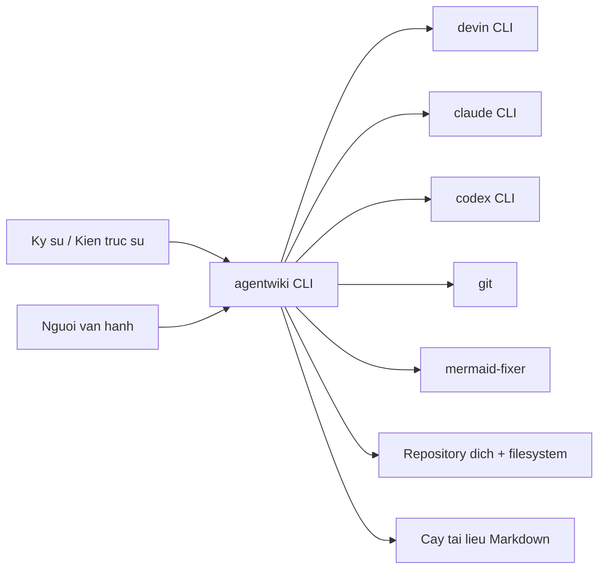
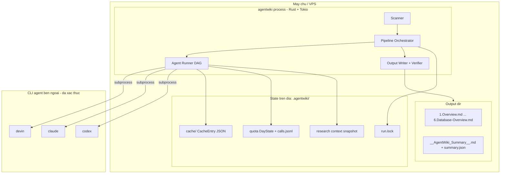
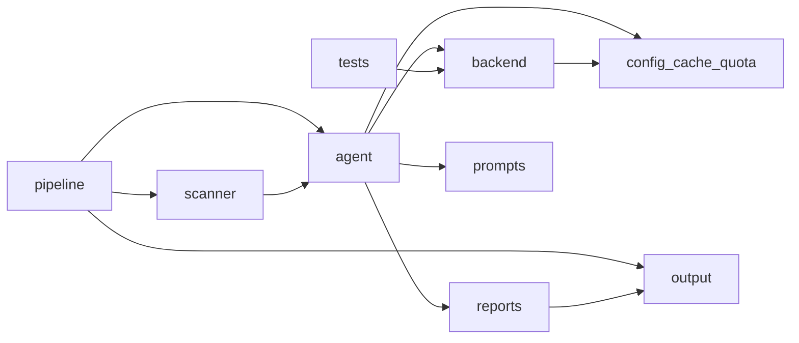
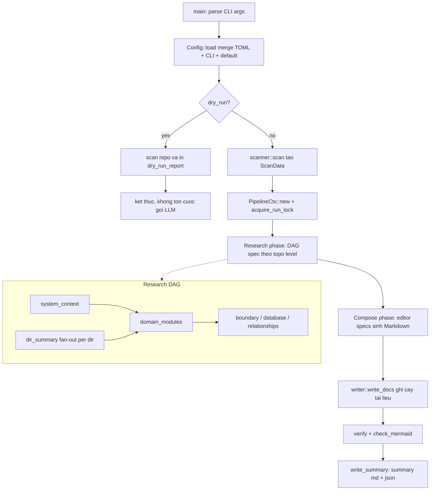
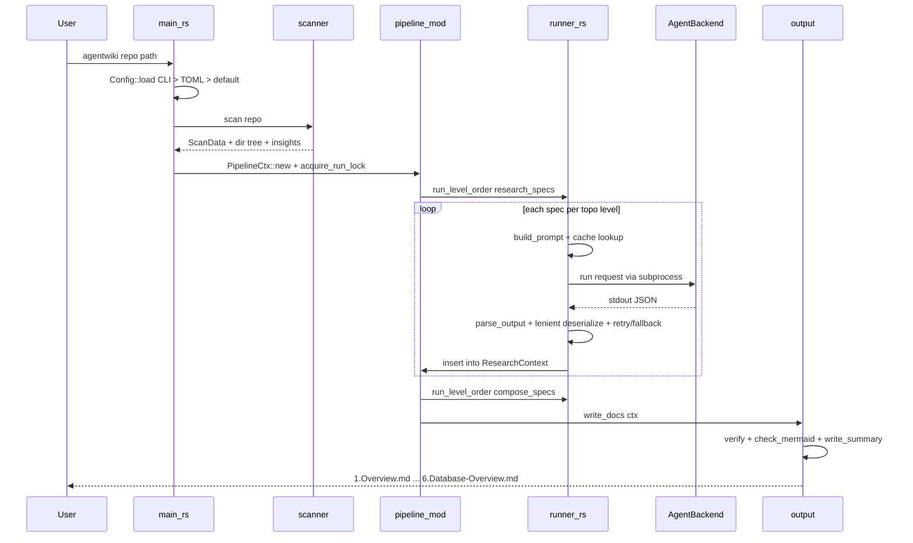
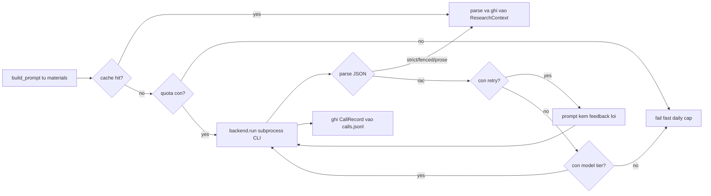

# System Architecture Documentation — agentwiki

## 1. Architecture Overview

`agentwiki` là một công cụ CLI viết bằng **Rust**, viết lại từ deepwiki-rs (Litho), có nhiệm vụ sinh tài liệu kiến trúc kiểu **C4** cho một repository mã nguồn bất kỳ. Điểm khác biệt cốt lõi so với deepwiki-rs: thay vì gọi API LLM trả phí qua HTTP (OpenAI-compatible), agentwiki **ủy toàn bộ suy luận cho các agent CLI đã xác thực sẵn** trên máy — `devin`, `claude`, `codex` — thông qua trait `AgentBackend` theo mô hình **ports-and-adapters**.

### 1.1 Quyết định kiến trúc then chốt

| Quyết định | Lý do | Hệ quả |
|---|---|---|
| LLM reasoning qua CLI subprocess, không qua HTTP API | Bảo vệ quota subscription (Max), tránh chi phí API key | `backend/` là adapter tầng ngoài; `sanitized_env` chặn biến billing |
| Scan phase hoàn toàn xác định (regex, walkdir) | Giảm phụ thuộc LLM, đầu vào ổn định cho prompt | Thay thế `language_processors` nặng nề của deepwiki-rs |
| DAG các AgentSpec theo topological levels | Chạy song song có kiểm soát (JoinSet + Semaphore) | Fan-out `dir_summary` PerDir, `key_module` PerDomain |
| Lenient deserializers + parse đa chiến lược | Output CLI không đảm bảo schema ("JSON bẩn") | `agent/reports/` đóng vai trò anti-corruption layer |
| Cache sha256 + daily cap + audit log | Ba lớp phòng thủ chi phí | Chạy lại gần như miễn phí nếu prompt không đổi |
| MockBackend trong tiến trình | Test offline không cần CLI thật/mạng | `cargo test` luôn xanh; E2E gate bởi `AGENTWIKI_E2E` |

### 1.2 Sơ đồ kiến trúc tổng thể

Luồng phụ thuộc **một chiều, không có chu trình**: Scan → Research → Compose → Write → Verify. `pipeline/` quyết định *khi nào* agent chạy; `agent/runner.rs` quyết định *chạy thế nào* — orchestration và execution tách bạch rõ ràng.

---

## 2. System Context

### 2.1 Phạm vi hệ thống

**Bao gồm:** CLI entry + parse tham số; nạp/merge cấu hình TOML + CLI + named profiles; scanner xác định (duyệt file, lọc loại trừ, importance scoring, regex insights); tầng agent (DAG spec/registry, runner với cache/quota/retry/fallback, `ResearchContext` chia sẻ, materials renderer); schema báo cáo + lenient deserializers; trait `AgentBackend` + impl devin/claude/codex/mock; điều phối pipeline (run-lock, cancellation, dry-run); tầng output (renderer Markdown, writer, verify Mermaid, summary); cache/quota/prompt loader; bộ prompt templates; logging `tracing` + kiểu lỗi chung.

**Không bao gồm:** suy luận LLM (ủy cho CLI ngoài); cài đặt/xác thực tài khoản CLI; sửa Mermaid bằng công cụ chuyên dụng (chỉ tích hợp `mermaid-fixer` nếu có sẵn); UI web hay dịch vụ lưu trữ; sửa đổi repo đích (chỉ đọc); quản lý git history/CI của repo đích.

### 2.2 Tác nhân và hệ thống bên ngoài

| Hệ thống ngoài | Vai trò | Cơ chế tương tác |
|---|---|---|
| `devin` CLI | Backend LLM đã xác thực | Subprocess `devin -p`, prompt qua arg/stdin, đọc stdout/stderr |
| `claude` CLI | Backend LLM đã xác thực | Subprocess `claude -p`, prompt ghi stdin |
| `codex` CLI | Backend LLM đã xác thực | Subprocess `codex exec`, lấy last message qua cờ `-o` |
| `git` | Lọc file git-tracked | `git ls-files` qua `std::process::Command` trong scanner |
| `mermaid-fixer` | Kiểm tra cú pháp Mermaid (tùy chọn) | Gọi binary ngoài ở pha verify; vắng mặt → heuristic nội bộ |
| Filesystem / repo đích | Đầu vào phân tích + đầu ra tài liệu | `walkdir`, `glob`, `include_str!`, fs I/O; state lưu tại `.agentwiki/` |

### 2.3 Người dùng mục tiêu

- **Kỹ sư phần mềm / kiến trúc sư**: cần tài liệu C4 đầy đủ (System Context, Architecture, Workflows, Boundary, Database, Deep-dive) từ một lệnh duy nhất, sơ đồ Mermaid hợp lệ.
- **Người vận hành / chủ sở hữu**: cần daily cap + audit `calls.jsonl`, cache để chạy lại rẻ, `--dry-run` để xem cấu hình/DAG trước, và lọc biến billing để không rơi sang API trả phí.

---

## 3. Container View

agentwiki là **một process CLI đơn** (không có service tách rời). "Container" ở đây là các tiến trình/subprocess và kho dữ liệu mà process điều phối:

| Thành phần | Công nghệ | Trách nhiệm |
|---|---|---|
| `agentwiki` binary | Rust, Tokio, clap, serde/serde_json, walkdir, regex | Toàn bộ pipeline trong một process async |
| `.agentwiki/cache/` | JSON files, key = sha256(prompt‖model‖backend‖SCHEMA_VERSION) | Tránh gọi lại LLM tốn kém |
| `.agentwiki/` quota + `calls.jsonl` | JSONL append | Daily cap + audit mọi cuộc gọi thật |
| `run.lock` | Lock file kèm pid, tự thu hồi khi pid chết | Chống hai tiến trình chạy đồng thời |
| CLI backends | `tokio::process::Command` | devin/claude/codex — suy luận thực tế |
| Output tree | Markdown files | `1.Overview.md` … `4.Deep-Exploration/*`, `5.Boundary-Interfaces.md`, `6.Database-Overview.md` |

---

## 4. Component View

### 4.1 Bản đồ domain

### 4.2 Các domain và module con

**Điều phối Pipeline (`src/pipeline/mod.rs`, `src/main.rs`, `src/lib.rs`)** — Core, importance 9.5
- `PipelineCtx::new`, `backend`, `cache_hit`, `cli_call`, `record`, `load_research`: gom mọi tài nguyên chia sẻ (config, ScanData, cache, quota, prompt loader, Semaphore, backends, CancellationToken) truyền cho từng spec.
- `run`, `run_pipeline`, `research`, `compose`, `run_level_order`: thực thi spec theo tầng topo song song qua `JoinSet`, giới hạn đồng thời bằng `Semaphore`, huỷ hợp tác qua `CancellationToken`.
- `acquire_run_lock`, `dry_run_report`: lock file + báo cáo cấu hình/DAG không tốn cuộc gọi.

**Quét & Trích xuất Mã nguồn (`src/scanner/`)** — Core, importance 8.5
- `files.rs`: `scan_files`, `is_excluded_dir`, `git_tracked_files`, `is_binary_by_content`, `importance` — walkdir + lọc + chấm điểm heuristic.
- `insights.rs`: `extract`, `rules_for`, `cached_regex`, `signature_line` — regex rules per-language (Rust, Python, JS/TS, Go, Java…) trích hàm, kiểu/class, import, LOC, cyclomatic complexity.
- `structure.rs`: `build_structure`, `extract_docs`, `format_as_tree`, `read_capped` — ScanData, README, cây thư mục ký tự, đọc file có giới hạn.

**Điều phối Agent & Vòng lặp LLM (`src/agent/`)** — Core, importance 9.5, phức tạp nhất
- `runner.rs`: `run_spec`, `run_instance`, `build_prompt`, `build_materials`, `parse_output` với `extract_strict` / `extract_fenced` / `extract_prose_wrapped`, `aggregate` — vòng lặp render → cache → quota → backend → parse → retry-with-feedback → fallback tier → `CallRecord`.
- `registry.rs` + `spec.rs`: `all_specs`, `research_specs`, `compose_specs`, `topo_levels`, `expand`, `instance_key`, `schema_spec` — khai báo tĩnh DAG (phase, fan-out PerDir/PerDomain, model tier, materials).
- `context.rs`: `insert`, `get`, `get_typed`, `snapshot`, `save`, `load` — typed store `RwLock<HashMap>` chia sẻ kết quả giữa các node DAG.
- `materials.rs`: `render_material`, `project_structure`, `readme_block`, `code_insights_block`, `relationships_block`, `filtered_insights`, `sort_insights` — biến ScanData thành block văn bản chèn prompt.

**Hợp đồng Báo cáo & Anti-corruption (`src/agent/reports/`)** — Supporting, importance 7.5
- `lenient.rs`: `de_string`, `de_opt_string`, `de_f64`, `de_bool`, `de_vec_string`, `de_vec_obj`, `any_to_string` — ép kiểu JSON "bẩn" thay vì fail.
- `code.rs`: `DirectoryDossier`, `FileInsight`, `CodePurpose` + `map_from_raw` chuẩn hoá nhãn phân loại.
- `research.rs`: `SystemContextReport`, `DomainModulesReport`, `BoundaryAnalysisReport`, `DatabaseOverviewReport`.
- `relationship.rs`: `CoreDependency`, `ArchitectureLayer`, `RelationshipAnalysis`, `DependencyType`.

**Tích hợp Backend CLI (`src/backend/`)** — Infrastructure, importance 9.0
- `mod.rs`: trait `AgentBackend` (`run`, `supports_fs`), `AgentRequest`/`AgentResult`/`TokenUsage`, `BackendKind`, `for_kind`, `parse` chuỗi `<backend>:<model>`, `sanitized_env` chặn biến billing, `tail`.
- `devin.rs` / `claude.rs` / `codex.rs`: `build_cmd` + `run` — spawn subprocess với env đã lọc, đo duration, thu stdout/stderr.
- `mock.rs`: `new`, `with_delay`, `canned`, `run` — scripted responses, giả lập lỗi/độ trễ cho test offline.

**Xuất & Kiểm chứng (`src/output/`)** — Core, importance 8.0
- `writer.rs`: `write_docs`, `write_file`, `sanitize_filename` — ánh xạ tĩnh `DOCS` ctx-key → đường dẫn.
- `boundary.rs`, `database.rs`: render tất định `boundary_doc`, `database_doc`, `cli_section`, `api_section`, `router_section`, `mermaid_id`.
- `verify.rs`, `summary.rs`: `verify`, `md_files`, `check_mermaid`, `run_mermaid_fixer`, `write_summary`.

**Quản lý Cấu hình, Cache & Quota** — Supporting, importance 8.0
- `config.rs` + `cli.rs`: `Config::load`, `apply_toml`, `model_for`, `call_timeout` — merge CLI > TOML > default, named profiles, model-per-tier.
- `cache.rs`: `Cache::new`, `key` (sha256), `get`, `put`.
- `quota.rs`: `Quota::new`, `consume`, `record`, `today_count`, `read_state` — `DayState` + JSONL audit, đồng bộ `tokio::Mutex`.
- `prompt.rs`: `PromptLoader` ưu tiên `prompts_dir`, fallback `include_str!` nhúng; render chỉ thay `{{key}}` đã biết.

**Tri thức Prompt (`prompts/`)** — Supporting: 9 template research + 4 template editors (`overview`, `architecture_doc`, `workflow_doc`, `deep_dive`), tất cả nhúng Mermaid safety rules.

**Kiểm thử (`tests/`)**: `pipeline_offline.rs` (6 test: full pipeline, daily cap, cache lần 2, cancel, mutual exclusion, retry-on-garbage), `e2e_real_cli.rs` (gate `AGENTWIKI_E2E`), `fixture-app/` (Python/SQLite task manager làm đầu vào mẫu).

---

## 5. Key Processes

### 5.1 Workflow chính: sinh tài liệu C4

### 5.2 Sequence: một lần chạy end-to-end

### 5.3 Vòng lặp LLM của Runner (per instance)

---

## 6. Technical Implementation

- **Ngôn ngữ/runtime**: Rust + Tokio (async, `JoinSet`/`Semaphore`/`CancellationToken`/`Mutex`), clap cho CLI, serde/serde_json + custom deserializers, walkdir/glob, regex với `cached_regex`, `include_str!` nhúng prompt fallback, `tracing` logging, kiểu lỗi chung ở `error.rs`.
- **Mở rộng (extension points)**: thêm backend = implement `AgentBackend` + đăng ký `BackendKind`/`for_kind`; thêm tác vụ phân tích = khai báo `AgentSpec` trong registry + template prompt + schema report; thêm tài liệu đầu ra = editor spec + entry trong ánh xạ `DOCS`.
- **Hiệu năng**: fan-out PerDir/PerDomain khiến số instance tỷ lệ kích thước repo — được kìm bởi `Semaphore` và daily cap; cache sha256 giúp chạy lại gần như miễn phí; `read_capped` và giới hạn materials chống prompt phình.
- **Bảo mật/chi phí**: `sanitized_env` lọc biến billing khỏi subprocess (tránh rơi sang API trả phí); `run.lock` mutual exclusion; không ghi gì vào repo đích ngoài `.agentwiki/` và output dir.
- **Drift đã ghi nhận**: `src/verify/` tồn tại nhưng rỗng (verify thật ở `src/output/verify.rs` — nên xoá); `src/progress.rs` và `src/util.rs` chưa nằm trong domain map; `pipeline/mod.rs` (~349 dòng) tích tụ nhiều trách nhiệm — ứng viên tách `context.rs`/`lock.rs` khi phình thêm; cặp `reports.rs` + `reports/` hợp lệ nhưng hơi khó đọc.

## 7. Deployment Architecture

- **Môi trường**: VPS Linux (ruan-dev), chạy dưới user thường — không sudo, không systemd system; nếu cần chạy định kỳ dùng `setsid nohup`, systemd --user (Linger), hoặc đăng ký OpenHands Automate (custom tarball + `bash run.sh`).
- **Phân phối**: một binary Rust duy nhất; prompt templates có thể nằm ngoài (`prompts/`) hoặc dùng bản nhúng — binary vẫn chạy khi thiếu thư mục prompts.
- **Phụ thuộc runtime**: ít nhất một trong `devin` / `claude` / `codex` CLI đã đăng nhập; `git` (tùy chọn, cho chế độ git-tracked-only); `mermaid-fixer` (tùy chọn, verify nâng cao).
- **State**: `.agentwiki/` trong repo đích chứa `cache/`, quota `DayState`, `calls.jsonl`, `run.lock`, snapshot `ResearchContext` — cho phép resume/audit và chạy lại rẻ.
- **Vận hành**: dùng `--dry-run` trước lần chạy thật để kiểm tra config hiệu lực và DAG; theo dõi `calls.jsonl` để audit quota; `summary.json` + `__AgentWiki_Summary__.md` là điểm kiểm tra kết quả cuối mỗi run; E2E thật chỉ bật khi set `AGENTWIKI_E2E`.