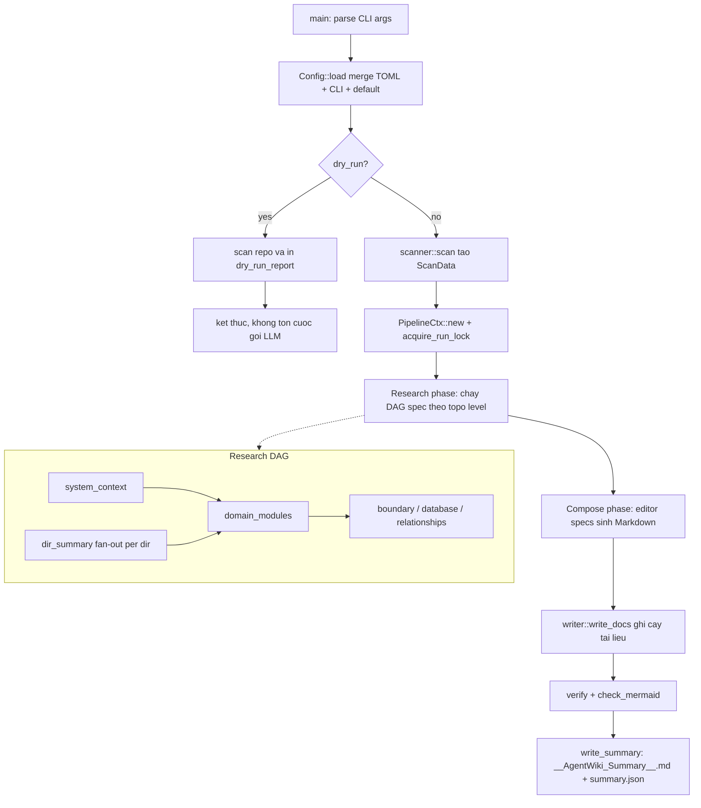
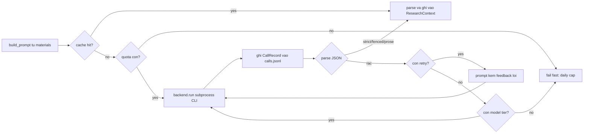
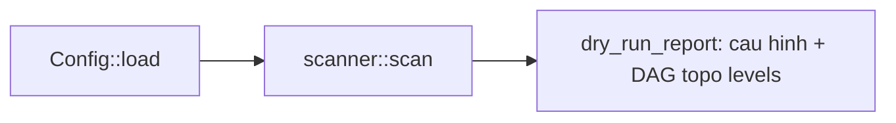
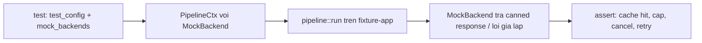
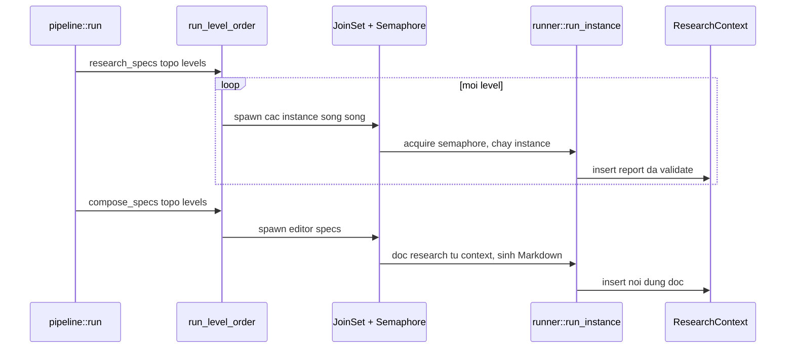
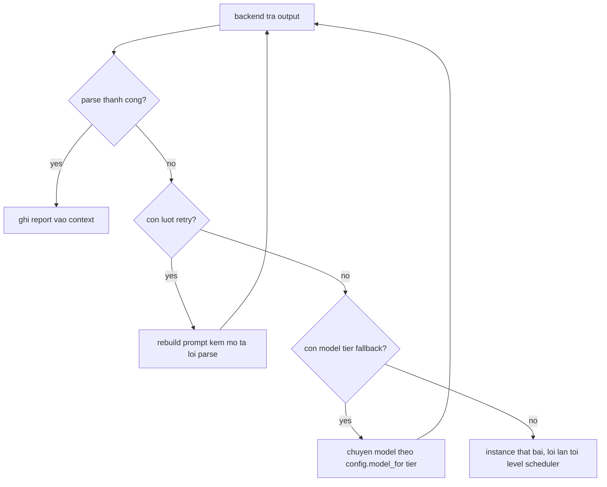

# Core Workflows

Tài liệu này mô tả các luồng công việc cốt lõi của **agentwiki** — một CLI tool Rust sinh tài liệu kiến trúc kiểu C4 cho một repository bất kỳ. Điểm đặc biệt của hệ thống: toàn bộ suy luận LLM được ủy quyền cho các agent CLI đã xác thực bên ngoài (`devin`, `claude`, `codex`) thông qua subprocess, còn agentwiki đóng vai trò điều phối pipeline, validate output và render tài liệu — không tiêu tốn chi phí API LLM.

## 1. Workflow Overview

### 1.1 Sơ đồ tổng quan pipeline

Pipeline chính gồm 5 pha một chiều, không có chu trình phụ thuộc:



### 1.2 Phân chia trách nhiệm hai tầng điều phối

Hệ thống tách bạch rõ hai mức điều phối:

- **`src/pipeline/mod.rs` (PipelineCtx + DAG scheduler)**: quyết định *khi nào* agent nào chạy — theo tầng topological của DAG, song song qua `JoinSet`, giới hạn đồng thời bằng `Semaphore`, huỷ hợp tác qua `CancellationToken`.
- **`src/agent/runner.rs` (Runner)**: quyết định *chạy thế nào* — vòng lặp agentic per instance: render prompt → cache → quota → backend → parse JSON → retry/fallback → ghi audit.

### 1.3 Bốn lớp bảo vệ chi phí

Bảo vệ quota của subscription CLI là mục tiêu xuyên suốt, được cài thành 4 lớp phòng thủ:

| Lớp | Cơ chế | Vị trí |
|-----|--------|--------|
| 1 | Content cache `sha256(prompt‖model‖backend‖SCHEMA_VERSION)` | `src/cache.rs` |
| 2 | Daily cap + audit log `calls.jsonl` | `src/quota.rs` |
| 3 | Lọc biến môi trường billing trước khi spawn subprocess | `src/backend/mod.rs::sanitized_env` |
| 4 | `--dry-run` xem cấu hình + DAG trước khi chạy thật | `src/pipeline/mod.rs::dry_run_report` |

## 2. Main Workflows

### 2.1 Sinh tài liệu C4 đầy đủ cho một repository

**Entry point**: `src/main.rs::main`. **Importance**: 10.0.

Đây là business flow trung tâm. Kết quả cuối cùng là cây tài liệu `1.Overview.md` → `6.Database-Overview.md` kèm `__AgentWiki_Summary__.md` và `summary.json`.

#### Các bước thực thi

| # | Bước | Entry point | Mục đích |
|---|------|-------------|----------|
| 1 | Nạp cấu hình | `config.rs::Config::load` | Merge theo thứ tự CLI > TOML > default; resolve named profile và ánh xạ model theo tier |
| 2 | Quét repo | `scanner::scan` | Duyệt file xác định (không AI), lọc loại trừ, chấm điểm importance, trích xuất statics bằng regex |
| 3 | Khởi tạo context + lock | `PipelineCtx::new`, `acquire_run_lock` | Gom tài nguyên chia sẻ (cache, quota, prompts, semaphore, backends); `run.lock` chống chạy kép |
| 4 | Research phase | `runner::run_spec` | Chạy các spec theo tầng topo: `system_context`, `dir_summary` (fan-out PerDir), `domain_modules`, `boundary`, `database`, `relationships` |
| 5 | Gọi backend | `AgentBackend::run` | Spawn `devin -p` / `claude -p` / `codex exec` với env đã lọc billing |
| 6 | Validate output | `agent/reports/*` deserializers | Normalize JSON "bẩn" của LLM thành report có schema, ghi vào `ResearchContext` |
| 7 | Compose phase | `registry::compose_specs` | Các editor spec (`overview`, `architecture`, `workflows`, `deep-dive`) đọc research và sinh Markdown |
| 8 | Ghi tài liệu | `output/writer.rs::write_docs` | Render tất định boundary/database + ghi cây Markdown theo ánh xạ ctx-key → đường dẫn |
| 9 | Kiểm chứng | `verify` + `write_summary` | Đối chiếu file kỳ vọng, kiểm tra Mermaid (heuristic hoặc `mermaid-fixer`), xuất summary |

### 2.2 Vòng lặp gọi LLM của Runner (per agent instance)

Đây là sub-process quan trọng nhất — vòng đời của mỗi node trong DAG:



Thứ tự kiểm tra có chủ đích: **cache trước, quota sau** — cache hit không consume quota và không ghi audit, vì không phát sinh cuộc gọi thật.

### 2.3 Dry-run

**Entry point**: `src/main.rs::main` với `args.dry_run`. Cho phép người vận hành kiểm tra cấu hình hiệu lực, danh sách file sẽ quét và DAG topo levels trước khi tiêu tốn một cuộc gọi CLI nào.



### 2.4 Kiểm thử pipeline offline (MockBackend)

**Entry point**: `cargo test` → `tests/pipeline_offline.rs`. `MockBackend` được inject vào `PipelineCtx`, trả canned response và giả lập lỗi/độ trễ — kiểm chứng cache, daily cap, cancellation, mutual exclusion và retry mà không cần CLI thật hay mạng. Test E2E với CLI thật (`tests/e2e_real_cli.rs`) mặc định `ignore`, chỉ chạy khi bật `AGENTWIKI_E2E` để bảo vệ quota.



## 3. Flow Coordination and Control

### 3.1 Lập lịch DAG theo tầng topological

`registry.rs::topo_levels` tính các level của DAG từ danh sách `AgentSpec` tĩnh. `run_level_order` thực thi từng level: các spec trong cùng level chạy song song qua `JoinSet`, level sau chỉ bắt đầu khi level trước hoàn tất — vì output của level trước là materials đầu vào của level sau (ví dụ `domain_modules` cần `system_context` + `dir_summary`).



### 3.2 Fan-out theo cấu trúc repository

Hai cơ chế mở rộng instance động:

- **`PerDir`** (`dir_summary`): số instance tỷ lệ với số thư mục được quét — mỗi thư mục một `DirectoryDossier`.
- **`PerDomain`** (`key_module`, deep-dive): số instance tỷ lệ với số domain module mà `domain_modules` report trả về.

`instance_key` đảm bảo mỗi instance có cache key và context key riêng. `Semaphore` kìm hãm độ song song để tránh quá tải quota.

### 3.3 ResearchContext — kho chia sẻ có kiểu

`src/agent/context.rs` là `RwLock<HashMap>` bất đồng bộ đóng vai trò data bus giữa các node DAG:

- `insert`/`get_typed`: ghi/đọc report có kiểu sau khi qua lenient deserializer.
- `snapshot`/`save`/`load`: persist trạng thái ra `.agentwiki/` — cho phép pipeline phục hồi và inspect sau chạy.
- Ánh xạ ctx-key → đường dẫn file được định nghĩa tĩnh trong `writer.rs::DOCS`, sanitize tên file cho tài liệu sinh động (deep-dive per module).

### 3.4 Khoá chạy và mutual exclusion

`acquire_run_lock` tạo file `run.lock` trong `.agentwiki/` chứa pid tiến trình. Nếu lock tồn tại nhưng pid đã chết, lock bị thu hồi (stale-lock reclamation); nếu pid còn sống, lần chạy thứ hai bị từ chối — được kiểm chứng bởi test `second_concurrent_run_refused`.

### 3.5 Cancellation

`CancellationToken` trong `PipelineCtx` cho phép huỷ hợp tác: scheduler kiểm tra token giữa các level, mỗi instance kiểm tra trước khi spawn subprocess. Test `cancel_aborts_mid_flight` xác nhận chạy đang lơ lửng bị abort sạch.

## 4. Exception Handling and Recovery

### 4.1 Chiến lược parse đa tầng cho output LLM

Output của CLI agent không đảm bảo schema, nên `parse_output` thử ba chiến lược theo thứ tự độ chặt giảm dần:

1. **`extract_strict`**: parse thẳng `serde_json` — đường nhanh khi agent trả JSON sạch.
2. **`extract_fenced`**: trích khối ```json fenced code block trong prose.
3. **`extract_prose_wrapped`**: quét prose để tìm JSON object bao quanh.

Sau đó **lenient deserializer** (`reports/lenient.rs`: `de_string`, `de_f64`, `de_bool`, `de_vec_obj`, `any_to_string`…) ép kiểu khoan dung — chấp nhận chuỗi/số/object lẫn lộn, biến kiểu sai thành giá trị hợp lệ thay vì fail. Đây là lớp anti-corruption cách ly JSON "bẩn" khỏi tầng output thuần Rust.

### 4.2 Retry-with-feedback và fallback model



- **Retry-with-feedback**: prompt lần sau kèm mô tả lỗi parse — cho agent cơ hội tự sửa định dạng (test: `retry_on_garbage_then_success`).
- **Fallback tier**: hết retry thì chuyển sang model tier khác theo `Config::model_for` trước khi tuyên bố thất bại.
- **Quota hết**: `Quota::consume` fail fast — không retry vì đây là giới hạn nghiệp vụ, không phải lỗi nhất thời (test: `daily_cap_blocks_calls`).

### 4.3 Fault tolerance ở tầng hệ thống

| Lỗi | Cơ chế xử lý |
|-----|--------------|
| Hai tiến trình đồng thời | `run.lock` + stale-pid reclamation |
| Subprocess CLI chết/timeout | `call_timeout` từ Config; stderr thu về `AgentResult` để chẩn đoán |
| Biến billing rò rỉ vào env con | `sanitized_env` xoá biến API-key trước khi spawn — tránh API trả phí |
| `mermaid-fixer` vắng mặt | Dependency mềm: verify fallback về heuristic nội bộ `check_mermaid` |
| Crash giữa chừng | Cache + `ResearchContext::load` cho phép chạy lại không tốn lại cuộc gọi đã thành công |

### 4.4 Verify sau khi ghi

`output/verify.rs::verify` đối chiếu file đã ghi với danh sách kỳ vọng (phát hiện doc bị thiếu do instance compose thất bại) và kiểm tra cú pháp Mermaid trong mọi `.md` — trước khi `write_summary` chốt kết quả vào `summary.json`.

## 5. Key Process Implementation

### 5.1 Phase 0 — Scan xác định (`src/scanner/`)

Chạy trước mọi pha AI, hoàn toàn deterministic:

1. `files.rs::scan_files`: walkdir duyệt cây, `is_excluded_dir` lọc thư mục loại trừ, `is_binary_by_content` loại file nhị phân, tuỳ chọn `git_tracked_files` chỉ giữ file git theo dõi, `importance` chấm điểm heuristic.
2. `insights.rs::extract`: `rules_for` chọn bộ regex theo ngôn ngữ (Rust/Python/JS-TS/Go/Java…), trích hàm/kiểu/import/metrics (LOC, cyclomatic) qua `cached_regex`.
3. `structure.rs::build_structure`: nhóm file theo thư mục thành `ScanData`, `extract_docs` đọc README, `format_as_tree` render cây ký tự cho prompt, `read_capped` giới hạn ký tự/file.

`ScanData` là đầu vào bắt buộc cho mọi pha sau — cả dry-run và offline test đều tái dùng đúng bước này.

### 5.2 Render materials và prompt (`src/agent/materials.rs` + `src/prompt.rs`)

`build_materials` biến `ScanData`, dossier, insights, relationships thành block văn bản (`project_structure`, `readme_block`, `code_insights_block`, `relationships_block`) với giới hạn độ dài và `sort_insights`/`filtered_insights` ưu tiên file quan trọng. `PromptLoader` ưu tiên file trong `prompts_dir` (override vận hành) rồi fallback template nhúng `include_str!`; `render` chỉ thay `{{key}}` đã biết — không template engine phức tạp, tránh lỗi injection.

### 5.3 Backend subprocess (`src/backend/`)

Mô hình ports-and-adapters: trait `AgentBackend` thống nhất `run(AgentRequest) -> AgentResult`, `kind()`, `supports_fs()`. `for_kind` là factory parse chuỗi `"<backend>:<model>"`. Ba adapter thật khác nhau ở cơ chế I/O:

| Backend | Lệnh | Prompt | Kết quả |
|---------|------|--------|---------|
| devin | `devin -p` | arg/stdin | stdout |
| claude | `claude -p` | stdin qua `AsyncWriteExt` | stdout |
| codex | `codex exec` | stdin | last message qua cờ `-o` |

`sanitized_env` chạy trước mọi spawn — xoá biến billing để CLI dùng subscription đã xác thực thay vì chuyển sang API trả phí. `tail` cắt stderr giữ log gọn.

### 5.4 Write & Verify (`src/output/`)

- `writer.rs::write_docs`: ánh xạ tĩnh `DOCS` (ctx-key → `1.Overview.md`…`4.Deep-Exploration/*`), `sanitize_filename` cho tên động.
- `boundary.rs`/`database.rs`: renderer tất định biến `BoundaryAnalysisReport`/`DatabaseOverviewReport` thành Markdown (sections CLI/API/router; bảng/view/procedure/data flow; `mermaid_id` sinh node ID ASCII an toàn).
- `verify.rs::verify` → `summary.rs::write_summary`: đối chiếu kỳ vọng, `check_mermaid` heuristic hoặc `run_mermaid_fixer` nếu binary có sẵn, xuất `__AgentWiki_Summary__.md` + `summary.json`.

### 5.5 Điểm mở rộng và rủi ro

- **Mở rộng chính**: thêm backend mới = implement `AgentBackend` + đăng ký trong `for_kind`; thêm tác vụ phân tích = khai báo `AgentSpec` trong `all_specs` + prompt template — không đổi scheduler hay runner.
- **Rủi ro tập trung**: `src/pipeline/mod.rs` tích tụ nhiều trách nhiệm (context, scheduler, lock, dry-run) — ứng viên tách module nếu pipeline phình to.
- **Dependency mềm**: `mermaid-fixer` vắng mặt thì verify chỉ còn heuristic — chất lượng kiểm chứng Mermaid giảm nhưng pipeline không hỏng.