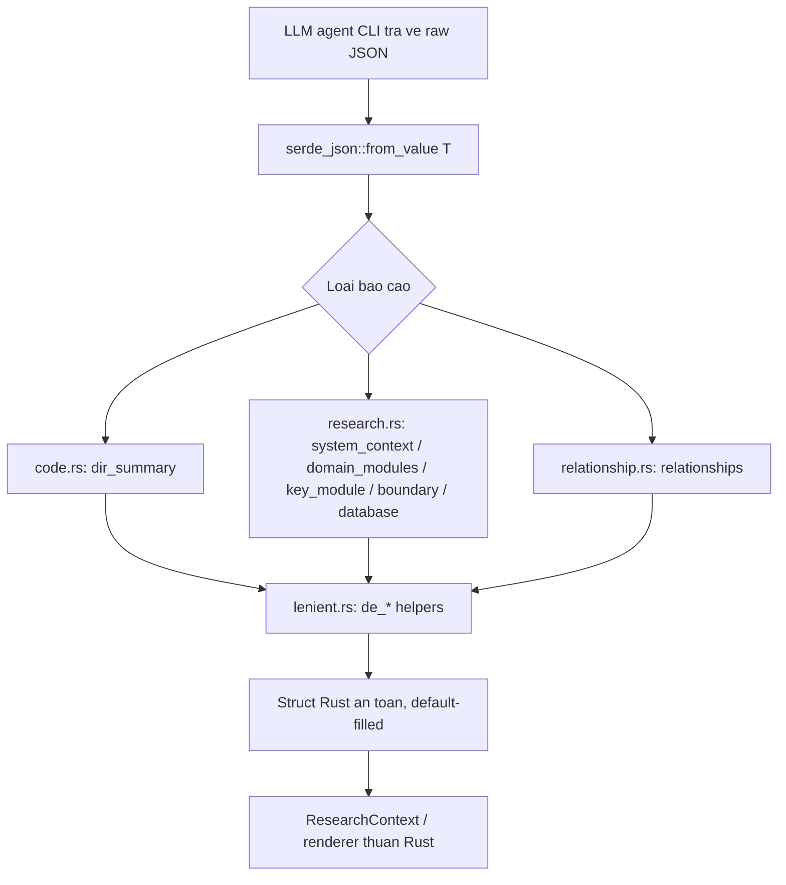
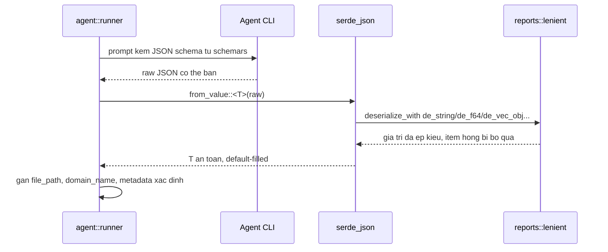

# agent::reports — Lớp Anti-Corruption cho Output LLM

## 1. Mục đích module

`src/agent/reports.rs` cùng thư mục `src/agent/reports/` là **lớp anti-corruption duy nhất** nằm giữa output JSON "bẩn" do các agent CLI (devin/claude/codex) trả về và pipeline Rust thuần của agentwiki. Module giải quyết hai vấn đề đối lập nhau trong một chỗ:

- **Chiều lên (prompt)**: mọi struct report đều derive `schemars::JsonSchema`, nên schema JSON chuẩn được nhúng vào prompt để hướng dẫn model trả về đúng hình dạng.
- **Chiều xuống (parse)**: dù schema đã được đưa vào prompt, CLI agent vẫn thường xuyên trả JSON sai kiểu — `"8"` thay cho số, `{"name": ...}` thay cho chuỗi, chuỗi trần trong mảng object, enum viết linh tinh. Module định nghĩa bộ deserializer khoan dung (`lenient.rs`) biến các hình dạng đó thành giá trị hợp lệ thay vì fail, kết hợp `#[serde(default)]` để field thiếu tự nhận giá trị mặc định.

Kết quả: phía dưới (runner, renderer output, ResearchContext) chỉ làm việc với struct Rust type-safe; mọi sự "bẩn" của LLM bị hấp thụ tại ranh giới này.

## 2. Cấu trúc nội bộ

Module gồm 1 file gốc re-export và 3 file schema dùng chung 1 nền tảng lenient:

| File | Vai trò | Struct/enum chính |
|---|---|---|
| `reports.rs` (22 dòng) | Facade: `pub use` toàn bộ API — consumer chỉ cần `agent::reports::X` | — |
| `reports/lenient.rs` (206 dòng) | Nền tảng ép kiểu JSON thuần hàm, dùng chung mọi schema | `de_string`, `de_opt_string`, `de_f64`, `de_usize`, `de_u8`, `de_bool`, `de_vec_string`, `de_vec_obj`, `any_to_string`, `json_value_to_string` |
| `reports/code.rs` (442 dòng) | Schema cho fan-out `dir_summary` | `DirectorySummaryResponse`, `FileInsight`, `InterfaceInfo`, `ParameterInfo`, `Dependency`, `DirectoryDossier`, enum `CodePurpose` (25 variant), `DirectoryPurpose`, `classify_directory_purpose` |
| `reports/research.rs` (1097 dòng) | 5 report nghiên cứu lớn + ~25 struct con | `SystemContextReport`, `DomainModulesReport`, `KeyModuleReport`, `BoundaryAnalysisReport`, `DatabaseOverviewReport`, enum `ProjectType` |
| `reports/relationship.rs` (154 dòng) | Report đồ quan hệ phụ thuộc | `RelationshipAnalysis`, `CoreDependency`, `ArchitectureLayer`, enum `DependencyType` |

## 3. Các interface chính

### 3.1 Nền tảng lenient — chiến lược "không bao giờ fail"

Tất cả hàm `de_*` có chữ ký serde `deserialize_with` chuẩn và đều deserialize input thành `serde_json::Value` trước rồi mới ép kiểu:

- `json_value_to_string`: như `any_to_string` nhưng **đào sâu object** tìm field văn bản theo thứ tự ưu tiên `name → module → path → summary → description → title → value → text → id`; không tìm được thì serialize cả object. Đây là chìa khóa xử lý kiểu `{"text": "core logic"}` mà model hay trả.
- `de_string` / `de_opt_string`: mọi giá trị → `String` / `Option<String>` (chuỗi rỗng → `None`).
- `de_f64` / `de_usize` / `de_u8`: chấp nhận number, chuỗi số, bool; kèm clamp (`usize ≥ 0`, `u8` clamp 0..=255).
- `de_bool`: nhận bool, số khác 0, và chuỗi `"true"|"1"|"yes"|"y"` (không phân biệt hoa thường).
- `de_vec_string`: mảng → lọc phần tử rỗng; scalar đơn lẻ → vec 1 phần tử; null → vec rỗng.
- `de_vec_obj<T, F>`: cốt lõi của các mảng struct. Từng phần tử object được `serde_json::from_value::<T>` riêng lẻ — **item hỏng bị bỏ qua, không làm fail cả mảng**. Phần tử không phải object (chuỗi trần…) được cứu qua closure `fallback` (thường gán vào field `name`/`command`/`endpoint`…). Object đơn lẻ cũng được bọc thành vec 1 phần tử.

### 3.2 Enum label mapping (`map_from_raw`)

Model thường trả nhãn enum tự do (`"entry point"`, `"function call"`, `"BackendService"`). Ba enum có mapper normalize:

- `CodePurpose::map_from_raw` — lọc về ASCII alphanumeric rồi match `contains`/`==` theo chuỗi từ khóa (entry, model, router, dao, api, test…), fallback `Other`. 25 variant port từ deepwiki-rs.
- `DependencyType::map_from_raw` — `import|use` → Import, `function|call` → FunctionCall, …; kèm `as_str()` xuất nhãn ổn định (`"function_call"`…) cho prompt/report.
- `ProjectType::map_from_raw` — match chính xác các biến thể (`"cli_tool"|"cli"` → CLITool), fallback `Other`.

### 3.3 Ba nhóm schema report

- **`code.rs` — dir_summary**: `DirectorySummaryResponse {summary, importance_score, key_files, file_insights}`. `FileInsight` mang `file_path: PathBuf` — **trường này do runner gán**, model không điền. `DirectoryDossier` là struct tổng hợp hoàn toàn do runner dựng (path, file_count, subdirectory_count, purpose qua `classify_directory_purpose` heuristic theo tên thư mục: src/lib/cmd → Core, test/tests → Test…), **không phải output LLM**.
- **`research.rs` — 5 report**: `SystemContextReport` (project_type qua `de_project_type`, target_users, external_systems, `system_boundary` có deserializer riêng chấp nhận cả **chuỗi JSON nhúng trong string**), `DomainModulesReport` (domain_modules + domain_relations + business_flows; `de_vec_flow_step` cứu step dạng chuỗi trần bằng cách gán `step = idx+1`, `operation = text`), `KeyModuleReport` (fan-out per-domain; `domain_name` do runner stamp), `BoundaryAnalysisReport` (cli/api/router/integration — mỗi loại có fallback gán vào `command`/`endpoint`/`path`/`description`), `DatabaseOverviewReport` (tables/views/procs/functions/relationships/data_flows).
- **`relationship.rs`**: `RelationshipAnalysis {core_dependencies, architecture_layers, key_insights}` — dùng `de_vec_obj` với fallback `|_| None`, tức entry không phải object bị loại thẳng.

## 4. Luồng dữ liệu / điều khiển

Điểm gọi là `serde_json::from_value::<T>` bên trong `schema_spec::<T>` của `spec.rs` — nó deserialize rồi re-serialize thành canonical form trước khi ghi vào `ResearchContext`, và còn thử bọc/tháo mảng một phần tử khi model trả `[{...}]` thay vì `{...}`.

## 5. Quyết định triển khai đáng chú ý

- **Best-effort thay vì strict**: triết lý chung là không bao giờ fail vì một field xấu — dữ liệu thiếu/xấu trở thành default, item rác trong mảng bị lọc. Điều này kết hợp với parse đa chiến lược (strict/fenced/prose) và retry-with-feedback của runner để tối đa hóa tỷ lệ thành công với backend không đảm bảo schema. Ngoại lệ hiếm hoi: `de_system_boundary` trả `Err` khi input không phải object/chuỗi-JSON — vì field này bắt buộc về mặt cấu trúc.
- **Schema là hợp đồng hai chiều**: cùng một struct vừa sinh `JsonSchema` nhúng prompt vừa là kiểu đích deserialize — schema và parser không thể lệch nhau.
- **Chia tách deterministic vs LLM**: các trường nhạy cảm về độ chính xác (`file_path`, `domain_name`, `path`, `file_count`, `purpose`) do runner/scanner điền tất định; LLM chỉ cung cấp phần ngữ nghĩa (summary, classification, insights).
- **`lenient.rs` thuần hàm**: toàn hàm pure trên `serde_json::Value`, dễ test; mỗi file schema kèm unit test parse JSON "bẩn" (kiểu hỗn hợp, chuỗi thay số, object thay string, entry rác bị lọc).
- **Cấu trúc file + thư mục cùng tên** (`reports.rs` + `reports/`) là idiomatic Rust — file gốc đóng vai facade re-export, giữ consumer khỏi phụ thuộc layout nội bộ.

## 6. File liên quan

- `src/agent/reports.rs` — facade re-export
- `src/agent/reports/lenient.rs` — bộ deserializer khoan dung dùng chung
- `src/agent/reports/code.rs` — schema dir_summary + `CodePurpose`/`DirectoryPurpose`/`classify_directory_purpose`
- `src/agent/reports/research.rs` — 5 report nghiên cứu + `ProjectType`
- `src/agent/reports/relationship.rs` — `RelationshipAnalysis` + `DependencyType`
- `src/agent/spec.rs` (`schema_spec<T>`) — điểm gọi deserialize/validate
- `src/agent/runner.rs`, `src/agent/materials.rs` — consumer chính (parse output, `dossier_from` dựng `DirectoryDossier`)
- `src/output/boundary.rs`, `src/output/database.rs` — deserialize lại report thành renderer đầu vào