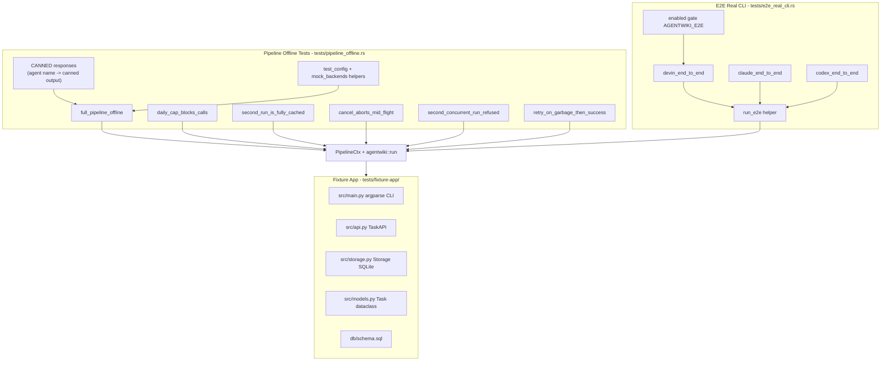
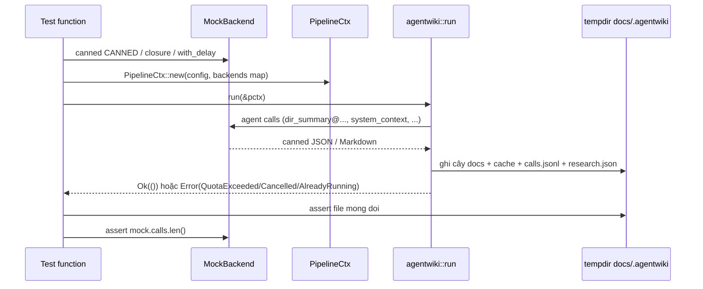
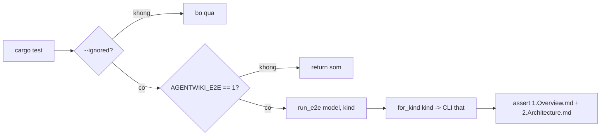

# Kiểm thử & Fixture — Deep Dive

## 1. Mục đích của module

Module `tests/` là hạ tầng kiểm định chất lượng của agentwiki, bao gồm ba thành phần:

1. **Test tích hợp offline** (`tests/pipeline_offline.rs`) — chạy toàn bộ pipeline sinh tài liệu với `MockBackend`, không cần agent CLI thật lẫn kết nối mạng. Đảm bảo `cargo test` luôn xanh trên máy không cài `devin`/`claude`/`codex`.
2. **Test E2E với CLI thật** (`tests/e2e_real_cli.rs`) — chạy pipeline đầu-cuối qua backend thật, mặc định `#[ignore]` và chỉ kích hoạt khi `AGENTWIKI_E2E=1`, nhằm bảo vệ quota của subscription CLI.
3. **Fixture app** (`tests/fixture-app/`) — một ứng dụng Python/SQLite mẫu (CLI task manager `taskman`) làm đầu vào cố định, đủ nhỏ để chạy nhanh nhưng đủ cấu trúc (CLI entry, API layer, storage layer, schema SQL) để pipeline có vật liệu phân tích.

Module này là **test dependency** của tầng backend: nhờ trait `AgentBackend` (ports-and-adapters), test có thể inject `MockBackend` vào `PipelineCtx` mà không thay đổi bất kỳ logic nào phía trên — đây chính là minh chứng cho giá trị của điểm mở rộng backend.

## 2. Cấu trúc nội bộ



### 2.1 `tests/pipeline_offline.rs` (251 dòng)

File định nghĩa một bộ **canned responses** — hằng `CANNED: &[(&str, &str)]` ánh xạ tên agent → output dựng sẵn. Bộ dữ liệu này bao phủ mọi spec trong DAG:

| Agent | Loại output |
|---|---|
| `dir_summary`, `relationships`, `system_context`, `domain_modules`, `database`, `key_module`, `boundary` | JSON khớp schema report tương ứng |
| `architecture`, `workflow` | Markdown research (không schema — `schema=None` trong registry) |
| `overview`, `architecture_doc`, `workflow_doc`, `deep_dive` | Markdown tài liệu compose |

Hai helper dùng chung:

- **`fixture_dir()`** — trả `CARGO_MANIFEST_DIR/tests/fixture-app`, đường dẫn tuyệt đối tới fixture.
- **`test_config(tmp, daily_cap)`** — dựng `Config` với `project_path` trỏ tới fixture, `output_path`/`internal_path` đặt trong `tempdir` (dọn sạch sau test), cả hai model tier đều là `"mock"`, tắt `git_tracked_only` và đặt `daily_cap` theo tham số.
- **`mock_backends(mock)`** — gói `Arc<MockBackend>` thành `HashMap<BackendKind, Arc<dyn AgentBackend>>` để inject qua `PipelineCtx::new(config, Some(backends))`.

Mọi test đều là `#[tokio::test(flavor = "multi_thread")]` — cần multi-thread runtime vì pipeline spawn `JoinSet` song song và `Semaphore` chặn theo tác vụ.

### 2.2 `tests/e2e_real_cli.rs` (75 dòng)

Ba test tương ứng ba backend, đều mang `#[ignore]` và kiểm tra lại `enabled()` (đọc `AGENTWIKI_E2E == "1"`) ở đầu hàm — **hai lớp gate**:

```text
cargo test                                    -> bi qua boi #[ignore]
cargo test -- --ignored                       -> chay nhung return som neu env chua bat
AGENTWIKI_E2E=1 cargo test --test e2e_real_cli devin -- --ignored
                                              -> chay that su
```

Helper `run_e2e(model, kind)` gán cả hai tier model về cùng một chuỗi (`devin:swe-2-medium`, `claude:sonnet`, `codex`), dựng backend thật qua `for_kind(kind)`, giữ `daily_cap = 20` và `call_timeout_s = 300` để giới hạn chi phí, rồi assert tối thiểu `1.Overview.md` và `2.Architecture.md` tồn tại.

### 2.3 `tests/fixture-app/`

Ứng dụng CLI quản lý tác vụ tối giản, cấu trúc phân tầng ba lớp:

| File | Vai trò |
|---|---|
| `src/main.py` | Entry point argparse: `taskman {add,list,done} [title]`, dispatch sang `TaskAPI` |
| `src/api.py` | `TaskAPI` — bề mặt nghiệp vụ (`add`, `list`, `done`) bọc `Storage` |
| `src/storage.py` | `Storage` — kết nối SQLite, tự tạo schema, `insert`/`all`/`mark_done` |
| `src/models.py` | `@dataclass Task(id: int\|None, title: str, done: bool)` |
| `db/schema.sql` | Bảng `tasks(id INTEGER PK AUTOINCREMENT, title TEXT NOT NULL, done INTEGER DEFAULT 0)` + index `idx_tasks_done` |
| `README.md` | Mô tả fixture (được scanner đọc vào `extract_docs`) |

Thiết kế cố ý: 3 thư mục (`root`, `src`, `db`) → fan-out `dir_summary` sinh đúng 3 instance, đủ để test quota mà không tốn nhiều call; có file SQL để agent `database` có đầu vào; có README để `extract_docs` hoạt động.

## 3. Giao diện kiểm thử

Cả hai file test dùng cùng một "hợp đồng" đối với crate `agentwiki`:

```rust
let pctx = PipelineCtx::new(config, Some(backends)).await?;
run(&pctx).await?;
```

- `PipelineCtx::new` nhận `Option<HashMap<BackendKind, Arc<dyn AgentBackend>>>` — truyền `Some(...)` để inject test double, `None` để pipeline tự dựng backend thật theo `config.models.*`.
- `run(&pctx)` trả `Result<(), Error>`; các nhánh lỗi được assert trực tiếp trên enum `Error`: `QuotaExceeded`, `Cancelled`, `AlreadyRunning`.

`MockBackend` (trong `src/backend/mock.rs`) cung cấp ba cửa cho test:

| API | Tác dụng |
|---|---|
| `MockBackend::canned(CANNED)` | Trả response theo `req.agent` — match chính xác hoặc prefix `name@` (cho fan-out `dir_summary@src`); mặc định `"{}"` |
| `MockBackend::new(closure)` | Handler tùy ý `Fn(&AgentRequest) -> Result<String, String>` — dùng cho kịch bản lỗi có điều kiện |
| `.with_delay(d)` | Async sleep trước khi trả kết quả — giữ call "in flight" để test huỷ/lock |
| `mock.calls: Mutex<Vec<String>>` | Nhật ký mọi request — dùng đếm số cuộc gọi thật sự đã xảy ra |

## 4. Luồng điều khiển



### Bộ test offline — ma trận bao phủ

| Test | Cơ chế được kiểm chứng | Kỹ thuật |
|---|---|---|
| `full_pipeline_offline` | Toàn bộ pipeline: research → compose → write → verify → summary | Assert 6 file docs + `4.Deep-Exploration/Task Management.md` + artifacts `.agentwiki/{calls.jsonl, research.json, cache/}`; `mock.calls > 5` chứng tỏ DAG chạy qua backend |
| `daily_cap_blocks_calls` | `Quota::consume` chặn khi vượt cap | `daily_cap=1` < 3 instance `dir_summary` → `Error::QuotaExceeded` |
| `second_run_is_fully_cached` | Cache sha256 phục vụ 100% lần chạy hai | Hai `PipelineCtx` cùng `internal_path`; số `mock.calls` không tăng sau run 2 |
| `cancel_aborts_mid_flight` | `CancellationToken` giải phóng pipeline kẹp giữa chừng | `with_delay(30s)` giữ `dir_summary` in-flight; `pctx.cancel.cancel()` sau 200ms; `Error::Cancelled` trong vòng 5s (abort_all + drain) |
| `second_concurrent_run_refused` | `run.lock` chống chạy đồng thời | Run A giữ lock (delay 5s) → run B nhận `AlreadyRunning`; sau khi A bị abort và nhả lock, run C thành công |
| `retry_on_garbage_then_success` | Retry-with-feedback khi output rác | Closure đếm: lần gọi đầu của `system_context` trả `Err`, retry trả JSON hợp lệ; pipeline hoàn tất và `1.Overview.md` được ghi |

### E2E — gating hai lớp



## 5. Quyết định triển khai đáng chú ý

- **Inject qua constructor, không qua feature flag**: `PipelineCtx::new` nhận map backend tùy chọn — đây là seam duy nhất của test. Không cần `#[cfg(test)]` rải rác trong production code; cùng một đường đi (`run`) được kiểm chứng cho cả mock lẫn CLI thật.
- **Canned data khớp schema thật**: mỗi JSON trong `CANNED` là một instance hợp lệ của report tương ứng (ví dụ `domain_modules` có đủ `sub_modules`, `database` có `tables[].columns[]`), nên test còn kiểm chứng gián tiếp các lenient deserializer trong `agent::reports`.
- **`key_module` trả `domain_name` rỗng**: phản ánh đúng hành vi thật — model không echo ổn định tên domain nên runner tự stamp lại lúc aggregate.
- **Tempdir cách ly hoàn toàn**: `output_path` và `internal_path` đều nằm trong `tempfile::tempdir()` — không test nào ghi vào repo hay đọc cache của nhau (trừ `second_run_is_fully_cached` cố ý chia sẻ `internal_path` giữa hai ctx).
- **Gate kép cho E2E**: `#[ignore]` chặn trong mọi CI mặc định; `enabled()` chặn cả khi ai đó chạy `--ignored` mà quên biến môi trường — bảo vệ quota Max theo đúng ràng buộc vận hành "không tốn cuộc gọi CLI khi không cần".
- **`daily_cap` và `call_timeout_s` siết chặt trong E2E** (20 calls / 300s) — đủ cho fixture 3 thư mục, chặn lệch cấu hình gây cháy quota.
- **Fixture deterministic**: `git_tracked_only=false` trong test config để fixture hoạt động kể cả khi `tests/fixture-app` không nằm trong git index (ví dụ cargo package).

## 6. Các file liên quan

| Đường dẫn | Vai trò |
|---|---|
| `tests/pipeline_offline.rs` | 6 test tích hợp offline + `CANNED` + helpers `fixture_dir`/`test_config`/`mock_backends` |
| `tests/e2e_real_cli.rs` | 3 test E2E gated (`devin`/`claude`/`codex`) + `run_e2e`/`enabled` |
| `tests/fixture-app/src/main.py` | CLI entry `taskman` (argparse) |
| `tests/fixture-app/src/api.py` | `TaskAPI` — lớp nghiệp vụ |
| `tests/fixture-app/src/storage.py` | `Storage` — lớp persistence SQLite |
| `tests/fixture-app/src/models.py` | `Task` dataclass |
| `tests/fixture-app/db/schema.sql` | Schema bảng `tasks` + index |
| `tests/fixture-app/README.md` | Mô tả fixture (đầu vào cho `extract_docs`) |
| `src/backend/mock.rs` | `MockBackend` — dependency trực tiếp của test |
| `src/pipeline/mod.rs` | `PipelineCtx::new` (điểm inject) và `run` (SUT) |
| `src/error.rs` | `Error::{QuotaExceeded, Cancelled, AlreadyRunning}` — các variant được assert |