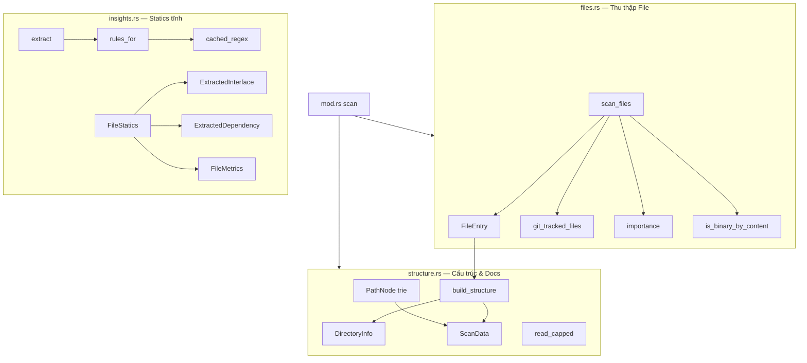
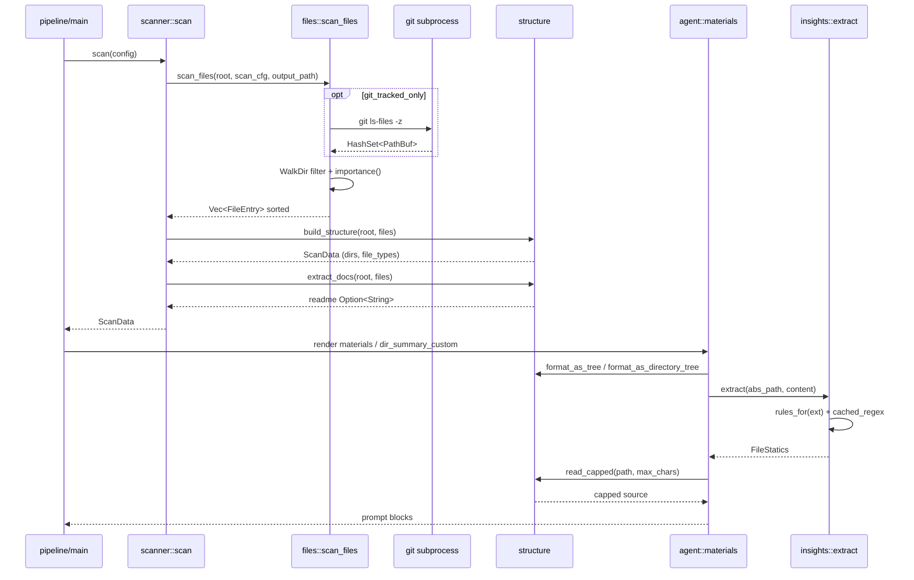

# Module Deep-Dive: `scanner` — Quét & Trích xuất Mã nguồn

## 1. Mục đích

`src/scanner/` là **bounded context tiền xử lý (Phase 0)** của pipeline agentwiki — chạy hoàn toàn **xác định, không gọi AI**. Nhiệm vụ: biến một repository bất kỳ trên đĩa thành `ScanData` — cấu trúc dữ liệu gọn gàng chứa danh sách file đã lọc, điểm quan trọng (importance), cây thư mục, thống kê extension, README, và (theo yêu cầu) thống kê tĩnh per-file trích xuất bằng regex.

Đây là nguồn "ground truth" duy nhất của toàn pipeline: mọi prompt của các agent research (system_context, dir_summary, domain_modules, boundary, database…) đều được dựng từ `ScanData` thông qua `agent::materials`. Module này thay thế `language_processors` của deepwiki-rs bằng một tập regex nhẹ theo ngôn ngữ — đủ tốt để gieo tên symbol vào prompt mà không cần AST.

**Các file thành phần:**

| File | Vai trò |
|---|---|
| `src/scanner/mod.rs` | Điểm vào `scan(config) -> Result<ScanData>`; re-export API public |
| `src/scanner/files.rs` | Walkdir + lọc loại trừ + git-tracked + chấm điểm importance |
| `src/scanner/structure.rs` | Gom file theo thư mục, đọc README, render cây cho prompt, `read_capped` |
| `src/scanner/insights.rs` | Trích xuất interface/dependency/metrics bằng regex theo extension |

## 2. Cấu trúc nội bộ & kiểu dữ liệu

Các kiểu trung tâm:

- **`FileEntry`** (`files.rs`): `rel_path`, `abs_path`, `name`, `size`, `extension` (lowercase), `importance_score` (0.0–1.0).
- **`ScanData`** (`structure.rs`): `project_name`, `root`, `files` (đã sort theo importance giảm dần), `directories: Vec<DirectoryInfo>` (fan-out target cho `dir_summary`), `file_types` (extension → count), `readme: Option<String>`.
- **`FileStatics`** (`insights.rs`): `interfaces` (symbol + signature một dòng), `dependencies` (name + `is_external`), `metrics` (LOC non-empty, số hàm/lớp, cyclomatic complexity).

## 3. Luồng điều khiển

`scan()` làm 4 việc tuần tự: canonicalize `project_path` → `scan_files` → `build_structure` → `extract_docs` (README). Statics không được tính ở đây — chúng được gọi **lazy** từ `agent::materials` khi build prompt (`dir_summary_custom`), qua `scanner::extract`.

## 4. Chi tiết triển khai

### 4.1 `files.rs` — thu thập & lọc

- **Cắt nhánh thư mục** bằng `WalkDir::filter_entry` (hiệu quả: không duyệt vào trong): `ALWAYS_EXCLUDED_DIRS` = `.agentwiki/.git/.hg/.svn`; thư mục ẩn khi `include_hidden=false`; `cfg.excluded_dirs` so không phân biệt hoa thường.
- **Lọc file** theo chuỗi điều kiện: nằm trong `output_path` đã canonicalize (không bao giờ nuốt output của chính mình); tên ẩn; khớp `cfg.excluded_files` (compile `glob::Pattern` lowercase); extension thuộc `BINARY_EXTENSIONS` (~40 loại); không có trong `git ls-files -z` khi `git_tracked_only` bật (kết quả rỗng → warn và fallback quét tất cả); vượt `max_file_size`; hoặc sniff **4096 byte đầu chứa NUL** (`is_binary_by_content`) cho file không extension.
- **`importance()`** — heuristic cộng dồn: path chứa `cmd/internal/pkg` +0.3; `main/index` +0.15; `config/setup` +0.1; `database/schema/migrations` +0.15; kích thước 1–50KB +0.15; bảng điểm extension (rs/py/java/go… +0.4, sql +0.3, jsx/tsx +0.2, js/ts +0.15, config +0.1…), clamp 1.0.
- **Sắp xếp** giảm dần theo score, tie-break theo `rel_path` — kết quả ổn định, quan trọng cho cache prompt.

### 4.2 `structure.rs` — cây & docs

- `build_structure` gom file vào `BTreeMap<PathBuf, Vec<FileEntry>>` theo parent dir → `DirectoryInfo` với `subdirectory_count` là số **con trực tiếp có file** (thư mục trống không xuất hiện — chấp nhận được vì `dir_summary` chỉ cần dir có nội dung).
- `extract_docs` chỉ tìm file tên bắt đầu `readme` ở **root**, đọc qua `abs_path` rồi fallback `root.join(rel_path)`.
- `PathNode` là trie `BTreeMap` render cây kiểu `├──`/`└──`, **thư mục trước file**; hai hàm public `format_as_tree` (đầy đủ) và `format_as_directory_tree` (chỉ thư mục, dùng khi repo lớn).
- `read_capped` cắt nội dung theo **số ký tự** (không phải byte) và thêm hậu tố `[truncated]`.

### 4.3 `insights.rs` — statics bằng regex

- `rules_for(ext)` trả `LangRules { funcs, types, imports, branches }` cho ~10 nhóm ngôn ngữ: Rust, Python, JS/TS/JSX/TSX, Go, Java/Kotlin/Scala, C/C++/C#, Ruby/PHP/Swift/Dart/sh/SQL; extension lạ nhận bộ rỗng (chỉ đếm branch chung).
- `cached_regex` cache `Regex` đã compile trong `LazyLock<Mutex<HashMap>>` — compile một lần cho cả scan.
- `extract()` giới hạn capture: tối đa **60 hàm + 40 type + 40 import**, dedup bằng `HashSet` theo prefix `f:`/`t:`/`d:`; signature lấy **nguyên dòng chứa match** (tối đa 160 ký tự) qua `signature_line`; `is_external=false` khi import bắt đầu `.`/`crate`/`self`/`super`.
- `cyclomatic_complexity` = tổng số lần xuất hiện của **chuỗi** branch-keyword (`if `, `for `, `case `, `?`…) — là `str::matches` chứ không phải regex, nên là chỉ số thô, thiên cao.

## 5. Quyết định thiết kế đáng chú ý

1. **Không có AST** — regex đủ để gieo tên symbol vào prompt với chi phí triển khai tối thiểu; trade-off là độ chính xác (ví dụ regex method JS/Java chấp nhận false-positive).
2. **Statics lazy** — `scan()` không gọi `extract()`; chỉ `materials.rs` gọi khi cần, tránh tốn CPU cho file không vào prompt. (Lưu ý: doc comment ở `mod.rs` nhắc `FileStatics::for_entry` nhưng method này **không tồn tại** — drift nhỏ giữa docs và code.)
3. **Sort theo importance** bảo đảm thứ tự file trong prompt ổn định → tăng cache-hit cho các agent call.
4. **Git-tracked là mềm**: `git ls-files` trả rỗng hoặc lỗi → fallback quét toàn bộ kèm warn, không fail pipeline.
5. **Giới hạn capture cứng** (60/40/40) chống prompt bùng nổ trên file minified/generated.

## 6. Phụ thuộc & người tiêu thụ

- **Phụ thuộc**: `walkdir`, `glob`, `regex`, `std::process::Command` (git), `crate::config::{Config, ScanConfig}`, `crate::error`.
- **Người tiêu thụ**: `agent::materials` (tree, `read_capped`, `extract`, `filtered_insights`), `agent::spec`/`registry` (`ScanData`, `DirectoryInfo` làm fan-out target PerDir cho `dir_summary`), `output::{boundary, database}` (nhận `ScanData` cho DetFn), `pipeline::dry_run_report`.

## 7. File liên quan

- `src/scanner/mod.rs` — façade + `scan()`
- `src/scanner/files.rs` — `FileEntry`, `scan_files`, `importance`
- `src/scanner/structure.rs` — `ScanData`, `DirectoryInfo`, `PathNode`, `read_capped`
- `src/scanner/insights.rs` — `FileStatics`, `extract`, `rules_for`
- `src/agent/materials.rs` — consumer chính render prompt materials
- `src/config.rs` — `ScanConfig` (git_tracked_only, excluded_dirs/files, max_depth, max_file_size, include_hidden)