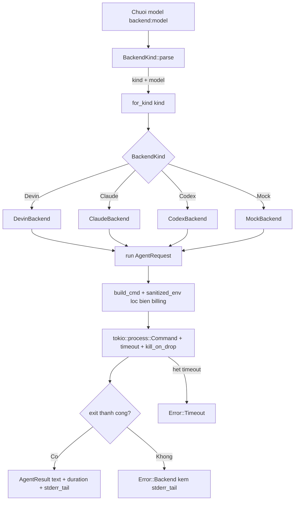
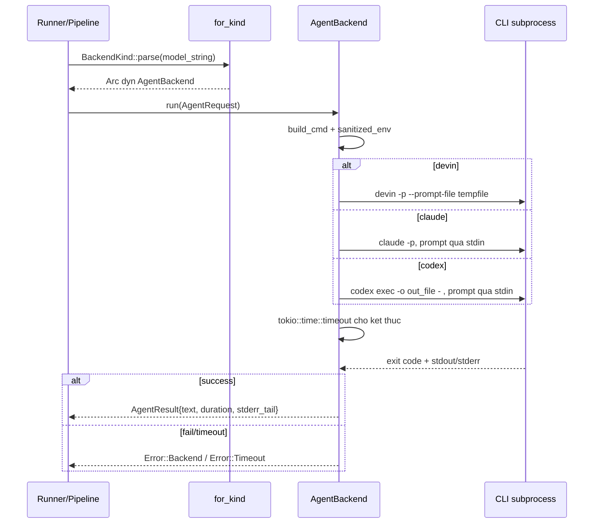

# Deep-Dive: Tích hợp Backend Agent CLI (`src/backend/`)

## 1. Mục đích & vị trí trong hệ thống

`src/backend/` là **Infrastructure Domain** theo mô hình **Ports & Adapters**: nó trừu tượng hóa các agent CLI đã xác thực (`devin`, `claude`, `codex`) thành một giao diện duy nhất — trait `AgentBackend` — để pipeline gọi LLM qua subprocess mà không cần biết CLI cụ thể.

Vai trò kinh doanh then chốt: agentwiki không gọi API LLM trả phí qua HTTP. Toàn bộ suy luận được ủy cho CLI đã đăng nhập bằng subscription (Max, v.v.). Module này là **điểm tích hợp duy nhất** với các tiến trình bên ngoài, đồng thời là một trong ba lớp bảo vệ quota (cùng cache sha256 và daily cap):

- **Lọc biến môi trường billing** (`sanitized_env` + `BANNED_PREFIXES`) — chặn `ANTHROPIC_*`, `OPENAI_*`, `CLAUDE_API`, `CODEX_API`, `DEVIN_API`, `OPENHANDS_*` để CLI con không rơi sang chế độ API trả phí.
- **`kill_on_drop(true)`** trên mọi command — cancel/timeout giết tiến trình con, tránh orphan tiếp tục "đốt" quota mà không ai cache kết quả.
- **Per-call timeout** bọc mọi subprocess bằng `tokio::time::timeout`.

Module phụ thuộc duy nhất vào `crate::error` — luồng phụ thuộc một chiều, không chu trình, và là điểm cô lập tốt của kiến trúc.

## 2. Cấu trúc nội bộ

| File | Thành phần | Vai trò |
|---|---|---|
| `mod.rs` | `BackendKind`, `AgentRequest`, `AgentResult`, `TokenUsage`, trait `AgentBackend`, `for_kind`, `sanitized_env`, `tail` | Hợp đồng & factory — "port" |
| `devin.rs` | `DevinBackend` (unit struct) | Adapter cho `devin -p` |
| `claude.rs` | `ClaudeBackend` | Adapter cho `claude -p` |
| `codex.rs` | `CodexBackend` | Adapter cho `codex exec` |
| `mock.rs` | `MockBackend`, `MockHandler` | Test double trong tiến trình |

Quy ước mở rộng (ghi ngay trong doc comment của `mod.rs`): thêm một backend = **một file mới + một nhánh trong `for_kind`**. `for_kind` là nơi duy nhất chứa `match` trên `BackendKind`, trả `Arc<dyn AgentBackend>`.

## 3. Giao diện chính

### 3.1 Trait `AgentBackend`

```rust
#[async_trait]
pub trait AgentBackend: Send + Sync {
    fn kind(&self) -> BackendKind;
    fn supports_fs(&self) -> bool;          // agent có đọc được file trong cwd?
    async fn run(&self, req: AgentRequest) -> Result<AgentResult>;
}
```

- `supports_fs()`: `true` với devin/claude/codex (chế độ agentic — agent tự đọc repo trong `cwd`), `false` với mock. Caller dùng nó để quyết định có nhúng scan materials vào prompt hay không.
- `Send + Sync` bắt buộc vì backend được share qua `Arc` và gọi từ nhiều task song song trong `JoinSet`/`FuturesUnordered` dưới `Semaphore`.

### 3.2 `BackendKind::parse` — chuỗi model `"<backend>:<model>"`

- `"devin:swe-2-medium"` → `(Devin, Some("swe-2-medium"))` — phần sau `:` truyền nguyên văn cho CLI.
- `"claude"` hoặc `"backend:"` → model = `None` (CLI dùng mặc định).
- `"mock"` / `"test"` đều map về `BackendKind::Mock`.
- Tên lạ (vd `openai:gpt-5`) → `Error::BackendNotAvailable` — đây là chốt chặn có chủ đích: agentwiki **từ chối** mọi backend HTTP API trả phí ở tầng parse.

### 3.3 `AgentRequest` / `AgentResult`

- `AgentRequest`: `prompt` (đã render), `model: Option<String>`, `cwd`, `timeout`, `agent` (tên instance để tương quan log/span/audit).
- `AgentResult`: `text` (stdout hoặc last message), `backend`, `model`, `duration` (wall-clock qua `Instant`), `usage: Option<TokenUsage>` (hiện luôn `None` — các CLI không expose token), `stderr_tail` (giữ lại **cả khi thành công** phục vụ chẩn đoán).

### 3.4 `sanitized_env` & `tail`

- `sanitized_env(&mut Command)`: duyệt `std::env::vars_os()`, `env_remove` mọi key khớp `BANNED_PREFIXES`. Định nghĩa một lần, mọi backend dùng chung.
- `tail(s, n)`: lấy `n` ký tự cuối (theo `chars()`, an toàn Unicode) — chuẩn hóa đoạn stderr đưa vào `Error::Backend`.

## 4. Luồng điều khiển



Sequence cho một lần gọi thật:



## 5. Chi tiết từng adapter

### DevinBackend — `devin -p`

- Prompt đi qua **`tempfile::NamedTempFile`** (`--prompt-file`) thay vì argv — tránh giới hạn độ dài argv với prompt lớn.
- Cờ cố định: `--respect-workspace-trust false`, `--permission-mode auto` (read-only tools auto-approve; lỗi print-mode lộ ra qua exit≠0 thay vì treo lặng).
- stdin = `Stdio::null()`; thực thi bằng `cmd.output()` bọc timeout — đơn giản nhất vì không cần ghi stdin.

### ClaudeBackend — `claude -p`

- Cờ cố định: `--output-format text`, `--no-session-persistence`, `--permission-mode bypassPermissions`, `--setting-sources local` (bỏ CLAUDE.md/settings của user và project để prompt không bị nhiễm).
- `spawn()` rồi ghi prompt vào stdin bằng `AsyncWriteExt::write_all` + `shutdown`, chờ `wait_with_output()` trong timeout.

### CodexBackend — `codex exec`

- Cờ cố định: `--skip-git-repo-check`, `-s read-only`, `--color never`, `-o <out_file>`, `-` (đọc prompt từ stdin), `-m <model>`.
- Kết quả: **ưu tiên file `-o`** (last message của agent); nếu file rỗng thì fallback sang stdout (transcript phiên). Đây là adapter duy nhất tách "câu trả lời cuối" khỏi transcript.

### MockBackend — test double trong tiến trình

- `new(handler)`: nhận closure `Fn(&AgentRequest) -> Result<String, String>` — handler trả `Err(String)` để giả lập CLI fail.
- `with_delay(d)`: `tokio::time::sleep` — sleep async nên **cancellation vẫn ngắt được giữa chừng** (dùng trong `cancel_aborts_mid_flight`).
- `canned(&[(name, body)])`: match chính xác `req.agent`, hoặc prefix `name@` (cho fan-out như `dir_summary@src/...`); key thiếu trả `"{}"`.
- `calls: Mutex<Vec<String>>` ghi lại mọi request — test assert số lần gọi (vd `second_run_is_fully_cached` chứng minh lần chạy 2 không tăng call).

## 6. Quyết định triển khai đáng chú ý

1. **`build_cmd` tập trung cờ ở một chỗ** — mỗi adapter có hàm nội bộ `build_cmd` chứa toàn bộ invocation; đổi cờ là single-point fix.
2. **Ba chiến lược truyền prompt khác nhau** phản ánh khả năng từng CLI: tempfile (devin), stdin (claude, codex). Không ép một cơ chế chung.
3. **Lỗi phân loại rõ**: `Error::Timeout{agent, secs}` khi hết giờ; `Error::Backend{backend, message, stderr_tail}` khi spawn fail hoặc exit≠0; `Error::BackendNotAvailable` khi tên backend lạ — runner dựa vào đó quyết định retry/fallback.
4. **`stderr_tail` giữ cả khi success** — CLI agent thường log hữu ích ra stderr; cắt 500 ký tự cuối đủ chẩn đoán mà không phình log.
5. **`usage` là `Option`** — thiết kế sẵn cho tương lai nếu CLI expose token, hiện luôn `None`.
6. **`for_kind` tạo `MockBackend::canned(&[])`** (mock rỗng) — chỉ để API đồng nhất; test thực tế inject mock có script qua `PipelineCtx::new(config, Some(backends))`.
7. **Alias `"test"` → `Mock`** trong `parse` — tiện cho config test.

## 7. Tương tác với các module khác

- **Runner** (`src/agent/runner.rs`) là caller duy nhất của `run()`: đi qua cache → quota → semaphore trước khi chạm backend, rồi parse output và ghi `CallRecord`.
- **PipelineCtx** (`src/pipeline/mod.rs`) giữ `HashMap<BackendKind, Arc<dyn AgentBackend>>`, tra qua `backend(kind)`; `None` thì dựng backend thật từ `config.models.*`, `Some(map)` cho test.
- **Tests**: `tests/pipeline_offline.rs` inject `MockBackend` qua `BackendKind::Mock` với `models.* = "mock"`; `tests/e2e_real_cli.rs` dùng `for_kind` với backend thật, gate bởi `AGENTWIKI_E2E`.
- **Config**: model theo tier (`efficient`/`powerful`) được parse qua `BackendKind::parse`; `call_timeout` → `AgentRequest.timeout`.

## 8. File liên quan

- `src/backend/mod.rs` — hợp đồng, factory, env sanitization
- `src/backend/devin.rs`, `claude.rs`, `codex.rs` — ba adapter subprocess
- `src/backend/mock.rs` — test double
- `src/agent/runner.rs` — caller
- `src/pipeline/mod.rs` — `PipelineCtx` giữ backends
- `src/config.rs` — model strings, timeout
- `tests/pipeline_offline.rs`, `tests/e2e_real_cli.rs` — kiểm chứng