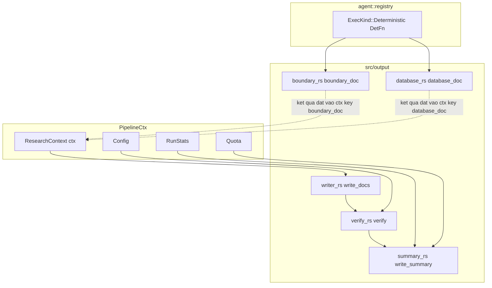
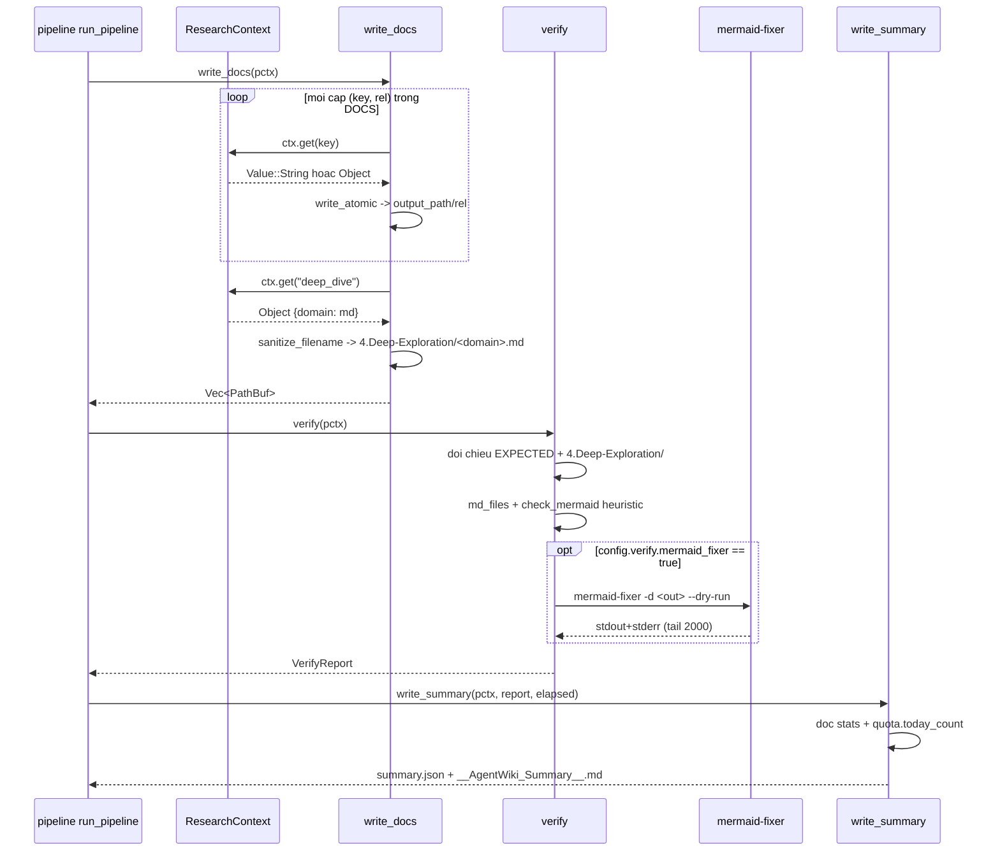

# Module Deep-Dive: `output` — Xuất & Kiểm chứng Tài liệu

## 1. Mục đích

`src/output/` là tầng cuối của pipeline agentwiki — nơi mọi kết quả nghiên cứu (research) và biên soạn (compose) được vật chất hoá thành cây tài liệu Markdown trên đĩa. Module gánh 4 trách nhiệm:

1. **Renderer tất định (deterministic renderers)**: biến `BoundaryAnalysisReport` và `DatabaseOverviewReport` — hai báo cáo có schema — thành Markdown hoàn chỉnh *không qua LLM* (`boundary.rs`, `database.rs`).
2. **Doc-tree writer**: ghi toàn bộ tài liệu ra `output_path` theo bảng ánh xạ tĩnh `ctx-key → đường dẫn` (`writer.rs`).
3. **Verify sau khi ghi**: đối chiếu file kỳ vọng, kiểm tra cú pháp Mermaid bằng heuristic nội bộ, và chạy `mermaid-fixer` nếu binary này có sẵn (`verify.rs`).
4. **Báo cáo tổng kết**: sinh `__AgentWiki_Summary__.md` (người đọc) và `summary.json` (máy đọc) (`summary.rs`).

Điểm thiết kế cốt lõi: phần lớn nội dung tài liệu do LLM sinh (qua compose specs), nhưng hai tài liệu mang tính dữ liệu cấu trúc cao — boundary và database — được render tất định. Điều này giảm phụ thuộc vào độ ổn định của LLM ở những phần vốn chỉ là trình bày dữ liệu đã có.

## 2. Cấu trúc nội bộ



| File | Vai trò | Hàm chính |
|---|---|---|
| `mod.rs` | Khai báo submodule, re-export API công khai | `boundary_doc`, `database_doc`, `write_docs`, `verify`, `VerifyReport`, `write_summary` |
| `writer.rs` | Ghi cây tài liệu theo ánh xạ `DOCS` + deep-dive theo domain | `write_docs`, `write_file`, `sanitize_filename` |
| `boundary.rs` | Render `5.Boundary-Interfaces.md` từ `BoundaryAnalysisReport` | `boundary_doc`, `cli_section`, `api_section`, `router_section`, `integration_section` |
| `database.rs` | Render `6.Database-Overview.md` từ `DatabaseOverviewReport` | `database_doc`, `project/table/view/proc/func/flow`, `mermaid_id` |
| `verify.rs` | Kiểm chứng file + Mermaid | `verify`, `md_files`, `check_mermaid`, `run_mermaid_fixer` |
| `summary.rs` | Báo cáo tổng kết | `write_summary`, struct `SummaryJson` |

## 3. Giao diện chính

### 3.1 Renderer tất định — chữ ký `DetFn`

```rust
pub fn boundary_doc(_scan: &ScanData, _config: &Config, dep: &serde_json::Value) -> Result<String>
pub fn database_doc(_scan: &ScanData, _config: &Config, dep: &serde_json::Value) -> Result<String>
```

Cả hai tuân theo trait-object `DetFn` của `agent::spec` (`(ScanData, Config, Value) -> Result<String>`), được `registry.rs` đăng ký làm node `ExecKind::Deterministic` trong DAG ở pha compose. `dep` là kết quả của research spec tương ứng (`boundary` / `database`) lấy từ `ResearchContext`; renderer `serde_json::from_value` sang kiểu report, lỗi parse được bọc thành `Error::Parse` kèm tên agent (`"boundary_doc"`/`"database_doc"`). Kết quả String được runner đặt lại vào ctx dưới key `boundary_doc`/`database_doc` — tức renderer tất định được xếp lịch như mọi agent khác, chỉ khác là không gọi LLM.

### 3.2 Writer

```rust
pub async fn write_docs(pctx: &PipelineCtx) -> Result<Vec<PathBuf>>
```

Đọc các ctx key theo bảng `DOCS` và trả về danh sách file đã ghi.

### 3.3 Verify & Summary

```rust
pub async fn verify(pctx: &PipelineCtx) -> Result<VerifyReport, Error>
pub async fn write_summary(pctx: &PipelineCtx, verify: &VerifyReport, total: Duration) -> Result<()>
```

`VerifyReport` (Serialize) chứa: `missing`, `empty`, `mermaid_blocks`, `mermaid_issues`, `fixer_available`, `fixer_output`.

## 4. Luồng dữ liệu & điều khiển

Pipeline gọi tuần tự từ `pipeline/mod.rs`:



### 4.1 Ánh xạ ctx-key → đường dẫn (`writer.rs`)

| ctx key | Đường dẫn đầu ra |
|---|---|
| `overview` | `1.Overview.md` |
| `architecture_doc` | `2.Architecture.md` |
| `workflow_doc` | `3.Workflow.md` |
| `boundary_doc` | `5.Boundary-Interfaces.md` |
| `database_doc` | `6.Database-Overview.md` |
| `deep_dive` (Object theo domain) | `4.Deep-Exploration/<domain>.md` |

## 5. Quyết định triển khai đáng chú ý

- **Ghi nguyên tử cho tài liệu**: mọi file doc đi qua `util::write_atomic` (ghi temp + rename) sau `create_dir_all` — tránh file nửa-vời khi crash. Lưu ý bất đối xứng: `write_summary` dùng `std::fs::write` thường cho cả `summary.json` lẫn `__AgentWiki_Summary__.md` (chấp nhận được vì đây là artifact phụ, không phải nội dung chính).
- **Khoan dung với ctx value không phải String**: nếu ctx key chứa `Value` khác String (ví dụ agent trả JSON thay vì Markdown), writer serialize `to_string_pretty` thay vì fail; key thiếu chỉ `warn` và bỏ qua — pipeline không sập vì một tài liệu vắng.
- **Sanitize tên file cho deep-dive**: `sanitize_filename` thay `/ \ : * ? " < > |` bằng `-` rồi trim — đủ để tránh path traversal và ký tự bất hợp lệ, nhưng *không* kiểm tra trùng lặp sau sanitize (hai domain `"a/b"` và `"a\b"` sẽ ghi đè nhau).
- **Renderer bỏ qua section rỗng**: `boundary_doc`/`database_doc` chỉ emit section khi danh sách tương ứng không rỗng, và luôn kết thúc bằng footer `**Analysis Confidence**: x.x/10` — giữ tài liệu gọn và minh bạch về độ tin cậy của research.
- **Mermaid an toàn ngay tại renderer**: `database.rs` sinh `erDiagram` với node id qua `mermaid_id` — mọi ký tự không phải `[A-Za-z0-9_]` biến thành `_`, đảm bảo tên bảng dạng `schema.table` không phá cú pháp Mermaid.
- **Verify không bao giờ fail pipeline**: `verify` gom mọi vấn đề vào `VerifyReport` và chỉ `tracing::warn` — triết lý "tài liệu xấu còn hơn không có tài liệu", việc phán quyết để cho người đọc qua summary.
- **Heuristic Mermaid hai tầng**: `check_mermaid` là state machine duyệt từng dòng, đếm block ```` ```mermaid ````, kiểm tra (a) dòng đầu body khớp một trong 21 header hợp lệ (`graph`, `flowchart`, `sequencediagram`, `erdiagram`, `c4context`…), (b) body ≥ 2 dòng, (c) block bị unterminated. Khi `config.verify.mermaid_fixer` bật, `run_mermaid_fixer` spawn binary ngoài ở chế độ `--dry-run`, gộp stdout+stderr và cắt tail 2000 ký tự bằng `backend::tail` — tái dùng tiện ích của tầng backend.
- **Summary kênh đôi**: `summary.json` trong `internal_path` (`.agentwiki/`) phục vụ tooling; `__AgentWiki_Summary__.md` nằm cạnh docs phục vụ người — chứa timestamp RFC3339, tổng giây, `cli_calls`, `cache_hits`, `quota used/cap`, số mermaid block/issues, danh sách missing và bảng spec timings.

## 6. Vị trí trong pipeline

`output` là Service Call thuần tuý của `pipeline`: không tự quyết định *khi nào* chạy, không biết DAG tồn tại. Ngược lại, `registry.rs` phụ thuộc vào `output` để gắn `boundary_doc`/`database_doc` làm DetFn — tạo chiều phụ thuộc `agent::registry → output` cho phần render, và `pipeline → output` cho phần write/verify/summary. Đầu vào duy nhất của verify ngoài filesystem là `config.verify.mermaid_fixer` — dependency mềm: vắng mặt binary chỉ làm `fixer_available=false`, không lỗi.

## 7. File liên quan

- `src/output/mod.rs` — facade re-export
- `src/output/writer.rs` — doc-tree writer
- `src/output/boundary.rs` — renderer boundary
- `src/output/database.rs` — renderer database + `erDiagram`
- `src/output/verify.rs` — verify + Mermaid check
- `src/output/summary.rs` — `SummaryJson` + `__AgentWiki_Summary__.md`
- `src/pipeline/mod.rs` — caller duy nhất (`write_docs` → `verify` → `write_summary`)
- `src/agent/registry.rs` — nơi DetFn được đăng ký vào DAG compose
- `src/agent/spec.rs` — định nghĩa `ExecKind::Deterministic` / `DetFn`
- `src/agent/reports/research.rs` — `BoundaryAnalysisReport`, `DatabaseOverviewReport` (hợp đồng đầu vào của renderer)
- `src/util.rs` — `write_atomic`
- `src/backend/mod.rs` — `tail` (dùng lại để cắt output của mermaid-fixer)