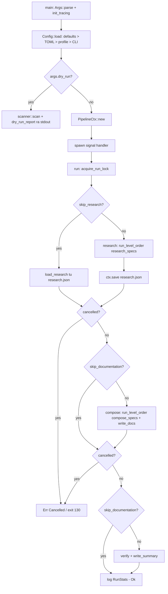
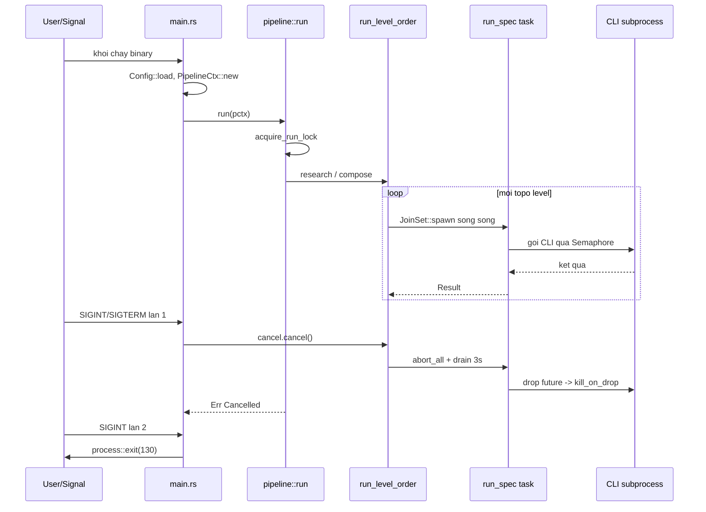

# Điều phối Pipeline Sinh Tài liệu — Module Deep-Dive

## 1. Mục đích

Module `pipeline` là **bounded context điều phối (orchestration)** của agentwiki — nó quyết định *khi nào* và *theo thứ tự nào* các giai đoạn sinh tài liệu C4 được thực thi, trong khi chi tiết *chạy thế nào* của từng tác vụ được ủy cho tầng `agent`. Vòng đời do module dàn xếp:

```
Preprocess (scan) → Research (DAG agent) → Compose (editor + renderer) → Write → Verify
```

Trách nhiệm cụ thể của module gồm:

- Khởi tạo và giữ **ngữ cảnh dùng chung `PipelineCtx`** — điểm hội tụ của mọi tài nguyên mà một agent spec cần (config, scan data, cache, quota, prompts, semaphore, backends, cancellation token).
- **Khoá chống chạy đồng thời** (`run.lock`) giữa các tiến trình agentwiki trên cùng một thư mục nội bộ.
- **Lập lịch DAG**: thực thi các `AgentSpec` theo tầng topological, song song trong từng tầng.
- **Huỷ hợp tác (cooperative cancellation)**: SIGINT/SIGTERM lần thứ nhất huỷ mềm, lần thứ hai thoát cưỡng ép.
- **Chế độ dry-run** in cấu hình hiệu lực và DAG mà không tiêu tốn cuộc gọi CLI nào.
- **Persist/restore** kết quả research (`research.json`) cho cờ `--skip-research`.

Module gồm ba file: `src/pipeline/mod.rs` (toàn bộ logic điều phối, ~349 dòng), `src/main.rs` (entry point mỏng của binary) và `src/lib.rs` (re-export API công khai).

## 2. Cấu trúc nội bộ

Toàn bộ logic nằm trong `src/pipeline/mod.rs`, chia thành bốn khối chức năng:

| Thành phần | Kiểu | Vai trò |
|---|---|---|
| `PipelineCtx` | `pub struct` | Ngữ cảnh chia sẻ qua `Arc`, truyền cho mọi spec instance |
| `RunStats` | `pub struct` | Bookkeeping: `cache_hits`, `cli_calls`, `saved_secs`, `timings` phục vụ summary report |
| `RunLock` + `acquire_run_lock` | struct + fn nội bộ | Mutual exclusion qua file `<internal>/run.lock` |
| `run` / `run_pipeline` / `research` / `compose` / `run_level_order` | async fns | Bộ lập lịch DAG theo tầng topo |
| `dry_run_report` | `pub fn` | Sinh báo cáo cấu hình + DAG cho `--dry-run` |
| `default_backends` | fn nội bộ | Dựng backend thật cho các kind xuất hiện trong `models.efficient/powerful` |

### 2.1. `PipelineCtx` — bối cảnh dùng chung

[mod.rs:23-48](file:///home/ruan/datspace/agentwiki/src/pipeline/mod.rs)

`PipelineCtx` được bọc trong `Arc` và clone rẻ cho từng task con. Các trường đáng chú ý:

- `scan: ScanData` — kết quả Phase 0 (deterministic, không AI), làm đầu vào cho mọi prompt materials.
- `ctx: ResearchContext` — store typed bất đồng bộ (`RwLock<HashMap<String, Value>>`) làm kênh trao đổi kết quả giữa các node của DAG.
- `cache`, `quota`, `prompts` — ba lớp bảo vệ chi phí: cache theo hash nội dung, daily cap + audit `calls.jsonl`, prompt loader với fallback `include_str!`.
- `semaphore: Semaphore` — khởi tạo với `config.max_parallels`, giới hạn số cuộc gọi CLI đồng thời trên toàn pipeline.
- `empty_cwd` — thư mục rỗng (`<internal>/empty-cwd`) làm `cwd` vệ sinh cho các lệnh gọi ở chế độ embedded, tránh agent CLI "nhìn thấy" file ngoài ý muốn.
- `progress` — thanh tiến trình terminal (tự ẩn khi không phải TTY).
- `cancel: CancellationToken` — token huỷ hợp tác, được `main` trigger từ signal handler.
- `backends: HashMap<BackendKind, Arc<dyn AgentBackend>>` — map backend đã dựng; **private**, truy cập qua `backend(kind)` trả `Error::BackendNotAvailable` nếu thiếu.

Điểm mấu chốt của `PipelineCtx::new` là tham số `backends: Option<...>`: khi `None` (đường chạy thật) nó tự dựng backend qua `default_backends` — parse chuỗi model `<backend>:<model>` trong `models.efficient`/`models.powerful` và gọi `backend::for_kind` cho mỗi kind duy nhất. Khi test, `MockBackend` được inject trực tiếp — đây chính là seam cho phép toàn bộ pipeline chạy offline.

### 2.2. `RunLock` — khoá chống chạy kép

[mod.rs:137-177](file:///home/ruan/datspace/agentwiki/src/pipeline/mod.rs)

Cơ chế lock file dùng `OpenOptions::create_new(true)` — thao tác atomic `O_EXCL` của filesystem, không có TOCTOU race:

1. Tạo mới `run.lock` và ghi `pid` của tiến trình → thành công, trả `RunLock`.
2. Nếu file đã tồn tại: đọc pid, kiểm tra `/proc/<pid>` tồn tại:
   - **Pid còn sống** → `Err(Error::AlreadyRunning { pid })`, fail fast.
   - **Pid đã chết** hoặc file không đọc/không parse được → lock cũ bị **thu hồi** (xóa) và thử lại, tối đa 2 vòng.
3. `RunLock` impl `Drop` xóa file khi guard ra khỏi scope — kể cả đường lỗi.

Thiết kế này đúng cho VPS Linux (kiểm tra pid qua `/proc`); lock của một tiến trình crash không bao giờ khóa vĩnh viễn các lần chạy sau.

### 2.3. `run_level_order` — bộ lập lịch DAG theo tầng

[mod.rs:246-279](file:///home/ruan/datspace/agentwiki/src/pipeline/mod.rs)

Đây là trái tim của module. Thuật toán:

1. `registry::topo_levels(specs)` chia DAG thành các tầng (Kahn level-ordering) — spec trong cùng tầng không phụ thuộc lẫn nhau.
2. Trước mỗi tầng, kiểm tra `cancel.is_cancelled()` → từ chối khởi động tầng mới nếu đã huỷ.
3. Spawn mỗi spec trong tầng vào `tokio::task::JoinSet`, mỗi task gọi `agent::run_spec(&spec, &pctx)`.
4. Vòng `tokio::select!` **biased** giữa `join_next()` và `cancel.cancelled()`:
   - Task hoàn thành → `??` lan truyền lỗi (một spec lỗi fail cả pipeline).
   - Token bị huỷ → `abort_all()`, rồi **drain có timeout 3 giây** để tránh một task kẹt trong sync poll làm treo shutdown. Abort drop future của backend → `kill_on_drop` giết tiến trình CLI con, không để orphan tốn quota.

Lưu ý: song song *trong tầng* còn bị kìm thêm bởi `pctx.semaphore` ở tầng runner — `max_parallels` (mặc định 2) là giới hạn thực tế cho số cuộc gọi CLI đồng thời, bảo vệ quota của subscription.

## 3. Giao diện công khai

`lib.rs` re-export phần API công khai của module:

```rust
pub use pipeline::{PipelineCtx, RunStats, dry_run_report, run};
```

| API | Chữ ký | Ý nghĩa |
|---|---|---|
| `PipelineCtx::new` | `async fn new(config, backends) -> Result<Arc<Self>>` | Dựng context: scan repo, tạo internal dir + empty_cwd, khởi tạo cache/quota/prompts/semaphore, dựng backends |
| `PipelineCtx::backend` | `fn backend(&self, kind) -> Result<Arc<dyn AgentBackend>>` | Tra backend theo `BackendKind` |
| `PipelineCtx::load_research` | `async fn load_research(&self, path)` (nội bộ) | Hydrate `ctx` từ `research.json` cho `--skip-research` |
| `run` | `pub async fn run(&Arc<PipelineCtx>) -> Result<()>` | Entry chính: acquire lock → `run_pipeline` → settle progress bar |
| `dry_run_report` | `pub fn dry_run_report(&Config, &ScanData) -> String` | Báo cáo cấu hình hiệu lực + DAG theo tầng |
| `RunStats` | `cache_hit / cli_call / record` | Được runner gọi để đếm cache hit, cuộc gọi thật và timing từng spec |

`main.rs` chỉ là wrapper mỏng: parse `Args` bằng clap → `init_tracing` (mức `-v`/`-vv`/`-vvv`, `RUST_LOG` override) → `Config::load` → nhánh `--dry-run` → `PipelineCtx::new` → spawn signal handler → `run`.

## 4. Luồng điều khiển

### 4.1. Luồng tổng thể



### 4.2. Tương tác huỷ giữa signal handler và scheduler



### 4.3. Checkpoint huỷ

`run_pipeline` đặt **hai điểm kiểm tra huỷ** giữa các giai đoạn lớn (sau research, sau compose+write) ngoài kiểm tra per-level trong `run_level_order` và per-call trong runner. Nhờ đó kết quả `research.json` đã persist vẫn tái dùng được qua `--skip-research` ngay cả khi lần chạy trước bị huỷ sau pha research — một thiết kế tiết kiệm quota đáng kể.

## 5. Quyết định triển khai đáng chú ý

1. **Tách bạch orchestration / execution.** Pipeline chỉ biết `AgentSpec` và `topo_levels`; vòng lặp LLM (cache → quota → backend → parse → retry → fallback) nằm hoàn toàn trong `agent::runner::run_spec`. Đổi chính sách retry hay thêm backend không đụng vào scheduler.

2. **JoinSet + select! biased.** `biased` ưu tiên nhánh `join_next` — task hoàn thành được thu kết quả trước khi kiểm tra cancel, tránh bỏ sót lỗi task. `JoinSet` được chọn thay `FuturesUnordered` vì spec cần `Send + 'static` spawn được, đồng thời `abort_all` huỷ sạch toàn bộ tầng.

3. **Drain có timeout 3 giây.** Sau `abort_all`, việc đợi task kết thúc bị bọc trong `tokio::time::timeout` — một task mắc kẹt trong đoạn đồng bộ (blocking sync code trong poll) không thể treo shutdown vô hạn.

4. **Backends inject được qua constructor.** `PipelineCtx::new(config, Some(mock_map))` là seam kiểm thử: sáu test offline trong `tests/pipeline_offline.rs` (full pipeline, daily cap, cache lần hai, cancel giữa chừng, mutual exclusion, retry) đều đi qua đúng đường `run()` thật nhờ điểm inject này.

5. **Persist research như một checkpoint quota.** `ctx.save(research.json)` chạy ngay sau pha research; `--skip-research` hydrate lại toàn bộ store — cho phép lặp lại compose/write/verify mà không tốn thêm cuộc gọi nào.

6. **Signal handler hai giai đoạn trong `main`.** Tín hiệu đầu → `cancel.cancel()` (huỷ hợp tác, child CLI bị giết qua `kill_on_drop` khi future bị drop); tín hiệu thứ hai → `exit(130)` ngay lập tức. Exit code 130 cũng được đặt khi pipeline trả `Cancelled` — theo quy ước SIGINT của Unix.

7. **Progress bar settle trên mọi đường ra.** `run()` gọi `progress.done()/cancel()/fail(e)` tương ứng với `Ok`/`Cancelled`/lỗi khác — terminal không bao giờ để lại progress bar treo.

8. **`empty_cwd` vệ sinh.** Các lệnh gọi embedded-mode dùng một thư mục rỗng làm `cwd`, cách ly agent CLI khỏi working directory của người dùng.

9. **`dry_run_report` tái dùng chính registry.** Báo cáo dry-run duyệt `research_specs`/`compose_specs` qua cùng `topo_levels` như đường chạy thật, in mỗi spec kèm kind (`llm`/`deterministic`), tier (`efficient`/`powerful`), fan-out (`PerDir ×N` theo số thư mục scan được, `PerDomain ×N`) và deps — người vận hành thấy đúng DAG sẽ chạy, không phải một mô tả riêng có thể lệch.

## 6. Rủi ro / điểm cần lưu ý

- **`pipeline/mod.rs` tích tụ nhiều trách nhiệm**: context, scheduler, lock, dry-run cùng nằm trong một file ~349 dòng — ứng viên tách `context.rs`/`lock.rs` nếu pipeline phình to.
- **`/proc/<pid>` là Linux-specific**: cơ chế reclaim lock cũ dựa vào procfs; trên hệ thống không có `/proc` (macOS, container tối giản) lock cũ sẽ bị xóa lầm — chấp nhận được vì môi trường mục tiêu là Linux VPS.
- **Thứ tự deps trong một tầng không đảm bảo nghiệp vụ gì thêm**: `topo_levels` chỉ đảm bảo deps chạy trước dependents, không đảm bảo thứ tự trong tầng — đúng với mô hình chia sẻ qua `ResearchContext` thay vì truyền trực tiếp.

## 7. File liên quan

| File | Vai trò |
|---|---|
| [mod.rs](file:///home/ruan/datspace/agentwiki/src/pipeline/mod.rs) | Toàn bộ module: `PipelineCtx`, `RunStats`, `RunLock`, `run`, `run_level_order`, `dry_run_report` |
| [main.rs](file:///home/ruan/datspace/agentwiki/src/main.rs) | Entry point binary: parse CLI, init tracing, nhánh dry-run, signal handler hai giai đoạn |
| [lib.rs](file:///home/ruan/datspace/agentwiki/src/lib.rs) | Khai báo module + re-export `PipelineCtx`, `RunStats`, `run`, `dry_run_report` |
| `src/agent/registry.rs`, `src/agent/spec.rs` | Cung cấp `research_specs`/`compose_specs`/`topo_levels` — định nghĩa DAG mà scheduler thực thi |
| `src/agent/runner.rs` | `run_spec` — execution engine được spawn trong từng task của JoinSet |
| `src/scanner/mod.rs` | `scan` — Phase 0 được gọi trong `PipelineCtx::new` và nhánh dry-run |
| `src/output/*` | `write_docs`, `verify`, `write_summary` — các giai đoạn cuối do pipeline gọi tuần tự |
| `tests/pipeline_offline.rs` | Kiểm chứng toàn bộ pipeline với `MockBackend` inject qua `PipelineCtx::new` |