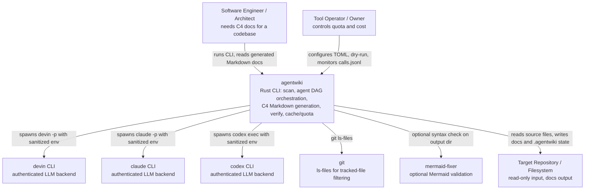

# System Context Overview

## 1. Project Introduction

**agentwiki** is a command-line tool written in Rust that automatically generates C4-model architecture documentation for any source code repository. It is a rewrite of deepwiki-rs (Litho), redesigned around a key operational constraint: **zero per-call LLM API cost**. Instead of calling an HTTP LLM API, it delegates all reasoning to already-authenticated agent CLIs (`devin`, `claude`, `codex`) running as local subprocesses under subscription plans.

### Core objectives

- Produce a complete, consistent C4 documentation tree (System Context, Architecture, Core Workflows, Deep-Dive, Boundary/Interfaces, Database Overview) from a single CLI invocation against an arbitrary repository.
- Guarantee deterministic, machine-validated output through JSON-schema contracts on every LLM-produced report, lenient deserialization, retry-with-feedback, and model-tier fallback.
- Protect subscription quota and cost through prompt-hash caching, a daily call cap with audit logging, billing-environment sanitization, an offline mock backend, and a `--dry-run` mode.

### Business value

- **Cost-free documentation generation**: LLM inference is delegated to subscription-based agent CLIs; no metered API keys are used.
- **Repeatability**: content-addressed caching (`sha256(prompt‖model‖backend‖schema_version)`) means re-runs consume no additional calls.
- **Operability**: daily quota caps, a `calls.jsonl` audit trail, run-lock mutual exclusion, cooperative cancellation, and dry-run inspection make the tool safe to run unattended on a VPS.
- **Quality control**: every agent response is validated against a JSON schema; malformed output triggers retry-with-feedback and fallback across model tiers; generated Mermaid diagrams are verified (internal heuristic, or the external `mermaid-fixer` binary when available).

### Technical characteristics

- **Layered pipeline architecture**: Scan (deterministic) → Research/Compose (agent DAG) → Write/Verify (Markdown output).
- **Ports-and-adapters backend layer**: a single `AgentBackend` trait abstracts `devin -p`, `claude -p`, `codex exec`, and an in-process `MockBackend`.
- **Deterministic pre-processing**: repository scanning uses `walkdir`, exclusion rules, git-tracked filtering, heuristic importance scoring, and regex-based static insight extraction — no AI involved.
- **DAG-scheduled agents**: research and compose tasks are declared as `AgentSpec`s with topological levels, fan-out (`PerDir`, `PerDomain`), and model tiers, executed in parallel under a `Semaphore` with `CancellationToken` support.
- **Anti-corruption report layer**: lenient JSON deserializers normalize "dirty" LLM output into strongly typed Rust report structs before anything reaches the output stage.

## 2. Target Users

### 2.1 Software Engineers / Architects

People who need to quickly understand the structure and design of a codebase — for onboarding, code review, or audit.

**Needs:**

- Generate a full C4 documentation set (System Context, Architecture, Workflows, Boundary, Database, Deep-Dive) from any repository.
- Run the whole flow as a single CLI command with flexible TOML/flag configuration and named profiles.
- Receive immediately readable Markdown with syntactically valid Mermaid diagrams.

**Typical scenario:** an engineer points `agentwiki` at an unfamiliar repository and gets a `docs/` tree (`1.Overview.md` through `6.Database-Overview.md`) describing the system at multiple C4 levels.

### 2.2 Tool Operators / Owners

People who run the tool on a VPS or personal machine and are accountable for quota and cost.

**Needs:**

- A hard daily cap on agent CLI calls, plus an audit log (`calls.jsonl`) of every real call.
- Content caching so re-runs are free.
- A `--dry-run` mode to inspect the effective configuration and the agent DAG before spending any calls.
- Sanitization of billing-related environment variables so child CLI processes cannot silently switch to metered API billing.

**Typical scenario:** an operator configures `agentwiki.toml` with model tiers and `daily_cap`, runs `--dry-run` to confirm the DAG, then schedules real runs knowing the quota guardrails apply.

## 3. System Boundaries

### Scope

agentwiki owns the entire pipeline of: scanning a repository, orchestrating a DAG of analysis tasks via external agent CLIs, validating JSON output, rendering and writing C4 Markdown documentation, verifying results, and managing cache/quota. It performs **no in-process LLM inference** — all reasoning is delegated to external CLIs.

### Included components

| Area | Components |
|---|---|
| Entry | CLI entry point and argument parsing (`main.rs`, `cli.rs`) |
| Configuration | TOML config load/merge, CLI overrides, named profiles (`config.rs`) |
| Scanning | File walking, exclusion filtering, importance scoring, regex-based insight extraction, directory tree building (`scanner/`) |
| Agent layer | DAG spec/registry, runner with cache/quota/retry/fallback, shared `ResearchContext`, prompt materials renderer (`agent/`) |
| Report contracts | JSON schemas plus lenient deserializers for LLM output (`agent/reports/`) |
| Backends | `AgentBackend` trait with devin/claude/codex/mock implementations, billing env sanitization (`backend/`) |
| Pipeline | Research → compose → write → verify orchestration, run lock, cancellation, dry-run (`pipeline/`) |
| Output | Markdown renderers (boundary, database), doc-tree writer, verify + Mermaid checks, summary report (`output/`) |
| Operations | sha256 content cache, daily-cap quota + audit log, prompt template loader (`cache.rs`, `quota.rs`, `prompt.rs`) |
| Prompts | Markdown prompt templates for research and compose tasks (`prompts/`) |
| Infrastructure | Common error types, `tracing` logging (`error.rs`, `main.rs`) |

### Excluded components

- **LLM inference and models** — performed by external CLIs (devin, claude, codex).
- **Installation, authentication, or account management** of the agent CLIs.
- **Dedicated Mermaid fixing/validation** — `mermaid-fixer` is only integrated if already present.
- **Web UI or hosted documentation service** — output is Markdown files on disk only.
- **The analyzed repository's source code** — read-only; never modified.
- **Git history management or CI/CD** of the target repository.

## 4. External System Interactions

| External system | Interaction type | Purpose |
|---|---|---|
| **devin CLI** | Subprocess spawn (`tokio::process::Command`), prompt via arg/stdin, stdout/stderr captured | Authenticated agent CLI used as an LLM backend via `devin -p` |
| **claude CLI** | Subprocess spawn, prompt written to stdin, stdout read as result | Authenticated agent CLI used as an LLM backend via `claude -p` |
| **codex CLI** | Subprocess spawn, prompt via stdin, last message captured via `-o` flag | Authenticated agent CLI used as an LLM backend via `codex exec` |
| **git** | `git ls-files` via `std::process::Command` inside the scanner | Optional filtering to only scan git-tracked files |
| **mermaid-fixer** | External binary invoked in dry-run mode over the output directory | Optional Mermaid syntax validation at the verify phase; internal heuristic used when absent |
| **Filesystem / target repository** | Direct file I/O (`walkdir`, `glob`, `include_str!`, `fs`) | The repository under analysis (read-only input) and the documentation/state output (`.agentwiki/`, docs tree) |

Key integration notes:

- All backend calls go through the `AgentBackend` trait; a `MockBackend` implements the same contract for fully offline testing.
- Child processes receive a **sanitized environment** (`sanitized_env`) that strips billing-related variables so CLIs cannot fall back to metered API usage.
- Real backend calls are **preceded by a cache lookup and quota consumption**, and **followed by a `CallRecord` audit write**.

## 5. System Context Diagram

## 6. Technical Architecture Overview

### Pipeline phases

1. **Scan (Phase 0, deterministic)** — walk the repository, apply exclusion rules and optional git-tracked filtering, score file importance, extract static insights (functions, types, imports, LOC, cyclomatic complexity) via per-language regex rules, and build `ScanData` plus a directory tree for prompts.
2. **Research (agent DAG)** — execute `AgentSpec`s in topological levels: `system_context`, `dir_summary` fan-out, `domain_modules`, `boundary`, `database`, `relationships`. Each instance follows the loop: render prompt → cache lookup → quota consume → backend call → JSON parse (strict/fenced/prose) → retry-with-feedback → model fallback → record.
3. **Compose (agent DAG)** — editor specs (`overview`, `architecture`, `workflows`, `deep-dive`) read research results from the shared `ResearchContext` and produce Markdown content.
4. **Write** — deterministic renderers convert `BoundaryAnalysisReport` and `DatabaseOverviewReport` into Markdown; the writer maps context keys to the output tree (`1.Overview.md` … `4.Deep-Exploration/*` … `6.Database-Overview.md`).
5. **Verify & summarize** — compare written files against expectations, check Mermaid syntax (heuristic or `mermaid-fixer`), emit `__AgentWiki_Summary__.md` and `summary.json`.

### Internal structure (domain view)

| Domain | Role | Type |
|---|---|---|
| Pipeline orchestration (`pipeline/`) | `PipelineCtx` shared context, DAG level scheduler, run lock, dry-run | Core |
| Agent orchestration & LLM loop (`agent/`) | Spec registry, runner engine, `ResearchContext`, prompt materials | Core |
| Source scanning & extraction (`scanner/`) | Deterministic repository analysis | Core |
| Documentation output & verification (`output/`) | Markdown rendering, doc-tree writing, verify, summary | Core |
| Agent CLI backend integration (`backend/`) | `AgentBackend` ports-and-adapters, env sanitization, mock | Infrastructure |
| Report contracts (`agent/reports/`) | JSON schemas + lenient deserializers (anti-corruption layer) | Supporting |
| Config, cache & quota (`config.rs`, `cache.rs`, `quota.rs`, `prompt.rs`) | Cost/quota protection and operability | Supporting |
| Prompt knowledge (`prompts/`) | Analysis personas, output contracts, Mermaid safety rules | Supporting |
| Tests & fixtures (`tests/`) | Offline pipeline tests via `MockBackend`, gated real-CLI E2E | Supporting |

Dependencies flow in one direction (no cycles): pipeline → agent layer → backend trait, with reports mediating between raw LLM JSON and typed output. The two structural hot spots are `pipeline/mod.rs` (concentrated orchestration responsibility) and `agent/runner.rs` (the full agentic loop), consistent with their importance scores of 9.5.

### Cross-cutting mechanisms

- **Cache**: `sha256(prompt‖model‖backend‖SCHEMA_VERSION)` keys stored under `.agentwiki/cache/`; a second run over an unchanged repository consumes zero CLI calls.
- **Quota**: a per-day counter (`DayState`) blocks calls beyond `daily_cap`; every real call appends a `CallRecord` to `calls.jsonl`.
- **Run lock**: a `run.lock` file prevents concurrent runs and reclaims locks from dead PIDs.
- **Cancellation**: `CancellationToken` aborts in-flight DAG levels cooperatively.
- **Fault tolerance**: multi-strategy JSON extraction (strict → fenced → prose-wrapped), retry-with-feedback on garbage output, and model-tier fallback per spec.
- **Testability**: the `MockBackend` enables the full pipeline — cache, cap, cancellation, mutual exclusion, retry — to be verified by `cargo test` with no real CLI and no network.