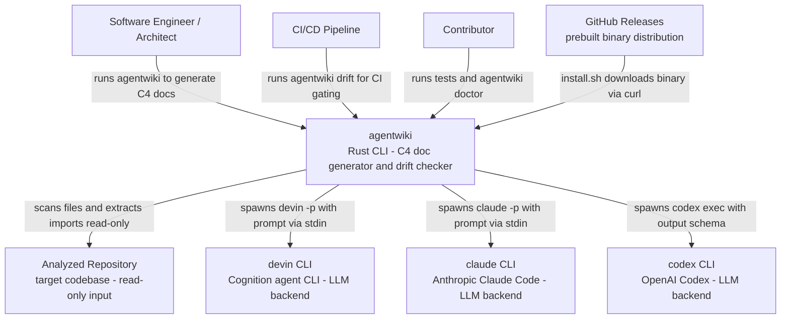

# System Context Overview — agentwiki

## 1. Project Introduction

**agentwiki** is a self-contained, single-binary Rust CLI tool that generates C4-style architecture documentation for arbitrary code repositories. It is a rewrite/port of deepwiki-rs (Litho), reoriented around a key design decision: all LLM inference is delegated to locally installed, subscription-authenticated agent CLIs (`devin`, `claude`, `codex`) spawned as subprocesses, rather than an HTTP LLM API. This eliminates API key management entirely — users authenticate through the CLI subscriptions they already have.

The tool orchestrates a declarative DAG of LLM analysis agents through a four-stage pipeline:

- **Preprocess** — scans the target repository into structured `ScanData` (directory structure, file inventory, README material), respecting ignore rules.
- **Research** — fans out structured-analysis agents per directory and domain; agents exchange results through a shared, typed `ResearchContext` store according to declared dependencies and topological levels.
- **Compose** — document writer/editor agents transform research reports into the C4 document set: Overview, Architecture, Workflow, Boundary, Deep-dive, and Data/Database documents, rendered as Markdown.
- **Verify** — post-generation checks on composed documents (e.g., Mermaid diagram validity, completeness).

A second, read-only capability — `agentwiki drift` — statically extracts the target repository's real import graph (Rust, Python, JS/TS) and cross-checks it against the dependency edges claimed in generated documentation, classifying claims as confirmed, unverifiable, reversed, or phantom, and surfacing undocumented real dependencies. This addresses a core problem in generated docs: silent divergence from the code.

All state — cache, quota ledger (`calls.jsonl`), locks, context snapshots, baselines — is written under the target repository's `.agentwiki/` directory.

### Core Objectives

- Automate the expensive manual work of producing accurate, up-to-date C4 documentation from source.
- Keep documentation *honest*: the drift checker verifies documented dependency claims against actual imports.
- Control cost and latency through content-hash caching, daily call quotas, model-tier selection, and resumable context snapshots.
- Remain fully testable offline via an in-process `MockBackend`, with opt-in real-CLI end-to-end tests.

## 2. Target Users

| User Group | Description | Key Needs |
|---|---|---|
| **Software engineers / architects** | Developers who need accurate, current architecture documentation for a repository they own or are onboarding to | Generate C4-level docs from source; choose backend and model tier per project (devin/claude/codex; efficient/powerful); cache results and cap daily agent calls to control cost; observe progress during long runs |
| **CI/CD pipelines and maintainers** | Teams running `agentwiki drift` in CI to detect documentation drift | Read-only drift check comparing claimed edges to the real import graph; machine-readable findings (`drift.json`) and exit codes for strict-mode gating; baseline file to suppress known findings; low false-positive rate via ordered filter chains (C1–C12, U1–U9) |
| **Contributors** | Developers modifying agentwiki itself | Offline test suite via MockBackend with opt-in real-CLI e2e; environment health checks via `agentwiki doctor`; prompt template overrides without recompiling |

### Usage Scenarios

- **Documentation generation** (`agentwiki`): scan → research DAG → compose → verify; writes Markdown docs under the output directory.
- **Drift check** (`agentwiki drift`): read-only; extract import graph → classify claims → detect undocumented edges → baseline → report + exit code.
- **Health check** (`agentwiki doctor`): probes agent CLI availability/versions on PATH, inspects `.agentwiki/` state (locks, quota, cache), validates config, and optionally `--fix`es stale locks/temp files.

## 3. System Boundaries

agentwiki is a **single-binary CLI** — not a service, daemon, or hosted product. It reads a target repository, drives external agent CLIs for all LLM work, writes documentation and state under the target repo's `.agentwiki/` directory, and performs read-only drift verification.

### In Scope

- CLI interface and layered configuration (clap args → global config → project `agentwiki.toml` → CLI overrides), named profiles, model tiers, timeouts
- Repository scanner and prompt material builders
- Agent orchestration DAG: `AgentSpec` registry, topological fan-out runner, shared `ResearchContext`
- Backend adapter layer (`AgentBackend` trait; devin/claude/codex/mock adapters)
- Structured-output parsing with lenient deserializers, retry-with-feedback, and model fallback
- Prompt template engine (embedded `include_str!` templates with disk overrides)
- Content-hash cache, daily quota, and `calls.jsonl` audit log
- Compose stage producing the C4 Markdown document set
- Drift checker: import extractors (Rust/Python/JS), resolvers, file→node graph, C1–C12 claim classification, U1–U9 undocumented-edge filters, baseline, report
- Diagnostics (`doctor`), progress display, atomic writes, run locking/cancellation
- Installer script (`install.sh`) and crates.io packaging

### Explicitly Out of Scope

- **LLM inference itself** — delegated entirely to external agent CLIs
- **LLM provider authentication** — handled by each CLI's own subscription auth
- **OpenAI-compatible HTTP API access** — an explicit non-goal of the design
- **Editing or fixing the analyzed repository** — agents run read-only against it
- **A hosted service, UI, or long-running daemon**
- **Full semantic/AST analysis** — import extraction is bounded-scope, regex/sanitizer-based static analysis (with offset-preserving comment/string blanking), not a compiler frontend

## 4. External System Interactions

| External System | Description | Interaction |
|---|---|---|
| **devin CLI** | Cognition's Devin agent CLI; LLM backend | Subprocess spawn (`devin -p`), prompt via stdin, plain stdout/stderr capture |
| **claude CLI** | Anthropic's Claude Code CLI; LLM backend | Subprocess spawn (`claude -p`), prompt via stdin, JSON output envelope parsed for text, structured output, and token usage |
| **codex CLI** | OpenAI's Codex CLI; LLM backend | Subprocess spawn (`codex exec`), prompt via stdin, line-based event stream parsed; JSON schema passed via `--output-schema` |
| **GitHub Releases** | Hosts prebuilt agentwiki binaries | HTTP download via `curl` in `install.sh`; platform mapped to Rust target triples |
| **Analyzed repositories** | Arbitrary user codebases used as input | Read-only filesystem scanning and static import extraction (Rust, Python, JS/TS) |

The `AgentBackend` trait abstracts all backend interactions behind a single interface, with a `for_kind` factory, PATH auto-detection (`BackendKind::detect`), per-adapter command construction and output parsing, model-string parsing, JSON schema normalization/sanitization per backend, and environment sanitization for spawned CLIs.

## 5. System Context Diagram

**Key points:**

- All LLM calls flow through subprocess spawns of the three agent CLIs; agentwiki never talks to an LLM HTTP API.
- The analyzed repository is strictly an input — nothing in it is modified; all agentwiki state lives under `.agentwiki/`.
- GitHub Releases is only involved in installation, not runtime.

## 6. Technical Architecture Overview

Internally, agentwiki is organized into seven domains (detail belongs to the C4 Container/Component levels; summarized here for context):

- **Agent Orchestration** (core) — declarative agent DAG: spec registry with topological levels, fan-out runner with retry/fallback and multi-strategy JSON extraction, shared `ResearchContext`, prompt materials assembly, and serde/schemars report schemas with lenient deserializers.
- **LLM Backend Integration** (core) — `AgentBackend` trait and adapters for devin, claude, codex, and mock.
- **Documentation Composition & Output** (core) — C4 document writers, output verification, and per-document editor prompt templates.
- **Drift Verification** (supporting) — import extraction and resolution, file/node graph with strong vs. wide evidence, C1–C12 claim classification, U1–U9 undocumented-edge filters, baseline, `drift.json` report, strict-mode exit codes.
- **Repository Scanning & Preprocessing** (supporting) — filesystem scanner producing `ScanData` and code insight collection.
- **Prompt Engineering Assets** (supporting) — analyst persona/output-contract templates and the render/loader engine.
- **CLI & Runtime Infrastructure** (infrastructure) — clap entry/dispatch, config merge, cache/quota/audit, `doctor` diagnostics, progress display, process utilities, atomic writes, error types.

Two primary business flows traverse these domains:

1. **Documentation Generation Pipeline** — `main` → scan → research DAG (runner → backend) → compose → verify → Markdown output.
2. **Documentation Drift Check** — `drift` subcommand → scan → import extraction → resolution/graph → claim classification → undocumented detection → baseline/report/exit code.

Both share the scanner and infrastructure; the drift flow is deliberately read-only (no run lock), making it safe for concurrent CI use.