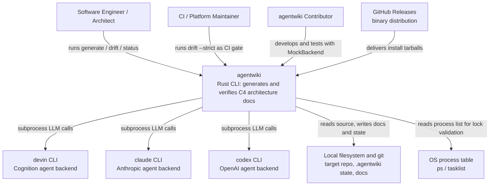

# Project Overview

## 1. Project Introduction

**agentwiki** is a Rust CLI tool (v0.5.0) that automatically generates C4-style architecture documentation for a target codebase. It is a rewrite of deepwiki-rs. Rather than calling LLM APIs directly, it delegates all model inference to already-authenticated agent CLIs on the local machine — `devin`, `claude`, and `codex` — invoked as subprocesses.

### Core Objective

Turn a source repository into verified, C4-style Markdown architecture documentation with minimal cost, minimal credential friction, and a verification layer that catches hallucinated or stale dependency claims — the main failure mode of LLM-generated docs.

### Business Value

- **Removes the cost of hand-written architecture docs**, which are expensive to produce and quick to go stale.
- **No API-key management** — reuses each agent CLI's existing local authentication.
- **Cost control** via content-hash caching, daily call quotas, and manifest-based incremental regeneration (only what changed is regenerated).
- **Trust through verification** — the `drift` subsystem statically extracts the real import graph and classifies every generated dependency claim (confirmed, structural, reversed, phantom, undocumented, unverifiable).

### Technical Characteristics

- **Four-stage pipeline**: Preprocess → Research → Compose → Verify.
- **Declarative multi-agent DAG**: research and compose tasks are declared as `AgentSpec`s with dependencies, fan-out axes (per-directory, per-domain), and model tiers; executed in topological levels with bounded concurrency.
- **Pluggable LLM backends** behind an `AgentBackend` trait; a scripted `MockBackend` enables fully offline testing.
- **Deterministic, read-only relationship with the target repo**: the tool only reads source; all state goes to `.agentwiki/` and generated docs to the docs directory.
- **Incremental and auditable**: manifest fingerprints, content-hash cache, daily quota counter, `calls.jsonl` audit log, and a run lock.
- **CI-grade verification**: `agentwiki drift --strict` produces deterministic exit codes (0/1/2) and exportable claims (`agentwiki.claims.json`).

## 2. Target Users

| User | Description | Key Needs |
|---|---|---|
| **Software engineers and architects** | Developers who need up-to-date C4 architecture docs for a codebase they own or are onboarding onto | Generate overviews, deep-dives, and workflow docs from source; incremental regeneration; drift detection when docs diverge from code |
| **CI/platform maintainers** | Teams wiring doc freshness checks into pipelines | `agentwiki drift --strict` as a CI gate; exported claims for automated verification; deterministic exit codes |
| **Contributors to agentwiki** | Developers extending the tool | Offline testing via `MockBackend` and `mock:*` model strings; optional e2e suite (`AGENTWIKI_E2E=1`); clippy-clean, no-unwrap conventions |

### Usage Scenarios

- **`agentwiki generate`** (default): scan repo → run research/compose agent DAG over agent CLIs → write doc tree → verify → summary.
- **`agentwiki drift`**: validate generated dependency claims against the real import graph; emit confirmed/structural/reversed/phantom/undocumented findings; exit-coded for CI.
- **`agentwiki doctor` / `agentwiki status`**: read-only environment health checks (agent CLIs on PATH, state dirs, stale locks) and freshness reporting (manifest diffs, doc ages, predicted regenerations).

## 3. System Boundaries

agentwiki owns everything **from scanning a target repo to emitting verified Markdown architecture docs**, plus the local state (cache, manifest, quota, drift baseline) needed to make runs incremental and auditable. It does **not** implement LLM inference — all model calls are delegated to external agent CLIs.

### Included in scope

- **CLI surface** — `generate` pipeline plus `doctor`/`drift`/`status` subcommands (clap)
- **Configuration layer** — `agentwiki.toml`, global config, profiles, model tiers, CLI > TOML > default precedence
- **Scanner / preprocess stage** producing `ScanData` (repo structure, files, README)
- **Agent orchestration core** — `AgentSpec` DAG registry, topological scheduling, fan-out, `ResearchContext` shared store
- **Agent runner** — prompt assembly, cache/quota checks, backend invocation, JSON extraction, retry-with-feedback, model-tier fallback
- **Backend abstraction** — `AgentBackend` trait with devin/claude/codex implementations and `MockBackend`
- **Structured report schemas** with lenient deserializers for messy LLM output
- **Prompt template system** — embedded defaults with disk overrides, `{{key}}` rendering
- **Compose stage** producing C4 documents (overview, architecture, deep-dive, workflows) via editor prompts
- **Drift engine** — import extraction for Rust/Python/JS-TS, resolution to a file graph, C1–C12 claim classification, U1–U9 undocumented-edge filters, baseline and report
- **State management** — content-hash cache, manifest fingerprints, daily quota counter, `calls.jsonl` audit log, run lock
- **Diagnostics** — doctor probes, drift report, status/freshness report, progress display

### Explicitly out of scope

- **LLM inference and model hosting** — delegated entirely to external agent CLIs
- **Authentication / credential management** — relies on each agent CLI's own login state
- **The target codebase being documented** — it is input, not part of the system
- **Doc hosting / rendering** — emits Markdown files; no web UI or publishing step
- **Full AST parsing** — import extraction is regex/heuristic-based over sanitized source
- **Write access to the target repo** — the tool only reads it; all outputs go to `.agentwiki/` and the docs directory

## 4. External System Interactions

| External System | Description | Interaction |
|---|---|---|
| **devin CLI** | Cognition's Devin agent CLI | Subprocess invocation (`devin -p`); prompt passed in, output parsed back. Reference backend. |
| **claude CLI** | Anthropic's Claude Code CLI | Subprocess (`claude -p`, prompt on stdin); JSON output envelope parsed for result text, token usage, errors. Supports `claude:<model>@<effort>` model strings. |
| **codex CLI** | OpenAI's Codex CLI | Subprocess (`codex exec`, prompt on stdin, `-o` output file); JSONL event stream parsed for text, usage, turn failures. JSON schemas normalized to codex's stricter requirements. |
| **GitHub Releases** | Release host for prebuilt binaries | `install.sh` downloads platform-matched release tarballs over HTTPS. |
| **Local filesystem and git** | Target repo, `~/.config` config files, `.agentwiki/` state dir, git HEAD | Reads source files for scanning and import extraction; reads git HEAD for manifest diffs; writes cache, `research.json`, manifests, `calls.jsonl`, and generated docs. |
| **OS process table** | `ps`/`tasklist` output | Parsed by `sys.rs` to detect running/orphaned agent processes and validate run-lock liveness. |

### Key dependencies

- **At least one agent CLI installed and authenticated** on PATH (devin, claude, or codex) — verified by `agentwiki doctor`.
- **A git repository** as the target for manifest diffing (git HEAD).
- **Network access only for installation** (GitHub Releases); runtime model calls go through the agent CLIs' own connectivity.

## 5. System Context Diagram

### Key observations

- **agentwiki sits between the user and the agent CLIs**: users never interact with LLM APIs; the tool translates documentation tasks into subprocess invocations.
- **The target repository is input, not a component** — the system is strictly read-only toward it.
- **The drift subsystem is self-contained**: it reuses the scanner's file set but performs no LLM calls, making it deterministic and CI-friendly.

## 6. Technical Architecture Overview

Internally, agentwiki is organized as a strict layered pipeline with six domain modules:

| Domain | Type | Role |
|---|---|---|
| **Documentation Generation Pipeline** (`src/pipeline`, `src/main.rs`, `src/cli.rs`, `src/output`) | Core | Orchestrates Preprocess → Research → Compose → Write → Verify; owns `PipelineCtx`, concurrency limits, cancellation, run statistics |
| **Agent Orchestration & Analysis** (`src/agent`) | Core | Declarative task DAG (`AgentSpec` registry, topo levels, per-directory/domain fan-out), agentic runner with retries and model-tier fallback, `ResearchContext` shared store, structured report schemas with lenient deserializers |
| **Agent Backend Integration** (`src/backend`) | Supporting | `AgentBackend` trait unifying devin/claude/codex subprocess invocations plus `MockBackend`; normalizes envelopes and event streams |
| **Drift Detection & Claim Verification** (`src/drift`) | Core | Read-only verification bounded context: multi-language import extraction, per-language resolution into `FileGraph`, C1–C12 verdict chain, U1–U9 undocumented-edge filters, baseline/reporting |
| **Repository Scanning** (`src/scanner`) | Supporting | Deterministic Phase-0 preprocessing: filesystem walk, directory structure metadata, README extraction, per-file statics — no AI calls |
| **Configuration & Prompt Management** (`src/config.rs`, `src/prompt.rs`, `prompts/`) | Infrastructure | Layered config (defaults → TOML → CLI), profile/model-tier resolution, `{{key}}` template engine, embedded prompt persona library |
| **Runtime Governance & Operations** (`src/cache.rs`, `src/manifest.rs`, `src/quota.rs`, `src/doctor.rs`, `src/status.rs`, `src/diag.rs`, `src/progress.rs`, `src/sys.rs`, `src/util.rs`, `src/error.rs`) | Infrastructure | Cross-cutting run-state services: content-hash cache, change manifests, daily quota + `calls.jsonl` audit, doctor/status commands, progress display, platform utilities |

### Domain relationships

- The **Pipeline** drives the **Agent Orchestration** DAG by topological level and consumes **Scanner** output, **Configuration**, and **Runtime Governance** services (cache, quota, manifest, progress).
- The **Agent Runner** invokes the **Backend** abstraction for every real model call, checking the content-hash cache and consuming quota/audit first.
- The **Drift** context reuses the **Scanner**'s file set and consumes relationship report types as claim inputs — a pure, read-only verification path.
- **Doctor/status** surface manifest diffs and drift state without mutating pipeline state.

### Primary business flows

1. **Generate Documentation Run** (`agentwiki generate`, importance 10.0): CLI parse → run lock → filesystem scan → manifest diff → topo-level agent DAG execution (research, then compose) → backend subprocess calls with cache/quota/retry → deterministic doc tree write and verify.
2. **Drift Verification** (`agentwiki drift`, importance 8.5): scan → multi-language import extraction → resolve to `FileGraph` → C1–C12 claim classification → U1–U9 undocumented-edge detection → baseline diff, report render, exit code.
3. **Operational Health & Freshness** (`agentwiki doctor`, `agentwiki status`, importance 6.5): probe agent CLI versions/processes/state dirs; diff stored manifest vs fresh scan; report doc ages and predict regenerations — all read-only.

This separation — a deterministic scanner and drift engine flanking a cost-governed LLM orchestration core — is what lets agentwiki produce documentation that is both cheap to regenerate and independently verifiable.