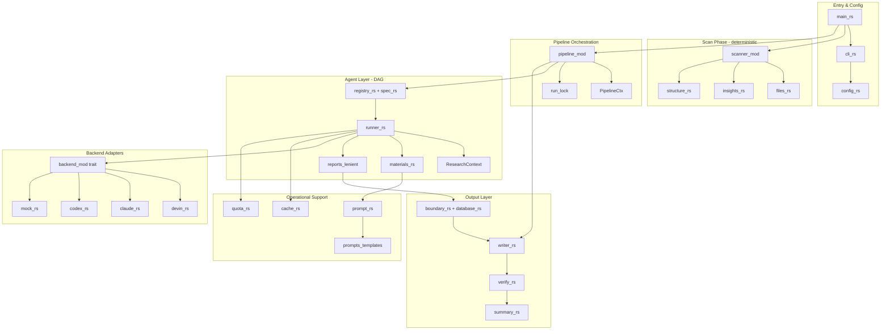
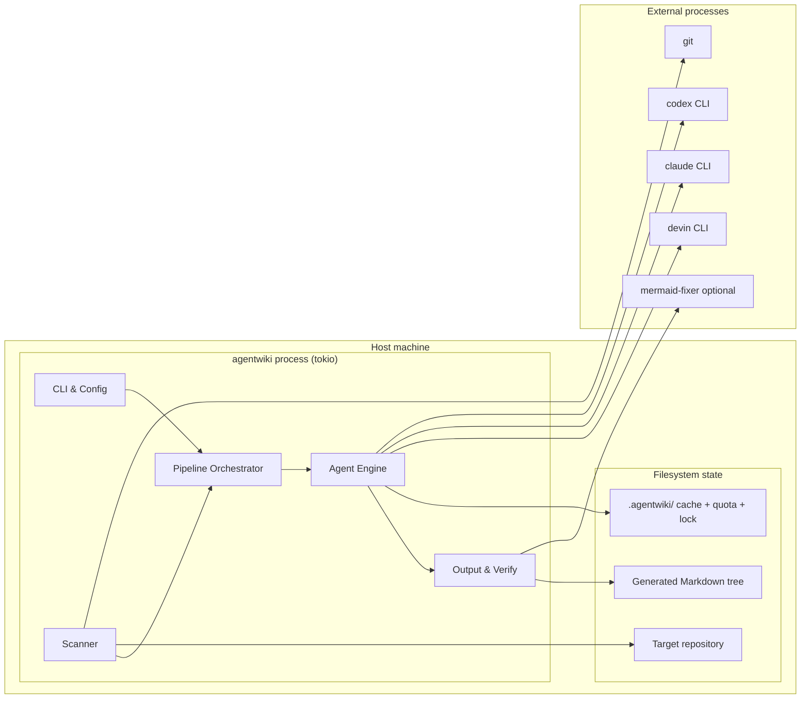
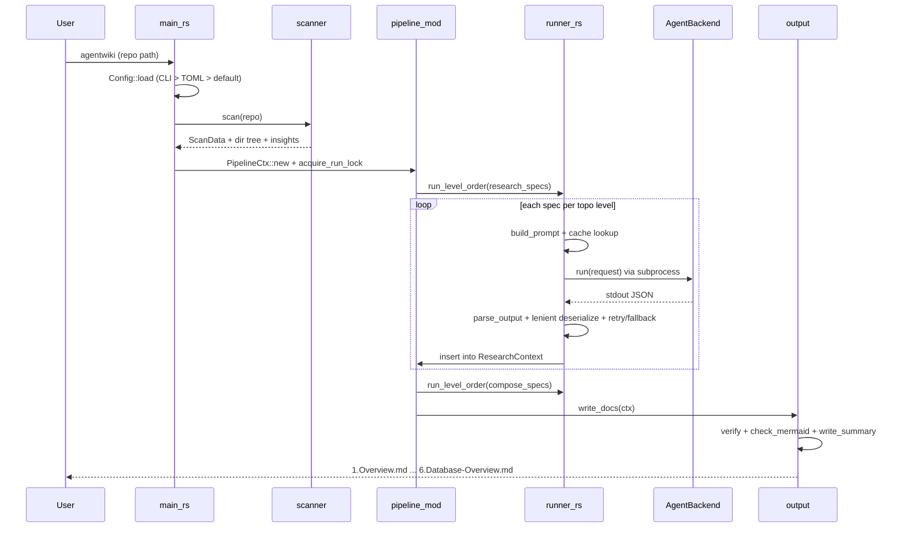
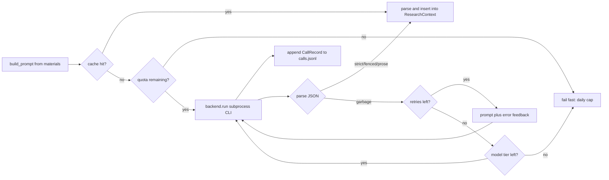
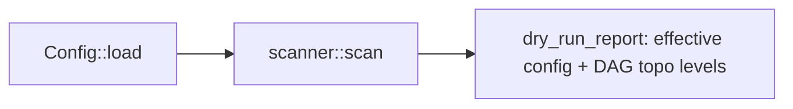
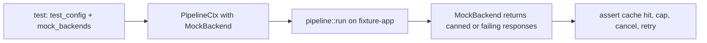

# System Architecture Documentation

## 1. Architecture Overview

**agentwiki** is a Rust CLI tool (a rewrite of deepwiki-rs/Litho) that generates C4-style architecture documentation for an arbitrary source repository. Its defining design decision: **it performs no LLM inference in-process**. Instead of calling paid HTTP LLM APIs, it delegates all reasoning to already-authenticated agent CLIs — `devin`, `claude`, and `codex` — spawned as subprocesses behind a ports-and-adapters `AgentBackend` trait.

The system is a unidirectional, layered pipeline with five phases:

```
Scan (deterministic, no AI) → Research (DAG of agent tasks) → Compose (editor agents) → Write → Verify
```

Output is a Markdown documentation tree (`1.Overview.md` … `4.Deep-Exploration/*` … `6.Database-Overview.md`) plus a summary report, written directly into the target repository's output directory, with run state under `.agentwiki/`.

**Core architectural qualities:**

- **Cost/quota protection as a first-class concern** — sha256 prompt cache, daily call cap with `calls.jsonl` audit, billing env-var sanitization, and a `--dry-run` mode. Four independent defense layers protect the Max-subscription quotas of the backing CLIs.
- **Anti-corruption boundary around LLM output** — lenient deserializers tolerate "dirty" JSON (coercing wrong types rather than failing), combined with multi-strategy parsing (strict / fenced / prose-wrapped) and retry-with-feedback.
- **Determinism where possible** — scanning, boundary/database rendering, and verification are pure Rust; LLM calls are reserved for synthesis tasks.
- **Testability** — `MockBackend` allows the full pipeline to run offline; E2E tests against real CLIs are gated behind `AGENTWIKI_E2E`.



## 2. System Context

agentwiki sits between a user (developer/architect or operator) and a set of external CLI tools, reading a target repository and producing documentation.

**Actors:**

| Actor | Description | Needs |
|---|---|---|
| Software engineer / architect | Wants to quickly understand a codebase (onboarding, review, audit) | Full C4 docs from one CLI command; valid Mermaid; readable Markdown |
| Operator / tool owner | Runs the tool on a VPS/workstation, owns quota & cost | Daily call caps, audit log, caching, dry-run, billing env filtering |

**External systems:**

| System | Interaction |
|---|---|
| `devin` CLI | Subprocess spawn (`tokio::process::Command`), prompt via arg/stdin, stdout as result |
| `claude` CLI | Subprocess, prompt written to stdin |
| `codex` CLI | Subprocess `codex exec`, last message captured via `-o` flag |
| `git` | `git ls-files` to optionally restrict scanning to tracked files |
| `mermaid-fixer` | Optional external binary for Mermaid syntax validation at verify time; falls back to internal heuristics |
| Filesystem / target repo | Read-only scanning of source; writes doc tree and `.agentwiki/` state |

**System boundary.** Included: CLI parsing, config merge, deterministic scanning, the agent DAG engine, report schemas/deserializers, backend adapters, pipeline orchestration (lock, cancellation, dry-run), Markdown output/verify/summary, cache/quota/prompt loading, and the prompt template knowledge base. Excluded: LLM inference itself, CLI authentication management, dedicated Mermaid repair (only integrates `mermaid-fixer` if present), any web UI, modification of the analyzed repository, and git/CI management of the target repo.

## 3. Container View

agentwiki is a **single-process async Rust binary** (tokio). There are no network services; "containers" in C4 terms map to the executable plus its on-disk stores and external processes it spawns.



| Container | Technology | Responsibility |
|---|---|---|
| `agentwiki` binary | Rust + tokio + clap + serde_json + walkdir + regex | Entire pipeline: scan, orchestrate, call backends, write, verify |
| `.agentwiki/` state | JSON files on disk | `cache/` sha256-keyed responses, `calls.jsonl` audit, daily quota state, `run.lock` |
| Agent CLIs | `devin`, `claude`, `codex` | All LLM reasoning; spawned per call with sanitized environment |
| `mermaid-fixer` | Optional external binary | Strict Mermaid validation (soft dependency) |

## 4. Component View

### 4.1 Entry & Configuration (`src/main.rs`, `src/cli.rs`, `src/config.rs`, `src/error.rs`)

- `main.rs` — entry point, tracing/logging init, invokes the pipeline.
- `cli.rs` — `Args` via clap (repo path, `--dry-run`, model overrides, etc.).
- `config.rs` — `Config::load` merges **CLI flags > TOML file > defaults**, supports named profiles and per-tier model mapping (`model_for`, `call_timeout`). This is how callers pick `devin:…`, `claude:…`, `codex:…` model strings.
- `error.rs` — shared error type.

### 4.2 Scanner (`src/scanner/`) — deterministic Phase 0

| Module | Key functions | Role |
|---|---|---|
| `files.rs` | `scan_files`, `is_excluded_dir`, `git_tracked_files`, `is_binary_by_content`, `importance` | Walks the tree with walkdir, filters hidden/binary/excluded dirs, optional git-tracked-only, heuristic importance scoring |
| `insights.rs` | `extract`, `rules_for`, `cached_regex`, `signature_line` | Per-language regex rules (Rust, Python, JS/TS, Go, Java…) extracting functions, types/classes, imports, LOC and cyclomatic complexity — a lightweight replacement for deepwiki-rs's language_processors |
| `structure.rs` | `build_structure`, `extract_docs`, `format_as_tree`, `format_as_directory_tree`, `read_capped` | Groups files into `ScanData`, reads README, renders a char tree for prompts, character-capped file reading |

### 4.3 Pipeline Orchestration (`src/pipeline/mod.rs`)

The orchestration bounded context — decides *when* things run.

- **`PipelineCtx`** — shared context handed to every agent spec: config, `ScanData`, `Cache`, `Quota`, `PromptLoader`, `Semaphore`, backend registry, `CancellationToken`. Key methods: `new`, `backend`, `cache_hit`, `cli_call`, `record`, `load_research`.
- **DAG scheduler** — `run`, `run_pipeline`, `research`, `compose`, `run_level_order` execute specs per topological level in parallel via `JoinSet`, bounded by `Semaphore`, cancellable via `CancellationToken`.
- **Run lock & dry-run** — `acquire_run_lock` writes `run.lock` (reclaims stale locks from dead pids) to prevent concurrent runs; `dry_run_report` prints effective config + DAG levels without spending a single CLI call.

### 4.4 Agent Layer (`src/agent/`) — the business-logic core

- **`runner.rs`** — the per-instance agentic loop: `build_prompt` → cache lookup → `quota.consume` → `backend.run` → `parse_output` (`extract_strict` / `extract_fenced` / `extract_prose_wrapped`) → retry-with-feedback → model-tier fallback → `CallRecord` audit. `run_spec` handles fan-out (`PerDir`, `PerDomain`) and `aggregate` merges instance results.
- **`registry.rs` + `spec.rs`** — static `AgentSpec` declarations for the whole pipeline (phase, fan-out, model tier, materials, schema) and `topo_levels` for level-ordered parallel scheduling. `research_specs` covers system_context, dir_summary fan-out, domain_modules, boundary, database, relationships, key_module, architecture, workflow; `compose_specs` covers the editor specs.
- **`context.rs`** — `ResearchContext`, a typed async store (`RwLock<HashMap>`) sharing results between DAG nodes, with `snapshot`/`save`/`load` persistence.
- **`materials.rs`** — renders `ScanData`, dossiers, insights and relationships into prompt text blocks (`render_material`, `project_structure`, `readme_block`, `code_insights_block`, `relationships_block`), with length caps and insight filtering/sorting.

### 4.5 Report Contracts (`src/agent/reports/`) — anti-corruption layer

| Module | Content |
|---|---|
| `lenient.rs` | Shared coercion deserializers: `de_string`, `de_opt_string`, `de_f64`, `de_bool`, `de_vec_string`, `de_vec_obj`, `any_to_string` — wrong types become valid values instead of failures |
| `code.rs` | `DirectoryDossier`, `FileInsight`, `CodePurpose` for dir_summary fan-out, `map_from_raw` normalizing LLM classification labels |
| `research.rs` | `SystemContextReport`, `DomainModulesReport`, `BoundaryAnalysisReport`, `DatabaseOverviewReport` |
| `relationship.rs` | `CoreDependency`, `ArchitectureLayer`, `RelationshipAnalysis`, `DependencyType` |

Each report has a JSON schema (`schema_spec`) that is injected into the prompt so backends know the expected shape.

### 4.6 Backend Adapters (`src/backend/`) — ports & adapters

- `mod.rs` — async trait `AgentBackend` (`run`, `supports_fs`), `AgentRequest`/`AgentResult`/`TokenUsage`, `BackendKind`, factory `for_kind`, `parse` for `<backend>:<model>` strings, and `sanitized_env` which **strips billing-related env vars** so CLIs can't silently switch to paid API-key usage.
- `devin.rs` — `devin -p`, prompt via args, stdout captured.
- `claude.rs` — `claude -p`, prompt written to stdin via `AsyncWriteExt`.
- `codex.rs` — `codex exec`, prompt via stdin, last message via `-o`.
- `mock.rs` — in-process canned/scripted responses with configurable delay and error injection (`with_delay`, `canned`) for offline tests.

### 4.7 Operational Support (`src/cache.rs`, `src/quota.rs`, `src/prompt.rs`, `prompts/`)

- `cache.rs` — key = sha256(prompt ‖ model ‖ backend ‖ SCHEMA_VERSION); `CacheEntry` JSON under `.agentwiki/cache`; hit/miss stats.
- `quota.rs` — per-day `DayState` counter, `consume`/`record`/`today_count`, appends a `CallRecord` JSONL line per real call, synchronized by tokio Mutex.
- `prompt.rs` — `PromptLoader` prefers on-disk `prompts/` files, falls back to `include_str!` embedded templates; renders only known `{{key}}` placeholders.
- `prompts/` — Markdown templates: research tasks (system_context, domain_modules, boundary, database, dir_summary, relationships, key_module, architecture, workflow) and editors (overview, architecture_doc, workflow_doc, deep_dive), all embedding shared Mermaid safety rules.

### 4.8 Output (`src/output/`)

- `writer.rs` — static `DOCS` mapping of context keys to output paths (`1.Overview.md` … `4.Deep-Exploration/*` … `6.Database-Overview.md`), `sanitize_filename` for dynamically named docs.
- `boundary.rs`, `database.rs` — deterministic Markdown renderers for `BoundaryAnalysisReport` (CLI/API/router sections) and `DatabaseOverviewReport` (tables/views/procedures/data flows, Mermaid), `mermaid_id` sanitization.
- `verify.rs` — reconciles written files against expectations, `check_mermaid` via internal heuristics plus `run_mermaid_fixer` when the binary exists.
- `summary.rs` — `write_summary` emits `__AgentWiki_Summary__.md` and `summary.json`.

### 4.9 Tests (`tests/`)

- `pipeline_offline.rs` — six offline integration tests covering full pipeline, daily cap, second-run cache, mid-flight cancellation, concurrent-run refusal, and retry-on-garbage.
- `e2e_real_cli.rs` — per-backend E2E tests, `#[ignore]`d unless `AGENTWIKI_E2E` is set.
- `fixture-app/` — a small Python/SQLite task-manager used as sample input.

### 4.10 Known drift / housekeeping

`src/verify/` exists but is empty (verification lives in `src/output/verify.rs`); `src/progress.rs` and `src/util.rs` are utility modules not mapped to a domain; `src/pipeline/mod.rs` (349 lines) concentrates context, scheduling, locking and dry-run — a candidate for splitting if it grows.

## 5. Key Processes

### 5.1 Full documentation generation



Research DAG shape: `system_context` and `dir_summary` (fanned out per directory) feed `domain_modules`, which feeds `boundary` / `database` / `relationships`. `key_module` fans out per domain. Compose specs then read all research results from `ResearchContext`.

### 5.2 Runner LLM call loop (per agent instance)



### 5.3 Dry-run



No CLI calls are consumed — used to validate configuration and DAG shape before a real run.

### 5.4 Offline testing with MockBackend



## 6. Technical Implementation

**Technology selection.** Rust + tokio for async subprocess orchestration and parallelism (`JoinSet`, `Semaphore`, `CancellationToken`); clap for CLI; serde/serde_json with custom deserializers for the ACL; walkdir + regex for deterministic scanning; `include_str!` so embedded prompt templates make the binary self-contained.

**Key design patterns:**

- **Ports & Adapters** — `AgentBackend` is the single seam between the pipeline and external CLIs; swapping devin/claude/codex/mock requires no changes above the trait.
- **Anti-Corruption Layer** — `reports/lenient.rs` deserializers isolate dirty LLM JSON from the pure-Rust output layer; combined with three parse strategies and retry-with-feedback, this substantially raises success rates against schema-noncompliant backends.
- **Shared Context / Blackboard** — `ResearchContext` decouples DAG nodes; producers insert typed reports, consumers read them at compose time.
- **Template Method / Declarative specs** — `AgentSpec` + `registry` declare the whole DAG statically; the runner implements the uniform execution loop.
- **Deterministic rendering** — boundary and database docs are rendered from structured reports rather than asking the LLM for prose, reducing both cost and nondeterminism.

**Scalability & performance:**

- Parallelism is bounded by a `Semaphore`; agent instance count scales with repo size via `PerDir`/`PerDomain` fan-out, so the semaphore is the primary backpressure mechanism protecting quota.
- Cache hits short-circuit before quota consumption — a second identical run costs zero CLI calls.
- Prompt material rendering is length-capped (`read_capped`, insight filtering) to bound token usage.
- Bottleneck: throughput is limited by external CLI latency and daily caps, not CPU; the failure mode under quota exhaustion is explicit (`fail fast`), not silent degradation.

**Security / cost protection:**

- `sanitized_env` strips billing/API-key env vars from spawned CLIs so they cannot fall back to paid API billing — enforcing the "subscription CLI only" policy.
- `calls.jsonl` provides a per-call audit trail (model, backend, duration, outcome).
- `run.lock` with stale-pid reclamation prevents concurrent runs from corrupting `.agentwiki/` state or double-spending quota.
- Prompt cache keys include `SCHEMA_VERSION`, so schema changes invalidate stale entries automatically.

**Extension points:** new backends (implement `AgentBackend` + `BackendKind`), new agent tasks (add an `AgentSpec` + prompt template + report schema), new report types (schema + lenient deserializers), new output docs (extend `DOCS` mapping and renderers).

## 7. Deployment Architecture

**Runtime model.** Single-user CLI invoked manually or from cron/automation on a workstation or VPS. No daemons, no network listeners. All state lives under the target repo's `.agentwiki/` directory.

**Prerequisites on the host:**

- At least one authenticated agent CLI on `PATH`: `devin`, `claude`, or `codex` (subscription-authenticated; billing env vars are stripped by `sanitized_env`).
- `git` (optional — only for git-tracked file filtering).
- `mermaid-fixer` (optional — improves verify strictness; heuristics are the fallback).

**Deployment strategy:**

- Distribute as a single Rust binary (`cargo build --release`). Embedded prompt templates mean the binary works without the `prompts/` directory; a `prompts/` dir on disk overrides embedded templates for customization.
- Configuration via `agentwiki.toml` (or equivalent TOML) plus CLI flags and named profiles — the effective config is always inspectable via `--dry-run` before spending quota.
- The target repository is treated read-only; generated docs and `.agentwiki/` state are the only writes.

**Operations guidance:**

| Concern | Mechanism |
|---|---|
| Preview before spend | `--dry-run` prints effective config + topo-ordered DAG |
| Budget control | `limits` config → `Quota::consume` fails fast at daily cap; audit via `.agentwiki/calls.jsonl` |
| Re-runs | sha256 cache makes repeated runs near-free; delete `.agentwiki/cache` to force regeneration |
| Concurrency safety | `run.lock` (stale-pid aware) rejects a second concurrent run |
| Partial failure | `CancellationToken` for cooperative abort; per-spec retry/fallback isolates flaky backends |
| Verification | `verify` reconciles expected vs written files and checks every Mermaid block |
| Testing | `cargo test` fully offline; set `AGENTWIKI_E2E=1` to opt into real-CLI tests |

**Risks:** external CLI behavior is outside the process boundary (latency, output format drift, auth expiry) — mitigated by lenient parsing, retry, and multi-backend fallback; `mermaid-fixer` is a soft dependency; `pipeline/mod.rs` is the main maintainability hotspot if responsibilities continue to accumulate.