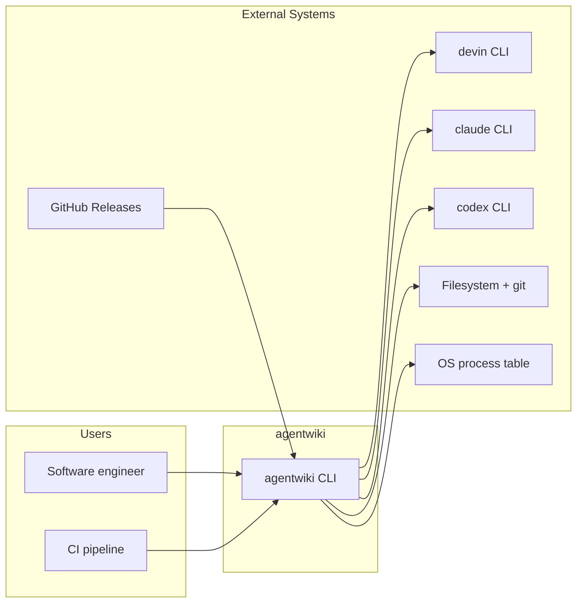
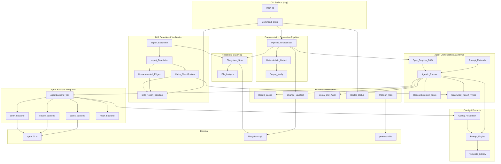
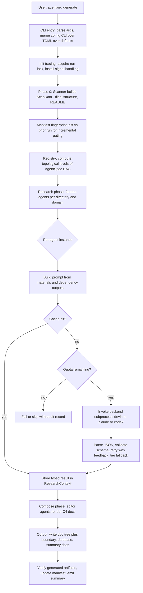
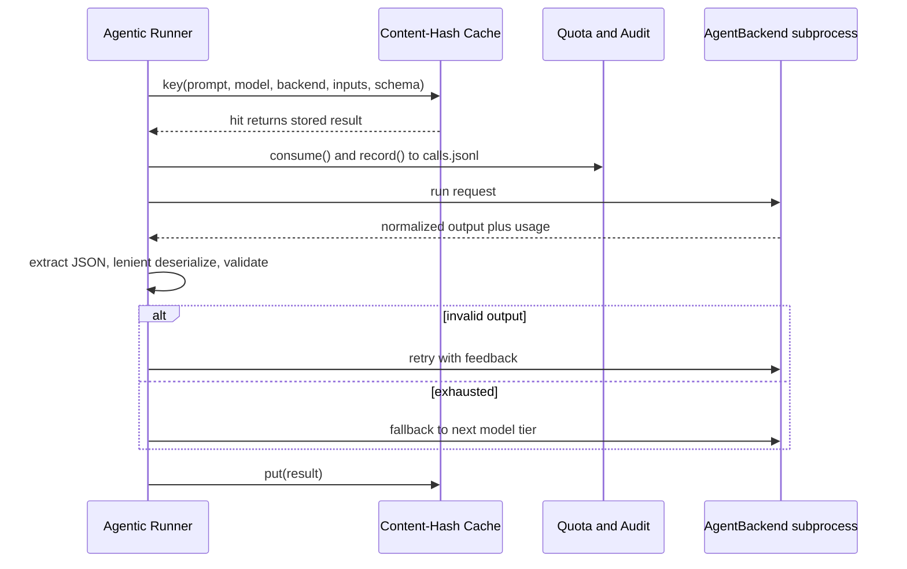
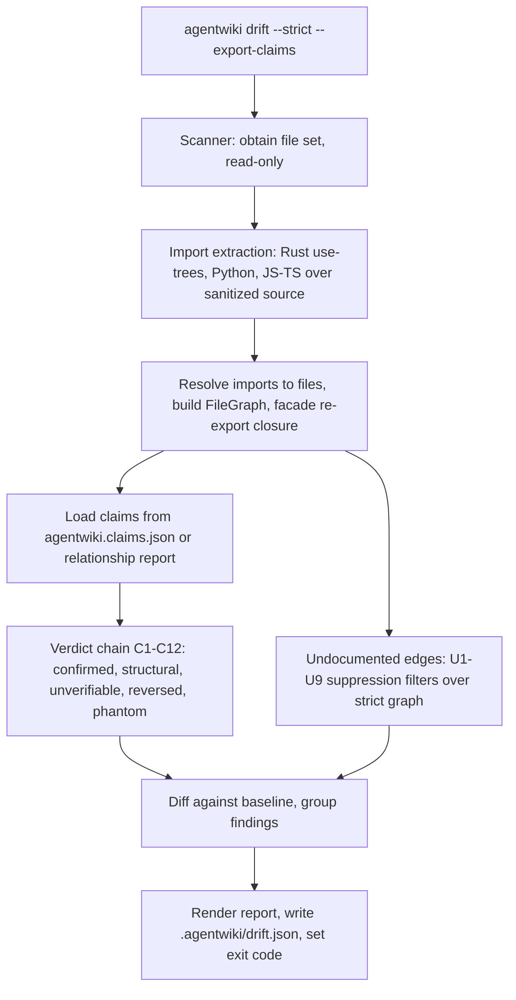
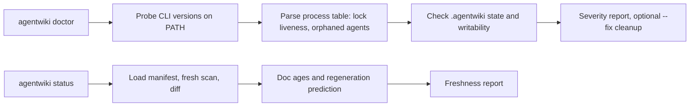
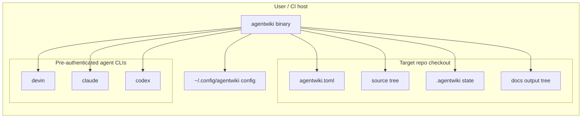

# System Architecture Documentation

## Architecture Overview

# agentwiki — Architecture Overview

**agentwiki** (v0.5.0) is a Rust CLI tool that generates C4-style architecture documentation for a target codebase. It is a rewrite of deepwiki-rs with a key architectural pivot: instead of calling LLM APIs directly, it shells out to already-authenticated agent CLIs (`devin`, `claude`, `codex`) as LLM backends. This removes API-key management entirely while delegating all model inference to external processes.

The system runs a four-stage pipeline — **Preprocess → Research → Compose → Verify** — that scans a repository, fans out analysis tasks over directories and domains, composes Markdown documents with Mermaid diagrams, and verifies generated dependency claims against a statically extracted import graph. A parallel read-only **drift engine** closes the hallucination loop, detecting invented or stale dependency claims — the dominant failure mode of LLM-generated documentation.

### Core Architectural Qualities

| Quality | Mechanism |
|---|---|
| **Cost-bounded** | Content-hash result cache, daily call quotas, manifest-based incremental regeneration |
| **Verifiable** | Drift engine validates claims against real import graph (C1–C12 verdict chain, U1–U9 filters) |
| **Auditable** | `calls.jsonl` audit log, deterministic exit codes (0/1/2) for CI scripting |
| **Read-only** | Never writes to the target repo; all state lives under `.agentwiki/` and the docs directory |
| **Resumable** | Cache + manifest fingerprints make interrupted or repeated runs cheap |
| **Offline-testable** | `MockBackend` (`mock:*` model strings) enables full pipeline tests without real CLI calls |

---

## 1. System Context

### 1.1 System Boundary

agentwiki owns everything from scanning a target repository to emitting verified Markdown architecture docs, plus the local state (cache, manifest, quota, drift baseline) needed to make runs incremental and auditable.

**Inside the boundary:**
- CLI surface: `generate` pipeline plus `doctor` / `drift` / `status` subcommands (clap)
- Configuration layer: `agentwiki.toml`, global config, profiles, model tiers (CLI > TOML > defaults)
- Scanner/preprocess stage producing `ScanData`
- Agent orchestration core: `AgentSpec` DAG registry, topological scheduling, fan-out, `ResearchContext` shared store
- Agent runner: prompt assembly, cache/quota checks, backend invocation, JSON extraction, retry-with-feedback, model-tier fallback
- `AgentBackend` trait with devin/claude/codex implementations and `MockBackend`
- Structured report schemas with lenient deserializers for messy LLM output
- Prompt template system: embedded defaults with disk overrides, `{{key}}` rendering
- Compose stage producing C4 documents via editor prompts
- Drift engine: multi-language import extraction, file-graph resolution, claim classification, baseline and reporting
- State management: cache, manifest, quota, audit log, run lock
- Diagnostics: `doctor` probes, `drift` report, `status` freshness report, progress display

**Outside the boundary:**
- LLM inference and model hosting — delegated entirely to external agent CLIs
- Authentication — relies on each agent CLI's own login state
- The target codebase — input only, never written to
- Doc hosting/rendering — emits Markdown; no web UI or publishing step
- Full AST parsing — import extraction is regex/heuristic-based over sanitized source
- Distribution — `install.sh` + GitHub Releases live outside the crate

### 1.2 External Systems

| External System | Interaction | Notes |
|---|---|---|
| `devin` CLI | Subprocess: `devin -p`, prompt in / result out | Reference backend; simplest pass-through |
| `claude` CLI | Subprocess: `claude -p`, prompt on stdin | JSON output envelope parsed for text, usage, errors; supports `claude:<model>@<effort>` |
| `codex` CLI | Subprocess: `codex exec`, `-o` output file | JSONL event stream; schemas normalized for stricter requirements |
| GitHub Releases | HTTPS download of platform tarballs | Install host only; no runtime coupling |
| Local filesystem + git | Read source for scan/imports; read git HEAD for manifest diffs; write `.agentwiki/` state and docs | Sole state store |
| OS process table | `ps` / `tasklist` parsed by `sys.rs` | Lock-liveness validation and orphaned-agent detection |

### 1.3 Target Users

- **Software engineers / architects** — generate and incrementally regenerate C4 docs; detect drift.
- **CI/platform maintainers** — `agentwiki drift --strict` as a pipeline gate, `agentwiki.claims.json` export, deterministic exit codes.
- **Contributors** — `MockBackend` for offline testing, `AGENTWIKI_E2E=1` for real-CLI e2e, clippy-clean no-unwrap conventions.

### 1.4 Context Diagram



---

## 2. Project Structure

The crate is both a binary (`main.rs`) and a library (`lib.rs`); tests under `tests/` consume the lib target.

```text
agentwiki/
├── Cargo.toml
├── install.sh                     # external distribution path (GitHub Releases)
├── agentwiki.toml                 # project config (optional)
├── prompts/                       # prompt template library (disk overrides embedded defaults)
│   ├── system_context.md          # research personas
│   ├── domain_modules.md
│   ├── boundary.md
│   ├── database.md
│   ├── workflow.md
│   ├── relationships.md
│   ├── dir_summary.md
│   ├── key_module.md
│   └── editors/                   # compose/editor personas (overview, architecture, deep-dive, workflow)
├── src/
│   ├── main.rs                    # CLI entry; dispatch, run lock, signal handling
│   ├── lib.rs                     # library target for tests/embedding
│   ├── cli.rs                     # clap command surface (Doctor, Drift, Status; generate is default)
│   ├── config.rs                  # layered config: defaults → TOML → CLI; profiles, model tiers
│   ├── prompt.rs                  # {{key}} template engine + PromptLoader (disk-override)
│   ├── error.rs                   # crate error taxonomy
│   ├── pipeline/
│   │   └── mod.rs                 # PipelineCtx, topo-level scheduling, semaphore, cancellation
│   ├── scanner/                   # Phase 0 deterministic preprocessing (no LLM)
│   │   ├── mod.rs                 # scan() → ScanData
│   │   ├── files.rs               # file walk honoring scan config/exclusions
│   │   ├── structure.rs           # directory structure + README extraction
│   │   └── insights.rs            # lazy per-file statics
│   ├── agent/                     # multi-agent orchestration core
│   │   ├── spec.rs                # AgentSpec: phase, fan-out, tier, deps, schema
│   │   ├── registry.rs            # all_specs(), topo_levels(), expand()
│   │   ├── runner.rs              # run_spec/run_instance: prompt→cache→quota→backend→parse→retry
│   │   ├── context.rs             # ResearchContext: typed async KV store + snapshots
│   │   ├── materials.rs           # prompt-ready markdown blocks with size caps
│   │   └── reports/               # structured output schemas
│   │       ├── code.rs            # directory dossiers / code insights
│   │       ├── relationship.rs    # CoreDependency, DependencyType (also drift input)
│   │       ├── research.rs        # system context, domain modules, boundary, database reports
│   │       └── lenient.rs         # tolerant deserializers for malformed LLM JSON
│   ├── backend/                   # AgentBackend trait + subprocess adapters
│   │   ├── mod.rs                 # trait, BackendKind, for_kind() factory, sanitized_env()
│   │   ├── devin.rs               # devin -p pass-through
│   │   ├── claude.rs              # claude -p JSON envelope, model@effort
│   │   ├── codex.rs               # codex exec JSONL events, schema normalization
│   │   └── mock.rs                # scripted offline test double (mock:*)
│   ├── drift/                     # read-only claim verification (no LLM)
│   │   ├── mod.rs                 # drift::run orchestration
│   │   ├── imports/               # extract_imports: rust.rs, python.rs, js.rs, sanitize.rs
│   │   ├── resolve/               # build_file_graph: rust.rs, python.rs, js.rs resolvers
│   │   ├── graph.rs               # FileGraph, reachability, hubs, facade closure
│   │   ├── claims.rs              # claim loading/normalization
│   │   ├── compare.rs             # C1–C12 ordered verdict chain
│   │   ├── undocumented.rs        # U1–U9 suppression filters for missing edges
│   │   ├── findings.rs            # finding types + stable finding_id
│   │   ├── report.rs              # versioned report schema + rendering
│   │   ├── baseline.rs            # baseline persistence for --strict
│   │   └── config.rs              # drift configuration
│   ├── output/                    # deterministic doc rendering (no LLM)
│   │   ├── mod.rs                 # write_docs()
│   │   ├── boundary.rs            # boundary doc renderer
│   │   ├── database.rs            # database doc renderer
│   │   ├── summary.rs             # __AgentWiki_Summary__.md
│   │   ├── verify.rs              # artifact verification
│   │   └── writer.rs              # doc tree writer
│   ├── cache.rs                   # content-hash result cache (.agentwiki/cache/)
│   ├── manifest.rs                # input fingerprints, diff, cosmetic vs structural
│   ├── quota.rs                   # daily cap + calls.jsonl audit
│   ├── doctor.rs                  # environment health probes, --fix
│   ├── status.rs                  # freshness report, regeneration prediction
│   ├── diag.rs                    # shared severity/report primitives
│   ├── progress.rs                # spinner with dynamic totals
│   ├── sys.rs                     # process table, pid liveness, PATH lookup
│   └── util.rs                    # write_atomic etc.
├── tests/                         # offline suites (*_offline.rs), fixture-app, fixture-rs
└── docs/                          # generated output (en/, vi/ locales, plans/)
```

State directory layout (runtime):

```text
.agentwiki/
├── cache/           # content-hash keyed agent results
├── manifest.json    # per-output-dir input fingerprints
├── calls.jsonl      # RFC3339-stamped audit records
├── drift.json       # latest drift report / baseline
├── context.json     # ResearchContext snapshot (resumability/debug)
└── .lock            # run lock (validated via process table)
```

---

## 3. Container View

In C4 terms agentwiki is a single deployable process, but internally it is organized as cooperating "containers" (bounded subsystems) with narrow interfaces.



### Container Responsibilities

| Container | Type | Location | Responsibility |
|---|---|---|---|
| Documentation Generation Pipeline | Core | `src/pipeline/`, `src/main.rs`, `src/cli.rs`, `src/output/` | Stage orchestration, `PipelineCtx`, concurrency semaphore, cooperative cancellation, run statistics |
| Agent Orchestration & Analysis | Core | `src/agent/` | Declarative `AgentSpec` DAG, topo scheduling, fan-out, retry/fallback, typed result exchange |
| Drift Detection & Claim Verification | Core | `src/drift/` | Read-only verification: import graph vs. claims (C1–C12, U1–U9), baseline, CI exit codes |
| Agent Backend Integration | Supporting | `src/backend/` | `AgentBackend` trait unifying devin/claude/codex subprocess protocols + mock |
| Repository Scanning | Supporting | `src/scanner/` | Deterministic Phase-0 walk → `ScanData`; no LLM calls |
| Configuration & Prompt Management | Infrastructure | `src/config.rs`, `src/prompt.rs`, `prompts/` | Precedence merge, profiles/tiers, template rendering |
| Runtime Governance & Operations | Infrastructure | `src/cache.rs`, `manifest.rs`, `quota.rs`, `doctor.rs`, `status.rs`, `sys.rs`, `util.rs` | Cache, manifests, quota/audit, health, atomic writes |

---

## 4. Component View

### 4.1 Pipeline Orchestrator (`src/pipeline/mod.rs`)

Holds shared `PipelineCtx` (config, scan data, cache, quota, backends), iterates topological spec levels from the registry, bounds concurrency via semaphore, and honors cooperative cancellation. Note: the code models only two `Phase` variants (`Research`, `Compose`); "Preprocess" is phase-0 scan input and "Verify" lives in `src/output/verify.rs` — the four-stage naming is conceptual.

### 4.2 Agent Orchestration (`src/agent/`)

- **Task DAG & Agent Specs** (`registry.rs`, `spec.rs`): declarative research/compose agent nodes with dependencies, fan-out axes (per-directory, per-domain), materials, output schemas, and model tiers. `topo_levels()` produces executable levels; `expand()` materializes fan-out instances.
- **Agentic Runner** (`runner.rs`): the heart of the paid-call path — `build_prompt` (materials + upstream results) → cache check → quota consume → backend `run` → `extract_json` → lenient schema validation → retry with feedback → model-tier fallback → `ResearchContext::insert`.
- **ResearchContext** (`context.rs`): async typed KV store with snapshot save/load; the inter-phase data bus.
- **Prompt Materials** (`materials.rs`): `render_material`, `dossier_from`, `filtered_insights` — size-capped markdown blocks.
- **Structured Report Types** (`reports/`): schema backbone for directory dossiers, relationship analysis, and research reports, with `de_*` lenient deserializers tolerating malformed LLM JSON.

### 4.3 Agent Backend Integration (`src/backend/`)

- **Abstraction & dispatch** (`mod.rs`): `trait AgentBackend { run }`, `enum BackendKind` parsing `<backend>:<model>` strings, `for_kind` factory, `sanitized_env`, `tail` for error truncation.
- **Devin** (`devin.rs`): reference backend; `devin -p`, pass-through.
- **Claude** (`claude.rs`): `claude -p`, stdin prompt, JSON envelope parsing, `model@effort` strings, schema sanitization.
- **Codex** (`codex.rs`): `codex exec`, JSONL event stream, schema normalization for stricter constraints, reasoning-effort mapping.
- **Mock** (`mock.rs`): scripted `canned`/`with_delay` responses via `mock:*` model strings.

### 4.4 Drift Detection (`src/drift/`)

A genuinely separate bounded context: read-only, no LLM calls, reuses only `ScanData` and relationship report types.

- **Import Extraction** (`imports/`): Rust use-trees + `mod` resolution, Python relative/absolute imports, JS/TS ESM/CJS/dynamic forms — over comment/string-sanitized source with byte-exact offsets.
- **Resolution & Graph** (`resolve/`, `graph.rs`): per-language resolvers (Cargo layout, Python module suffix matching, JS extension/index probing) → `FileGraph` → facade re-export closure.
- **Claim Classification** (`compare.rs`, `claims.rs`, `findings.rs`): ordered C1–C12 verdict chain classifying each claimed edge as confirmed / structural / unverifiable / reversed / phantom, with guards evaluated before evidence.
- **Undocumented Edge Detection** (`undocumented.rs`): U1–U9 suppression filters (containment, hub nodes, reversed-claim suppression, evidence thresholds, report cap) over the strict strong-evidence graph.
- **Reporting & Baselining** (`report.rs`, `baseline.rs`, `config.rs`): versioned report schema, finding grouping, `strict_failures`, baseline persistence.

### 4.5 Supporting Components

- **Scanner** (`scanner/`): `scan()` → `ScanData`; `scan_files`, `build_structure`, `extract_docs`; `insights.rs` for lazy per-file statics.
- **Config Resolution** (`config.rs`): `load`, `apply_toml`, `model_for`, `find_profile` — CLI > TOML > defaults.
- **Prompt Engine** (`prompt.rs`): `render` for `{{key}}` placeholders; `PromptLoader::load` with disk-override over embedded defaults.
- **Governance** (`cache.rs`, `manifest.rs`, `quota.rs`): `cache::key(prompt, model, backend, inputs, schema)`; `manifest::{build,diff,subtree_fingerprint}`; `quota::{consume,record,today_count}`.
- **Operations** (`doctor.rs`, `status.rs`, `diag.rs`): read-only probes and freshness reports sharing severity primitives.
- **Platform utilities** (`progress.rs`, `sys.rs`, `util.rs`, `error.rs`): spinner, process table, `write_atomic`, error taxonomy.

---

## 5. Key Processes

### 5.1 Generate Documentation Run (`agentwiki generate`)



Key steps:

1. **CLI entry & setup** — `generate` is the implicit default command (top-level args; `cli.rs` only defines `Doctor`/`Drift`/`Status` variants). Applies precedence chain, acquires run lock, installs cancellation.
2. **Repository scan** — deterministic walk producing `ScanData`; honors exclusions and output paths. No LLM calls.
3. **Incremental gating** — manifest fingerprints per output subtree classify changes as cosmetic vs structural.
4. **DAG scheduling** — `topo_levels` over research then compose specs.
5. **Agentic execution** — the governance loop below.
6. **Backend dispatch** — normalized subprocess protocols per backend.
7. **Output & verification** — doc tree + non-LLM docs (boundary, database, `__AgentWiki_Summary__.md`), artifact verification, manifest/context persistence. Output lands in `docs/<locale>/` (e.g., `docs/en/1.Overview.md`, `agentwiki.claims.json`); multi-locale output exists (`docs/vi`).

### 5.2 Agentic Runner Governance Loop

The cross-cutting control loop applied to every paid CLI call — the system's cost and reliability control point.



### 5.3 Drift Verification (`agentwiki drift`)



Exit codes: `0` clean, `1` findings (strict failures), `2` operational error — suitable for CI gating.

### 5.4 Health & Freshness (`doctor`, `status`)



---

## 6. Technical Implementation

### Technology Choices

- **Rust** — single static binary distribution via GitHub Releases, strong typing for the structured-report layer, and `tokio` async for concurrent agent execution bounded by semaphores.
- **clap** — declarative CLI with subcommands; `generate` as implicit default.
- **Subprocess backends over SDKs** — deliberately delegates inference and auth to external CLIs; the `AgentBackend` trait isolates protocol differences (envelope vs JSONL vs pass-through).
- **Regex/heuristic import extraction** — explicitly not full AST parsing; the U1–U9 filters compensate by suppressing low-confidence edges, making undocumented-edge detection intentionally conservative.
- **Lenient deserializers** (`reports/lenient.rs`) — tolerate malformed LLM JSON rather than hard-failing.

### Design Patterns

- **Strategy** — `AgentBackend` trait with interchangeable devin/claude/codex/mock implementations.
- **DAG + topological scheduling** — declarative `AgentSpec` registry; the research graph is extensible without touching the orchestrator.
- **Shared blackboard** — `ResearchContext` async KV store decouples producers and consumers across phases.
- **Template Method / governance loop** — cache → quota → invoke → parse → retry → fallback applied uniformly per instance.
- **Bounded context separation** — drift engine shares only `ScanData` and report types with the generation path; it cannot be polluted by generation logic.

### Scalability & Performance

- Parallelism bounded by a semaphore in `PipelineCtx`; cancellation is cooperative via signal handling + run lock.
- Cache key includes schema and inputs — prompt template edits broadly invalidate cache (finer-grained input hashing is a known optimization opportunity).
- Manifest fingerprints enable subtree-level incremental regeneration; `status` predicts regenerations before spending calls.
- Implicit coupling risk: `ResearchContext` keys consumed by specs aren't captured in the DAG — a spec depending on a key no producer emits fails at run time, not registration time.

### Security & Reliability

- No credentials handled — auth delegated to each CLI's login state; `sanitized_env` strips sensitive variables before spawning subprocesses.
- Read-only toward the target repo; atomic writes (`util::write_atomic`) for all state.
- Subprocess coupling is a reliability exposure: envelope/JSONL format changes in `claude`/`codex` output would silently break parsing until tests or drift catch it.
- `doctor` mitigates external-dependency fragility with PATH/version/process probes and stale-lock `--fix`.

### Development Guidance

- Tests: `tests/*_offline.rs` run fully offline via `MockBackend` with `fixture-app`/`fixture-rs`; set `AGENTWIKI_E2E=1` for real-CLI e2e.
- Conventions: clippy-clean, no `unwrap` in production paths.
- Extending drift to new languages = adding an extractor in `drift/imports/` + a resolver in `drift/resolve/`.
- Adding an agent = declare an `AgentSpec` (phase, deps, fan-out, tier, schema) in the registry; orchestration is automatic.

---

## 7. Deployment Architecture

### Runtime Model

Single static Rust binary installed via `install.sh` (downloads platform-matched tarballs from GitHub Releases). No daemon, no service — runs on demand from a developer shell or CI job against a checked-out repository.



### Deployment Concerns

- **Prerequisites**: at least one agent CLI on PATH, already authenticated (`agentwiki doctor` verifies).
- **Configuration**: global `~/.config/` + per-repo `agentwiki.toml` + CLI flags; named backend profiles and per-tier models.
- **CI integration**: `agentwiki drift --strict --export-claims` as a gate; exit codes 0/1/2; `agentwiki.claims.json` exportable for external verification.
- **State portability**: `.agentwiki/` is self-contained — cache, manifest, quota, drift baseline, context snapshot. Deleting it resets incrementality but nothing else.
- **Concurrency**: single-run lock per repo (validated via process-table liveness, not just file existence); concurrent runs blocked.
- **Localization**: output supports multiple locales (`docs/en`, `docs/vi` observed); doc filenames are stable (`1.Overview.md`, etc.).

### Known Limitations / Watch Items

- Import extraction covers Rust, Python, JS/TS only — polyglot repos need new extractors.
- `Phase` enum has only `Research`/`Compose`; Preprocess/Verify are conceptual stages, not enum variants.
- Research reports describe `Command::Generate`, but `generate` is the implicit default — minor doc-vs-code drift.
- External CLI output formats are an unpinned contract — pinned versions or e2e coverage (`AGENTWIKI_E2E=1`) are recommended for CI environments.