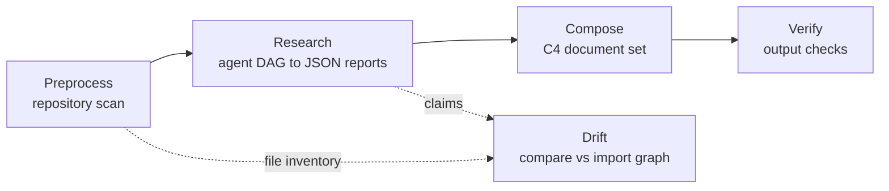
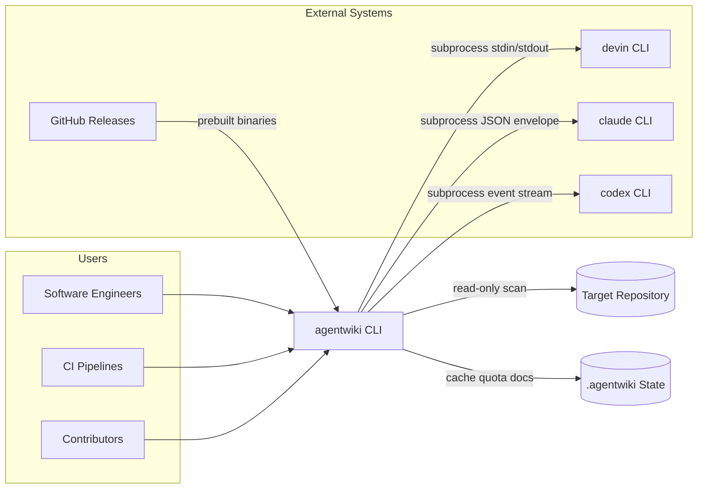
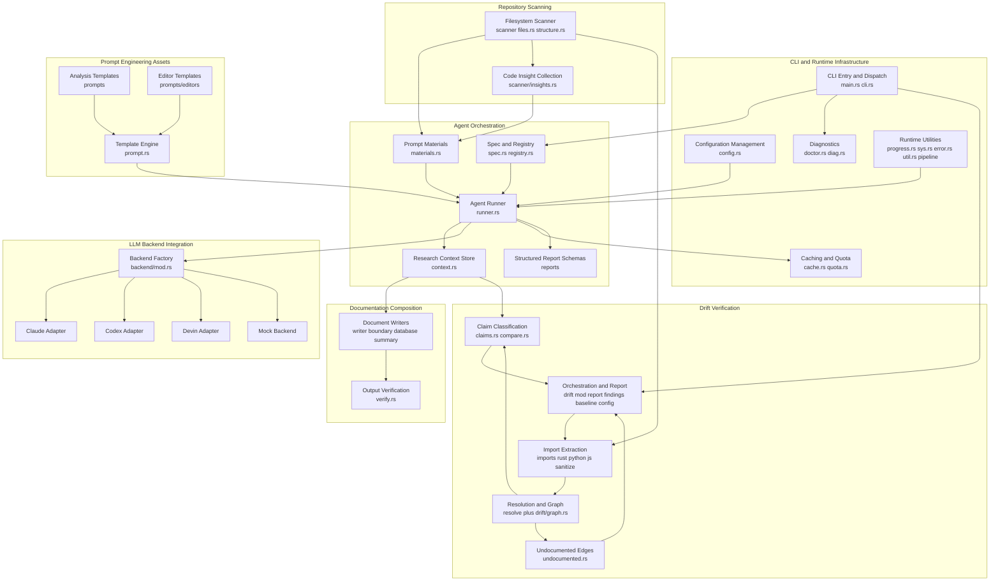
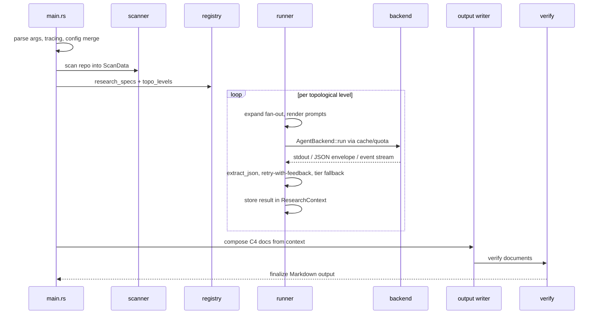
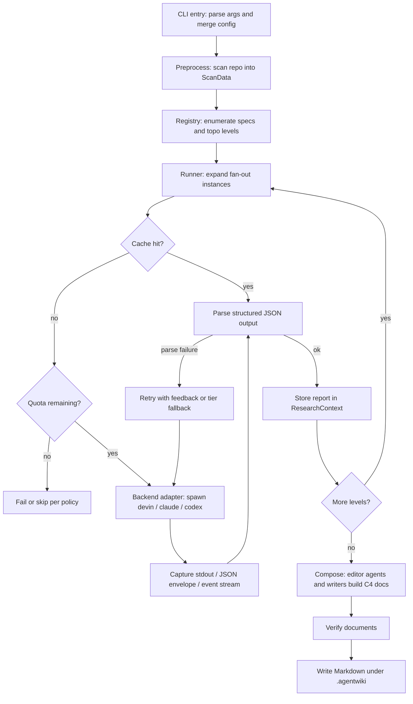
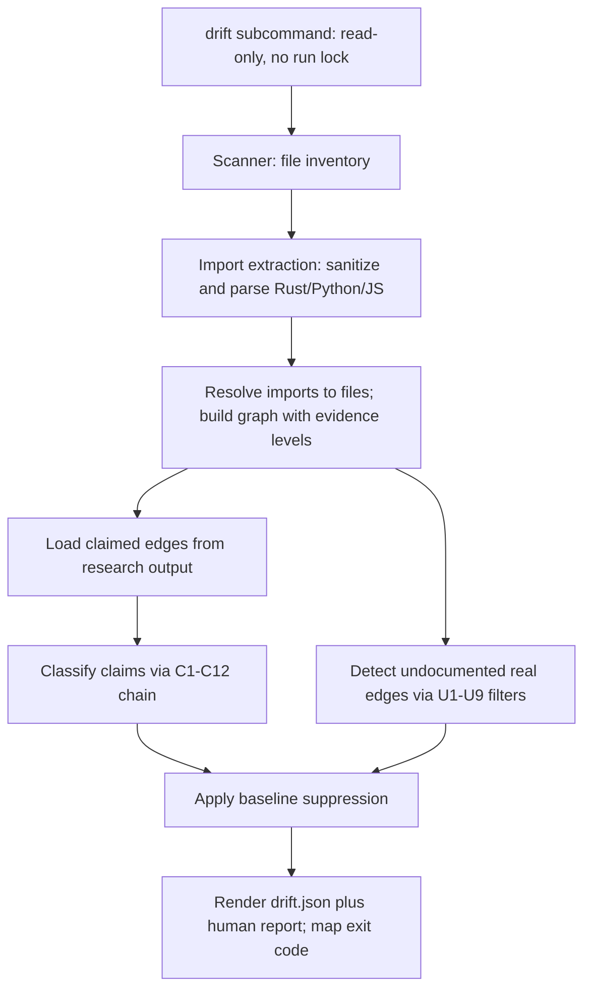
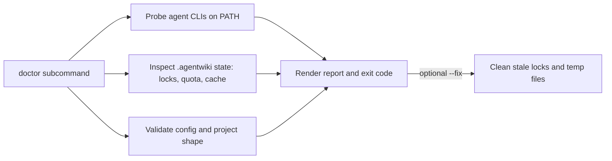
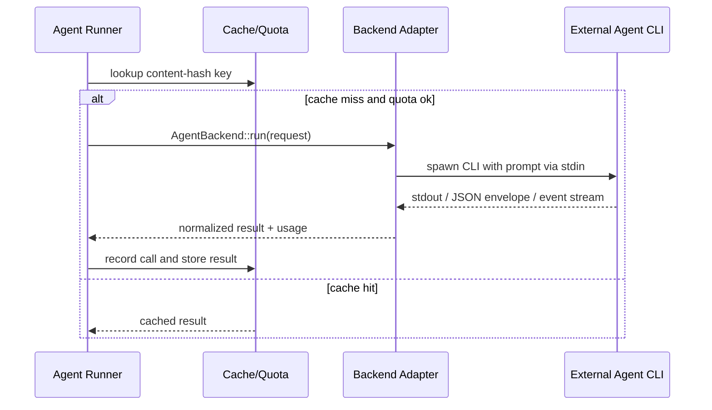

# Architecture Overview

**Project**: agentwiki — a single-binary Rust CLI (v0.5.0, edition 2024) that generates C4-style architecture documentation for arbitrary code repositories by orchestrating a declarative DAG of LLM analysis agents driven by locally installed, subscription-authenticated agent CLIs (`devin`, `claude`, `codex`). It is a rewrite/port of deepwiki-rs (Litho).

---

## 1. Architecture Overview

### 1.1 Design Philosophy

agentwiki's defining architectural decision is that **it owns no inference**. All LLM work is delegated to external agent CLIs spawned as subprocesses; agentwiki itself only orchestrates, validates, caches, and renders. This eliminates API-key management (subscription auth lives inside the CLIs), avoids embedding an HTTP LLM client (there is deliberately no HTTP client dependency in `Cargo.toml`), and makes the entire pipeline offline-testable through an in-process `MockBackend`.

The pipeline follows a four-stage ETL shape:

**Preprocess → Research → Compose → Verify**

Two additional commands sit alongside it: a read-only **drift** checker (`agentwiki drift`) that cross-checks generated dependency claims against a statically extracted import graph, and a **doctor** diagnostics command (`agentwiki doctor`).

### 1.2 High-Level Pipeline



### 1.3 Key Architectural Patterns

| Pattern | Location | Notes |
|---|---|---|
| Declarative DAG orchestration | `src/agent/spec.rs`, `registry.rs` | Each agent is an `AgentSpec` (deps, fan-out axis, materials, model tier, output schema); `topo_levels` schedules parallel execution per level. |
| Adapter / Strategy | `src/backend/*` | `AgentBackend` trait hides per-CLI invocation, envelope parsing, and schema normalization; `for_kind` factory plus `BackendKind::detect` for PATH auto-detection. |
| Shared-context mediator | `src/agent/context.rs` | RwLock-guarded typed key-value store; agents communicate only through declared dependencies — no direct agent-to-agent calls. |
| Defense-in-depth output validation | `runner.rs` + `reports/lenient.rs` | Multi-strategy JSON extraction, lenient deserializers, retry-with-feedback, cross-tier model fallback. |
| Read-only verification | `src/drift/*` | Ordered filter chains (C1–C12 claim classification, U1–U9 undocumented-edge suppression), baseline file, CI exit codes. |
| Cost controls | `cache.rs`, `quota.rs` | Content-hash keyed cache, daily call cap, `calls.jsonl` audit log under `.agentwiki/`. |

---

## 2. System Context



### 2.1 External Systems

| System | Interaction |
|---|---|
| `devin` CLI | Subprocess spawn (`devin -p`), prompt via stdin, plain stdout/stderr capture. |
| `claude` CLI | Subprocess spawn (`claude -p`), prompt via stdin, JSON envelope parsed for text, structured output, and token usage. |
| `codex` CLI | Subprocess spawn (`codex exec`), prompt via stdin, line-based event stream parsed; JSON schema passed via `--output-schema`. |
| GitHub Releases | HTTP download of prebuilt binaries via `install.sh` (platform mapped to Rust target triples). |
| Analyzed repositories | Read-only filesystem scanning and regex-based static import extraction (Rust, Python, JS/TS). |

### 2.2 System Boundary

**Included:** CLI/config merge (clap args, `agentwiki.toml`, profiles, model tiers), repository scanner, agent DAG orchestration, backend adapters, structured-output parsing with retry/fallback, prompt template engine, cache/quota/audit log, document composition, the drift checker, diagnostics, installer and crates.io packaging.

**Explicitly excluded (non-goals):** LLM inference itself, provider authentication, OpenAI-compatible HTTP APIs, editing the analyzed repository (agents run read-only), any hosted service/UI/daemon, and full AST analysis beyond bounded-scope regex import extraction.

### 2.3 Target Users

- **Software engineers / architects** — generate C4 docs (context, container, component, workflow, data) with per-project backend and model-tier control, caching, and cost caps.
- **CI/CD pipelines and maintainers** — run `agentwiki drift` for machine-readable findings (`drift.json`), strict-mode exit codes, baseline suppression, and low false-positive filter chains.
- **Contributors** — offline tests via `MockBackend`, `agentwiki doctor` health checks, and prompt template overrides without recompiling.

---

## 3. Container View

The system ships as a single binary; the "containers" are its internal modules plus the external CLIs it drives.



### 3.1 Domain Modules

| Domain | Type | Paths | Responsibility |
|---|---|---|---|
| Agent Orchestration | Core | `src/agent` | Declarative DAG of analysis agents: specs, topo scheduling, prompt assembly, backend invocation with retry/fallback, structured parsing, shared context. |
| LLM Backend Integration | Core | `src/backend` | `AgentBackend` trait and adapters for devin/claude/codex/mock; model-string parsing, command construction, envelope/event-stream parsing, env sanitization. |
| Documentation Composition & Output | Core | `src/output`, `prompts/editors` | Turns research reports into the C4 document set (overview, architecture, workflow, boundary, deep-dive, database); verifies and writes Markdown. |
| Drift Verification | Supporting | `src/drift` | Read-only `agentwiki drift`: compares claimed edges to the real import graph; phantom/reversed/undocumented detection, baseline gating, CI exit codes. |
| Repository Scanning & Preprocessing | Supporting | `src/scanner` | Preprocess stage producing immutable `ScanData` (structure, file inventory, README, insights). |
| Prompt Engineering Assets | Supporting | `prompts/`, `src/prompt.rs` | Markdown templates for analyst personas and output contracts; `{{key}}` rendering with disk overrides over embedded defaults. |
| CLI & Runtime Infrastructure | Infrastructure | `main.rs`, `cli.rs`, `config.rs`, `cache.rs`, `quota.rs`, `doctor.rs`, `diag.rs`, `progress.rs`, `sys.rs`, `error.rs`, `util.rs`, `src/pipeline` | Cross-cutting: argument parsing/dispatch, layered config, cache/quota/audit, diagnostics, progress, process introspection, atomic writes. |

### 3.2 Strongest Couplings (strength >= 8)

- CLI Infra → Agent Orchestration (dispatch, config, cache, quota)
- Agent Orchestration → LLM Backend Integration (`AgentBackend::run` per instance)
- Agent Orchestration → Prompt Assets (template rendering + material injection)
- Agent Orchestration → Repository Scanning (ScanData → materials)
- Documentation Composition → Agent Orchestration (ResearchContext reports)

---

## 4. Component View

### 4.1 Agent Orchestration (`src/agent`) — the core domain

| Sub-module | Files | Responsibility |
|---|---|---|
| Agent Specification & Registry | `spec.rs`, `registry.rs`, `mod.rs` | Declares every research/compose DAG node (deps, fan-out axis, materials, model tier, output schema); `topo_levels` computes parallel scheduling levels. Key fns: `all_specs`, `research_specs`, `compose_specs`, `topo_levels`, `expand`, `schema_spec`. |
| Agent Runner | `runner.rs` | The agentic-loop engine: expands fan-out instances, renders prompts, calls backends through cache/quota, multi-strategy JSON extraction, retry-with-feedback, model-tier fallback. Key fns: `run_spec`, `run_instance`, `build_prompt`, `parse_output`, `extract_json`, `aggregate`. |
| Research Context Store | `context.rs` | Typed RwLock-guarded key-value store; agents publish/consume via declared deps; disk snapshot/save/load for replayability. |
| Prompt Materials Assembly | `materials.rs` | Renders ScanData and upstream results into material blocks (project structure, README excerpts, code insights, dossiers) with caps and importance sorting. |
| Structured Report Schemas | `reports/{code,relationship,research,lenient}.rs` | Serde/schemars output contracts (directory dossiers, relationships, system context, domain modules, boundaries, database overview) plus lenient deserializers (`de_string`, `de_vec_obj`, `str_list`) tolerating malformed LLM JSON. |

### 4.2 LLM Backend Integration (`src/backend`)

| Sub-module | Responsibility |
|---|---|
| Backend Abstraction & Factory (`mod.rs`) | `AgentBackend` trait, request/result/usage types, `BackendKind::{parse,detect}`, `for_kind` factory, `sanitized_env` for spawned CLIs. |
| Claude Adapter (`claude.rs`) | `claude -p` invocation, stdin prompt, JSON envelope parsing (text, structured output, usage, errors), schema sanitization. |
| Codex Adapter (`codex.rs`) | `codex exec` with reasoning-effort and `--output-schema` flags, normalization of arbitrary JSON schemas to codex-compatible forms, line-based event stream parsing. |
| Devin Adapter (`devin.rs`) | Reference adapter: `devin -p`, stdin prompt, plain stdout capture; minimal parsing surface. |
| Mock Backend (`mock.rs`) | In-process scripted backend for fully offline tests: canned replies, custom handlers, simulated latency/errors. |

### 4.3 Drift Verification (`src/drift`)

| Sub-module | Responsibility |
|---|---|
| Orchestration & Reporting (`mod.rs`, `report.rs`, `findings.rs`, `config.rs`, `baseline.rs`) | Wires scan → claims → compare → undocumented → report; applies baselines, computes strict-mode outcome, maps to exit codes, renders `drift.json` plus human output. |
| Claim Normalization & Classification (`claims.rs`, `compare.rs`) | Loads `core_dependencies` claims, normalizes endpoints, classifies through the ordered **C1–C12** chain (endpoint sanity → checkability guards → positive evidence → negatives). |
| Import Extraction (`imports/{mod,rust,python,js,sanitize}.rs`) | Language detection, offset-preserving comment/string blanking, per-language raw-import extraction. |
| Import Resolution & Graph (`resolve/*`, `graph.rs`) | Resolves imports to internal/external/unresolved via per-language resolvers and `RepoIndex`; lifts file edges into node graphs with strong vs. wide evidence, reachability, hub detection, facade re-export closure. `graph.rs` sits at `src/drift/graph.rs`, shared by compare and undocumented paths. |
| Undocumented Edge Detection (`undocumented.rs`) | Mirror-image check: real strong-evidence dependencies never claimed, filtered by the **U1–U9** noise-suppression chain with per-filter suppression counts. |

### 4.4 Remaining Components

- **Repository Scanning** (`src/scanner`): `scan` builds `ScanData`; `insights.rs` collects per-file/per-directory inputs for the `dir_summary` fan-out.
- **Documentation Composition** (`src/output`): per-document writers (`boundary.rs`, `database.rs`, `summary.rs`, `writer.rs`) and `verify.rs` post-generation checks (e.g., Mermaid validity). Editor prompts live in `prompts/editors/`.
- **Prompt Engine** (`src/prompt.rs`): `render` substitutes `{{key}}` placeholders; `PromptLoader::load` prefers disk overrides over `include_str!` embedded defaults, preserving unknown placeholders.
- **Runtime Infrastructure**: `cli.rs` clap surface (`run`, `drift`, `doctor`), `config.rs` layered merge (defaults → global → project TOML → CLI) with profiles/model tiers, `cache.rs` content-hash cache, `quota.rs` daily cap + `calls.jsonl`, `doctor.rs`/`diag.rs` health probes, `progress.rs` indicatif spinner, `sys.rs` dependency-free process/PATH introspection, `util.rs` atomic writes, `src/pipeline/mod.rs` stage wiring.

---

## 5. Key Processes

### 5.1 Documentation Generation Pipeline (default run)



Flow detail:



### 5.2 Documentation Drift Check (`agentwiki drift`)



### 5.3 Environment Health Check (`agentwiki doctor`)



### 5.4 Backend Adapter Invocation (cross-cutting)



---

## 6. Technical Implementation

### 6.1 Technology Stack

| Concern | Choice | Rationale |
|---|---|---|
| Language | Rust 2024 edition, single binary | Static distribution via GitHub Releases; strong typing for report schemas. |
| Async runtime | tokio (`rt-multi-thread`, `process`, `signal`) | Parallel DAG levels + subprocess spawning; no HTTP client crate by design. |
| CLI | clap 4 (derive) | `Command` enum routes `run`/`drift`/`doctor`. |
| Schemas | serde + serde_json + schemars | Output contracts double as `--output-schema` inputs for codex. |
| Error handling | thiserror + anyhow | Unified `Error` enum at boundaries, ergonomic propagation internally. |
| Progress | indicatif | Spinner for long-running agent calls. |
| Prompts | `include_str!` embedded + disk overrides | Templates editable without recompiling; unknown placeholders preserved. |
| Static analysis | regex-based import extraction (Rust/Python/JS) | Deliberately bounded scope; offsets preserved via comment/string blanking. |

### 6.2 Resilience Design

LLM CLIs produce malformed structured output regularly, so the pipeline layers defenses:

1. **Lenient deserializers** (`reports/lenient.rs`): `de_string`, `de_vec_obj`, `str_list` coerce loose JSON into strict types.
2. **Multi-strategy JSON extraction** (`runner.rs::extract_json`): finds JSON in mixed prose output.
3. **Retry-with-feedback**: parse failures are fed back to the agent for a corrected attempt.
4. **Model-tier fallback**: failures cascade across configured model tiers (efficient → powerful).

### 6.3 Cost Governance

Every backend call passes through the content-hash keyed cache (`cache.rs`) and the daily quota (`quota.rs`) with a `calls.jsonl` audit log under `.agentwiki/`. This is the guardrail against **fan-out cost amplification**: DAG parallelism × per-directory fan-out × retry × tier fallback can multiply agent calls, so cache and quota defaults matter operationally.

### 6.4 Extensibility

- **New backend**: implement `AgentBackend` + add a `BackendKind` variant; factory and PATH detection pick it up.
- **New agent**: add an `AgentSpec` (deps, fan-out, materials, tier, schema); `topo_levels` schedules it automatically.
- **New document type**: add an editor template under `prompts/editors/` and a compose spec.
- **New drift language**: add an extractor under `drift/imports/` and a resolver under `drift/resolve/`; the C1–C12/U1–U9 chains are language-agnostic.
- **Prompt customization**: drop template overrides on disk — no recompile needed.

### 6.5 Known Limitations / Risks

- **Subprocess fragility**: adapters parse CLI-specific output formats (claude JSON envelope, codex event stream). Upstream output-format drift is the main external stability risk; lenient parsing mitigates but does not eliminate it.
- **Regex-based import extraction** caps drift precision — dynamic imports, macro-generated code, and conditional imports surface as unresolved/unverifiable rather than confirmed.
- **`runner.rs` complexity concentration**: fan-out, rendering, caching, quota, parsing, retry, and fallback converge in one file — the natural first candidate for future decomposition.

### 6.6 Security Posture

- No credentials handled: LLM auth lives in the external CLIs' subscription sessions; `sanitized_env` strips inherited env before spawning.
- Read-only target access: agents never write to the analyzed repo; all state lives under `.agentwiki/`; `drift` and `doctor` run without a run lock.
- Atomic writes (`util.rs::write_atomic`) prevent torn output files.

---

## 7. Deployment Architecture

### 7.1 Distribution & Runtime

- **Artifact**: single statically-linked Rust binary published via GitHub Releases and crates.io; `install.sh` maps platforms to Rust target triples and downloads via curl.
- **Runtime model**: short-lived CLI process, not a daemon. Only the `run` command is mutating (takes a run lock); `drift` and `doctor` are read-only.
- **State layout** (under the target repo's `.agentwiki/`): content-hash cache, daily quota counters, `calls.jsonl` audit log, research context snapshots, run locks, generated Markdown docs, `drift.json`, baseline file.
- **Dependencies at runtime**: one or more agent CLIs on `PATH` (`devin`, `claude`, `codex`), detected via `BackendKind::detect` and probed by `doctor`.

### 7.2 Configuration Layers

Merged in order: built-in defaults → global config → project `agentwiki.toml` → CLI overrides. Named profiles and model tiers let each project pin backend and cost/quality tradeoffs without code changes; per-call timeouts bound subprocess hangs.

### 7.3 Operational Guidance

- **Pre-flight**: run `agentwiki doctor` before long runs; `--fix` clears stale locks/temp files.
- **CI gating**: `agentwiki drift --strict` returns a nonzero exit code on unclassified/phantom findings; commit a baseline file to suppress known findings.
- **Cost control**: tune quota defaults and prefer the efficient model tier for fan-out agents; reruns are cheap because the content-hash cache short-circuits unchanged calls.
- **Development**: the `MockBackend` (`canned`, `with_delay`, custom handlers) enables a fully offline test suite; real-CLI e2e tests are opt-in. Design history lives in `docs/`, `DRIFT_CHECK_PLAN.md`, `DRIFT_NEXT_STEPS.md`, and `IMPLEMENTATION_PLAN.md`.

---

## 8. Project Structure

```text
agentwiki/
  Cargo.toml            # single binary, no HTTP client deps
  install.sh            # GitHub Releases installer
  agentwiki.toml        # project config
  prompts/              # analysis templates (dir_summary, system_context, architecture,
                        #   workflow, boundary, database, domain_modules, key_module, relationships)
    editors/            # C4 doc generation templates (overview, architecture_doc,
                        #   workflow_doc, deep_dive)
  src/
    main.rs  cli.rs     # entry, clap dispatch (run / drift / doctor)
    config.rs           # layered config, profiles, model tiers
    cache.rs  quota.rs  # content-hash cache, daily cap, calls.jsonl
    doctor.rs diag.rs   # health probes and report primitives
    progress.rs sys.rs error.rs util.rs prompt.rs lib.rs
    pipeline/           # stage wiring (context plumbing)
    scanner/            # ScanData: structure, files, insights
    agent/              # spec, registry, runner, context, materials, reports/
    backend/            # AgentBackend trait + devin/claude/codex/mock adapters
    output/             # writers (writer, boundary, database, summary), verify
    drift/              # mod/report/findings/config/baseline, claims, compare,
                        #   undocumented, graph, imports/, resolve/
  tests/  examples/  docs/
```

The documentation faithfully mirrors the implementation: every module and prompt template listed above exists at the stated path with the stated responsibility; noted gaps are minor (e.g., `src/agent/reports.rs` module root alongside `reports/`, and the `pipeline/` wiring module deserves first-class mention rather than being folded into runtime utilities).