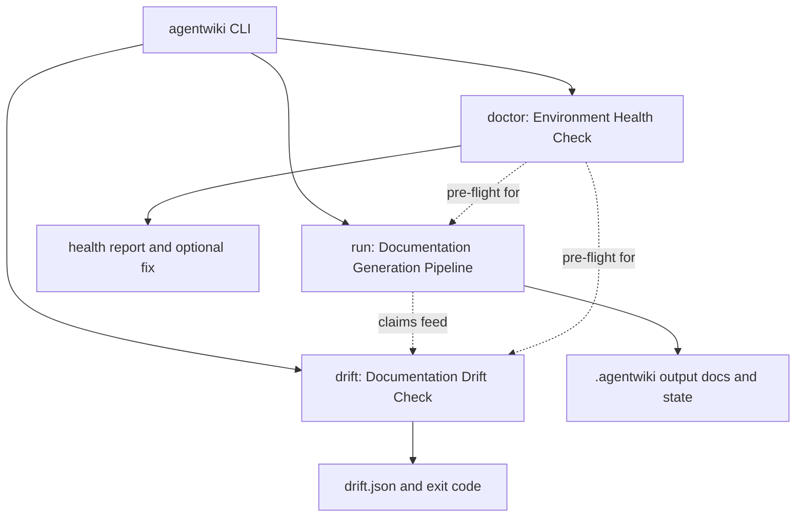
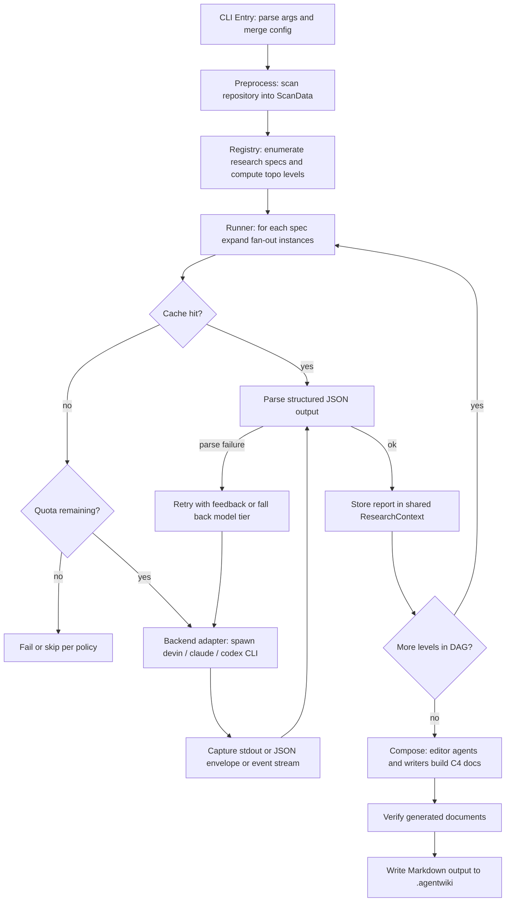
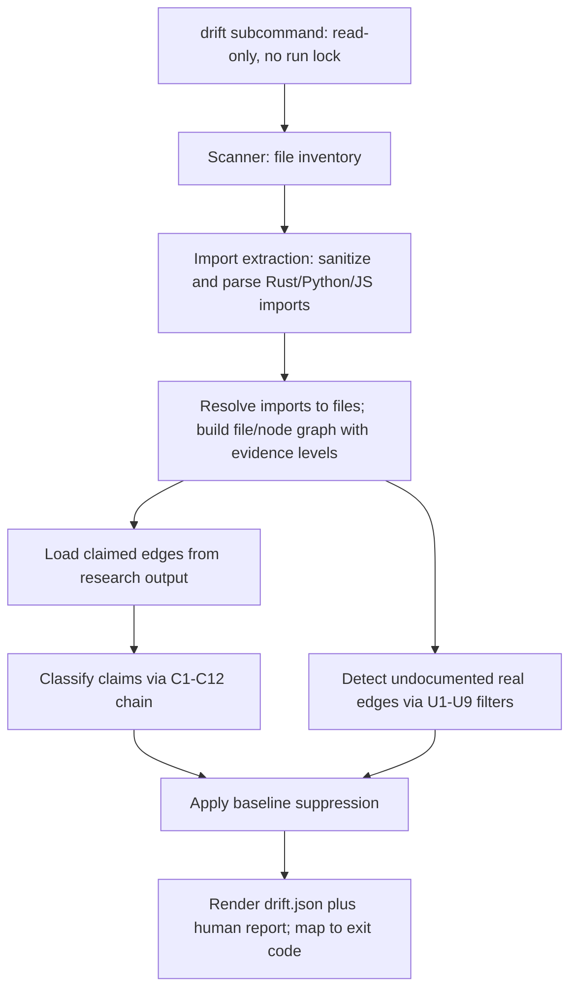
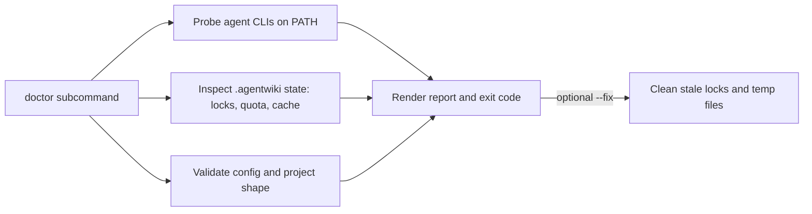
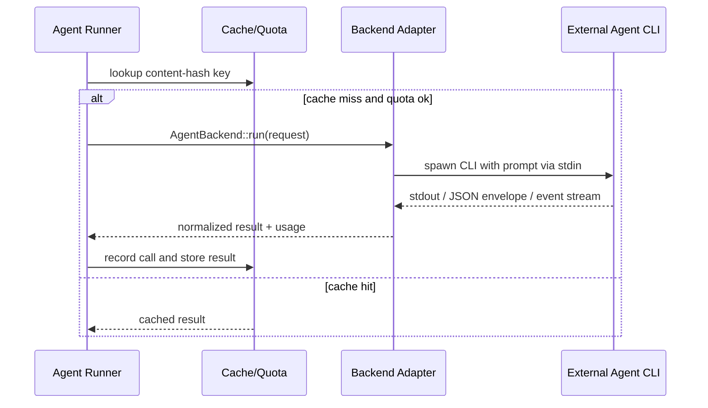

# Core Workflows

## 1. Workflow Overview

agentwiki is a single-binary Rust CLI that generates C4-style architecture documentation for an arbitrary repository. Its defining characteristic is that it **owns no LLM inference**: all model work is delegated to locally installed, subscription-authenticated agent CLIs (`devin`, `claude`, `codex`) behind a trait-based backend layer. agentwiki orchestrates, validates, caches, and renders.

The system exposes three top-level workflows, dispatched from `src/main.rs` via the clap surface in `src/cli.rs`:

| Workflow | Command | Mutating? | Purpose |
|---|---|---|---|
| Documentation Generation Pipeline | `agentwiki` (default) | Yes (writes `.agentwiki/`) | Scan → Research DAG → Compose → Verify → Markdown docs |
| Documentation Drift Check | `agentwiki drift` | No (read-only, no run lock) | Compare claimed dependency edges against the real static import graph; CI-gating exit code |
| Environment Health Check | `agentwiki doctor` | No (optional `--fix` mutates) | Probe CLIs, `.agentwiki/` state, config; pre-flight for the other two |

Cross-cutting across all three is the **Backend Adapter Invocation** sub-flow: every agent call is normalized through `AgentBackend::run`, wrapped by the content-hash cache and the daily quota (`calls.jsonl` audit log).

## 2. Main Workflows

### 2.1 Documentation Generation Pipeline

The default run is a four-stage pipeline: **Preprocess → Research → Compose → Verify**.

**Stage details:**

1. **CLI entry & dispatch** — `src/main.rs::main` parses arguments (`src/cli.rs`), initializes tracing, and invokes `config::load`, which merges defaults → global config → project `agentwiki.toml` → CLI overrides. Named profiles and model tiers (`config::model_for`, `call_timeout`) are resolved here. Mutating runs take a run lock; `drift` and `doctor` do not.
2. **Preprocess** — `src/scanner/` walks the target repository respecting ignore rules, producing `ScanData`: directory structure, file inventory, README excerpts, and per-file/per-directory code insights (`scanner/insights.rs`). This is the *only* filesystem pass both the pipeline and drift share as their data foundation.
3. **DAG scheduling** — `src/agent/registry.rs` enumerates `research_specs` / `compose_specs` from `all_specs` and computes `topo_levels`: agents whose declared dependencies are satisfied at the same level run in parallel. Each `AgentSpec` (`src/agent/spec.rs`) declares deps, a fan-out axis (per directory, per domain), required materials, model tier, and output schema.
4. **Agent execution** — `src/agent/runner.rs::run_spec` expands fan-out instances, renders prompts (`build_prompt` → `PromptLoader` + `materials.rs` blocks), and invokes the backend **through** the cache (`Cache::get/put`) and quota (`Quota::consume/record`) layers. `parse_output`/`extract_json` apply multi-strategy JSON extraction with lenient deserializers (`reports/lenient.rs`); failures trigger retry-with-feedback, then model-tier fallback.
5. **Backend dispatch** — `backend::for_kind` returns the adapter for the configured `BackendKind` (or `BackendKind::detect` auto-detection on PATH). Adapters spawn `devin -p`, `claude -p`, or `codex exec`, pipe the prompt via stdin, and normalize each CLI's output format into a common result + usage type.
6. **Context publication** — successful reports are `insert`ed into `ResearchContext` (`src/agent/context.rs`), an `RwLock`-guarded typed key-value store that downstream agents read via `get_typed`. Snapshots can be persisted to disk (`save`/`load`).
7. **Compose** — editor agents (driven by `prompts/editors/*.md`: overview, architecture_doc, workflow_doc, deep_dive) plus deterministic writers (`output/boundary.rs`, `database.rs`, `summary.rs`) turn the structured research reports into the C4 document set.
8. **Verify & write** — `src/output/verify.rs` performs post-generation checks (e.g., Mermaid validity, completeness); `writer.rs` emits final Markdown via `util::write_atomic`.

### 2.2 Documentation Drift Check (`agentwiki drift`)

A read-only verification pass that closes the loop between generated docs and ground truth. Input contract: `relationships.core_dependencies` claims produced by the research pipeline.

**Key steps:**

- **Import extraction** (`drift/imports/`): `Lang::from_extension` detects language; `sanitize` performs offset-preserving blanking of comments/strings; per-language extractors (`rust.rs` with `expand_use_tree`, `python.rs`, `js.rs`) emit raw imports. This is bounded-scope regex-based analysis — deliberately not full AST.
- **Resolution & graph construction** (`drift/resolve/`, `graph.rs`): `RepoIndex::build` indexes repo files; per-language resolvers classify imports as internal/external/unresolved; `build_file_graph` produces file edges; `lift` raises them to node graphs annotated with strong vs. wide evidence, plus reachability, hub detection, and facade re-export closure.
- **Claim classification** (`drift/claims.rs`, `compare.rs`): `load_claims`/`normalize_claims` map claim endpoints to paths; `classify_claim` runs each edge through the ordered **C1–C12** chain (endpoint sanity → checkability guards → positive evidence → negatives), yielding confirmed / unverifiable / reversed / phantom.
- **Undocumented edges** (`drift/undocumented.rs::find`): mirror-image check for real strong-evidence edges never claimed, filtered by the **U1–U9** suppression chain with per-filter suppression counts.
- **Reporting** (`drift/mod.rs::run`, `report.rs`, `baseline.rs`, `findings.rs`): baseline file suppresses already-known findings (matched by `finding_id`); `strict_failures` computes strict-mode outcome; renders `drift.json` + human report; exit code allows CI gating.

### 2.3 Environment Health Check (`agentwiki doctor`)

`src/doctor.rs::run` executes a probe battery — `probe_version` on each agent CLI, `sys::list_processes`/`find_on_path` for availability, `quota_state` for cap status, config validation, project-shape checks — rendered via shared `diag` `Status`/`Report` primitives. Nonzero exit on failures makes it a composable pre-flight gate.

### 2.4 Backend Adapter Invocation (cross-cutting sequence)

Adapter differences: **Claude** (`claude -p`) returns a JSON envelope carrying text, structured output, usage, and errors (`parse_envelope`, `sanitize_schema`). **Codex** (`codex exec`) emits a line-based event stream and takes `--output-schema`; `normalize_schema` rewrites arbitrary JSON schemas into codex-compatible form. **Devin** (`devin -p`) is the minimal reference adapter — plain stdout capture. **Mock** provides scripted replies, custom handlers, and simulated latency/errors for fully offline tests. `sanitized_env` strips interfering environment variables from spawned CLIs.

## 3. Flow Coordination and Control

- **DAG scheduling with a shared blackboard.** Research agents never call each other directly. `AgentSpec` dependencies drive `topo_levels`, so all specs at a level execute in parallel; data exchange happens exclusively through `ResearchContext` (RwLock-guarded, typed, disk-snapshotable). This makes the data flow explicit and the parallelism safe.
- **Fan-out expansion.** Specs declare a fan-out axis; `registry::expand` materializes one instance per directory or domain, and `runner::aggregate` folds instance results back into a single report before publication.
- **Prompt assembly pipeline.** `PromptLoader::load` resolves templates disk-override-first, then embedded `include_str!` defaults; `render` substitutes `{{key}}` placeholders (preserving unknowns); `materials.rs` fills material slots (`project_structure`, `code_insights_block`, `dossier_from`) with caps and importance sorting — so prompt content is bounded even on huge repos.
- **Layered config authority.** defaults → global → `agentwiki.toml` → CLI flags → named profiles; model tier resolution is centralized in `config::model_for` so fallback decisions in the runner reference the same tier ordering.
- **Cost governance on the call path.** Cache key = content hash of the request; quota is a daily cap with `calls.jsonl` audit logging under `.agentwiki/`. Both sit *between* runner and backend, so every adapter benefits uniformly.
- **Inter-workflow dependencies.** Drift consumes artifacts of the generation pipeline (`core_dependencies`) and reuses `ScanData`; doctor is independent but validates the prerequisites of both. Only the pipeline mutates project state — enforced via the run lock that read-only commands skip.

## 4. Exception Handling and Recovery

**LLM output resilience (defense in depth):**

1. Lenient deserializers (`reports/lenient.rs`: `de_string`, `de_vec_obj`, `str_list`) tolerate type drift in LLM JSON.
2. `extract_json` tries multiple extraction strategies (fenced blocks, brace-matching, whole-body) against messy CLI output.
3. On parse failure, `run_instance` retries **with feedback** — the parse error is injected into the next prompt so the agent self-corrects.
4. If the model tier keeps failing, the runner falls back across tiers (efficient → powerful or per profile ordering).

**CLI-level failures:** adapters capture stderr/nonzero exits into typed `Error` variants (`src/error.rs`); cancellation handling in `main` lets interrupted mutating runs exit cleanly. `sanitized_env` prevents user env vars from contaminating spawned CLI behavior.

**Quota exhaustion:** `Quota::consume` denies the call before spawn; the runner fails or skips per policy — spend is hard-capped, never best-effort.

**Drift-specific fault tolerance:** unresolved/external imports are first-class outcomes (not errors); C1–C12 ordering guarantees endpoint sanity checks run before evidence checks so malformed claims classify as unverifiable rather than phantom; the baseline suppresses known findings so CI signal stays actionable.

**Doctor as recovery entry point:** `--fix` removes stale locks and temp files — the standard recovery path after a killed run.

## 5. Key Process Implementation

| Process | Entry point | Mechanism |
|---|---|---|
| Dispatch | `src/main.rs::main` | clap `Command` routing; run lock for mutating commands only |
| Scan | `src/scanner/mod.rs::scan` | Ignore-aware walk → `ScanData` |
| Schedule | `src/agent/registry.rs::topo_levels` | Topological levels over declared deps → per-level parallelism |
| Execute | `src/agent/runner.rs::run_spec` / `run_instance` | expand → build_prompt → cache/quota → backend → parse → publish |
| Backend | `src/backend/mod.rs::for_kind` | `AgentBackend` trait; per-CLI `build_cmd`/`run` + output parsers |
| Compose | `src/output/writer.rs` + `prompts/editors/` | Editor agents + deterministic writers → C4 doc set |
| Verify | `src/output/verify.rs` | Mermaid validity / completeness checks pre-finalize |
| Drift | `src/drift/mod.rs::run` | scan → extract → resolve → classify → undocumented → baseline → report/exit code |
| Doctor | `src/doctor.rs::run` | probe battery → `diag::Report` → exit code → optional `--fix` |

**Practical guidance:**

- Run `agentwiki doctor` before a generation run on a fresh checkout — it catches missing CLIs, bad config, and stale state cheaply.
- Reruns are cheap by design: content-hash cache hits skip both quota consumption and CLI spawn. To force regeneration, clear the relevant cache entries under `.agentwiki/`.
- In CI, `agentwiki drift` + `--strict` gates on new findings only if a baseline file is committed; without it, strict mode treats all findings as failures.
- Override any prompt by placing a same-named file on disk — no recompile needed (useful when tuning output contracts for a new backend).
- For contributors: `MockBackend::canned`/`with_delay` exercises the full DAG offline; real-CLI e2e tests are opt-in.

**Known limits and optimization levers:** drift's static analysis is regex-bounded — unresolved facades and dynamic imports reduce precision; deeper AST analysis would raise it. Conversely, sharing one `ScanData` between pipeline and drift scans would avoid double-walking large repos. Parallelism is already maximized at the DAG level; the remaining bottleneck is per-instance CLI latency, which the cache and quota layers exist to amortize.