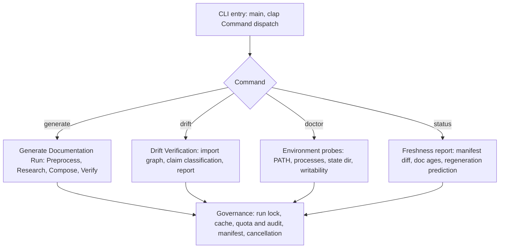
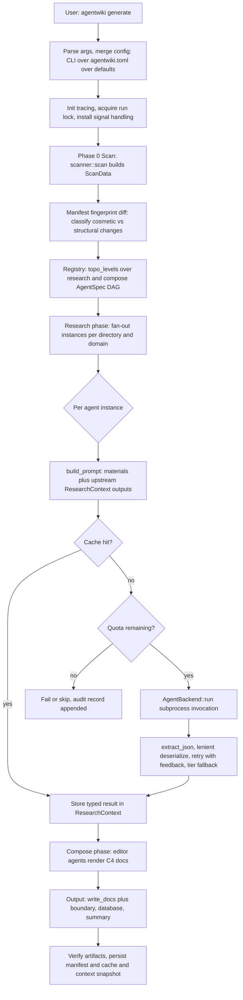
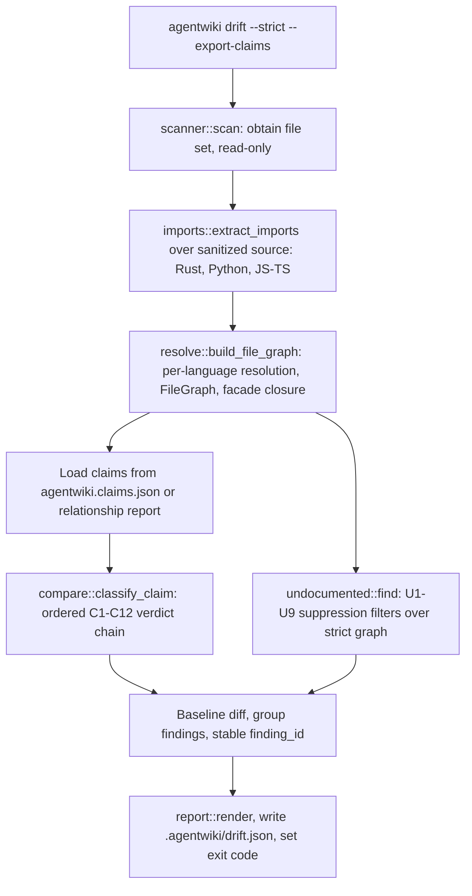
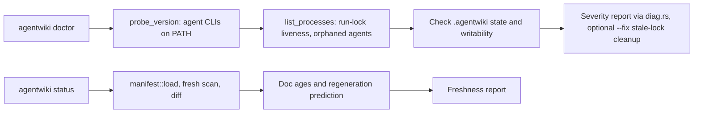
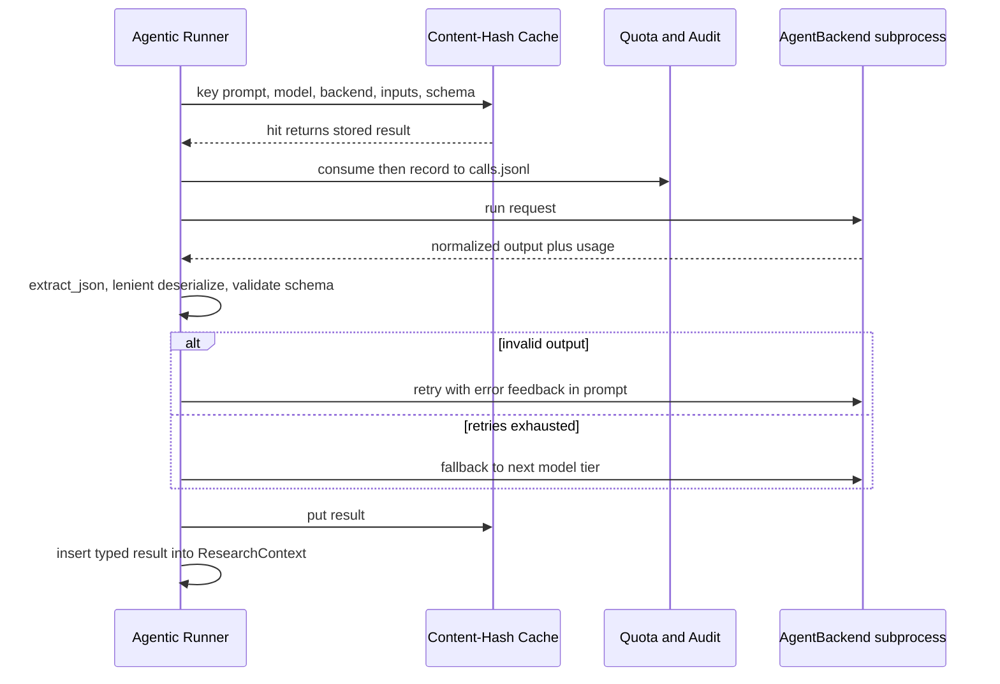

# Core Workflows

## 1. Workflow Overview

agentwiki executes a small set of well-bounded workflows, all reachable from a single CLI surface (`src/main.rs`, `src/cli.rs`). The central workflow is the **Generate Documentation Run** — a four-stage pipeline (Preprocess → Research → Compose → Verify) that turns a target repository into C4-style Markdown documentation by orchestrating already-authenticated agent CLIs (devin, claude, codex) as LLM backends. Around it sit three supporting workflows: **Drift Verification** (read-only validation of generated dependency claims against a statically derived import graph), **Operational Health & Freshness** (`doctor` / `status` probes), and the **Agentic Runner Governance Loop**, a cross-cutting control pattern applied to every paid CLI call.

The defining architectural invariant is a hard cost boundary: scanning, manifest diffing, import extraction, drift classification, and output rendering are all deterministic and free; only the agentic runner crosses into paid territory. The cache → quota → backend → validate → retry/fallback sequence sits exactly at that boundary.

## 2. Main Workflows

### 2.1 Generate Documentation Run (`agentwiki generate`)

The end-to-end pipeline. Entry point: `src/main.rs::main → Command::Generate → src/pipeline/mod.rs::run`.

**Step details:**

1. **CLI entry & setup** — `main` parses the command, converts `CliOverrides`, and merges configuration with strict precedence (CLI > `agentwiki.toml` > global config > defaults) via `config::load` / `apply_toml`. A run lock is acquired (validated against the OS process table via `sys.rs`) and signal handling is installed for cooperative cancellation.
2. **Repository scan (Phase 0)** — `scanner::scan` deterministically walks the project honoring scan config and output-path exclusion, producing `ScanData`: file set, `DirectoryInfo` structure, README/doc extracts, and lazy `FileStatics` insights (`scanner/insights.rs`). No LLM calls occur here.
3. **Incremental gating** — `manifest::build` fingerprints scan inputs and environment per output directory; `manifest::diff` compares against the stored manifest, classifying changes as cosmetic vs structural so only stale subtrees regenerate.
4. **DAG scheduling** — `agent/registry.rs` declares `AgentSpec`s (phase, dependencies, fan-out axis, model tier, output schema); `topo_levels` computes executable levels. Research specs fan out per directory/domain (`expand`); compose specs consume their outputs.
5. **Agentic execution** — `runner::run_spec` executes each instance: `build_prompt` assembles materials (`materials.rs`) and dependency outputs from `ResearchContext`; the cache is consulted; quota is consumed and audited; the backend is invoked; output is extracted and validated; retries carry error feedback; model tiers provide fallback. See §2.4.
6. **Backend dispatch** — `backend::for_kind` resolves `BackendKind` from `<backend>:<model>` strings and returns an `AgentBackend` implementation: `devin -p` (pass-through), `claude -p` (JSON envelope, `model@effort` support), `codex exec` (JSONL event stream, normalized schemas), or `mock:*` for offline runs.
7. **Deterministic output & verification** — `output::write_docs` writes the doc tree; `boundary.rs`, `database.rs`, `summary.rs` render non-LLM documents; `verify.rs` checks generated artifacts; manifest, cache, and a `ResearchContext` snapshot are persisted under `.agentwiki/`.

### 2.2 Drift Verification (`agentwiki drift`)

A fully read-only, LLM-free bounded context that re-derives ground truth (the static import graph) and classifies each dependency claim emitted during generation. Exit codes 0/1/2 make `--strict` a CI gate.

**Stage details:**

- **Import extraction** (`drift/imports/`): per-language extractors run over comment/string-sanitized source with byte-exact offsets — Rust use-trees and `mod` resolution (`expand_use_tree`), Python relative/absolute imports, JS/TS ESM/CJS/dynamic forms.
- **Resolution & graph building** (`drift/resolve/`): raw imports resolve to repository files per language rules (Cargo crate layout, Python module suffix matching, JS extension/index probing); `RepoIndex::build` + facade re-export closure produce the `FileGraph`.
- **Claim classification** (`drift/compare.rs`): `normalize_claims` ingests `CoreDependency` claims; `classify_claim` applies the ordered C1–C12 verdict chain — guards before evidence — yielding confirmed / structural / unverifiable / reversed / phantom verdicts (`phantom_and_reversed`).
- **Undocumented edge detection** (`drift/undocumented.rs`): `find` runs the U1–U9 suppression filter chain over the strict strong-evidence graph (reachability, hubs, facade closure) to surface real edges missing from claims.
- **Reporting** (`drift/report.rs`, `baseline.rs`): versioned report schema, finding grouping, human-readable rendering; `Baseline::load/save` under `.agentwiki/` supports `--strict` diffing; `strict_failures` maps findings to exit codes.

### 2.3 Operational Health & Freshness (`agentwiki doctor`, `agentwiki status`)

- **`doctor`**: probes backend CLI versions, parses the process table for lock-liveness and orphaned agent processes (`sys.rs::pid_alive`, `find_on_path`), inspects `.agentwiki/` state including drift reports, and checks writability. `--fix` removes stale locks.
- **`status`**: diffs the stored manifest against a fresh scan, reports document ages, and predicts which documents the next run would regenerate — a dry-run signal before spending paid calls.

### 2.4 Agentic Runner Governance Loop

The cross-cutting control pattern applied to every real CLI call; it defines the tool's cost and reliability behavior.

## 3. Flow Coordination and Control

- **Task DAG scheduling**: `registry::topo_levels` partitions research and compose specs into dependency levels; the pipeline executes levels sequentially and instances within a level concurrently, bounded by a semaphore in `PipelineCtx`. Fan-out axes (per-directory, per-domain) expand one spec into N instances sharing the same schema and materials contract.
- **Shared state**: `ResearchContext` (`agent/context.rs`) is an async typed key-value store through which upstream research results flow to downstream compose agents; it supports `snapshot`/`save`/`load` for resumability. `PipelineCtx` carries config, `ScanData`, cache, quota, and backend handles for the whole run.
- **Data flow**: `ScanData` → prompt materials (`materials.rs`, size-capped markdown blocks) → agent JSON outputs (leniently deserialized into typed reports in `agent/reports/`) → `ResearchContext` → editor prompts → rendered docs → `output/verify.rs`.
- **Cost governance**: the content-hash cache (`cache.rs`, keyed by prompt/model/backend/inputs/schema) precedes the quota check, so cache hits never consume quota. Every real call appends an RFC3339-stamped record to `calls.jsonl`; `quota::consume` enforces the configurable daily cap.
- **Incrementality**: manifest fingerprints per output subtree gate regeneration; `status` exposes the same diff as a prediction.
- **Concurrency & cancellation**: parallelism is semaphore-bounded inside topo levels; cancellation is cooperative via signal handling, and the run lock (validated against live PIDs) prevents concurrent mutation of `.agentwiki/` state.
- **Config coordination**: `model_for`/`find_profile` resolve named backend profiles and per-tier models; `BackendKind::parse` aligns `<backend>:<model>` strings with profiles; `PromptLoader` resolves templates with disk-override over embedded defaults.

## 4. Exception Handling and Recovery

- **Malformed LLM output**: `extract_json` recovers JSON from noisy text; lenient deserializers (`reports/lenient.rs`) tolerate schema drift; failures retry **with error feedback injected into the next prompt**, then **fall back across model tiers** when retries exhaust.
- **Backend failures**: subprocess errors are normalized per backend (envelope errors for claude, turn-failure events for codex); usage and error tails (`tail`) are captured for diagnostics. Backend health is an external dependency — surfaced proactively by `doctor`.
- **Quota exhaustion**: when `consume` fails, the instance fails or skips and the audit record is written — degraded output rather than a hard crash.
- **Lock and process faults**: stale run locks are detected via `pid_alive` against the process table and cleaned by `doctor --fix`; orphaned agent processes are reported.
- **Crash recovery / resumability**: atomic writes (`util::write_atomic`) prevent torn state files; the content-hash cache and `ResearchContext` snapshot make reruns cheap — completed work is never re-billed.
- **Verification safety net**: drift detection closes the hallucination loop — phantom/reversed/unverifiable claims and undocumented real edges are surfaced deterministically, and `--strict` turns them into CI-blocking exit codes (0 pass, 1 findings, 2 error).
- **Error taxonomy**: `error.rs` defines the crate-wide error enum, keeping boundaries (scan vs backend vs state) distinguishable for exit-code mapping.

## 5. Key Process Implementation

| Process | Entry point | Mechanism |
|---|---|---|
| Pipeline orchestration | `src/pipeline/mod.rs::run` | Topo-level scheduling over `AgentSpec` DAG; semaphore-bounded concurrency; cooperative cancellation |
| Agent execution | `src/agent/runner.rs::run_spec` | Prompt assembly → cache → quota/audit → backend → JSON extraction → retry-with-feedback → tier fallback |
| Backend dispatch | `src/backend/mod.rs::for_kind` | `AgentBackend` trait; per-backend `build_cmd`/parse (devin pass-through, claude JSON envelope, codex JSONL events) |
| Import extraction | `src/drift/imports/mod.rs::extract_imports` | Sanitized-source regex/heuristic extractors per language with byte-exact offsets |
| Graph building | `src/drift/resolve/mod.rs::build_file_graph` | Per-language resolvers + `RepoIndex` + facade re-export closure → `FileGraph` |
| Claim verdicts | `src/drift/compare.rs::classify_claim` | Ordered C1–C12 chain, guards before evidence, stable `finding_id` |
| Undocumented edges | `src/drift/undocumented.rs::find` | U1–U9 suppression filters over strict strong-evidence graph |
| Incremental gating | `src/manifest.rs::build/diff` | `subtree_fingerprint` per output dir; cosmetic vs structural classification |
| Cost control | `src/cache.rs`, `src/quota.rs` | Content-hash keying; daily cap; `calls.jsonl` audit trail |
| Output | `src/output/mod.rs::write_docs` | Deterministic doc tree + boundary/database/summary renderers + `verify` |

**Performance and optimization notes:** parallelism is bounded by the `PipelineCtx` semaphore rather than unbounded fan-out; materials are size-capped to control prompt cost; lazy `FileStatics` defers per-file analysis until a prompt needs it; mock backend (`mock:*` model strings) enables fully offline pipeline and prompt iteration. Known levers: the cache key includes schema and inputs, so template edits invalidate broadly — finer-grained input hashing would raise hit rates; extending import extractors beyond Rust/Python/JS-TS is the main lever for polyglot drift coverage.