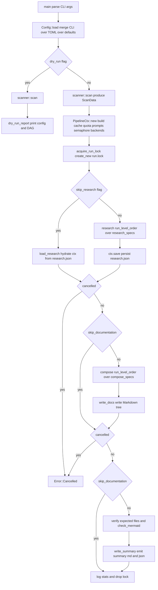
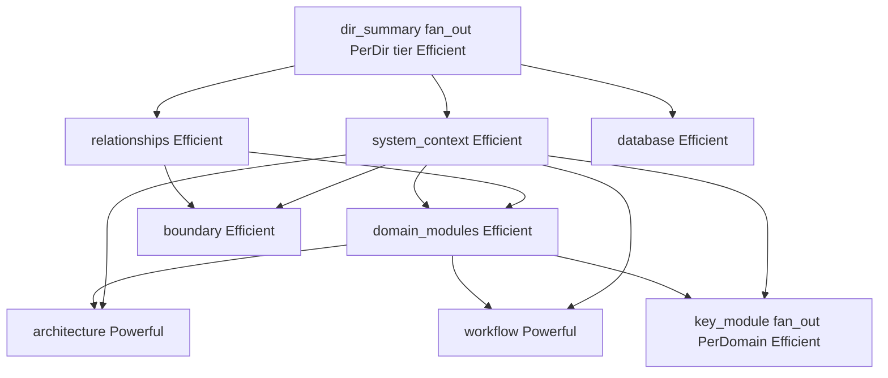
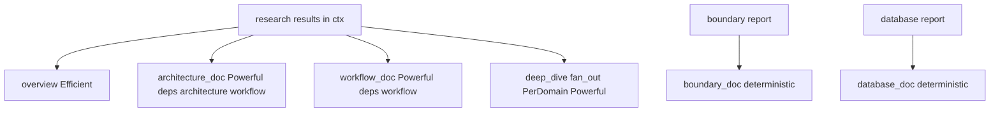
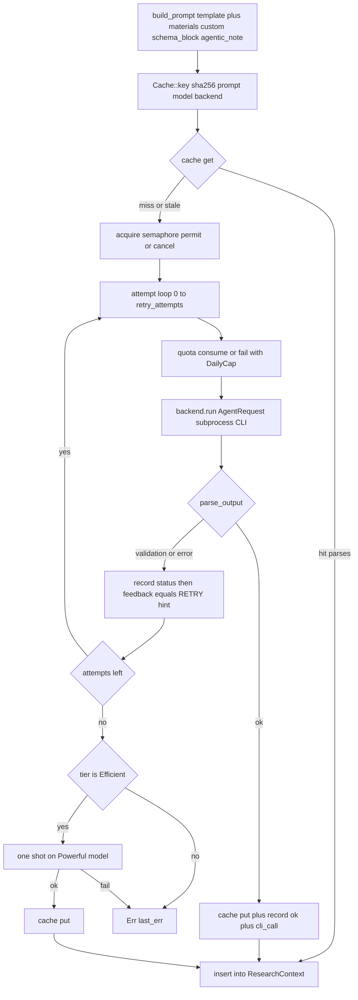

# Core Workflows

## 1. Workflow Overview

agentwiki is a Rust CLI that generates C4-style architecture documentation for an arbitrary repository. All LLM reasoning is delegated to already-authenticated agent CLIs (`devin -p`, `claude -p`, `codex exec`) spawned as subprocesses through the `AgentBackend` trait — no paid API calls are made in-process. The tool's own job is deterministic preparation, orchestration, validation, and rendering.

The end-to-end lifecycle is a strictly one-directional, five-stage pipeline:

```
Scan → Research → Compose → Write → Verify
```

| Stage | Module | Nature | Cost |
|---|---|---|---|
| Scan | `src/scanner/` | Deterministic (walkdir, regex, git) | Free |
| Research | `src/agent/` DAG over CLI backends | LLM, parallel by topo level | CLI calls |
| Compose | `src/agent/` editor specs + deterministic renderers | LLM + pure Rust | CLI calls |
| Write | `src/output/writer.rs` | Deterministic file I/O | Free |
| Verify | `src/output/verify.rs`, `summary.rs` | Deterministic (+ optional `mermaid-fixer`) | Free |

Three cost-protection mechanisms are woven through every LLM-touching step:

- **Content cache** — `sha256(prompt ‖ model ‖ backend)` keying in `.agentwiki/cache/`; a hit returns without any CLI call.
- **Daily cap + audit** — `Quota::consume` gates every real call; each call appends a `CallRecord` to `calls.jsonl`.
- **Billing-env sanitization** — subprocesses are spawned with billing-related environment variables stripped (`sanitized_env`), so the CLIs stay on subscription auth and never fall back to metered APIs.

Coordination is split cleanly: `src/pipeline/mod.rs` decides **when** agents run (topological levels, semaphore, run-lock, cancellation), while `src/agent/runner.rs` decides **how** a single invocation runs (prompt → cache → quota → backend → parse → retry → fallback).

## 2. Main Workflows

### 2.1 Full C4 documentation generation

The primary flow: `main` → `Config::load` → `scanner::scan` → `PipelineCtx::new` + run lock → research DAG → compose DAG → write → verify → summary.



**Step detail:**

1. **Config resolution** (`src/config.rs`, `src/cli.rs`). clap args are merged over TOML over defaults, with named profiles. The result pins `models.efficient` / `models.powerful` (`"<backend>:<model>"` strings), `max_parallels`, `limits.daily_cap`, `retry_attempts`, `materials_char_cap`, `mode` (Agentic vs Embedded), and `skip_research` / `skip_documentation` / `no_cache` / `force_regenerate` flags.
2. **Deterministic scan** (`src/scanner/`). `scan_files` walks the tree with exclusion rules (hidden, binary-by-content, excluded dirs), optionally restricting to `git ls-files` output, and scores file importance heuristically. `insights.rs` applies per-language cached regexes to extract functions, types, imports, LOC and cyclomatic metrics. `structure.rs` groups files into `ScanData`, reads README, and renders an ASCII directory tree for prompts. **No AI is used here.**
3. **Context construction** (`PipelineCtx::new`). Creates `.agentwiki/` (internal dir) and `empty-cwd/`, builds `Cache`, `Quota`, `PromptLoader`, a `Semaphore::new(max_parallels)`, a `CancellationToken`, a `Progress` display, and the backend map — real `for_kind` backends for every `BackendKind` named in `models.*`, or injected mocks in tests. `scan` itself runs inside `PipelineCtx::new`.
4. **Run lock** (`acquire_run_lock`). `create_new` on `.agentwiki/run.lock`; on `AlreadyExists` it reads the pid inside and checks `/proc/<pid>` — a live pid yields `Error::AlreadyRunning`, a stale/unreadable lock is reclaimed (one retry). The `RunLock` guard deletes the file on `Drop`.
5. **Research phase** (`run_level_order(research_specs())`). Runs the research DAG level by level; results land in the shared `ResearchContext` (an async `RwLock<HashMap>`). On success the context is persisted to `.agentwiki/research.json` so `--skip-research` can hydrate it later.
6. **Compose phase** (`run_level_order(compose_specs())`). Editor specs read research from context and produce Markdown strings; deterministic specs (boundary_doc, database_doc) render reports directly without any LLM call.
7. **Write** (`output::write_docs`). Maps context keys to output paths (`1.Overview.md`, `2.Architecture.md`, `3.Workflows.md`, `4.Deep-Exploration/<sanitized-name>.md`, `5.Boundary-Interfaces.md`, `6.Database-Overview.md`), sanitizing dynamically generated filenames.
8. **Verify + summary** (`output::verify`, `write_summary`). Compares written files against the expected set, validates Mermaid blocks (internal heuristics, or external `mermaid-fixer` when present on the system), then emits `__AgentWiki_Summary__.md` and `summary.json` including `RunStats` (cli_calls, cache_hits, saved_secs, per-spec timings).
9. **Teardown.** `run` settles the progress bar (`done`/`cancel`/`fail`), logs stats via `tracing`, and the `RunLock` drop removes `run.lock`.

### 2.2 The research DAG (concrete topology)

From `registry::research_specs()` — the actual dependency graph:



`topo_levels` therefore yields roughly: level 0 = `dir_summary` (fan-out over every scanned directory); level 1 = `relationships`, `system_context`, `database`; level 2 = `domain_modules`; level 3 = `architecture`, `workflow`, `key_module` (PerDomain fan-out), `boundary`. All specs within a level spawn concurrently on a `JoinSet`.

### 2.3 The compose DAG



`boundary_doc` and `database_doc` are `ExecKind::Deterministic` — pure-Rust renderers (`output/boundary.rs`, `output/database.rs`) that consume the structured reports and produce Markdown with Mermaid diagrams, costing zero CLI calls.

### 2.4 Per-instance agent invocation loop (runner)

This is the core inner workflow — executed once per spec instance (per directory, per domain, or once for non-fan-out specs):



Key mechanisms inside `run_instance_inner` (`src/agent/runner.rs`):

- **Prompt assembly** (`build_prompt`): loads template (disk `prompts_dir` → embedded `include_str!` fallback), injects `{{materials}}` (dep results first, then scan-derived blocks — capped at `materials_char_cap`), `{{custom}}` (per-target block for `dir_summary`, `key_module`, `deep_dive`, `boundary`, `database`, `relationships`), `{{schema_block}}` (JSON schema contract for structured agents), `{{language_instruction}}`, and `{{agentic_note}}` (Agentic mode only: repo is cwd, read-only).
- **Mode-dependent cwd**: Agentic → `scan.root` (the agent CLI can read the repo itself); Embedded → sanitized `empty-cwd` (all context must come through materials).
- **Cache discipline**: lookup before any quota consumption; on hit, the cached text is still re-parsed — a stale entry that no longer validates is regenerated. Successful responses are stored with `CacheMeta` (agent, backend, model, created_at, secs) so later hits can credit `saved_secs`.
- **Retry-with-feedback**: each failure appends `**RETRY**: Your previous response failed: {err}...` to the prompt for the next attempt, up to `retry_attempts`. Every attempt (ok, `validation`, or `error`) is recorded to `calls.jsonl`.
- **Tier fallback**: after exhausting retries, Efficient-tier specs get one final shot on the Powerful model (different backend possible); a success is cached under the original key. Powerful-tier specs fail immediately.
- **Multi-strategy JSON extraction** (`extract_json`): strict `serde_json` parse → ```` ```json ```` fenced block → depth-counted first `{…}`/`[…]` honoring strings/escapes. Result then passes the spec's schema validator (lenient `de_*` deserializers that coerce messy LLM output rather than failing).
- **Fan-out execution**: `FuturesUnordered` inside the same task (not `JoinSet`) — aborting the task drops futures synchronously, which drops each in-flight `Child` and kills the CLI via `kill_on_drop`. `aggregate` merges results: `dir_summary` → `Vec<DirectoryDossier>`; PerDomain specs → `{domain_name: result}` map, stamping `domain_name` on `key_module` outputs since the model doesn't reliably echo it.

### 2.5 Dry-run workflow

`--dry-run` exercises only the free stages: `Config::load` → `scanner::scan` → `dry_run_report`, which prints the effective config (paths, profile, mode, models, max_parallels, daily_cap), scan summary (file/dir counts), and the full task DAG for both phases with per-spec `[llm|deterministic|tier]`, fan-out multipliers (`×N dirs`, `×N domains`), and dependency lists. Zero CLI calls.

### 2.6 Offline test workflow

`cargo test` runs `tests/pipeline_offline.rs` against `tests/fixture-app` (a Python/SQLite task manager) with `MockBackend` injected into `PipelineCtx` — canned/scripted responses plus simulated errors and delays. Six tests cover: full pipeline, daily cap blocking, second run fully cached, mid-flight cancellation, concurrent-run refusal, and retry-on-garbage. Real-CLI E2E tests (`devin`/`claude`/`codex`) exist but are gated behind `AGENTWIKI_E2E` to protect quota.

## 3. Flow Coordination and Control

**Shared state.** `PipelineCtx` is the single coordination object, wrapped in `Arc` and cloned into every spawned task: immutable `config`/`scan`, the mutable `ResearchContext` (`RwLock<HashMap<String, Value>>` keyed by spec name — e.g. `dir_summary`, `domain_modules`), `Cache`, `Quota` (internally `tokio::Mutex`-synchronized day counter), `Semaphore`, `RunStats` (`Mutex`), `Progress`, `CancellationToken`, and the `backends` map.

**Level-ordered scheduling.** `run_level_order` computes `topo_levels` (deps before dependents) and processes levels strictly in order: spawn all specs in the level on a `JoinSet`, drain it, then proceed. A `biased` `tokio::select!` races `join_next` against `cancel.cancelled()` — biased so a just-completed task's result isn't lost to a simultaneous cancel.

**Concurrency bounding.** Two nested limits: at most one level's width of specs run at once (DAG structure), and the `Semaphore(max_parallels)` inside `run_instance_inner` caps actual concurrent CLI subprocesses across all fan-out instances of all specs. Semaphore acquisition itself is cancel-aware.

**Data flow.** One direction only: `ScanData` → materials/prompts → backend responses → validated `Value`s → `ResearchContext` → dep blocks / deterministic renderers → `write_docs` → `verify`. Cross-spec dependencies travel exclusively through context keys listed in `spec.deps`; `build_materials` renders each dep's stored value via `dep_block` into the dependent's prompt. `research.json` persistence creates a resumable boundary between Research and Compose (`--skip-research`).

**Backend abstraction.** `BackendKind::parse("<backend>:<model>")` resolves the kind; `pctx.backend(kind)` returns `Arc<dyn AgentBackend>` with a uniform `run(AgentRequest) -> Result<AgentResult>` — each adapter builds its own CLI invocation (`devin -p`, `claude -p` with prompt on stdin, `codex exec -o`) over a billing-sanitized environment. This is the system's single integration seam: swap or mock backends with zero changes upstream.

## 4. Exception Handling and Recovery

| Failure | Detection | Response |
|---|---|---|
| Double run | `run.lock` exists, `/proc/<pid>` alive | `Error::AlreadyRunning{pid}`, fail fast |
| Stale lock | pid dead or file unreadable | Reclaim (remove + retry once) |
| Cache poison | cached text fails `parse_output` | Treat as miss, regenerate |
| Daily cap hit | `quota.consume` error | Fail the instance (and therefore its level) |
| Backend error / empty output | `backend.run` Err or `parse_output` Err | Retry with appended `**RETRY**` feedback, up to `retry_attempts` |
| Garbage JSON | `extract_json` fails all three strategies | Same retry path; lenient `de_*` deserializers still coerce type-mismatched fields |
| Retries exhausted | end of attempt loop | Efficient tier → one fallback call on Powerful model; Powerful tier → propagate `last_err` |
| Cancellation (signal) | `CancellationToken` set by `main`'s handler | Checked before each level, before each attempt, inside semaphore acquire, and racing `backend.run`; `abort_all` drops tasks, `kill_on_drop` kills child CLIs, bounded 3s drain, then `Error::Cancelled` |
| Semaphore/task join failure | acquire/join error | Wrapped as `Error::Pipeline` |
| Missing expected doc / bad Mermaid | `verify`, `check_mermaid` | Recorded in `VerifyReport` + summary (external `mermaid-fixer` if present, internal heuristics otherwise) — report, don't re-run |
| Spec failure mid-level | `run_spec` returns Err | Propagates up `run_level_order`; level aborts (in-flight siblings still drain), pipeline fails |

Recovery levers for operators: re-run is cheap because successful calls are cached (`second_run_is_fully_cached` test); `research.json` lets `--skip-research` redo only compose/write; `--dry-run` diagnoses config/DAG issues before spending calls; `calls.jsonl` provides a per-call audit trail (`ts, agent, backend, model, prompt_chars, secs, status`).

## 5. Key Process Implementation

**Entry points** (`src/main.rs`, `src/lib.rs`): parse args → `Config::load` → `scanner::scan` for dry-run → `PipelineCtx::new(config, None)` → `run(&pctx)`; the signal handler cancels `pctx.cancel`.

**Deterministic spec path** (`run_spec`, `ExecKind::Deterministic(f)`): no fan-out, no prompt — calls `f(&scan, &config, first_dep_result)` and stores the returned Markdown string directly. Used by `boundary_doc`/`database_doc`.

**Prompt budget controls** (`limits`): `materials_char_cap` truncates assembled materials; `code_insights_limit` and `file_source_chars` bound per-material size; `call_timeout()` bounds each subprocess.

**Progress and observability**: `progress.add_total` (1 per spec or per fan-out target), `start`/`finish` per instance; `RunStats` accumulates cache_hits, cli_calls, saved_secs, and per-spec wall times, all surfaced in `__AgentWiki_Summary__.md`/`summary.json`; `tracing::info!` marks each DAG level and final stats.

**Extension seams**: add a spec by declaring an `AgentSpec` (name, phase, tier, deps, fan_out, materials, prompt_tmpl, schema) in `registry.rs` — scheduling, caching, retry, and validation come free; add a backend by implementing `AgentBackend` and registering in `for_kind`.

**Known concentration risk**: `src/pipeline/mod.rs` carries context, scheduler, lock, stats, and dry-run reporting in one file (~350 lines) — the natural split point if orchestration grows. `mermaid-fixer` is a soft dependency: absent it, verification falls back to internal heuristics.