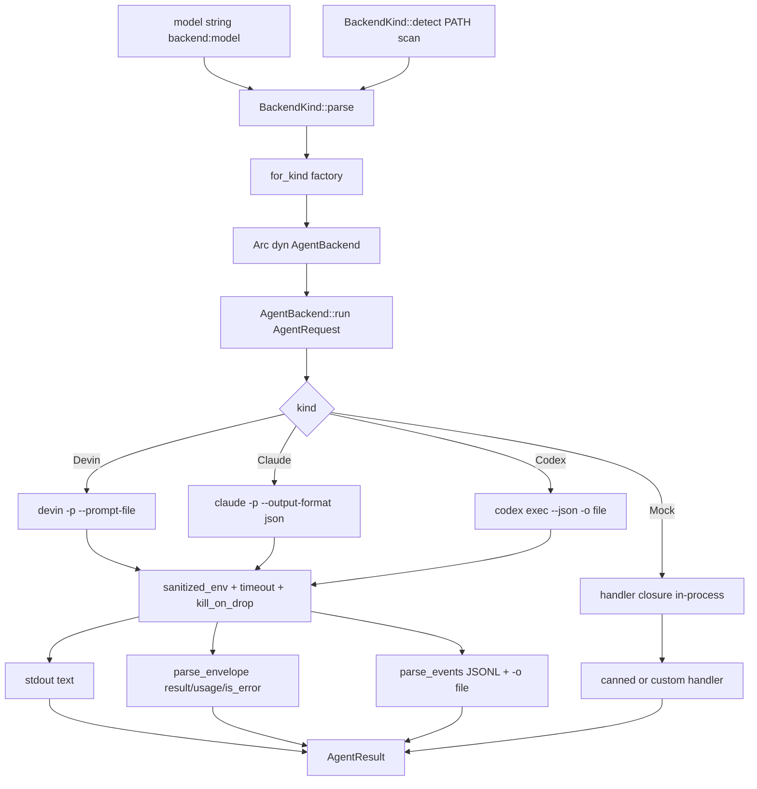
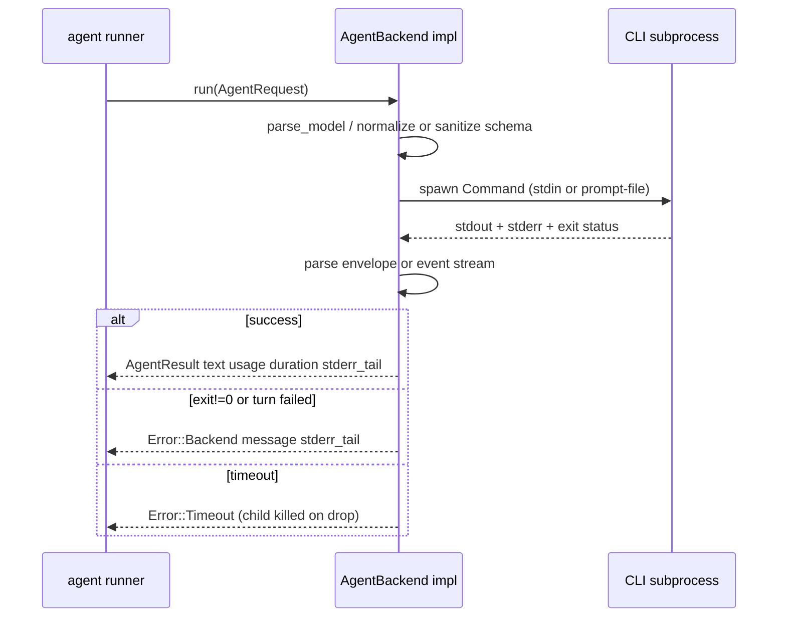

# Agent Backend Integration — Module Deep-Dive

**Location:** `src/backend/` · **Domain type:** Supporting · **Importance:** 9.0

## 1. Purpose

Agentwiki delegates all LLM inference to already-authenticated agent CLIs rather than calling model APIs directly. The `src/backend` module is the adapter layer that makes this work: it unifies three external CLIs — `devin`, `claude`, and `codex` — plus an in-process `MockBackend` behind a single async `AgentBackend` trait. Everything upstream (the agentic runner, cache, quota, compose stage) sees one uniform request/result contract; everything downstream is a subprocess invocation with CLI-specific flags, output formats, and failure semantics.

The module's responsibilities:

- **Model-string dispatch** — parse `"<backend>:<model>"` strings (e.g. `claude:sonnet@high`) into a `BackendKind` plus pass-through model id.
- **Environment hygiene** — strip billing-related env vars (`ANTHROPIC_*`, `OPENAI_*`, `CLAUDE_API`, `CODEX_API`, `DEVIN_API`, `OPENHANDS_*`) so child processes never silently flip onto metered API billing.
- **Process lifecycle** — spawn with `kill_on_drop`, apply per-call `tokio::time::timeout`, capture stderr tails for diagnostics.
- **Output normalization** — translate each CLI's output protocol (plain stdout, JSON envelope, JSONL event stream) into a common `AgentResult` with text, token usage, duration, and error detail.
- **Schema adaptation** — rewrite schemars-produced JSON Schemas into whatever each CLI accepts (or ignore them where unsupported).
- **Offline testing** — `MockBackend` answers the same `mock:<model>` model strings through the production dispatch path, so tests exercise real routing without real CLIs.

## 2. Internal Structure

| File | Role | Key items |
|---|---|---|
| `src/backend/mod.rs` | Contract & dispatch | `BackendKind`, `AgentRequest`, `AgentResult`, `TokenUsage`, `AgentBackend` trait, `for_kind`, `sanitized_env`, `tail` |
| `src/backend/devin.rs` | Devin adapter | `DevinBackend`, `build_cmd` — simplest pass-through (`devin -p`) |
| `src/backend/claude.rs` | Claude adapter | `ClaudeBackend`, `build_cmd`, `parse_model`, `parse_envelope`, `sanitize_schema` |
| `src/backend/codex.rs` | Codex adapter | `CodexBackend`, `build_cmd`, `parse_model`, `parse_events`, `normalize_schema`, `is_nullable` |
| `src/backend/mock.rs` | Test double | `MockBackend`, `MockHandler`, `new`, `canned`, `with_delay`, public `calls` log |

Each real backend keeps its **entire CLI invocation in one private `build_cmd`**, so flag changes are single-point fixes. Shared helpers (`sanitized_env`, `tail` — last *n* chars of stderr for error messages) live in `mod.rs` and are used by all three.

## 3. Key Interfaces

### `BackendKind`

```rust
pub enum BackendKind { Devin, Claude, Codex, Mock }
```

- `parse("<backend>:<model>")` → `(BackendKind, Option<String>)`. Bare `"devin"` yields `model: None`; `"mock"` and `"test"` both map to `Mock`; unknown names return `Error::BackendNotAvailable`. The substring after `:` is passed through verbatim to the CLI — backend-specific suffixes like `@<effort>` are interpreted per-backend, not here.
- `as_str()` → stable lowercase id used in logs, cache keys, and `calls.jsonl` audit lines.
- `default_models()` → per-kind `(efficient, powerful)` model-string pairs, used by the backend-name built-in profiles (e.g. Claude yields `("claude:sonnet@low", "claude:sonnet@high")`).
- `detect()` → first CLI found on `PATH`, preference order **devin → codex → claude**.

### `AgentRequest` / `AgentResult` / `TokenUsage`

`AgentRequest` carries everything one call needs:

| Field | Meaning |
|---|---|
| `prompt` | Fully rendered prompt (system + user already merged upstream) |
| `model` | Model id passed through to the CLI, if any |
| `cwd` | Working directory — project root in agentic mode |
| `timeout` | Per-call timeout enforced via `tokio::time::timeout` |
| `agent` | Agent name for span/log correlation (and MockBackend routing) |
| `json_schema` | Optional JSON Schema; enforced where the CLI supports it (codex `--output-schema`, claude `--json-schema`), ignored otherwise (devin) |

`AgentResult` returns `text` (final message/stdout), `backend`, `model`, `duration`, optional `usage` (`TokenUsage { input, output }` — `None` when the CLI doesn't report it), and `stderr_tail` (last 500 chars, kept even on success for diagnostics).

### `AgentBackend` trait

```rust
#[async_trait]
pub trait AgentBackend: Send + Sync {
    fn kind(&self) -> BackendKind;
    fn supports_fs(&self) -> bool;      // true for real CLIs, false for mock
    async fn run(&self, req: AgentRequest) -> Result<AgentResult>;
}
```

`supports_fs` gates agentic/file-reading mode: real CLIs can read files inside `cwd`; the mock cannot.

### `for_kind` factory

`for_kind(kind) -> Arc<dyn AgentBackend>` is the **only** `match` on kinds in the crate — adding a backend is one file plus one arm. One caveat: the `Mock` arm always constructs `MockBackend::canned(&[])`; a custom-scripted mock must be injected via `PipelineCtx::new(Some(map))`, not through the factory.

## 4. Control Flow

### Dispatch



Upstream, `PipelineCtx` holds a `HashMap<BackendKind, Arc<dyn AgentBackend>>` (injectable for tests); `agent/runner.rs` resolves the backend and calls `run` behind the cache/quota/audit boundary.

### Per-call lifecycle



## 5. Backend Implementations

### Devin — `devin -p` (reference implementation)

The simplest adapter. The prompt is written to a `NamedTempFile` and passed via `--prompt-file` to stay under argv limits; stdin is `Stdio::null()`.

```
devin -p --prompt-file <tmp> --respect-workspace-trust false \
      --permission-mode auto [--model <m>]
```

`--permission-mode auto` auto-approves read-only tools; a print-mode prompt failure surfaces as `exit != 0` rather than a silent hang. Output is plain stdout — no envelope parsing, `usage: None`, and `json_schema` is ignored (documented behavior for backends that can't enforce schemas).

### Claude — `claude -p` (JSON envelope)

Prompt travels on stdin; output is a `--output-format json` envelope.

```
claude -p --output-format json --no-session-persistence \
      --permission-mode bypassPermissions --setting-sources local \
      [--model <m>] [--effort <e>] [--json-schema <inline>]
```

- **`--setting-sources local`** ignores user/project `CLAUDE.md` and settings so prompts stay clean.
- **Effort suffix:** `claude:<model>@<effort>` maps to `--effort`; `EFFORTS = [low, medium, high, xhigh, max]`. Validation happens in `parse_model` before spawn so a typo fails fast instead of inside the CLI.
- **`sanitize_schema`** recursively strips `$schema` keys — `claude --json-schema` rejects the draft URI that schemars emits at the root. The schema is passed **inline**, not as a file.
- **`parse_envelope`** extracts, in preference order: `structured_output` (present when `--json-schema` was given) → `result` → raw stdout fallback. Token usage sums `input_tokens + cache_creation_input_tokens + cache_read_input_tokens` into `input` so it means "total prompt tokens" consistently with codex.
- **Critical:** claude can **exit 0 on a failed turn**, so `is_error` is surfaced explicitly as `Error::Backend`, with non-success `subtype` values (e.g. `error_max_turns`) prefixed onto the message.

### Codex — `codex exec` (JSONL event stream)

Prompt on stdin (`-`); the agent's final message is captured via `-o <file>`; `--json` emits a JSONL event stream on stdout.

```
codex exec --skip-git-repo-check -s read-only --color never \
      --ephemeral --disable hooks -c project_doc_max_bytes=0 \
      --json -o <tmp> [-m <m>] [-c model_reasoning_effort="<e>"] \
      [--output-schema <file>] -
```

- **Sandbox flags:** `-s read-only`, `--ephemeral` (one subprocess per call, no session files), `--disable hooks` (user hooks would fire once per call), `-c project_doc_max_bytes=0` keeps project `AGENTS.md` out of the prompt — materials are agentwiki's job.
- **Effort suffix:** `codex:<model>@<effort>` → `-c model_reasoning_effort="<e>"`; `EFFORTS` adds `"ultra"` to claude's list.
- **`normalize_schema`** rewrites schemars output into codex's strict `--output-schema` subset:
  - `oneOf` is rejected → const-variants collapse into a plain `enum` (with `type` inferred when uniform), otherwise downgrade to `anyOf`.
  - `$ref` must stand alone — sibling keywords are dropped (`allOf` is banned).
  - Every object gets `additionalProperties: false` and a `required` listing **all** properties; originally-optional fields stay optional via a nullable `anyOf: [orig, {type: "null"}]` (detected by `is_nullable`, which checks `type` unions and `anyOf`).
  - The schema goes to a temp file (`--output-schema` reads a file) that must outlive the child.
- **`parse_events`** scans stdout line-by-line: last `item.completed`/`agent_message` → text fallback; `turn.completed` → usage (output includes `reasoning_output_tokens`); `turn.failed`/`error` → failure detail — again, `codex exec` can **exit 0 on a failed turn**.
- Final text prefers the `-o` file over the event-stream fallback.

### Mock — in-process scripted backend

```rust
pub struct MockBackend {
    handler: MockHandler,  // Fn(&AgentRequest) -> Result<String, String>
    delay: Duration,       // async sleep — cancellation still interrupts
    pub calls: Mutex<Vec<String>>,  // request log for assertions
}
```

- `new(handler)` — fully custom response logic, including simulated failures via `Err(String)`.
- `canned(&[(name, body)])` — exact match on `req.agent`, else `name@target` prefix match; unmatched agents get `"{}"`.
- `with_delay(d)` — injects latency as an async `tokio::time::sleep`, letting tests exercise mid-flight cancellation paths.
- `supports_fs() == false` — this is what gates mock runs out of agentic file-reading mode.
- Reachable via `mock:<anything>` (or `test:`) model strings, so `tests/*_offline.rs` exercise the **production** dispatch path end-to-end.

## 6. Notable Implementation Decisions

- **Single dispatch point.** `for_kind` is deliberately the only `match` on `BackendKind`; all other code is generic over `Arc<dyn AgentBackend>`. Adding a backend = one file + one arm (stated in the module docs).
- **Env sanitization is centralized.** `sanitized_env` runs in every backend's `build_cmd` so no CLI can inherit API keys that would silently switch it to metered billing — the whole premise is reusing each CLI's *login session*, not API keys.
- **`kill_on_drop` everywhere.** Cancellation or timeout drops the `Child`, which must kill the CLI — an orphaned subprocess would keep spending calls with nobody to cache the result.
- **Exit-code 0 is not trusted.** Both claude (`is_error` envelope) and codex (`turn.failed`/`error` events) can report failure while exiting successfully; each parser surfaces these explicitly as `Error::Backend`.
- **Best-effort text recovery.** Claude falls back to raw stdout when the envelope is unparseable; codex falls back from the `-o` file to the last `agent_message` event. Downstream lenient deserializers then get maximum material to work with.
- **Schema fidelity is per-backend.** The same `json_schema` is sanitized (claude), strictly normalized (codex), or ignored (devin) — an honest degradation model documented on the `AgentRequest` field.
- **`stderr_tail` retained on success** (last 500 chars) — useful for diagnosing warnings without failing the call.

## 7. Testing

- `claude.rs` and `codex.rs` carry in-file `#[cfg(test)]` modules covering `parse_model` edge cases, envelope/event parsing (including `is_error`, `subtype` prefixing, garbage input), and `sanitize_schema`/`normalize_schema` rewrites (`oneOf`→`enum`, closed objects, nullable optionals, `$defs` recursion).
- `devin.rs` and `mock.rs` rely on integration tests — `tests/incremental_offline.rs` and the `fixture-app`/`fixture-rs` suites run full pipelines against `MockBackend`.
- Real-CLI end-to-end tests are gated behind `AGENTWIKI_E2E=1`.

## 8. Associated Files

| File | Relationship |
|---|---|
| `src/backend/mod.rs` | Trait, types, dispatch, shared helpers |
| `src/backend/{devin,claude,codex,mock}.rs` | Backend implementations |
| `src/agent/runner.rs` | Sole caller of `AgentBackend::run`; wraps calls in cache/quota/retry/tier-fallback |
| `src/pipeline/mod.rs` | `PipelineCtx` owns the `HashMap<BackendKind, Arc<dyn AgentBackend>>` and `backend(kind)` resolution; `PipelineCtx::new` injects mocks |
| `src/config.rs` | Produces model strings consumed by `BackendKind::parse`; profiles use `default_models()` |
| `src/error.rs` | `Error::Backend`, `Error::Timeout`, `Error::BackendNotAvailable` |
| `src/sys.rs` | `find_on_path` backing `BackendKind::detect` |
| `tests/incremental_offline.rs` | Offline integration tests driven through `mock:*` dispatch |