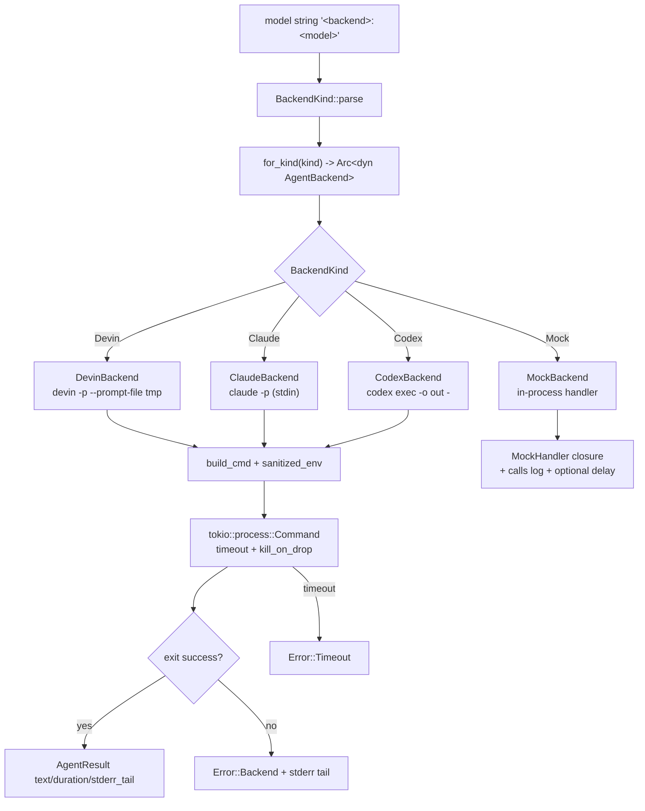
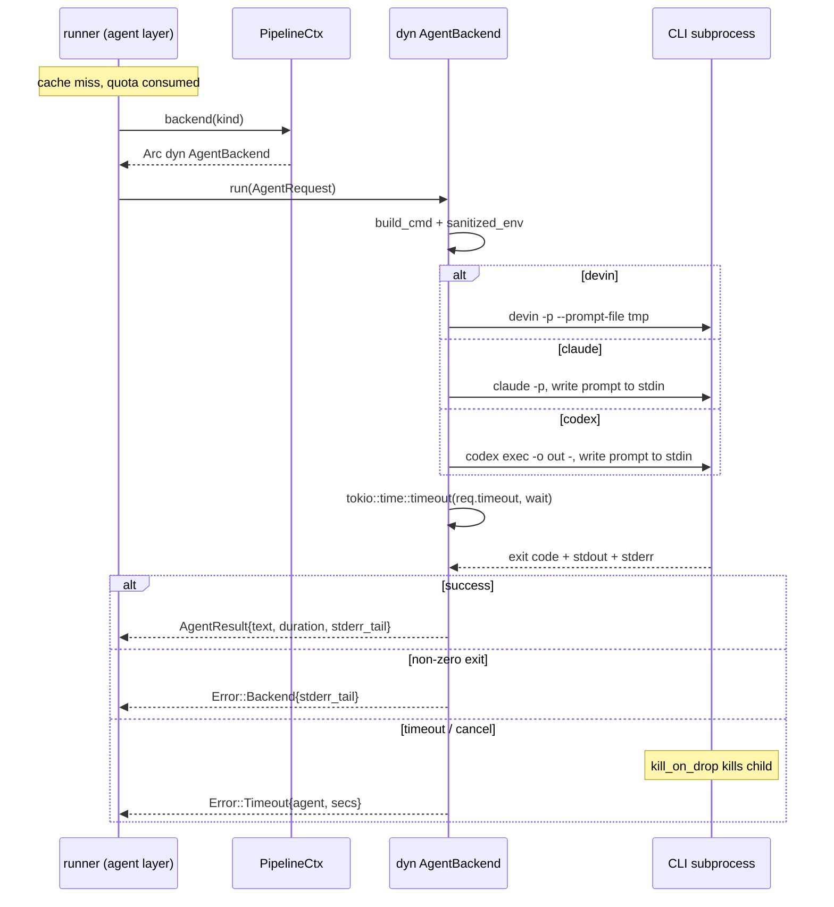

# Deep-Dive: Agent CLI Backend Integration (`src/backend/`)

## 1. Purpose

The `backend` module is the **ports-and-adapters layer** that lets the agent pipeline call LLMs without knowing which CLI is behind them. Instead of calling a metered HTTP API, agentwiki delegates all inference to already-authenticated agent CLIs (`devin`, `claude`, `codex`) spawned as subprocesses via `tokio::process::Command`.

Three design goals dominate the module:

1. **Uniform abstraction** — one `AgentBackend` trait; callers only see `AgentRequest`/`AgentResult`.
2. **Cost protection** — `sanitized_env` strips env vars that could flip a CLI from subscription auth onto metered API billing, and `kill_on_drop` guarantees no orphaned CLI keeps spending quota after a cancel/timeout.
3. **Offline testability** — `MockBackend` is an in-process backend with scripted responses, making the full pipeline testable without real CLIs or network.

The module is small (~580 lines) and deliberately flat: adding a backend means one new file plus one arm in `for_kind`.

## 2. Internal Structure



| File | Lines | Role |
|------|-------|------|
| `src/backend/mod.rs` | 172 | `AgentBackend` trait, `AgentRequest`/`AgentResult`/`TokenUsage`, `BackendKind`, `for_kind` factory, `sanitized_env`, `tail` |
| `src/backend/devin.rs` | 93 | `devin -p` adapter; prompt via temp file (argv limit safe) |
| `src/backend/claude.rs` | 99 | `claude -p` adapter; prompt via stdin, plain-text output |
| `src/backend/codex.rs` | 114 | `codex exec` adapter; prompt via stdin, final message captured via `-o` file with stdout fallback |
| `src/backend/mock.rs` | 106 | Scripted in-process backend for offline tests |

## 3. Key Interfaces

### 3.1 `AgentBackend` trait (`mod.rs:109`)

```rust
#[async_trait]
pub trait AgentBackend: Send + Sync {
    fn kind(&self) -> BackendKind;
    fn supports_fs(&self) -> bool;
    async fn run(&self, req: AgentRequest) -> Result<AgentResult>;
}
```

- `kind()` — stable identity used in logs, cache keys, and `calls.jsonl` audit lines.
- `supports_fs()` — whether the agent can read files inside `cwd` (agentic mode). `true` for all real CLIs, `false` for `MockBackend`. The runner uses this to decide whether to inline scan materials into the prompt.
- `run()` — the single invocation point; fully async so cancellation via `tokio::select!` works.

### 3.2 `AgentRequest` (`mod.rs:77`)

Carries everything one call needs: the fully rendered `prompt`, optional `model` id passed verbatim to the CLI, `cwd` (empty temp dir in embedded mode, project root in agentic mode), per-call `timeout`, and `agent` — the instance name (`system_context`, `dir_summary@src/agent`, …) used for span/log correlation and, for `MockBackend::canned`, response lookup.

### 3.3 `AgentResult` (`mod.rs:92`)

Returns `text` (final message/stdout), `backend`, the `model` actually used, wall-clock `duration`, `usage: Option<TokenUsage>` (currently always `None` — none of the CLIs expose token counts), and `stderr_tail`, which is kept **even on success** for diagnostics.

### 3.4 `BackendKind::parse` (`mod.rs:36`)

Splits `"<backend>:<model>"` → `(kind, Option<model>)`. A bare name (`"claude"`) yields `model = None` (CLI default). `mock` and `test` both map to `BackendKind::Mock`. Unknown names produce `Error::BackendNotAvailable` — notably, strings like `openai:gpt-5` are **rejected**, which is intentional: the tool cannot accidentally route to a metered API.

### 3.5 `for_kind` (`mod.rs:119`)

The **only** `match` on `BackendKind` in the codebase. Returns `Arc<dyn AgentBackend>`; `PipelineCtx` holds a `HashMap<BackendKind, Arc<dyn AgentBackend>>` so tests can inject mocks instead of constructing real backends.

### 3.6 `sanitized_env` (`mod.rs:141`)

Iterates the parent process's env vars and calls `env_remove` on the child `Command` for every key matching `BANNED_PREFIXES`:

```
ANTHROPIC_  OPENAI_  CLAUDE_API  CODEX_API  DEVIN_API  OPENHANDS_
```

This is a deny-by-prefix filter — new vars in these namespaces are blocked automatically. It exists because a stray `ANTHROPIC_API_KEY` in the environment would silently switch `claude` from Max-subscription auth to per-token billing. Defined once in `mod.rs`, invoked by every backend's `build_cmd`.

### 3.7 `tail` (`mod.rs:151`)

Char-safe (not byte-safe) suffix extraction — last *n* characters of stderr for error messages. Reused by `output::verify` for `mermaid-fixer` output.

## 4. Backend Implementations

All three real backends follow an identical skeleton: `build_cmd` (single-point flag definition) → `sanitized_env` → `kill_on_drop(true)` → spawn → `tokio::time::timeout` → check `status.success()` → `AgentResult` or `Error::Backend`/`Error::Timeout`.

| Aspect | Devin | Claude | Codex |
|--------|-------|--------|-------|
| Invocation | `devin -p --prompt-file <tmp> --respect-workspace-trust false --permission-mode auto [--model m]` | `claude -p --output-format text --no-session-persistence --permission-mode bypassPermissions --setting-sources local [--model m]` | `codex exec --skip-git-repo-check -s read-only --color never -o <out> [-m m] -` |
| Prompt transport | Temp file (`tempfile::NamedTempFile`) — avoids argv length limits | stdin (`AsyncWriteExt::write_all` + `shutdown`) | stdin (trailing `-` arg) |
| Result source | stdout | stdout | `-o` file (final message); stdout transcript as fallback |
| Spawn style | `cmd.output()` inside timeout | `spawn()` → write stdin → `wait_with_output()` | same as Claude |
| Notable flags | `--permission-mode auto`: read-only auto-approves; a prompt for edits exits non-zero rather than hanging | `--setting-sources local`: ignores user/project `CLAUDE.md` + settings so prompts stay clean | `-s read-only`: sandbox enforced read-only |

Shared behaviors worth noting:

- **`kill_on_drop(true)`** on every `Command`: when the runner's `tokio::select!` cancels a call or the timeout fires, dropping the `Child` kills the CLI process. An orphaned CLI would keep consuming subscription calls with no one to cache the result.
- **Timeout** wraps the *wait*, not just spawn: `Error::Timeout { agent, secs }` carries the agent name for the audit log.
- **Non-zero exit** → `Error::Backend { backend, message, stderr_tail }` with the last 500 chars of stderr.
- `usage` is always `None` today; `TokenUsage` exists as a forward-compatible field.
- Each backend is a unit struct — stateless, cheap to `Arc`.

### `MockBackend` (`mock.rs`)

```rust
pub type MockHandler =
    Box<dyn Fn(&AgentRequest) -> std::result::Result<String, String> + Send + Sync>;
```

- `MockBackend::new(handler)` — custom closure; `Err(String)` simulates a failing CLI (used by `retry_on_garbage_then_success`).
- `MockBackend::canned(&[(agent, body)])` — exact match on `req.agent`, else prefix match on `name@target` (fan-out instances like `dir_summary@src/scanner` share the `dir_summary` canned body); unmatched agents get `"{}"`.
- `with_delay(d)` — injects an **async** sleep before responding, so `cancel_aborts_mid_flight` and `second_concurrent_run_refused` can exercise mid-flight cancellation and the run lock.
- `calls: Mutex<Vec<String>>` records every agent name seen — `second_run_is_fully_cached` asserts the count doesn't grow on a second run.
- `supports_fs() = false`, matching how a no-filesystem agent behaves in embedded mode.

Wired in via a model string of `"mock:<anything>"` (parse maps `mock`/`test` → `BackendKind::Mock`) and injected through `PipelineCtx::new(config, Some(backends))`.

## 5. Control Flow



The caller (`runner::run_instance_inner`) never sees process details — it gets text or a typed error, which feeds the retry/fallback loop and the `CallRecord` audit entry.

## 6. Notable Implementation Decisions

1. **Subscription-only enforcement at two levels**: `BackendKind::parse` whitelists backend names (no `openai:` etc.), and `sanitized_env` strips billing env vars. Even a hostile or misconfigured environment can't silently route calls to a metered API — aligned with the project's "no paid API keys" constraint.

2. **Prompt transport differs per CLI for good reasons**: devin uses a temp file because its `-p` takes the prompt inline (argv limits on ~200KB prompts); claude/codex take stdin natively. Keeping each CLI's quirks inside its own `build_cmd` is the "single-point fix" convention called out in the code comments.

3. **`kill_on_drop` is a cost guard, not just hygiene**: cancellation in the pipeline aborts futures; without kill-on-drop the CLI subprocess would keep running (and billing against the subscription) with nobody consuming the result.

4. **`stderr_tail` kept on success**: CLIs print progress/warnings to stderr; retaining the tail aids post-hoc debugging in `calls.jsonl` and logs without failing the call.

5. **Codex prefers `-o` over stdout**: `codex exec` writes the session transcript to stdout but the agent's *final message* to the `-o` file — preferring the file avoids parsing the transcript; stdout remains a fallback if the file is empty.

6. **`supports_fs` decouples mode from backend identity**: the runner checks this flag to decide whether to embed scan materials (embedded mode) or tell the agent to read files itself (agentic mode), rather than hardcoding per-kind behavior.

7. **Stateless unit structs**: backends hold no state; all per-call data flows through `AgentRequest`. Concurrency limiting lives upstream in `PipelineCtx`'s `Semaphore`, keeping this module free of synchronization concerns.

8. **Mock shares the trait, not a flag**: tests inject `MockBackend` through the same `Arc<dyn AgentBackend>` map, so the entire pipeline — cache, quota, retry, fallback, cancellation, run-lock — is exercised against real control flow rather than a test-only code path.

## 7. Error Model

Errors flow into `crate::error::Error`:

- `Error::BackendNotAvailable` — unknown backend name in a model string (parse time).
- `Error::Backend { backend, message, stderr_tail }` — spawn failure or non-zero exit.
- `Error::Timeout { agent, secs }` — call exceeded `req.timeout`.
- `Error::io` — tempfile creation/write failures (devin, codex).

The runner treats `Backend`/`Timeout` as retryable (retry-with-feedback, then Efficient→Powerful fallback), while parse-level errors surface immediately.

## 8. Associated Files

- `src/backend/mod.rs` — trait, types, `BackendKind::parse`, `for_kind`, `sanitized_env`, `tail`, parse unit test
- `src/backend/devin.rs` — `DevinBackend`
- `src/backend/claude.rs` — `ClaudeBackend`
- `src/backend/codex.rs` — `CodexBackend`
- `src/backend/mock.rs` — `MockBackend` + `MockHandler`
- Callers: `src/pipeline/mod.rs` (backend map construction, `PipelineCtx::backend`), `src/agent/runner.rs` (`backend.run` invocation), `src/config.rs` (`model_for` produces the `<backend>:<model>` strings), `tests/pipeline_offline.rs` and `tests/e2e_real_cli.rs` (mock injection and real-CLI E2E gated by `AGENTWIKI_E2E`)