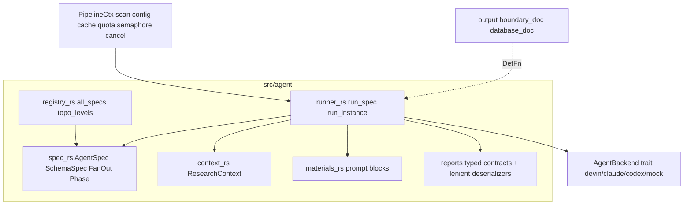
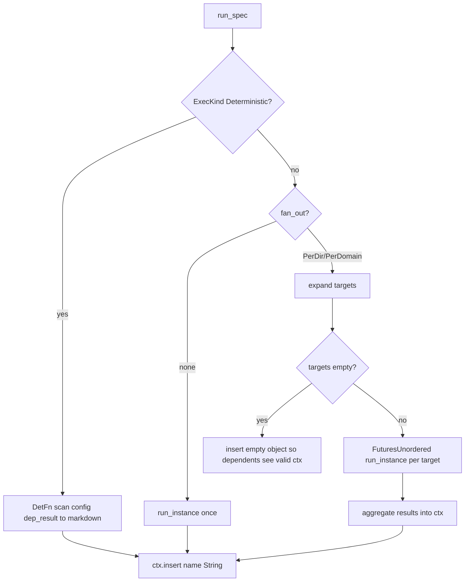
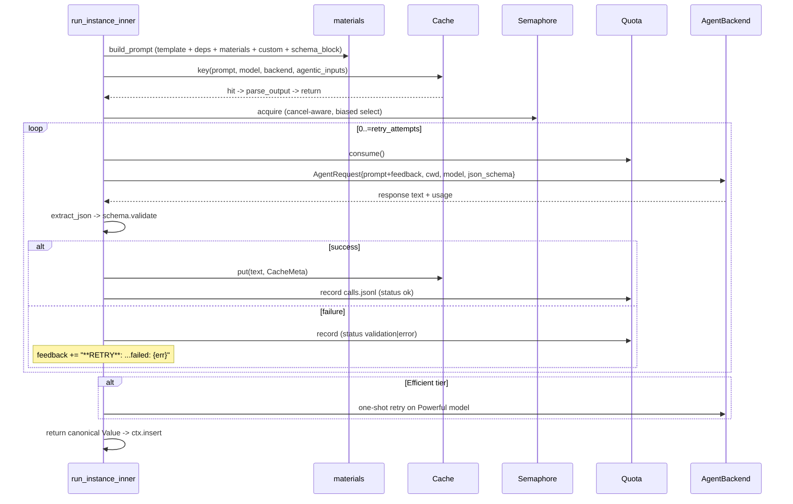

# Agent Orchestration & Analysis — Module Deep-Dive

## 1. Purpose

`src/agent` is the core business domain of agentwiki: a declarative multi-agent task DAG that turns deterministic scan data (`ScanData`) into structured architecture research and, in a second phase, finished Markdown documents. The module is responsible for:

- Declaring every agent node — its prompt template, model tier, dependencies, fan-out axis, materials, phase, and output contract (`AgentSpec`).
- Scheduling nodes in dependency order via topological levels (`topo_levels`).
- Executing each node through an agentic loop: prompt assembly → content-hash cache → quota → backend subprocess → lenient JSON extraction → schema validation → retry-with-feedback → model-tier fallback (`runner.rs`).
- Exchanging typed results between agents through a shared async store (`ResearchContext`).
- Rendering scan data and upstream results into prompt-ready material blocks (`materials.rs`).
- Defining the typed output contracts every structured agent must satisfy (`reports/`).

The module deliberately contains no LLM access of its own: all inference is delegated through the `AgentBackend` trait (`src/backend`), and all governance (cache, quota, semaphore, cancellation, progress, stats) is consumed from `PipelineCtx` rather than implemented here.

## 2. Internal Structure



| File | Role |
|---|---|
| `src/agent/mod.rs` | Module root; re-exports. |
| `src/agent/spec.rs` | `AgentSpec` node definition, `SchemaSpec`, `FanOut`, `Phase`, `Material`, `ExecKind`, `FanTarget`, `expand()`. |
| `src/agent/registry.rs` | Declarative DAG: `research_specs()`, `compose_specs()`, `all_specs()`, `topo_levels()`, `display_name()`. |
| `src/agent/runner.rs` | `run_spec`, `run_instance`, `run_instance_inner`, `build_prompt`, `parse_output`, `extract_json`, `aggregate`, `project_dep`. |
| `src/agent/context.rs` | `ResearchContext` — async `RwLock<HashMap<String, Value>>` with `insert`/`get`/`get_typed`/`snapshot`/`save`/`load`. |
| `src/agent/materials.rs` | `render_material`, `dep_block`, `dossier_from`, `code_insights_block`, per-agent `*_custom` blocks, size caps. |
| `src/agent/reports.rs` + `reports/{code,research,relationship,lenient}.rs` | Output schemas (`DirectorySummaryResponse`, `SystemContextReport`, `DomainModulesReport`, `KeyModuleReport`, `BoundaryAnalysisReport`, `DatabaseOverviewReport`, `RelationshipAnalysis`) plus ~25 lenient `de_*` deserializers. |

## 3. The Task DAG

### 3.1 Spec declaration

Each node is a plain `AgentSpec` struct literal in `registry.rs`. Fields:

- `name` / `prompt_tmpl` — unique key and template under `prompts/`.
- `schema: Option<SchemaSpec>` — `None` means free-form Markdown output; `Some(schema_spec::<T>())` gives a two-hook contract: `json_schema` is injected into the prompt as `{{schema_block}}`, and `validate` parses then re-serializes the model's JSON so only canonical forms reach the context.
- `tier: ModelTier` — `Efficient` or `Powerful`; the tier determines both the backend model and whether tier fallback is allowed.
- `deps` — names of specs whose stored results are injected as `#### <display name>` fenced blocks.
- `fan_out: Option<FanOut>` — `PerDir` (one instance per scanned directory) or `PerDomain` (one instance per entry in the `domain_modules` report).
- `materials` — additional scan/context blocks for `{{materials}}`.
- `phase` — `Research` (phase 1) or `Compose` (phase 2).
- `exec` — `ExecKind::Llm` or `ExecKind::Deterministic(DetFn)`.

### 3.2 Registered nodes

**Research phase (9 agents):**

| Spec | Tier | Fan-out | Deps | Output |
|---|---|---|---|---|
| `dir_summary` | Efficient | PerDir | — | `DirectorySummaryResponse` → `Vec<DirectoryDossier>` |
| `relationships` | Efficient | — | `dir_summary` | `RelationshipAnalysis` |
| `system_context` | Efficient | — | `dir_summary` | `SystemContextReport` |
| `domain_modules` | Efficient | — | `dir_summary`, `system_context`, `relationships` | `DomainModulesReport` |
| `database` | Efficient | — | `dir_summary` | `DatabaseOverviewReport` |
| `architecture` | Powerful | — | `system_context`, `domain_modules` | free-form text |
| `workflow` | Powerful | — | `system_context`, `domain_modules` | free-form text |
| `key_module` | Efficient | PerDomain | `system_context`, `domain_modules` | `KeyModuleReport` per domain |
| `boundary` | Efficient | — | `system_context`, `relationships` | `BoundaryAnalysisReport` |

**Compose phase (6 agents):** `overview`, `architecture_doc`, `workflow_doc`, `deep_dive` (PerDomain) are LLM editor prompts under `prompts/editors/`; `boundary_doc` and `database_doc` are `ExecKind::Deterministic` renderers (`crate::output::boundary_doc` / `database_doc`) that convert their dep's report into Markdown with no CLI call.

### 3.3 Topological scheduling

`topo_levels()` is a Kahn-style level ordering: `levels[i]` contains every spec whose deps all completed in earlier levels. Deps referencing names not in the spec list are ignored (allows running a subset of the DAG). The pipeline executes levels sequentially and specs within a level concurrently; a `debug_assert` catches dependency cycles in debug builds.

Derived levels for the current registry:

- **L0**: `dir_summary`
- **L1**: `relationships`, `system_context`, `database`
- **L2**: `domain_modules`, `boundary`
- **L3**: `architecture`, `workflow`, `key_module`
- **Compose**: `overview`, then `architecture_doc` / `workflow_doc` / `deep_dive`, plus the deterministic `boundary_doc` / `database_doc`.

## 4. Execution Engine (`runner.rs`)

### 4.1 `run_spec` — per-spec driver



Key behaviors:

- **Deterministic specs** call `f(&pctx.scan, &pctx.config, &first_dep_result)` and store the rendered Markdown string — zero model calls, zero cost.
- **Fan-out expansion** (`spec::expand`): `PerDir` yields a `FanTarget` per `ScanData.directories` entry (key = relative path, `"."` for root); `PerDomain` reads `DomainModulesReport` from the context and yields one target per domain. An empty target set stores `{}` rather than failing.
- **Concurrency** uses `FuturesUnordered` (not `JoinSet`) deliberately: the futures live inside the `run_spec` task, so aborting it drops them synchronously — which drops each in-flight `Child` handle and kills the CLI subprocess via `kill_on_drop`. Cooperative cancellation propagates through `pctx.cancel`.
- **`aggregate`** sorts results by key for deterministic ordering. `dir_summary` merges each `DirectorySummaryResponse` with its scanner `DirectoryInfo` via `materials::dossier_from` (filling in `file_path` from `dir.rel_path`); `PerDomain` specs store a `{domain_name: result}` map and stamp `domain_name` on `key_module` results because models don't reliably echo it.

### 4.2 `run_instance_inner` — the agentic loop



Governance order matters: **cache before semaphore before quota** — a cache hit costs no permit and no quota; queued instances can still be cancelled while waiting on the semaphore (`biased` select). Every paid call is recorded to `calls.jsonl` with status `ok`/`validation`/`error`, token usage, duration, and prompt size.

**Retry-with-feedback**: each failed attempt appends a `**RETRY**` suffix containing the prior parse/validation error to the next prompt — the model sees exactly why its output was rejected. Attempts are bounded by `config.limits.retry_attempts`.

**Tier fallback**: after exhausting retries, `Efficient`-tier agents get one final shot on the `Powerful` model (same prompt+feedback, same cache key). `Powerful`-tier failures propagate immediately.

**Agentic vs. embedded mode**: in `Mode::Agentic` the backend's `cwd` is the repo root (the agent can read files itself), so the cache key additionally mixes in manifest fingerprints — `subtree_fingerprint(rel)` for `PerDir` targets, `fingerprint_all()` for everything else — because repo content outside the prompt can change the answer. Embedded mode uses an empty cwd and no fingerprint input.

### 4.3 Prompt assembly (`build_prompt`)

`{{key}}` variables rendered into the template:

- `materials` — dep results first (freshest context), then scan materials; capped by `limits.materials_char_cap`.
- `custom` — per-agent block: `dir_summary` gets file metrics + source preview; `key_module`/`deep_dive` get domain detail; `relationships`, `boundary`, `database` get purpose-filtered dossier insights.
- `schema_block` — pretty-printed JSON Schema plus strict output instructions (structured agents only).
- `language_instruction`, `agentic_note` (read-only repo access notice in agentic mode).

**Dep projection** (`project_dep`) is a notable cache-stability optimization: `PerDomain` instances receive only their own slice of upstream results. `domain_modules` is projected to `{domain: <this entry>, other_domains: [names]}` and per-domain maps are sliced to `v[target.key]`. This means editing domain B's entry cannot churn `key_module@A`'s prompt or cache key — verified by the `per_domain_prompt_stable_when_other_domain_changes` test.

### 4.4 Output parsing (`parse_output`, `extract_json`)

A three-stage lenient extraction, ported from deepwiki-rs:

1. Strict `serde_json` parse of the whole response.
2. ` ```json … ``` ` fenced block.
3. Depth-counted scan for the first `{`/`[` … matching close, honoring string literals and escapes.

Then `SchemaSpec::validate` deserializes into `T` — with a single-element-array unwrap fallback (models sometimes wrap the object in `[…]`) — and re-serializes so the context stores a canonical shape. Unstructured agents only reject empty responses.

## 5. ResearchContext — the data plane

`ResearchContext` (context.rs) is an `RwLock<HashMap<String, serde_json::Value>>`: keys are spec names (`dir_summary`) or instance keys (`key_module@Auth`), values are canonical JSON. It provides `insert`, `get`, `get_typed<T>`, `contains`, sorted `keys`, `snapshot`, and `save`/`load` persistence to `research.json` — which powers `--skip-research` reruns of the compose phase without re-spending calls.

Dependency wiring is **implicit**: `spec.deps` names are resolved against the context at prompt-build time. The DAG guarantees ordering (a dep's spec ran in an earlier level) but not key existence — a spec that produced an empty result yields no block rather than an error.

## 6. Structured report types (`reports/`)

- `code.rs` — `DirectorySummaryResponse`, `FileInsight` (importance score, `CodePurpose`, `source_summary`), `DirectoryDossier` (model output merged with scanner facts), `classify_directory_purpose`.
- `research.rs` — `SystemContextReport`, `DomainModulesReport` (+ `DomainModule`), `KeyModuleReport`, `BoundaryAnalysisReport`, `DatabaseOverviewReport`.
- `relationship.rs` — `RelationshipAnalysis`, `DependencyType`.
- `lenient.rs` — ~25 `de_*` deserializers that coerce messy LLM output (strings→numbers, single values→vecs, missing fields→defaults) through `serde_json::Value`, so validation succeeds on the imperfect JSON real models emit.

These types serve double duty: `schemars` derives the schema injected into prompts, and serde types are what `ctx.get_typed` and the drift engine deserialize downstream.

## 7. Notable implementation decisions

- **Declarative DAG over imperative orchestration** — adding an agent is a struct literal; scheduling, prompt wiring, and dependency injection are automatic. Mirrors deepwiki-rs's orchestrator.
- **`FuturesUnordered` inside the task** for synchronous child cleanup on cancel — subprocesses die with the pipeline rather than leaking.
- **Cache key includes prompt + model + backend + agentic inputs** — correct invalidation across mode/model changes; dep projection keeps per-domain cache hits stable.
- **Deterministic compose nodes** (`boundary_doc`, `database_doc`) reuse the same spec machinery while spending zero calls.
- **Feedback retries + tier fallback** localize resilience in the runner; callers never see partial failures.
- **Best-effort audit** — `calls.jsonl` recording and cache writes never abort a run.

## 8. Associated files

- `src/agent/mod.rs`, `spec.rs`, `registry.rs`, `runner.rs`, `context.rs`, `materials.rs`, `reports.rs`
- `src/agent/reports/code.rs`, `research.rs`, `relationship.rs`, `lenient.rs`
- Collaborators: `src/pipeline/mod.rs` (`PipelineCtx`, `run_level_order`), `src/backend/` (`AgentBackend`, `AgentRequest`), `src/cache.rs`, `src/quota.rs`, `src/manifest.rs`, `src/prompt.rs`, `src/output/{boundary,database}.rs`, `prompts/` templates.