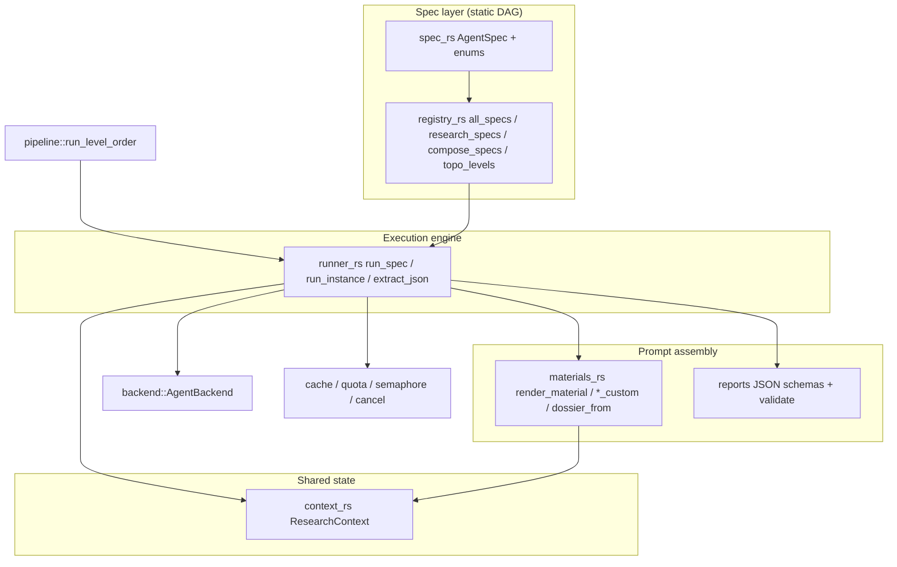
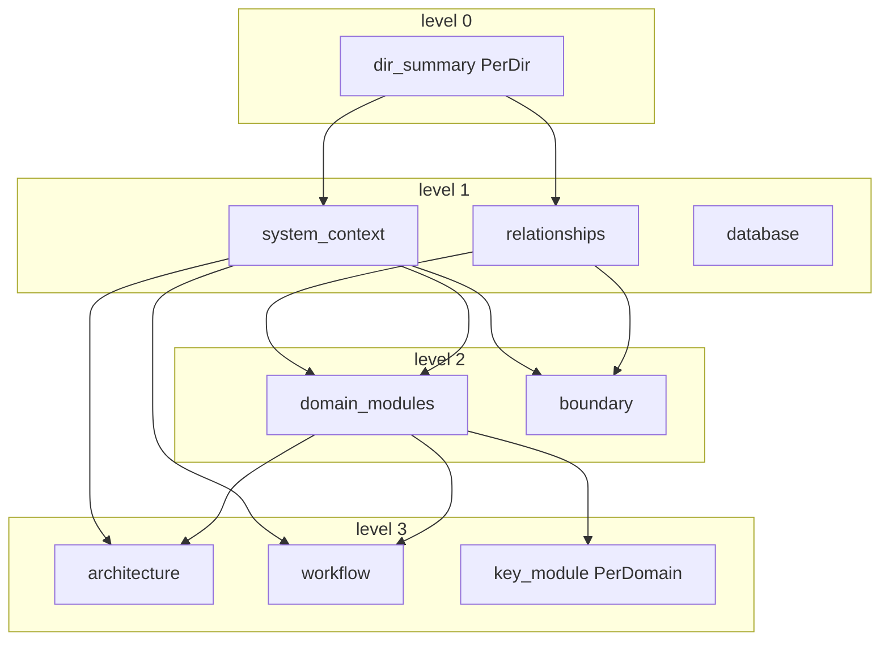
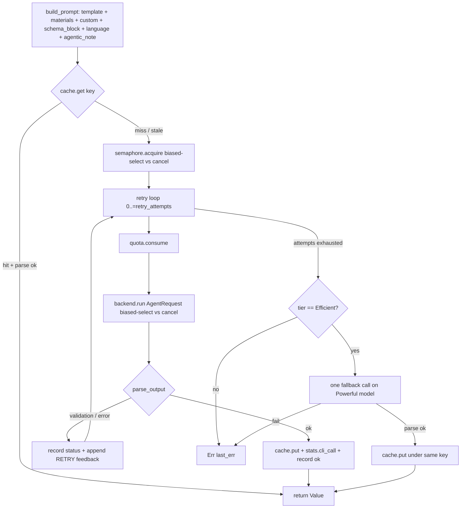
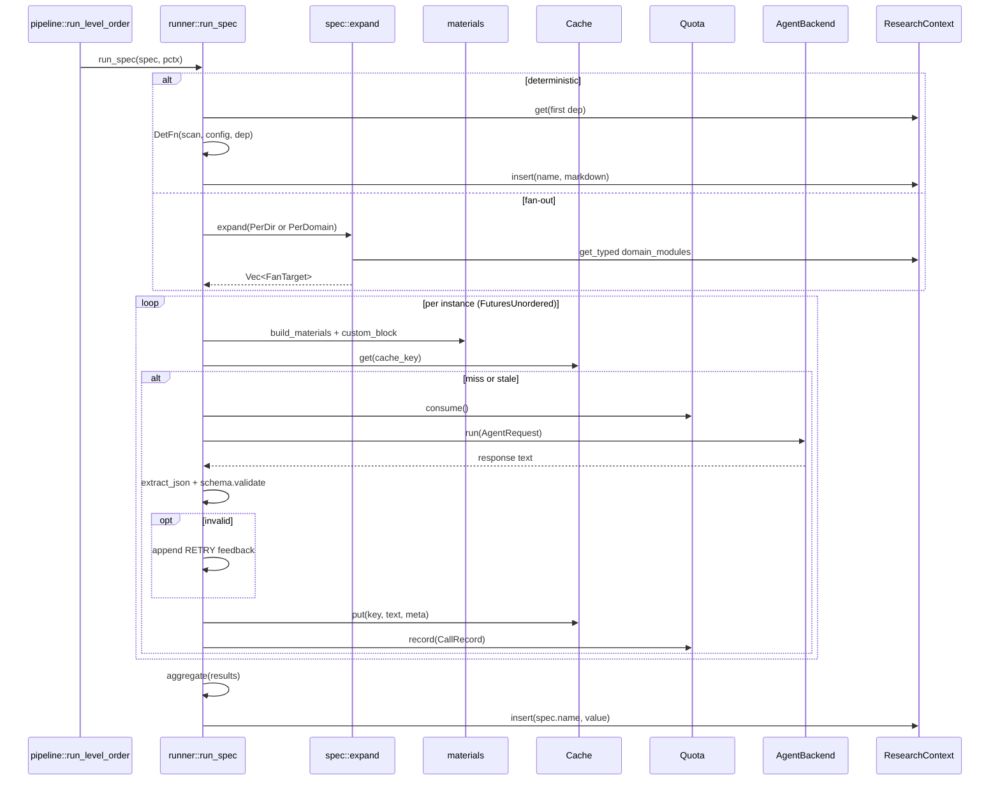

# Deep-Dive: Agent Orchestration & LLM Loop (`src/agent`)

## 1. Module Purpose

`src/agent` is the business-logic core of agentwiki. It defines the DAG of research and compose tasks (the "who runs when"), executes each node through an agentic loop (the "how it runs"), and stores every result in a shared typed store that later nodes consume. It deliberately contains **no LLM code**: all reasoning is delegated to external authenticated CLIs (`devin`, `claude`, `codex`) through the `AgentBackend` trait in `src/backend`. This module owns:

- **Spec layer** (`spec.rs`) — the `AgentSpec` node type: name, prompt template, JSON-schema contract, model tier, dependencies, fan-out axis, materials, phase, and execution kind (LLM vs. deterministic).
- **Registry** (`registry.rs`) — the static declaration of all 15 DAG nodes plus Kahn level-ordering for parallel scheduling.
- **Runner** (`runner.rs`) — the agentic loop per instance: render prompt → cache lookup → semaphore → quota → backend subprocess → multi-strategy JSON extraction → schema validation → retry-with-feedback → model-tier fallback → audit record.
- **Context** (`context.rs`) — `ResearchContext`, an async `RwLock<HashMap<String, Value>>` shared store with disk persistence for `--skip-research`.
- **Materials** (`materials.rs`) — formatters that turn `ScanData`, directory dossiers, and dep results into the `{{materials}}` / `{{custom}}` prompt blocks.
- **Reports** (`reports.rs` + `reports/`) — the anti-corruption layer: schemars-derived JSON contracts and lenient deserializers that normalize "dirty" LLM JSON instead of failing. (Covered in its own deep-dive.)

## 2. Internal Structure



| File | Lines | Role |
|---|---|---|
| `src/agent/mod.rs` | 13 | Module declarations + re-export of `run_spec`. |
| `src/agent/spec.rs` | 186 | `AgentSpec`, `SchemaSpec`, `FanOut`/`FanTarget`, `Phase`, `Material`, `ExecKind`, `expand`. |
| `src/agent/registry.rs` | 250 | All 15 spec declarations, `display_name`, `topo_levels` (Kahn). |
| `src/agent/runner.rs` | 517 | The agentic loop; fan-out via `FuturesUnordered`; cache/quota/retry/fallback. |
| `src/agent/context.rs` | 83 | `ResearchContext` async store + `save`/`load`. |
| `src/agent/materials.rs` | 310 | Prompt-block renderers and dossier assembly. |
| `src/agent/reports.rs` + `reports/` | ~1,900 | Report contracts + lenient deserializers. |

## 3. Key Types and Interfaces

### 3.1 `AgentSpec` — one DAG node

[spec.rs:105-136](../../../src/agent/spec.rs)

Each node declares:

- `name` — unique key (`dir_summary`, `system_context`, …); also the `ResearchContext` key.
- `prompt_tmpl` — template path under `prompts/` (empty for deterministic nodes).
- `schema: Option<SchemaSpec>` — the structured-output contract. `SchemaSpec` carries two function pointers: `json_schema` (schemars schema injected into the prompt) and `validate` (deserialize → re-serialize to canonical form). `None` means the output is raw Markdown/text.
- `tier: ModelTier` — `Efficient` or `Powerful`; resolved via `Config::model_for`.
- `deps` — node names that must finish first; their stored results are injected as `#### <Display Name>` blocks automatically.
- `fan_out` — `PerDir` (one instance per scanned directory) or `PerDomain` (one per domain from `domain_modules`).
- `materials` — scan/context blocks for `{{materials}}`.
- `exec` — `ExecKind::Llm` or `ExecKind::Deterministic(DetFn)` where `DetFn = fn(&ScanData, &Config, &Value) -> Result<String>`.

`instance_key(target)` produces `name@target` for fan-out instances (e.g. `dir_summary@src/agent`), used for cache keys, progress tracking, and audit records.

### 3.2 `SchemaSpec::validate` — canonicalization

`schema_spec::<T>()` builds a validator that `serde_json::from_value::<T>`s the extracted JSON and re-serializes the typed struct. Two consequences: (1) whatever the model emitted is normalized into the canonical shape stored in ctx; (2) a common model quirk — wrapping the single object in a one-element array — is handled by trying `a[0]` before failing (`spec.rs:30-32`).

### 3.3 `ResearchContext` — the shared store

[context.rs](../../../src/agent/context.rs)

A thin `RwLock<HashMap<String, serde_json::Value>>` (tokio async lock). Keys are spec names (`dir_summary`, `key_module`, …); values are canonical JSON (validated reports) or `Value::String` (markdown / free text). API: `insert`, `get`, `get_typed<T>`, `contains`, `keys` (sorted), `snapshot`, plus `save`/`load` to `research.json` via `write_atomic` — this is what powers `--skip-research`, letting compose re-run without any LLM calls. Because keys are spec names rather than instance keys, aggregation (§5.3) is what flattens fan-out results before storage.

### 3.4 Entry point

```rust
pub async fn run_spec(spec: &AgentSpec, pctx: &Arc<PipelineCtx>) -> Result<()>
```

Called by `pipeline::run_level_order` once per spec per topo level. The pipeline decides *when* a node runs; `run_spec` decides *how*.

## 4. The DAG

### 4.1 Research specs (`registry::research_specs`)

| Spec | Tier | Fan-out | Deps | Output |
|---|---|---|---|---|
| `dir_summary` | Efficient | `PerDir` | — | `DirectorySummaryResponse` per dir → `Vec<DirectoryDossier>` |
| `relationships` | Efficient | — | `dir_summary` | `RelationshipAnalysis` |
| `system_context` | Efficient | — | `dir_summary` | `SystemContextReport` |
| `domain_modules` | Efficient | — | `dir_summary`, `system_context`, `relationships` | `DomainModulesReport` |
| `database` | Efficient | — | `dir_summary` | `DatabaseOverviewReport` |
| `architecture` | Powerful | — | `system_context`, `domain_modules` | free text (`schema: None`) |
| `workflow` | Powerful | — | `system_context`, `domain_modules` | free text |
| `key_module` | Efficient | `PerDomain` | `system_context`, `domain_modules` | `KeyModuleReport` per domain |
| `boundary` | Efficient | — | `system_context`, `relationships` | `BoundaryAnalysisReport` |

### 4.2 Compose specs (`registry::compose_specs`)

| Spec | Tier | Fan-out | Deps | Exec |
|---|---|---|---|---|
| `overview` | Efficient | — | `system_context`, `domain_modules` | LLM → `1.Overview.md` |
| `architecture_doc` | Powerful | — | `system_context`, `domain_modules`, `architecture`, `workflow` | LLM → `2.Architecture.md` |
| `workflow_doc` | Powerful | — | `system_context`, `domain_modules`, `workflow` | LLM → `3.Workflow.md` |
| `boundary_doc` | Efficient | — | `boundary` | **Deterministic** (`output::boundary_doc`) → `5.Boundary-Interfaces.md` |
| `database_doc` | Efficient | — | `database` | **Deterministic** (`output::database_doc`) → `6.Database-Overview.md` |
| `deep_dive` | Powerful | `PerDomain` | `system_context`, `domain_modules`, `architecture`, `workflow`, `key_module` | LLM → `4.Deep-Exploration/<domain>.md` |

Two deliberate design choices visible here: `architecture`/`workflow` research produce free-form text (matching the deepwiki-rs reference — the *editors* impose structure later), and `boundary_doc`/`database_doc` are **deterministic renderers** — pure Rust `DetFn`s that need zero LLM calls, reducing quota consumption and eliminating a whole class of formatting failures for the most schema-heavy documents.

### 4.3 Level ordering

`topo_levels` (`registry.rs:227`) is a Kahn-style level ordering: a spec joins a level once all deps that appear in the same spec list are in earlier levels. Deps not present in the list (e.g. compose specs referencing research results already in ctx) are ignored — `!names.contains(d) || done[p]`. A `debug_assert` catches dependency cycles in development. The pipeline runs each level's specs concurrently in a `JoinSet`.



## 5. The Agentic Loop (`runner.rs`)

### 5.1 Per-instance lifecycle

`run_instance_inner` (`runner.rs:144`) is the heart of the module:



Key behaviors:

1. **Cache before anything else** — `Cache::key(prompt, model_str, backend)` covers the fully-rendered prompt, so identical inputs never consume a call. A cached entry that fails `parse_output` is treated as stale and regenerated rather than trusted.
2. **Semaphore bounds total concurrency** — `pctx.semaphore` (sized by `config.max_parallels`) is acquired *after* the cache check, in a biased `tokio::select!` against `cancel`, so queued instances unwind promptly on Ctrl-C.
3. **Quota is consumed per attempt**, not per instance — retries cost real calls, which is correct for the daily-cap accounting.
4. **Retry-with-feedback** — on failure the error is appended to the prompt as `**RETRY**: Your previous response failed: {err}. Correct it and return ONLY the required output.` and the next attempt reuses the same base prompt. Every attempt (success or failure) appends a `CallRecord` to `calls.jsonl` with status `ok`/`validation`/`error`.
5. **Model-tier fallback** — only `Efficient`-tier specs get one extra attempt on the `Powerful` model after exhausting retries (`runner.rs:236`). The result is cached under the *original* cache key, so the cheaper model's key still hits next run.
6. **Biased select on backend call** — a response that lands in the same instant as a cancellation is still cached and returned, avoiding wasted work.

### 5.2 Multi-strategy JSON extraction

`extract_json` (`runner.rs:398`) implements three escalating strategies, ported from deepwiki-rs:

1. **Strict** — `serde_json::from_str` on the whole trimmed response.
2. **Fenced** — find ```` ```json ````, parse up to the closing fence.
3. **Depth-counted scan** — find the first `{`/`[`, then walk bytes tracking brace depth while honoring `"…"` strings and `\` escapes, and parse the balanced slice. This recovers JSON wrapped in prose ("Sure! {…} done") without being fooled by braces inside string literals.

Schema validation then runs through `SchemaSpec::validate` (with the sole-element-array fallback). For `schema: None` specs, `parse_output` only rejects empty responses — the trimmed text is stored as `Value::String`.

### 5.3 Fan-out and aggregation

`run_spec` expands `spec.fan_out` via `spec::expand` (`spec.rs:150`): `PerDir` clones `pctx.scan.directories` into `FanTarget`s; `PerDomain` reads the typed `DomainModulesReport` from ctx (empty report → empty target list → an empty JSON object is stored so dependents see a valid context).

Instances run concurrently inside a `FuturesUnordered` — deliberately **not** `JoinSet` (see `runner.rs:52-54`): the futures live in the current task, so aborting that task drops them synchronously, which drops each in-flight `tokio::process::Child` and kills the CLI thanks to `kill_on_drop`. Concurrency is still bounded by the shared semaphore.

`aggregate` merges results under `spec.name`:

- `dir_summary` → each `DirectorySummaryResponse` is merged with scanner metadata via `materials::dossier_from` into a `Vec<DirectoryDossier>` (the model never supplies `file_path`, `file_count`, or `purpose` — those are deterministic fields filled from `DirectoryInfo`).
- Other `PerDomain` specs (`key_module`, `deep_dive`) → stored as `{domain_name: result}` maps. `key_module` additionally stamps `domain_name` into each result because models don't reliably echo it (`runner.rs:105-113`).

### 5.4 Deterministic specs

`ExecKind::Deterministic(f)` short-circuits the whole loop: fetch the first dep's stored value, call `f(&scan, &config, &dep)`, store the markdown string. No prompt, no cache, no quota. This is how `boundary_doc` and `database_doc` render `5.Boundary-Interfaces.md` and `6.Database-Overview.md` for free.

## 6. Prompt Assembly

`build_prompt` loads the template via `PromptLoader` (disk override → embedded `include_str!`) and substitutes five placeholders:

| Placeholder | Source |
|---|---|
| `{{materials}}` | `build_materials`: dep results first (`dep_block` with `display_name`), then scan-derived blocks — capped at `materials_char_cap` (default 192k chars) |
| `{{custom}}` | `custom_block`: per-spec, per-instance data (below) |
| `{{language_instruction}}` | `config.target_language.instruction()` |
| `{{schema_block}}` | Pretty-printed JSON schema + "return ONLY valid JSON" instruction; empty for unstructured specs |
| `{{agentic_note}}` | Read-only exploration notice, only in `Mode::Agentic` |

### 6.1 Mode-dependent materials

`build_materials` (`runner.rs:298`) always puts **dep results first** ("freshest context"), each rendered as `#### <Display Name>` + fenced JSON/text via `materials::dep_block`. Then:

- **`Mode::Agentic`** — returns immediately: the CLI has the repo as its `cwd` and can explore files itself, so scan materials are omitted entirely (saves prompt tokens).
- **`Mode::Embedded`** — appends the requested `Material` blocks: `ProjectStructure` (full tree ≤100 files, dirs-only tree above), `CodeInsights` (top-N `FileInsight`s across dossiers by importance), `Relationships` (edge list from `RelationshipAnalysis`), `Readme` (≤16k chars).

Correspondingly, `cwd` in the `AgentRequest` is the repo root in agentic mode and `empty_cwd` in embedded mode.

### 6.2 Per-instance `{{custom}}` blocks (`materials.rs`)

| Spec | Block content |
|---|---|
| `dir_summary@<dir>` | Directory metadata + per-file metrics (LOC, functions, classes, importance), interfaces, dependencies, and a source preview capped at `file_source_chars` (default 500 chars) — statics computed on demand via `scanner::extract` |
| `relationships` | All directory dossiers with key files and top-10 interface names |
| `key_module@<domain>` | Domain detail + insights filtered to paths intersecting `domain.code_paths` (≤50) |
| `deep_dive@<domain>` | Compact `**Module**/**Description**/**Code paths**` header |
| `boundary` | Insights filtered to `Entry/Api/Config/Router/Controller/Command` purposes |
| `database` | Insights with `Database`/`Dao` purpose or `.sql`/`.sqlproj` paths (≤50, summaries capped at 10k chars) |

## 7. Interactions with Other Modules



- **Pipeline** — supplies `PipelineCtx` (`scan`, `config`, `cache`, `quota`, `semaphore`, `cancel`, `stats`, `progress`, `prompts`, `backend`) and calls `run_spec` per topo level.
- **Backend** — `BackendKind::parse(model_str)` splits `<backend>:<model>`; `pctx.backend(kind)` resolves the `Arc<dyn AgentBackend>`. Parse or lookup failure propagates before any quota is consumed.
- **Reports** — every `schema` points at a `schema_spec::<T>()` where `T` lives in `agent::reports` and uses lenient deserializers, so extraction strictness and field-level leniency compose.
- **Scanner** — `materials` reads `ScanData`/`DirectoryInfo` and calls `scanner::extract` lazily while building `dir_summary_custom`.

## 8. Notable Implementation Decisions

1. **Separation of scheduling and execution.** `topo_levels`/`run_level_order` (pipeline) own ordering and cross-spec parallelism; `run_spec` owns intra-spec fan-out and the LLM loop. The `AgentSpec` declaration is the only contract between them.
2. **Cache key includes the rendered prompt.** Because `dir_summary@src` and `dir_summary@tests` render different prompts, no instance-key disambiguation is needed in the cache — content addressing handles it for free.
3. **Deterministic renderers in the DAG.** Modeling `boundary_doc`/`database_doc` as spec nodes (rather than ad-hoc pipeline steps) keeps the DAG the single source of truth for ordering and progress, while `ExecKind::Deterministic` keeps them off the quota meter.
4. **`FuturesUnordered` over `JoinSet` for fan-out** — same-task futures so cancellation propagates to `Child::drop` → `kill_on_drop`, preventing orphaned CLI processes that would keep burning subscription quota.
5. **Fallback is one-shot and Efficient-only.** Powerful-tier failures fail fast (retrying on a stronger model wouldn't help); Efficient-tier failures get exactly one Powerful attempt — a bounded escape hatch that caps cost.
6. **Canonical re-serialization on validate.** Storing `to_value::<T>` output (not raw model JSON) means downstream consumers always see the same shape regardless of which lenient paths the deserializer took.
7. **Domain stamping.** `key_module` writes `domain_name` into each result itself (`runner.rs:105`), since model echo of identifiers is unreliable — a small deterministic fix-up at the aggregation boundary.
8. **Audit is append-only and best-effort.** `record()` writes `calls.jsonl` after every attempt; `Quota::record` swallows IO errors so logging can never break the pipeline.

## 9. Failure Modes

| Failure | Handling |
|---|---|
| Invalid/garbage JSON | `extract_json` strategies → `Error::Parse` → retry with `**RETRY**` feedback |
| Schema mismatch | `SchemaSpec::validate` error (with raw tail) → same retry path |
| Backend subprocess error/timeout | `Error::Backend`/`Error::Timeout` → retry path |
| Retries exhausted, Efficient tier | One fallback call on Powerful model |
| Retries exhausted, Powerful tier | `Err(last_err)` propagates; spec fails; dependents in later levels never run (pipeline fails) |
| Daily cap hit | `Error::QuotaExceeded` from `consume()` — immediate, no backend call |
| Cancellation | Checked before each attempt, during semaphore wait, and during `backend.run` via biased `select!` → `Error::Cancelled` |
| Empty fan-out targets | Empty JSON object stored so dependents see a valid context |
| Stale cache entry (no longer parses) | Treated as miss and regenerated |

## 10. Associated Files

- `src/agent/mod.rs` — module root, re-exports `run_spec`.
- `src/agent/spec.rs` — `AgentSpec`, `SchemaSpec`, `FanOut`, `FanTarget`, `Phase`, `Material`, `ExecKind`, `DetFn`, `expand`.
- `src/agent/registry.rs` — `all_specs`, `research_specs`, `compose_specs`, `display_name`, `topo_levels`.
- `src/agent/runner.rs` — `run_spec`, `run_instance`, `run_instance_inner`, `build_prompt`, `build_materials`, `custom_block`, `parse_output`, `extract_json`, `aggregate`, `record`.
- `src/agent/context.rs` — `ResearchContext` (`insert`/`get`/`get_typed`/`keys`/`snapshot`/`save`/`load`).
- `src/agent/materials.rs` — `render_material`, `project_structure`, `readme_block`, `code_insights_block`, `relationships_block`, `dep_block`, `dir_summary_custom`, `relationships_custom`, `key_module_custom`, `boundary_custom`, `database_custom`, `dossier_from`, `filtered_insights`.
- `src/agent/reports.rs`, `src/agent/reports/{code,research,relationship,lenient}.rs` — report contracts and lenient deserializers consumed by `schema_spec`.
- Collaborators: `src/pipeline/mod.rs` (caller, `PipelineCtx`), `src/backend/*` (`AgentBackend`, `BackendKind`, `AgentRequest`), `src/cache.rs`, `src/quota.rs`, `src/prompt.rs`, `src/scanner/*` (material inputs), `src/output/{boundary,database}.rs` (the two `DetFn`s), `prompts/` + `prompts/editors/` (templates referenced by `prompt_tmpl`).