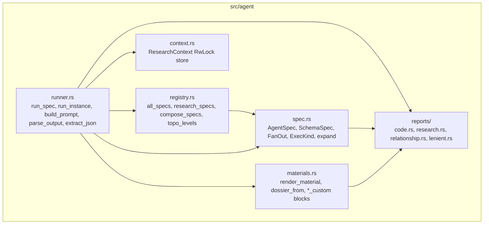
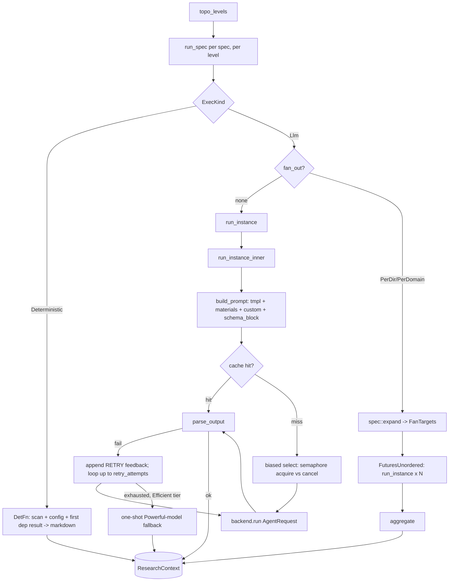

# Agent Orchestration — Module Deep Dive

**Module**: `src/agent` — the core business domain of agentwiki.
**Role in pipeline**: Implements the *Research* and *Compose* stages of the Preprocess → Research → Compose → Verify pipeline. Consumes `ScanData` from the scanner and a `PipelineCtx` of shared infrastructure; produces the structured research reports and composed Markdown documents that `src/output` writes to disk.

## 1. Purpose

Agent Orchestration is a declarative DAG of LLM analysis agents. Each node in the DAG is an `AgentSpec` that declares what it needs (dependencies, prompt materials, fan-out axis) and what it produces (a JSON-schema'd report or free-form Markdown). The runner executes the DAG level by level, fanning specs out into per-directory or per-domain instances, invoking external agent CLIs through the backend layer, and publishing results into a shared `ResearchContext` through which downstream agents consume upstream output.

The module owns no LLM inference itself — all model calls go through `crate::backend::AgentBackend`. Its job is scheduling, prompt assembly, resilience (retry/fallback), output validation, and inter-agent data flow.

## 2. Internal Structure



| File | Responsibility |
|---|---|
| `src/agent/mod.rs` | Module root; re-exports `ResearchContext`, `run_spec`, and the spec types. |
| `src/agent/spec.rs` | DAG node definitions: `AgentSpec`, `SchemaSpec`, `FanOut`, `Phase`, `Material`, `ExecKind`, `FanTarget`, and `expand()` which resolves a fan-out axis into concrete targets. |
| `src/agent/registry.rs` | The DAG itself: `research_specs()` (9 agents), `compose_specs()` (6 agents), `topo_levels()` (Kahn level-ordering), and `display_name()` for prompt injection. |
| `src/agent/runner.rs` | The agentic-loop engine: fan-out expansion, prompt building, cache/quota gating, backend invocation, multi-strategy JSON extraction, retry-with-feedback, and Powerful-tier fallback. |
| `src/agent/context.rs` | `ResearchContext` — an async `RwLock<HashMap<String, Value>>` blackboard with `save`/`load` for `--skip-research` reuse. |
| `src/agent/materials.rs` | Renders scan data and dependency results into `{{materials}}` / `{{custom}}` prompt blocks. |
| `src/agent/reports.rs` + `src/agent/reports/` | Serde/schemars output contracts for every structured agent, plus lenient deserializers (`lenient.rs`) that tolerate malformed LLM JSON. |

## 3. Key Interfaces

### 3.1 `AgentSpec` — the DAG node

`AgentSpec` (spec.rs) is a declarative struct, not a trait — agents are data, not implementations:

- `name` — unique node key (`dir_summary`, `system_context`, …). Results are stored under this name in `ResearchContext`.
- `prompt_tmpl` — template path under `prompts/` (empty for deterministic nodes).
- `schema: Option<SchemaSpec>` — the structured-output contract; `None` means the result is free-form text stored as a JSON string.
- `tier: ModelTier` — `Efficient` or `Powerful`; resolved to a `"backend:model"` string via `config.model_for`.
- `deps: &[&str]` — nodes that must complete first; their stored results are automatically injected into the prompt as `#### <display_name>` blocks.
- `fan_out: Option<FanOut>` — `PerDir` (one instance per scanned directory) or `PerDomain` (one per domain module reported by `domain_modules`).
- `materials: &[Material]` — extra scan/context blocks for `{{materials}}` (`ProjectStructure`, `CodeInsights`, `Relationships`, `Readme`, `Custom`).
- `phase: Phase` — `Research` or `Compose`.
- `exec: ExecKind` — `Llm` (render → backend → parse) or `Deterministic(DetFn)` (pure `fn(&ScanData, &Config, &Value) -> Result<String>` used by `boundary_doc`/`database_doc`).

### 3.2 `SchemaSpec` — the output contract

`schema_spec::<T>()` builds a pair of function pointers over any `T: JsonSchema + DeserializeOwned + Serialize`:

- `json_schema` — produces `schema_for!(T)` as a JSON value, injected into the prompt as `{{schema_block}}` and passed to the backend as `AgentRequest.json_schema` for CLIs that support native structured output.
- `validate` — deserializes with `serde_json::from_value::<T>`, then re-serializes to canonical form before storage. If the model wrapped a single object in a one-element array, `validate` retries the sole element before failing — a common LLM quirk absorbed here rather than in the retry loop.

### 3.3 `ResearchContext` — the shared blackboard

```rust
pub struct ResearchContext { inner: RwLock<HashMap<String, Value>> }
```

Agents never call each other; they exchange data only through this store, keyed by spec name (fan-out results are pre-aggregated under the spec name — see §5). API: `insert`, `get`, `get_typed<T>`, `contains`, `keys`, `snapshot`, `save`, `load`. `save`/`load` persist the full map atomically to `research.json`, enabling `--skip-research` reruns that reuse a prior research phase.

### 3.4 Entry point

```rust
pub async fn run_spec(spec: &AgentSpec, pctx: &Arc<PipelineCtx>) -> Result<()>
```

Called once per spec by the pipeline's `run_level_order`, which spawns each level's specs in a `JoinSet` racing a `CancellationToken`.

## 4. The Agent DAG

`registry.rs` declares 15 nodes. Research phase:

| Agent | Deps | Fan-out | Tier | Schema |
|---|---|---|---|---|
| `dir_summary` | — | `PerDir` | Efficient | `DirectorySummaryResponse` |
| `relationships` | `dir_summary` | — | Efficient | `RelationshipAnalysis` |
| `system_context` | `dir_summary` | — | Efficient | `SystemContextReport` |
| `domain_modules` | `dir_summary`, `system_context`, `relationships` | — | Efficient | `DomainModulesReport` |
| `database` | `dir_summary` | — | Efficient | `DatabaseOverviewReport` |
| `architecture` | `system_context`, `domain_modules` | — | Powerful | none (free-form) |
| `workflow` | `system_context`, `domain_modules` | — | Powerful | none (free-form) |
| `key_module` | `system_context`, `domain_modules` | `PerDomain` | Efficient | `KeyModuleReport` |
| `boundary` | `system_context`, `relationships` | — | Efficient | `BoundaryAnalysisReport` |

Compose phase: `overview`, `architecture_doc`, `workflow_doc`, `deep_dive` (`PerDomain`) are `Llm` editor agents; `boundary_doc` and `database_doc` are `Deterministic` renderers that convert the corresponding research reports to Markdown with no CLI call.

`topo_levels` is a Kahn-style level-ordering: `levels[i]` contains every spec whose deps are all in earlier levels, so independent agents run in parallel within a level. A `debug_assert` catches dependency cycles; deps naming unknown specs are ignored (treated as satisfied).

## 5. Control & Data Flow



### Per-instance lifecycle (`run_instance_inner`)

1. **Prompt build** — `build_prompt` renders `prompts/<tmpl>` with vars: `materials` (dep blocks + scan materials, char-capped at `limits.materials_char_cap`), `custom` (per-instance block), `language_instruction`, `schema_block`, `agentic_note`.
2. **Cache lookup** — key = sha256 over `(prompt, model_str, backend)`. A cached entry is still run through `parse_output`; a stale entry that no longer parses falls through to regeneration.
3. **Admission** — a `biased` `tokio::select!` between `semaphore.acquire()` (bounding concurrent CLI calls across all fan-out instances) and `cancel.cancelled()`, so queued instances unwind promptly on Ctrl-C.
4. **Retry loop** — `0..=retry_attempts`: `quota.consume()` → `backend.run(AgentRequest)` under a second biased select (a response that just landed still gets cached even if cancel arrives simultaneously) → `parse_output`. On failure the error is appended to the prompt as `**RETRY**: Your previous response failed: …` feedback and every attempt is recorded to `calls.jsonl` with status `ok` / `validation` / `error` plus token usage.
5. **Tier fallback** — `Efficient`-tier agents that exhaust retries get one additional attempt on the `Powerful` model (parsed, cached, and returned if valid).
6. **Publish** — `ctx.insert(spec.name, result)`.

### Fan-out & aggregation

`spec::expand` resolves `PerDir` from `scan.directories` and `PerDomain` from the `domain_modules` report already in ctx. Instances run concurrently in `FuturesUnordered` — deliberately chosen over `JoinSet` because these futures live inside the `run_spec` task; aborting it drops them synchronously, which drops each in-flight `Child` and kills the spawned CLI via `kill_on_drop`. Instance keys are `name@target` for progress/log correlation.

`aggregate` merges instance results before publication:

- `dir_summary` → each `DirectorySummaryResponse` is merged with scanner metadata via `materials::dossier_from` (which fills in `file_path` — the model only reports file names — and classifies `DirectoryPurpose` locally) into a `Vec<DirectoryDossier>`.
- `PerDomain` specs → results become a `{domain_name: result}` map; for `key_module` the runner *stamps* `domain_name` into each result because models don't reliably echo it.
- Empty target sets (e.g. `domain_modules` found no domains) publish an empty object so dependents see a valid context.

### Prompt materials

`build_materials` injects dep results first (freshest context) as `#### <display_name>` fenced blocks, then — **in Embedded mode only** — appends the spec's declared `Material`s. In `Agentic` mode the scanned repo is the CLI's `cwd` and the agent explores files itself, so scan materials are omitted and `{{agentic_note}}` instructs read-only exploration instead. `{{custom}}` is dispatched per spec in `custom_block`: `dir_summary@<dir>` gets per-file metrics/interfaces/source previews (calling `scanner::extract` lazily), `key_module@<domain>`/`deep_dive@<domain>` get domain detail + path-filtered insights, `boundary`/`database` get `CodePurpose`-filtered insight lists, `relationships` gets the dossier summaries.

## 6. Output Parsing — Defense in Depth

The pipeline assumes CLI-produced JSON is frequently malformed and layers four mechanisms:

1. **`extract_json`** — three strategies in order: strict `serde_json` parse → ` ```json ` fenced block → depth-counted first `{…}`/`[…]` substring that honors strings and escapes (ported from deepwiki-rs).
2. **`SchemaSpec::validate`** — unwraps single-element arrays and re-serializes to canonical form.
3. **Lenient deserializers** (`reports/lenient.rs`) — `de_string`, `de_opt_string`, `de_f64`, `de_usize`, `de_u8`, `de_bool`, `de_vec_string`, `de_vec_obj` coerce `"8"` → `8`, `{"name": …}` → string, bare strings → single-element vecs, etc. Fuzzy classifiers like `CodePurpose::map_from_raw` map free-text labels onto closed enums.
4. **Retry-with-feedback + fallback** — parse/validation errors feed back into the prompt for the next attempt; Efficient-tier failures escalate to the Powerful model once.

## 7. Report Schemas

`reports/` defines ~1100 lines of schemars-annotated types (`research.rs`) covering `SystemContextReport`, `DomainModulesReport`, `BoundaryAnalysisReport`, `DatabaseOverviewReport`, `KeyModuleReport`, plus `code.rs` (`DirectoryDossier`, `FileInsight`, `CodePurpose`) and `relationship.rs` (`RelationshipAnalysis`, `CoreDependency` — the claims contract consumed by `agentwiki drift`). Every structured spec gets a compile-time-checked JSON schema injected into its prompt.

## 8. Notable Implementation Decisions

- **Specs as data**: adding an agent is a pure registry entry — no trait impls, no wiring. The `DetFn` variant lets compose renderers reuse the same DAG machinery (deps, ordering, context insertion, progress) with zero CLI cost.
- **`FuturesUnordered` over `JoinSet`** for fan-out: keeps child futures in-task so cancellation synchronously drops in-flight `Child` processes (`kill_on_drop`), rather than detaching spawned CLIs.
- **Biased selects**: both the semaphore acquisition and the backend call race cancellation with `biased`, prioritizing prompt cancellation response while still caching a response that completed in the same instant.
- **Canonical storage**: `validate` re-serializes before insert, so ctx values are stable, typed, and safe to snapshot/`--skip-research` reload.
- **Cost governance in the call path**: every call passes `Cache` (content-hash keyed) and `Quota` (daily cap + `calls.jsonl` audit) — fan-out × retry amplification is bounded by construction.
- **Mode-aware prompting**: `Mode::Agentic` trusts the CLI's filesystem access (cwd = repo root); `Mode::Embedded` stuffs the prompt with scan materials and uses an empty cwd — the same DAG serves both.
- **Runner concentration**: fan-out, prompting, caching, quota, parsing, retry, and fallback all converge in `runner.rs` (540 lines) — a deliberate single-loop design, but the natural decomposition point if complexity grows.

## 9. Dependencies

- **Inbound**: `PipelineCtx` (`scan`, `ctx`, `cache`, `quota`, `semaphore`, `prompts`, `progress`, `stats`, `cancel`, `config`); `backend::AgentBackend`/`AgentRequest`/`BackendKind`; `config::{ModelTier, Mode, Config}`; `scanner::{ScanData, DirectoryInfo, extract}`; `prompt::{PromptLoader, render}`; `output::{boundary_doc, database_doc}` (as `DetFn`s); `cache`, `quota::CallRecord`, `util::write_atomic`.
- **Outbound / consumers**: `pipeline::run_level_order` drives `run_spec`; `output::write_docs` reads compose-phase ctx entries; `drift` reads `relationships.core_dependencies` claims; `--skip-research` loads a saved `ResearchContext`.

## 10. Associated Files

- `src/agent/mod.rs`, `src/agent/spec.rs`, `src/agent/registry.rs`, `src/agent/runner.rs`, `src/agent/context.rs`, `src/agent/materials.rs`
- `src/agent/reports.rs`, `src/agent/reports/code.rs`, `src/agent/reports/research.rs`, `src/agent/reports/relationship.rs`, `src/agent/reports/lenient.rs`
- Prompt templates consumed by specs: `prompts/{dir_summary,relationships,system_context,domain_modules,database,architecture,workflow,key_module,boundary}.md` and `prompts/editors/{overview,architecture_doc,workflow_doc,deep_dive}.md`