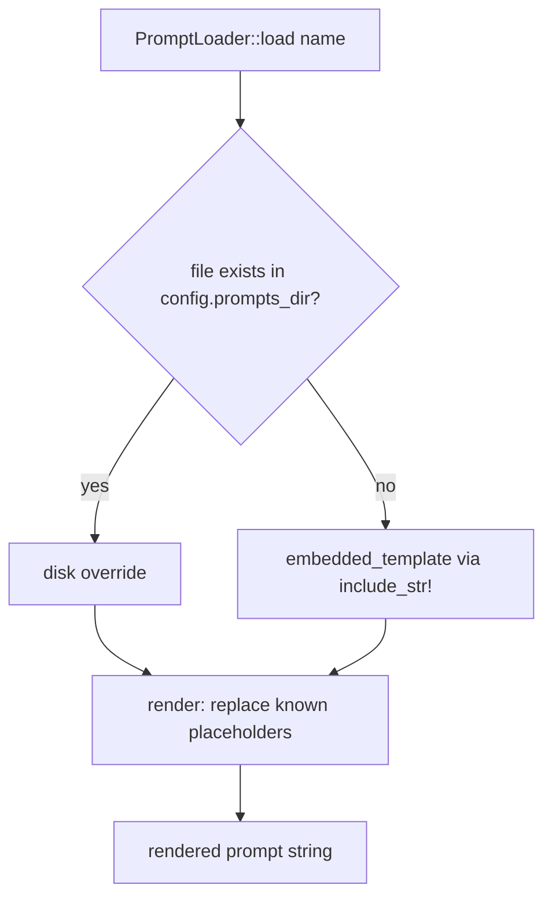
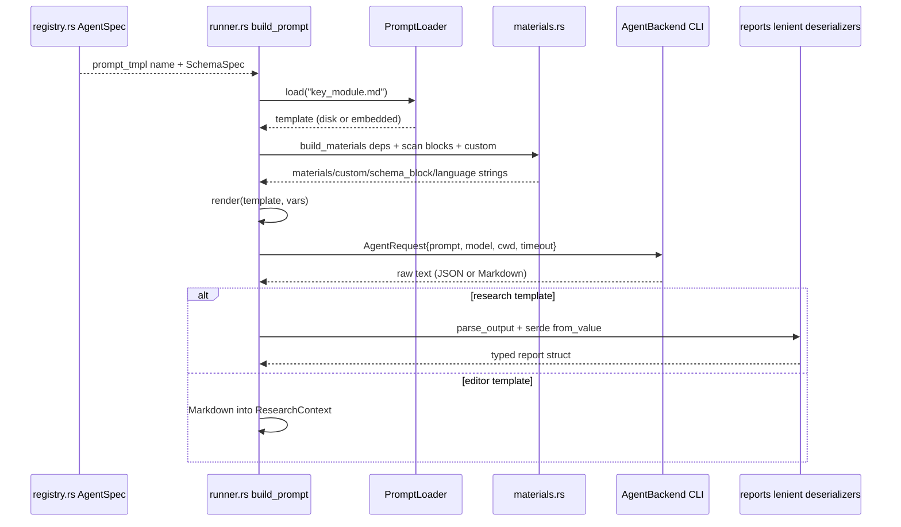

# Module Deep Dive: Analysis Prompt Knowledge Base (`prompts/` + `prompts/editors/`)

## 1. Purpose

The `prompts/` directory is a **knowledge base, not executable code**. It holds 13 Markdown prompt templates that define, for every node in the agent DAG, three things: the *persona* the LLM should adopt ("You are a professional software architecture analyst…"), the *analytical task* it must perform, and the *output contract* it must satisfy (JSON field lists for research tasks, document-structure requirements for compose tasks).

Because all LLM reasoning in agentwiki is delegated to external authenticated CLIs (`devin`, `claude`, `codex`), the prompt text is the *only* lever controlling output quality. These templates are therefore the functional equivalent of the language-processor/analysis logic in the original deepwiki-rs — they encode what "analysis" means for each pipeline stage.

The templates split into two groups mirroring the pipeline phases:

| Group | Path | Templates | Consumer phase |
|---|---|---|---|
| Research | `prompts/*.md` | 9 templates | `Phase::Research` specs in `src/agent/registry.rs` |
| Editors | `prompts/editors/*.md` | 4 templates | `Phase::Compose` specs |

## 2. Internal Structure

### 2.1 Loading and rendering

Templates reach the LLM through `PromptLoader` (`src/prompt.rs`), which implements a two-tier lookup:

- The `embedded!` macro maps 13 names (e.g. `"key_module.md"`, `"editors/deep_dive.md"`) to `include_str!` paths, so the compiled binary is **self-contained** — it works without a `prompts/` checkout.
- A `prompts_dir` on disk (config setting) **overrides** the embedded copy, allowing prompt tuning without a rebuild.
- `render()` is deliberately primitive: plain `String::replace` on `{{key}}` placeholders. There is no escaping, conditionals, or loops. Unknown placeholders are **left in place**, which protects literal `{{"a": 1}}`-style JSON braces inside templates.

### 2.2 Placeholder vocabulary

The runner (`src/agent/runner.rs::build_prompt` + `build_materials`) fills a fixed set of placeholders:

| Placeholder | Meaning | Produced by |
|---|---|---|
| `{{materials}}` | Rendered blocks: project structure tree, README, code insights, dependency reports of upstream DAG nodes | `agent/materials.rs` |
| `{{custom}}` | Per-instance block for fan-out (directory dossier, domain name) | `materials::dir_summary_custom`, `key_module_custom`, etc. |
| `{{schema_block}}` | JSON schema of the expected report, generated via schemars from the report type | `spec::schema_spec::<T>` |
| `{{language_instruction}}` | Output-language directive derived from `Config.target_language` | `TargetLanguage::instruction()` |
| `{{agentic_note}}` | Extra instruction injected only in `Mode::Agentic` (tells the CLI it may read files in `cwd`) | `runner::build_prompt` |

Not every template uses every placeholder — e.g. `key_module.md` uses `{{custom}}` + `{{schema_block}}` + `{{language_instruction}}` + `{{agentic_note}}`, while `dir_summary.md` additionally consumes a `{{custom}}` dossier block.

## 3. The Research Templates

Nine templates define the analysis tasks whose JSON outputs feed `ResearchContext`:

| Template | Task | Output contract highlights |
|---|---|---|
| `dir_summary.md` | Per-directory dossier (fan-out `PerDir`) | `summary`, `importance_score` (0.0–1.0), `key_files` (≤5), `file_insights[]` with `code_purpose` enum (Entry, Agent, Service, Dao, Test…) and typed `interfaces`/`dependencies`. Explicitly weights backend dirs higher than frontend. |
| `system_context.md` | C4 SystemContext analysis | `project_type` enum (CLITool, BackendService…), `target_users[]`, `external_systems[]`, `system_boundary` as a **JSON object** — with "CRITICAL RULES" guarding against stringified nested objects. |
| `domain_modules.md` | DDD-style domain decomposition | Bounded contexts, domain types, relationships; validates domain boundaries against actual code organization. |
| `boundary.md` | External interface discovery | CLI/API/router boundary signals found in entry points and controllers. |
| `database.md` | Data-layer analysis | Tables, views, stored procedures, functions, constraints, data types, data flows. |
| `relationships.md` | Dependency-graph analysis | Core dependencies, architecture layers, `DependencyType` classification. |
| `key_module.md` | Per-domain deep analysis (fan-out `PerDomain`) | `module_description`, `interaction`, `implementation`, `associated_files[]`, plus `flowchart_mermaid`/`sequence_diagram_mermaid` fields (ASCII-only node IDs required). |
| `architecture.md` | Architecture synthesis | Prose/diagram architecture analysis. |
| `workflow.md` | Business-flow analysis | Main + secondary workflows with steps and code entry points. |

Common structural pattern across all research templates:

1. **Persona line** — establishes the expert role.
2. **Task description** — numbered analysis requirements.
3. **`{{materials}}` / `{{custom}}` insertion point** — where scan-derived evidence lands.
4. **Required JSON fields** — an explicit field list that mirrors the corresponding `#[derive(Deserialize)]` report struct in `src/agent/reports/`.
5. **Output-style rules** — "Plain English, short sentences, no filler", which reduce token burn and parsing ambiguity.
6. **Trailer placeholders** — `{{language_instruction}}`, `{{schema_block}}`, `{{agentic_note}}`.

The dual specification of the output contract — a human-readable field list *and* the machine-generated `{{schema_block}}` — is intentional: it gives the model two chances to conform, which raises the success rate of the runner's three-stage JSON extraction (`extract_strict` → `extract_fenced` → `extract_prose_wrapped`) before the lenient deserializers even engage.

## 4. The Editor Templates (Compose Phase)

`prompts/editors/` contains four templates that turn structured research into prose documentation:

| Template | Document | Output path |
|---|---|---|
| `overview.md` | C4 SystemContext "Project Overview" | `1.Overview.md` |
| `architecture_doc.md` | Architecture overview | `2.Architecture.md` |
| `workflow_doc.md` | "Core Workflows" document | `3.Workflow.md` |
| `deep_dive.md` | Per-domain module deep dive (fan-out `PerDomain`, depends on `key_module` results) | `4.Deep-Exploration/<domain>.md` |

These differ from research templates in that they output **raw Markdown**, not JSON — e.g. `overview.md` ends with "Output raw Markdown only. IMPORTANT: do not use transition phrases…". They prescribe a recommended document skeleton (`# System Context Overview` → sections 1–6) and C4 conformance requirements. Note that `5.Boundary-Interfaces.md` and `6.Database-Overview.md` are **not** produced by these templates — they are rendered deterministically by `src/output/boundary.rs` and `database.rs` from the research reports.

## 5. Mermaid Safety Rules

A shared "Mermaid Diagram Safety Rules (MUST follow)" section appears in every template that can emit diagrams (the four editor templates plus `architecture.md` and `workflow.md`; `key_module.md` inlines an equivalent "ASCII-only node IDs" constraint since it produces `flowchart_mermaid`/`sequence_diagram_mermaid` strings). The rules are identical across templates:

- Node IDs: ASCII `[A-Za-z0-9_]` only; localized text lives in labels.
- Standard headers only: `graph TD`, `graph LR`, `flowchart TD`, `sequenceDiagram`, `erDiagram`.
- No zero-width characters, smart quotes, or unusual Unicode.
- Every node ID defined before edge use; edge labels are plain text.

This is a prompt-level defense that pairs with the verify-phase check in `src/output/verify.rs::check_mermaid` (header allowlist, non-empty body, no unterminated blocks) — prompt-side prevention, verifier-side detection.

## 6. Data Flow

## 7. Notable Implementation Decisions

- **Text, not code**: there is zero executable logic in this module — all behavior emerges from what the templates instruct the LLM to do. This keeps the knowledge base editable by non-Rust contributors and diffable in review.
- **`include_str!` embedding**: templates compile into the binary, so `agentwiki` is a single-file distributable; the `prompts_dir` override preserves tunability.
- **Deliberately dumb `render()`**: no templating engine dependency. One-shot prompts don't need loops/conditionals, and leaving unknown placeholders intact protects JSON examples in the template body.
- **Fan-out via `{{custom}}`**: a single template (e.g. `dir_summary.md`, `key_module.md`, `deep_dive.md`) is reused across N directories/domains; the per-instance context arrives through `{{custom}}` rather than template duplication.
- **Output contract redundancy**: field lists + injected JSON schema + lenient deserializers + retry-with-feedback form a four-layer defense against non-conforming LLM output.
- **Bias rules embedded in prompts**: e.g. `dir_summary.md` explicitly instructs backend directories to score higher than frontend at equal business value — a domain heuristic that would be awkward to encode in Rust.

## 8. Associated Files

| File | Role |
|---|---|
| `prompts/{dir_summary,system_context,domain_modules,boundary,database,relationships,key_module,architecture,workflow}.md` | Research templates |
| `prompts/editors/{overview,architecture_doc,workflow_doc,deep_dive}.md` | Compose/editor templates |
| `src/prompt.rs` | `PromptLoader`, `render`, `embedded!` macro — the only code that reads these files |
| `src/agent/registry.rs` | Maps each `AgentSpec.prompt_tmpl` to a template name; assigns `SchemaSpec` per spec |
| `src/agent/materials.rs` | Renders `{{materials}}` and `{{custom}}` blocks from `ScanData` and upstream reports |
| `src/agent/runner.rs` | `build_prompt` assembles variables and calls `render`; sends the result to the backend |
| `src/agent/reports/*.rs` | Rust-side mirror of each research template's JSON contract |

**Drift note**: per the key-module research, the Mermaid Safety Rules section is *not* a universal preamble across all 13 templates — it appears only in the ~6 templates that can emit diagrams. Treating it as "shared" is accurate in wording (identical text) but not in coverage.