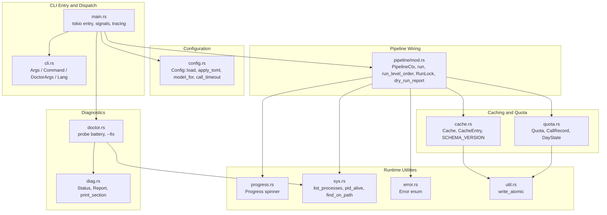
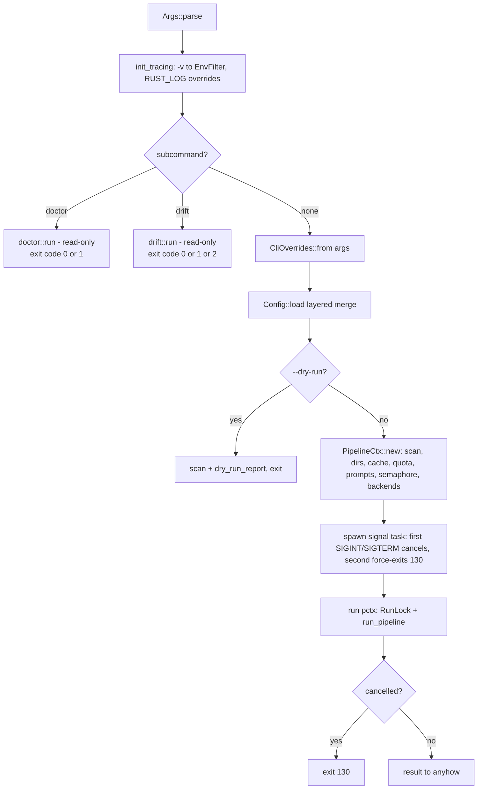

# CLI & Runtime Infrastructure — Module Deep-Dive

## 1. Purpose

The CLI & Runtime Infrastructure module is the cross-cutting foundation every agentwiki command runs on. It owns the process boundary — argument parsing, configuration resolution, and subcommand dispatch — and assembles the shared `PipelineCtx` that the agent DAG, backend adapters, and output stages consume. Its responsibilities:

- **CLI parsing & dispatch** (`main.rs`, `cli.rs`): clap-derived argument surface, routing of `doctor` / `drift` subcommands vs. the default generation run, tracing initialization, and signal handling.
- **Layered configuration** (`config.rs`): a five-layer merge (defaults → global TOML → project TOML → profile → CLI overrides) with model-tier selection and PATH auto-detection.
- **Pipeline wiring** (`pipeline/mod.rs`): the `PipelineCtx` shared context, per-level parallel spec execution, run-lock mutual exclusion, and cancellation plumbing.
- **Cost controls** (`cache.rs`, `quota.rs`): content-hash result caching and a daily call cap with an append-only audit log.
- **Diagnostics** (`doctor.rs`, `diag.rs`): a read-only health-check battery and shared severity-tagged report primitives.
- **Runtime utilities** (`progress.rs`, `sys.rs`, `error.rs`, `util.rs`): progress display, dependency-free process/PATH introspection, the unified `thiserror` error enum, and atomic file writes.

The module is deliberately boring: everything here is deterministic, synchronous-friendly infrastructure that keeps the probabilistic parts (LLM agents) testable, auditable, and safe to rerun.

## 2. Internal Structure



### Sub-module breakdown

| Sub-module | Files | Responsibility |
|---|---|---|
| CLI Entry & Dispatch | `src/main.rs`, `src/cli.rs` | clap `Args`/`Command` surface, tracing init from `-v` count, signal → `CancellationToken` wiring, exit-code mapping |
| Configuration Management | `src/config.rs` | `Config` schema, `TomlConfig` partial-merge layer, profile resolution, model tiers, timeouts |
| Pipeline Context | `src/pipeline/mod.rs` | `PipelineCtx` assembly, `RunLock`, level-ordered parallel execution, `RunStats`, `dry_run_report` |
| Caching & Quota | `src/cache.rs`, `src/quota.rs` | sha256-keyed result cache; daily cap in `state.json`; `calls.jsonl` audit log |
| Diagnostics | `src/doctor.rs`, `src/diag.rs` | `doctor` probe battery; `Status`/`Report` primitives shared with `drift` |
| Runtime Utilities | `src/progress.rs`, `src/sys.rs`, `src/error.rs`, `src/util.rs` | indicatif spinner, process table probes, error taxonomy, atomic writes |

## 3. Key Interfaces

### 3.1 `cli.rs` — argument surface

- `Args` (clap `Parser`): positional `PROFILE`, `-p/--project-path`, `-o/--output-path`, `-c/--config`, `--target-language`, `--model-efficient`, `--model-powerful`, `--max-parallels`, `--agentic`, `--no-cache`, `--force-regenerate`, `--skip-research`, `--skip-documentation`, `--dry-run`, and a global counted `-v`.
- `Command` (clap `Subcommand`): `Doctor(DoctorArgs)` and `Drift(crate::drift::DriftArgs)`. Subcommand names shadow profiles of the same name — `agentwiki drift` is the subcommand, never a profile.
- `From<&Args> for CliOverrides`: the single conversion point that flattens CLI state into the config-merge input.
- `Lang` (clap `ValueEnum`): eight documentation languages, converted to `config::TargetLanguage`, whose `instruction()` string is appended to every rendered prompt.

### 3.2 `config.rs` — `Config::load`

```rust
pub fn load(cli: &CliOverrides, config_path: Option<&Path>) -> Result<Config>
```

Merge order (lowest to highest precedence):

1. `Config::default()` — including `ModelsConfig` defaults from `BackendKind::Devin.default_models()` and `LimitsConfig` (`daily_cap: 300`, `call_timeout_s: 600`, `retry_attempts: 3`, `materials_char_cap: 192_000`, `code_insights_limit: 25`, `file_source_chars: 500`).
2. Global TOML — `$XDG_CONFIG_HOME/agentwiki/config.toml` falling back to `~/.config/agentwiki/config.toml`.
3. Project TOML — explicit `-c` path, else `<project>/agentwiki.toml`, else `./agentwiki.toml`.
4. Profile — `[profiles.<name>]` sections (project shadows global); absent positional arg means `default`. Bare backend names (`agentwiki claude`) resolve to built-in profiles selecting that CLI's default model pair; unknown names produce an error listing available profiles.
5. `CliOverrides` — flag-by-flag application.

Two post-merge fixups:

- **Model auto-detection**: `track_models` records which tiers any layer set explicitly; tiers left unset everywhere fall back to `BackendKind::detect()` (first CLI on PATH in preference order devin → codex → claude).
- **`internal_path` rebasing**: a relative `internal_path` (default `.agentwiki`) is joined onto `project_path`, keeping cache/state per-repo.

Supporting API: `Config::model_for(ModelTier) -> &str` maps `Efficient`/`Powerful` to the `"<backend>:<model>"` strings; `call_timeout() -> Duration` wraps `limits.call_timeout_s`.

### 3.3 `pipeline/mod.rs` — `PipelineCtx` and `run`

`PipelineCtx` is the shared, `Arc`-distributed context every spec instance receives:

| Field | Type | Purpose |
|---|---|---|
| `config` | `Config` | Resolved configuration |
| `scan` | `ScanData` | Phase-0 scanner output |
| `ctx` | `ResearchContext` | Shared agent result store |
| `cache` | `Cache` | Content-hash call cache |
| `quota` | `Quota` | Daily cap + audit log |
| `prompts` | `PromptLoader` | Template resolution |
| `semaphore` | `Semaphore` | Bounds concurrent CLI calls to `max_parallels` |
| `stats` | `Mutex<RunStats>` | `cache_hits`, `cli_calls`, `saved_secs`, per-spec timings |
| `empty_cwd` | `PathBuf` | Sanitized cwd for embedded-mode calls |
| `progress` | `Progress` | Terminal spinner |
| `cancel` | `CancellationToken` | Cooperative shutdown |
| `backends` | `HashMap<BackendKind, Arc<dyn AgentBackend>>` | Private; resolved via `backend(kind)` |

`PipelineCtx::new(config, backends)` scans the repo, creates `.agentwiki/` and `empty-cwd/`, and either uses injected backends (tests) or calls `default_backends` — which parses `models.efficient`/`models.powerful` via `BackendKind::parse` and constructs one adapter per referenced kind.

`run(&pctx)` acquires the `RunLock`, invokes `run_pipeline` (research → compose → `write_docs` → `verify` → `write_summary` → claims export), then settles the progress bar: `done()` on success, `cancel()` on `Error::Cancelled`, `fail(e)` otherwise.

`run_level_order` executes each topological level through a `JoinSet` with a `biased` `tokio::select!` racing `cancel.cancelled()`: on cancellation it calls `abort_all()` — dropping backend futures kills in-flight child CLIs via `kill_on_drop` — and bounds the drain with a 3-second timeout so a task stuck in a synchronous poll can't hang shutdown.

### 3.4 `cache.rs` — `Cache`

- `Cache::key(prompt, model, backend) -> String`: `sha256(prompt ‖ NUL ‖ model ‖ NUL ‖ backend ‖ NUL ‖ SCHEMA_VERSION)`, hex-encoded. `SCHEMA_VERSION = "2"` is baked into every key, so a prompt/schema-semantics change invalidates the whole cache by bumping one constant.
- `Cache::get(key) -> Option<CacheEntry>`: reads `.agentwiki/cache/<key>.json`; returns `None` when `disabled` (`--no-cache`) or `no_read` (`--force-regenerate`), and silently treats unreadable/corrupt entries as misses.
- `Cache::put(key, text, meta)`: serializes `CacheEntry { text, meta: { agent, backend, model, created_at, secs } }` and persists via `write_atomic`. `put` still writes under `--force-regenerate` so regeneration refreshes the cache; only `--no-cache` suppresses writes.
- `CacheStats { hits, misses, saved }`: bookkeeping for the summary report — `saved` sums the original call durations recorded in `CacheMeta`, so the report can quantify wall-time saved.

### 3.5 `quota.rs` — `Quota`

- `Quota::new(internal_dir, cap)`: roots `state.json` (a `DayState { date, count }`) and `calls.jsonl` under `.agentwiki/`.
- `consume() -> Result<()>`: reserves one call slot under a `tokio::Mutex`, so the check-and-increment is atomic across parallel agents and the cap can't be overrun. The day resets when the UTC date changes. Returns `Error::QuotaExceeded { cap }` when spent.
- `record(CallRecord)`: best-effort append of one JSONL audit line per real CLI call — timestamp, agent key (e.g. `dir_summary@src`), backend, model, prompt size, wall seconds, status (`ok`/`error`/`timeout`), and optional token usage. Logging failures are swallowed; audit must never fail the pipeline.
- `today_count() -> u32`: current day's count for the summary report.

### 3.6 `error.rs` — `Error`

Single `thiserror` enum for the whole library; the binary wraps it in `anyhow`. Variants carry structured context — `Io { path, source }` (via `Error::io(path, e)`), `Backend { backend, message, stderr_tail }`, `Parse`/`Validation { agent, message }`, `Timeout { agent, secs }`, `QuotaExceeded { cap }`, `AlreadyRunning { pid }`, `DepFailed { agent, dep }`, plus `Config`, `Prompt`, `BackendNotAvailable`, `Cancelled`, and the `Pipeline` catch-all. `Cancelled` is a first-class variant so the pipeline can distinguish user abort from real failure when settling the progress bar and exit code.

### 3.7 `util.rs` — `write_atomic`

Writes via `tempfile::NamedTempFile` in the target's own directory, then `persist()` (rename). A crash leaves either the old or the new content — never a torn file. Used by `Cache::put`, `Quota::consume`, `ResearchContext::save`, and the drift report writer. Same-directory placement guarantees the rename stays on one filesystem.

## 4. Control Flow

### 4.1 Dispatch in `main()`



Two deliberate asymmetries in dispatch:

- **`doctor`/`drift` are read-only**: they return early *before* the cancellation handler is installed and never take `run.lock`. `drift` scans the repo (it needs the file inventory) but writes only `drift.json` and an optional baseline — no pipeline state.
- **Signals are cooperative**: the spawned task waits for SIGINT/SIGTERM, calls `cancel.cancel()`, then waits for a *second* signal before `exit(130)`. This gives `run_level_order` time to abort in-flight tasks and drop child CLI processes cleanly. A pipeline that ends already-cancelled also exits 130 — the conventional SIGINT code — since the progress bar already reported the cancellation.

### 4.2 Per-level execution and the cost-control call path

```mermaid
sequenceDiagram
    participant U as User
    participant M as main.rs
    participant C as Config
    participant P as PipelineCtx
    participant S as JoinSet specs
    participant K as Cache
    participant Q as Quota
    participant B as Backend

    U->>M: agentwiki [profile] [flags]
    M->>C: load(CliOverrides, config_path)
    M->>P: new(config, backends)
    P->>P: scan, mkdir .agentwiki, Cache/Quota/Semaphore
    M->>P: run() — acquire_run_lock
    loop per topo level
        P->>S: spawn run_spec per spec
        S->>K: get(key(prompt, model, backend))
        alt cache hit
            K-->>S: CacheEntry (stats.cache_hit)
        else miss
            S->>Q: consume() under Mutex
            Q-->>S: ok or QuotaExceeded
            S->>B: AgentRequest via semaphore permit
            B-->>S: AgentResult
            S->>Q: record(CallRecord to calls.jsonl)
            S->>K: put(key, text, meta) via write_atomic
        end
    end
    P-->>M: Result; progress done/fail/cancel
```

### 4.3 `doctor` probe battery

`doctor::run` builds reports with the shared `diag::Report`/`Status` primitives (severities ordered `Info < Ok < Warn < Fail`, so `worst` is a `max` fold), prints each named section via `print_section`, and exits 1 iff any check fails. Probes include:

- **Config**: `Config::load` result, sources used, resolved profile/lang/mode; each `models.*` string validated through `BackendKind::parse`. A failed config falls back to defaults so the remaining checks still run.
- **CLIs**: `sys::find_on_path` per `BackendKind` plus a `--version` probe; missing CLIs are `Fail` only when required by the configured models, `Info` otherwise.
- **State**: `run.lock` (live pid vs. stale), `state.json` quota usage, cache directory, saved `research.json`, `calls.jsonl`, leftover temp files, and writability of `.agentwiki/`.
- **Processes**: `sys::list_processes()` filtered through `agent_name` to surface running/orphaned agent processes.
- **`--fix`**: removes stale locks and temp files, recorded via `Report::fixed`.

## 5. Notable Implementation Decisions

- **Read-only subcommands bypass the lock and signal handler.** `doctor` and `drift` return before `PipelineCtx` exists, so they are safe to run while a generation run is active — `drift` in CI never blocks on `run.lock`.
- **Pid-based stale-lock reclaim.** `acquire_run_lock` uses `create_new` for atomicity; on `AlreadyExists` it reads the pid and calls `sys::pid_alive`. A dead pid or unreadable/truncated lock file is reclaimed (one retry), a live pid fails fast with `Error::AlreadyRunning { pid }`. The `RunLock` guard deletes the file on `Drop`, so normal exits never leave stale locks.
- **Schema-versioned cache keys.** `SCHEMA_VERSION` inside the sha256 input means cache invalidation is a constant bump, not a directory purge — old entries simply become unreachable.
- **Mutex-guarded quota reservation.** `consume()` holds the `tokio::Mutex` across the read-check-increment-write sequence, so `max_parallels` concurrent agents can't collectively overrun `daily_cap`. `record()` reuses the same mutex for serialized JSONL appends.
- **Cancellation by dropping futures.** No explicit kill protocol: `abort_all()` on the `JoinSet` drops each `run_spec` future, which drops the backend's `tokio::process::Child`, which `kill_on_drop(true)` converts into a child-process kill. The 3-second drain bound prevents a sync-stuck task from hanging shutdown.
- **Dependency-free process introspection.** `sys.rs` shells out to `ps -eo pid=,etime=,args=` (with a no-`etime` fallback for portability) on unix and `tasklist /FO CSV /NH` on Windows rather than taking a `sysinfo`-style dependency. `agent_name` matches argv\[0] basenames (lowercased, `.exe` stripped) and argv\[1] when argv\[0] is a known interpreter (`node`, `bun`, `deno`, `python`, `sh`, `bash`, `zsh`, `env`) — catching a node-installed `codex` while avoiding false positives like `vim devin.md`.
- **Hidden-when-piped progress.** `Progress` picks `ProgressDrawTarget::hidden()` when stderr isn't a TTY, so CI logs stay clean with no caller-side checks. The bar's message is the live set of in-flight instance keys, truncated to one line with a `… +N` suffix.
- **Atomic writes everywhere state matters.** `write_atomic` (tempfile-in-same-dir + rename) underpins the cache, quota state, research snapshots, and drift report — a crash mid-write can never produce a corrupt JSON that poisons the next run.
- **`internal_path` rebasing.** Because `.agentwiki` is resolved against `project_path` after merging, cache/quota/lock state is per-repository even when agentwiki is invoked from a different cwd.

## 6. Associated Files

| File | Role |
|---|---|
| `src/main.rs` | tokio entry point, subcommand dispatch, signal task, tracing init |
| `src/cli.rs` | `Args`, `Command`, `DoctorArgs`, `Lang`, `CliOverrides` conversion |
| `src/config.rs` | `Config`, `TomlConfig` partials, `CliOverrides`, `ModelTier`, `Mode`, `TargetLanguage`, profile/builtin resolution |
| `src/pipeline/mod.rs` | `PipelineCtx`, `RunStats`, `RunLock`, `run`, `run_pipeline`, `run_level_order`, `dry_run_report` |
| `src/cache.rs` | `Cache`, `CacheEntry`, `CacheMeta`, `CacheStats`, `SCHEMA_VERSION` |
| `src/quota.rs` | `Quota`, `CallRecord`, `DayState`, `today`, `now_rfc3339` |
| `src/doctor.rs` | `doctor::run` probe battery, `probe_version`, `--fix` cleanup |
| `src/diag.rs` | `Status`, `Report`, `print_section` (shared with `drift`) |
| `src/progress.rs` | `Progress` spinner: `add_total`, `start`, `finish`, `done`, `fail`, `cancel` |
| `src/sys.rs` | `ProcInfo`, `list_processes`, `pid_alive`, `find_on_path`, `agent_name`, `AGENT_PROCS` |
| `src/error.rs` | `Error` enum, `Result` alias, `Error::io` |
| `src/util.rs` | `write_atomic` |
| `src/lib.rs` | Crate root re-exports (`PipelineCtx`, `run`, `dry_run_report`, module declarations) |