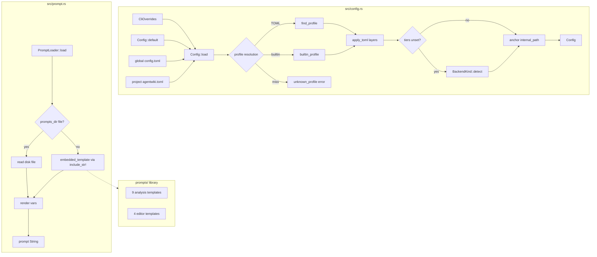
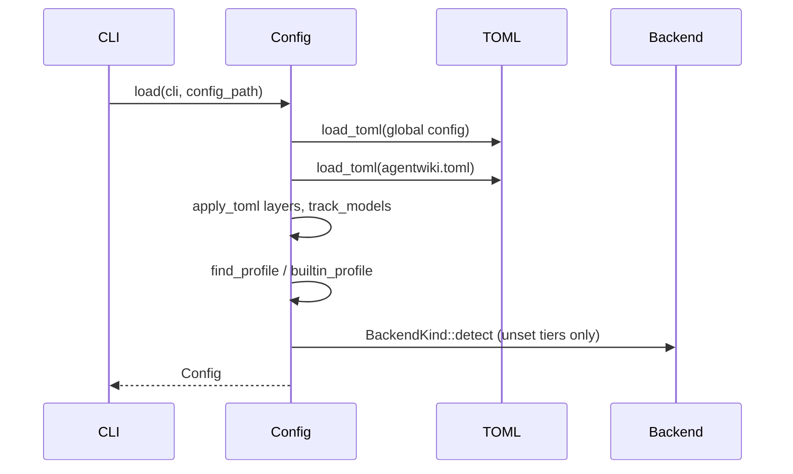

# Configuration & Prompt Management — Module Deep Dive

## 1. Purpose

This module is the infrastructure layer that every other domain depends on before doing real work. It answers two questions:

1. **How is agentwiki configured?** — `src/config.rs` resolves a fully-materialized `Config` from a layered precedence chain (built-in defaults → global TOML → project `agentwiki.toml` → named profile → CLI overrides), including named backend profiles, per-tier model resolution, and PATH-based auto-detection for unconfigured model tiers.
2. **Where do prompts come from?** — `src/prompt.rs` plus the `prompts/` asset library provide a `{{key}}` template engine with disk-override-over-embedded loading, so the shipped binary is self-contained yet fully customizable.

Nothing in this module calls an LLM or performs pipeline work; it produces the values (`Config`, prompt strings) that the orchestrator, runner, backends, and drift engine consume.

## 2. Internal Structure

### `src/config.rs` — Config Resolution

**Core types** (`src/config.rs`):

| Type | Role |
|---|---|
| `Config` | Fully-resolved runtime config: paths, language, parallelism, mode, skip flags, and the `models` / `limits` / `scan` / `verify` / `drift` sections. |
| `TomlConfig` | Private all-optional mirror of `Config`; one struct serves both top-level files and `[profiles.<name>]` entries (their nested `profiles` key is ignored). |
| `ModelsConfig`, `LimitsConfig`, `ScanConfig`, `VerifyConfig` | Section structs with concrete defaults; each has a `*Partial` TOML mirror (`ModelsPartial`, `LimitsPartial`, `ScanPartial`, `VerifyPartial`) where every field is `Option`. `DriftConfig`/`DriftPartial` live in `crate::drift::config`. |
| `CliOverrides` | Flattened clap arguments: positional `profile`, `-p`/`-o` paths, `--model-*`, `--max-parallels`, boolean switches (`--agentic`, `--no-cache`, `--force-regenerate`, `--incremental`, `--full`, `--skip-research`, `--skip-documentation`). |
| `Mode` | `Embedded` (default; prompts carry code materials, agent runs in an empty cwd) vs. `Agentic` (agent runs at project root and reads files itself). |
| `TargetLanguage` | Eight languages (`En` default, `Zh`, `Ja`, `Ko`, `De`, `Fr`, `Ru`, `Vi`); `instruction()` returns the per-language sentence appended to every prompt — e.g. `"Write all prose in Vietnamese. JSON keys stay in English."` |
| `ModelTier` | `Efficient` (routine fan-out tasks) vs. `Powerful` (complex schemas, retry fallback). |

**Key functions:**

- `Config::load(cli: &CliOverrides, config_path: Option<&Path>) -> Result<Config>` — single entry point, called once during CLI setup.
- `apply_toml(&mut self, t: &TomlConfig)` — field-wise partial overlay: only `Some` fields are copied, so each layer is a sparse patch over the accumulator.
- `track_models(t, &mut [bool; 2])` — records which tiers (`efficient`, `powerful`) a given layer explicitly set.
- `find_profile(name, project, global)` — project TOML `[profiles.<name>]` shadows global.
- `builtin_profile(name)` — `default` returns a no-op layer; bare backend names (`devin`, `claude`, `codex`) resolve via `BackendKind::parse` to that CLI's default model pair; `mock`/`test` are deliberately excluded.
- `unknown_profile(name, ...)` — builds `Error::Config` listing all available profiles (built-ins + TOML-defined).
- `global_config_path()` — `$XDG_CONFIG_HOME/agentwiki/config.toml`, falling back to `~/.config/agentwiki/config.toml`.

**Accessors:** `model_for(ModelTier) -> &str` (the `"<backend>:<model>"` string backend spawners parse), `call_timeout() -> Duration`, `global_config_file()`.

### `src/prompt.rs` — Prompt Engine

Deliberately tiny (88 lines):

- `render(template, &HashMap<&str, String>)` — naive `str::replace` per variable. Unknown `{{key}}` placeholders are **left in place**, which is a feature: JSON examples inside templates (`{{"a": 1}}`-style braces) survive rendering untouched. Cost is O(vars × template size), acceptable at template sizes.
- `embedded!` macro — generates `embedded_template(name) -> Option<&'static str>`, a `match` over 13 names mapping to `include_str!` assets under `prompts/`.
- `PromptLoader::new(Option<PathBuf>)` / `load(name)` — prefers `config.prompts_dir/<name>` on disk; falls back to the embedded copy; returns `Error::Prompt { name, "unknown template" }` when neither exists.

### `prompts/` — Template Library

13 Markdown assets in two groups:

- **Analysis personas (9):** `system_context.md`, `domain_modules.md`, `boundary.md`, `workflow.md`, `database.md`, `relationships.md`, `dir_summary.md`, `key_module.md`, `architecture.md`. These define analyst personas that emit strict JSON (required fields spelled out, rules like "system_boundary must be a JSON OBJECT, NOT a string" to counter LLM stringification habits).
- **Editor personas (4):** `editors/overview.md`, `editors/architecture_doc.md`, `editors/workflow_doc.md`, `editors/deep_dive.md`. These produce the final C4 documents and all embed the same Mermaid safety rules (ASCII-only node IDs, strict parser validity, standard headers only).

All templates expose injection points: `{{materials}}` for scan/research content, `{{custom}}` for user-supplied additions, plus `{{language_instruction}}` / `{{agentic_note}}` in editor templates — the wiring between `TargetLanguage`/`Mode` config values and prompt content.

## 3. Layered Merge Semantics

Merge order, lowest to highest precedence:

1. `Config::default()` — `ModelsConfig` defaults seed from `BackendKind::Devin.default_models()`.
2. Global `config.toml`.
3. Project `agentwiki.toml` — looked up next to `cli.project_path` first, then the cwd; an explicit `config_path` argument wins.
4. Profile layer — `cli.profile` defaults to `"default"`. Resolution: project `[profiles.<name>]` → global `[profiles.<name>]` → built-ins. Unknown names fail fast with an enumerated error.
5. CLI overrides — boolean flags are **OR-ed** in (`|=`), never cleared except `--full` which explicitly resets `incremental`; `max_parallels` is clamped `>= 1` (also clamped in `apply_toml`).
6. PATH auto-detection — only tiers still unset (tracked via `models_set: [bool; 2]`, where CLI model flags also count as explicit) get filled by `BackendKind::detect()` in devin → codex → claude order.
7. Post-processing — a relative `internal_path` is anchored to `project_path`, keeping `.agentwiki/` state per-repo.

## 4. Notable Implementation Decisions

- **Partial-overlay merging.** Rather than serde-flattening layered structs, every TOML field is `Option` and `apply_toml` copies only `Some` values. This makes "unset" distinguishable from "set to the default value" — critical for the model-tier tracking that gates auto-detection.
- **Explicit-tier tracking (`[bool; 2]`).** Auto-detection would otherwise silently overwrite user intent or, conversely, run when the user had no agent CLIs configured. Tracking per-tier (not per-section) lets a user set only `powerful` and still get `efficient` auto-detected.
- **Profiles as `TomlConfig`.** Profiles reuse the same partial-overlay type, so a profile can touch any field — models, mode, skip flags — not just model names. Built-in backend profiles (`agentwiki claude`) are synthesized as a `TomlConfig` containing only a `ModelsPartial`, and TOML profiles shadow built-ins of the same name.
- **No-op `default` built-in.** `agentwiki default` works on a fresh machine with no config files; it resolves to an empty layer rather than erroring.
- **Lenient `render`.** Substitution is dumb `str::replace` and unmatched `{{…}}` survives — essential because the templates themselves contain JSON schema examples with double braces.
- **Self-contained binary, overridable assets.** `include_str!` bakes all 13 templates into the binary; `prompts_dir` lets users override any subset on disk per-project without forking. Missing both produces a named `Error::Prompt`, not a panic.
- **Config types serialize.** `Config` and its sections derive `Serialize`, enabling state dumps (e.g. into `.agentwiki/` snapshots).

## 5. Error Surface

- `Error::Config` — TOML parse failures (path-prefixed), unknown profile (with enumerated alternatives).
- `Error::Prompt { name, message }` — unknown template name.
- `Error::io(path, e)` — unreadable TOML or disk-override prompt files.
- A missing agent CLI is *not* a config error: detection failure leaves the devin defaults, and the backend spawn fails at run time with a clearer message.

## 6. Consumers

| Consumer | Uses |
|---|---|
| `main`/`cli` | `Config::load`, `CliOverrides` construction |
| Backend spawners (`src/backend/`) | `model_for(ModelTier)` → `"<backend>:<model>"` parsing; `call_timeout()` |
| Pipeline & runner (`src/pipeline/`, `src/agent/`) | `mode`, `max_parallels`, `limits.*` caps, skip flags, `incremental`; `PromptLoader` + `render` for prompt assembly with `{{materials}}`/`{{custom}}`/`{{language_instruction}}` |
| Scanner | `scan.*` (depth, size, git-tracked, exclusion lists) |
| Output/verify | `verify.mermaid_fixer`, `output_path`, `target_language` |
| Drift engine | `drift` section |
| Governance (`cache.rs`, `quota.rs`, `manifest.rs`) | `internal_path`, `limits.daily_cap`, `no_cache`/`force_regenerate` |

## 7. Associated Files

- `src/config.rs` — layered resolver, all config types, merge helpers, precedence/profile/detection tests.
- `src/prompt.rs` — `render`, `embedded!` table, `PromptLoader`, placeholder-preservation test.
- `prompts/*.md` — 9 analysis templates.
- `prompts/editors/*.md` — 4 editor templates.
- Related by dependency: `src/backend/mod.rs` (`BackendKind::parse`/`detect`/`default_models`), `src/error.rs` (`Error::Config`/`Prompt`/`io`), `src/drift/config.rs` (`DriftConfig`/`DriftPartial`).