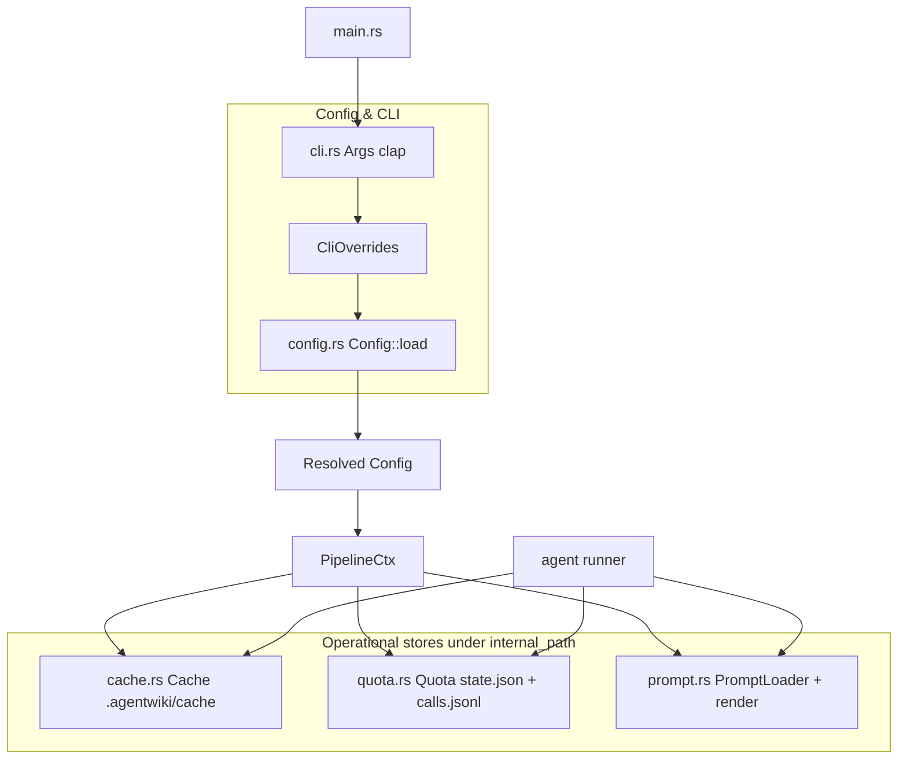
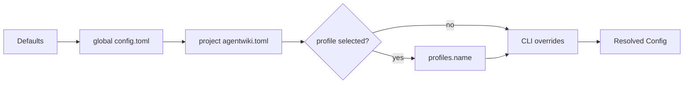
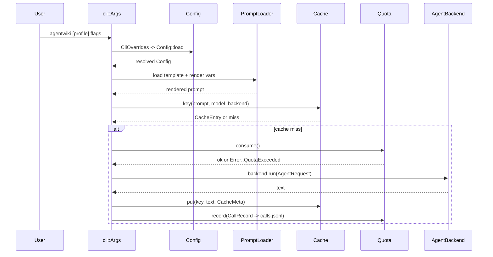

# Deep Dive: Configuration, Cache & Quota Management

**Module**: `src/config.rs`, `src/cli.rs`, `src/cache.rs`, `src/quota.rs`, `src/prompt.rs`
**Domain type**: Supporting / operational cross-cutting infrastructure

## 1. Purpose

This bounded context provides the operational backbone of agentwiki. Its job is to make expensive LLM-via-CLI calls predictable, auditable, and cheap to repeat:

- **Configuration & CLI** — resolve a fully-merged `Config` from layered sources (defaults → global TOML → project TOML → named profile → CLI overrides), plus parse command-line arguments via clap.
- **Content cache** — a content-addressed, on-disk cache keyed by `sha256(prompt ‖ model ‖ backend ‖ SCHEMA_VERSION)` so re-runs never re-pay for identical agent calls.
- **Quota & audit** — a per-day call counter (`state.json`) enforcing `daily_cap`, plus an append-only `calls.jsonl` audit log recording every real CLI invocation.
- **Prompt loading & rendering** — `PromptLoader` resolves templates from a disk override directory first, falling back to `include_str!`-embedded copies so the binary is self-contained; `render` performs `{{key}}` placeholder substitution.

The design intent aligns with the project's core constraint — *no paid LLM API usage*. Three layers of cost protection live here (cache hits skip calls entirely, `daily_cap` hard-stops spend, and `--dry-run` plus `no_cache`/`force_regenerate` flags give operators control), complemented by `sanitized_env` in the backend layer.

## 2. Internal Structure

All four components hang off `Config.internal_path` (default `.agentwiki/`, anchored under `project_path` when relative). They share `crate::error::{Error, Result}` and `crate::util::write_atomic` for crash-safe file writes.

## 3. Configuration & CLI (`config.rs`, `cli.rs`)

### 3.1 Merge pipeline

`Config::load(&CliOverrides, config_path)` applies layers in strict precedence order — later layers win:

1. **Defaults** — `Config::default()` (see table below).
2. **Global TOML** — `$XDG_CONFIG_HOME/agentwiki/config.toml`, falling back to `~/.config/agentwiki/config.toml` (`global_config_path`).
3. **Project TOML** — explicit `-c` path, else `<project_path>/agentwiki.toml`, else `./agentwiki.toml`.
4. **Named profile** — positional `agentwiki <profile>` selects `[profiles.<name>]`; project profiles shadow global ones. An unknown name returns `Error::Config` listing all available profiles.
5. **CLI overrides** — `-p`, `-o`, `--model-efficient`, `--max-parallels` (clamped to ≥1), `--target-language`, `--agentic`, and OR-ed boolean flags (`no_cache`, `force_regenerate`, `skip_research`, `skip_documentation`).

### 3.2 Key types

| Type | Role |
|---|---|
| `Config` | Fully-resolved runtime config: paths, `models`, `limits`, `scan`, `verify`, `mode`, `target_language`, `max_parallels`, `profile` |
| `TomlConfig` + `*Partial` structs | All-`Option` serde mirror; `#[serde(default)]` lets every field merge over existing values in `apply_toml` |
| `CliOverrides` | Flattened, TOML-independent representation of CLI args |
| `Mode` | `Embedded` (default — materials baked into prompts) vs `Agentic` (agent reads the repo itself) |
| `TargetLanguage` | 8 languages; `instruction()` returns the per-prompt prose directive ("Write all prose in X. JSON keys stay in English.") |
| `ModelTier` | `Efficient` / `Powerful`; `Config::model_for(tier)` maps to `<backend>:<model>` strings |
| `cli::Args` | clap `Parser` struct; `From<&Args> for CliOverrides` converts; `Lang` is a clap `ValueEnum` mirrored onto `TargetLanguage` |

**Key functions**: `Config::load`, `apply_toml`, `model_for`, `call_timeout()` (→ `Duration`), `global_config_file`, `global_config_path`, `load_toml`.

### 3.3 Defaults

| Field | Default |
|---|---|
| `models.efficient` / `powerful` | `devin:swe-2-medium` |
| `limits.daily_cap` | 300 calls/day |
| `limits.call_timeout_s` | 600 s |
| `limits.retry_attempts` | 3 |
| `limits.materials_char_cap` | 192,000 |
| `limits.code_insights_limit` | 25 |
| `limits.file_source_chars` | 500 |
| `max_parallels` | 2 |
| `output_path` | `./agentwiki.docs` |
| `internal_path` | `.agentwiki` (anchored to `project_path`) |
| `scan.git_tracked_only` | `true` |
| `verify.mermaid_fixer` | `true` |

## 4. Content Cache (`cache.rs`)

A filesystem cache rooted at `<internal>/cache/` mapping one JSON file per call.

- **Key**: `Cache::key(prompt, model, backend)` → hex `sha256` over `prompt \x00 model \x00 backend \x00 SCHEMA_VERSION`. The NUL separators prevent field-boundary ambiguity; `SCHEMA_VERSION = "1"` is baked into every key, so bumping it atomically invalidates the entire cache when prompt or schema semantics change.
- **Entry**: `CacheEntry { text, meta }` where `CacheMeta` records provenance — agent name, backend, model, `created_at` (RFC3339 UTC), and original call duration `secs`.
- **Modes**: `disabled` (`--no-cache`) skips reads *and* writes; `no_read` (`--force-regenerate`) skips reads but still writes fresh results, keeping the cache warm.
- **Write safety**: `put` uses `write_atomic` (write-temp-then-rename) so a crash mid-write cannot leave a corrupt entry; `get` treats unreadable or unparseable files as misses (`ok()?` chains).
- **Stats**: `CacheStats { hits, misses, saved }` aggregates hit/miss counts and wall-time saved for the summary report.

## 5. Quota & Audit (`quota.rs`)

Two artifacts under `<internal>/`:

| File | Content |
|---|---|
| `state.json` | `DayState { date: "YYYY-MM-DD", count }` — rewritten atomically on every consumed call |
| `calls.jsonl` | One `CallRecord` JSON line per real CLI call: `ts` (RFC3339), `agent`, `backend`, `model`, `prompt_chars`, `secs`, `status` (`ok`/`error`/`timeout`) |

**Concurrency**: a `tokio::sync::Mutex<()>` serializes the check-and-increment in `consume()`, so parallel agent instances (bounded by the pipeline `Semaphore`) cannot race past `daily_cap`.

**Semantics of `consume()`**:
1. Read `state.json`; if `state.date != today()` (UTC), reset to a fresh day.
2. If `count >= cap` → `Err(Error::QuotaExceeded { cap })` — fail-fast before any subprocess spawn.
3. Otherwise increment and persist via `write_atomic`.

`record()` is **best-effort** — every IO/serialization error is swallowed so audit logging can never break the pipeline. `today_count()` feeds the summary report's "quota used / cap" line. The day boundary is **UTC**, not local time. Helpers `today()` and `now_rfc3339()` (via `time::OffsetDateTime`) are shared with the output/summary layer.

## 6. Prompt Loading & Rendering (`prompt.rs`)

- **`PromptLoader::load(name)`** — takes a relative template name (`"system_context.md"`, `"editors/deep_dive.md"`). If `config.prompts_dir` is set and contains the file, the disk copy wins (edit prompts without rebuilding); otherwise `embedded_template(name)` resolves an `include_str!`-compiled copy via the `embedded!` macro — a static match over 13 templates (9 research + 4 editors). Unknown names return `Error::Prompt`.
- **`render(template, &HashMap<&str, String>)`** — plain `String::replace` of `{{key}}` placeholders. **Unknown placeholders are preserved verbatim**, which is deliberate: templates contain literal JSON examples whose braces would otherwise be destroyed. No escaping, conditionals, or loops — sufficient for single-shot prompts.

Placeholders used across the template inventory: `{{custom}}`, `{{materials}}`, `{{language_instruction}}`, `{{schema_block}}`, `{{agentic_note}}` — all filled by the runner/materials layer.

## 7. Data & Control Flow

The typical per-call path through this module (driven by the agent runner):

Cache lookup always precedes quota consumption — a cache hit costs nothing. `CallRecord` is only written for *real* CLI calls, so `calls.jsonl` is a faithful audit of spend.

## 8. Notable Implementation Decisions

- **Layered merge via partial structs**: `TomlConfig`/`*Partial` use `#[serde(default)]` so every TOML field is optional and `apply_toml` only overwrites set fields — profiles reuse the same `TomlConfig` shape, getting profile support nearly for free.
- **Schema version in the cache key**: bumping `SCHEMA_VERSION` is the only cache-invalidation mechanism — simple, total, and avoids TTL/eviction complexity.
- **Mutex-guarded quota**: check+increment under `tokio::Mutex` guarantees the cap holds even when the pipeline spawns parallel agent instances.
- **Best-effort audit**: `record()` swallows all errors — observability must never be a failure mode.
- **UTC day boundary**: deterministic and timezone-independent; documented gap vs. local-time expectations.
- **Embedded template fallback**: `include_str!` makes the binary self-contained while `prompts_dir` allows runtime customization — the same template name resolves both ways.
- **Deliberately naive templating**: preserving unknown `{{...}}` placeholders lets JSON examples live inside templates without escaping.
- **OR-ed boolean CLI flags**: `--no-cache` etc. can only enable, never disable — if TOML sets `no_cache = true`, no CLI flag can turn it back off.
- **Relative `internal_path` anchoring**: resolved against `project_path` after merging, so cache/quota state is naturally per-repository.

## 9. Known Gaps

- No cache eviction/TTL — the cache directory grows monotonically until `SCHEMA_VERSION` bumps.
- `calls.jsonl` has no rotation.
- Quota counts by UTC day only.
- Boolean flags cannot be re-disabled from the CLI once a TOML layer enables them.

## 10. Associated Files

| File | Role |
|---|---|
| `src/cli.rs` | clap `Args`, `Lang` enum, `From<&Args> for CliOverrides` |
| `src/config.rs` | `Config`, `TomlConfig` + partials, `CliOverrides`, `Config::load`/`apply_toml`/`model_for`/`call_timeout`, defaults |
| `src/cache.rs` | `Cache`, `CacheEntry`, `CacheMeta`, `CacheStats`, `SCHEMA_VERSION` |
| `src/quota.rs` | `Quota`, `DayState`, `CallRecord`, `today()`, `now_rfc3339()` |
| `src/prompt.rs` | `PromptLoader`, `render`, `embedded!` macro, `embedded_template` |
| `prompts/*.md`, `prompts/editors/*.md` | 13 embedded template bodies resolved by `PromptLoader` |
| `src/util.rs` | `write_atomic` used by cache writes and quota state |
| `src/error.rs` | `Error::{Config, Prompt, QuotaExceeded, io, Pipeline}` |

**Consumers**: `src/main.rs` (parse + `Config::load`), `src/pipeline/mod.rs` (`PipelineCtx` owns `Cache`, `Quota`, `PromptLoader`), `src/agent/runner.rs` (per-instance `cache.get`/`quota.consume`/`backend.run`/`record` loop), `src/output/summary.rs` (`today_count`, `CacheStats`).