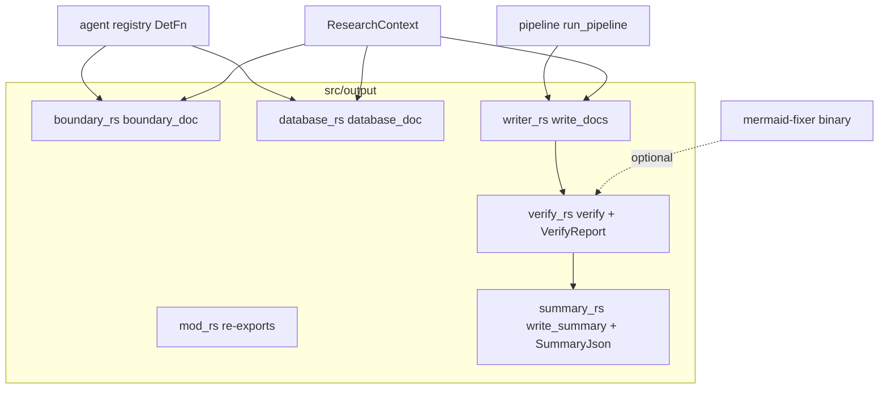
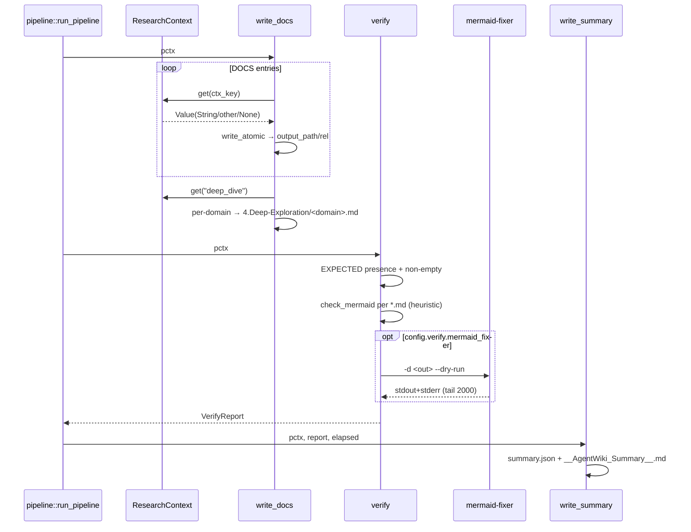

# Module Deep-Dive: Document Export & Verification (`src/output/`)

## 1. Purpose

The `output` module is the terminal stage of the agentwiki pipeline. After the Research and Compose phases have populated the shared `ResearchContext` with structured reports and rendered Markdown, this module:

1. **Renders deterministic documents** — converts the structured `BoundaryAnalysisReport` and `DatabaseOverviewReport` JSON into Markdown without any LLM involvement (`boundary.rs`, `database.rs`).
2. **Writes the document tree** — materializes the context contents onto disk under `output_path` following a fixed ctx-key → path mapping (`writer.rs`).
3. **Verifies post-write** — checks expected files exist and are non-empty, and validates Mermaid diagrams via a built-in heuristic plus the optional external `mermaid-fixer` binary (`verify.rs`).
4. **Produces a run summary** — a human-readable `__AgentWiki_Summary__.md` next to the docs and a machine-readable `summary.json` in the internal `.agentwiki/` dir (`summary.rs`).

A deliberate design choice: boundary and database docs are rendered **deterministically** (registered as `ExecKind::Deterministic` DetFns in the agent registry) rather than by an editor agent. This saves two LLM calls per run and guarantees formatting consistency — the LLM only produces the structured research JSON; Rust owns the prose layout.

## 2. Internal Structure



| File | Role | Key items |
|---|---|---|
| `mod.rs` | Facade | Re-exports `boundary_doc`, `database_doc`, `write_docs`, `verify`/`VerifyReport`, `write_summary` |
| `writer.rs` | Doc-tree writer | `write_docs`, `write_file`, `sanitize_filename`, `DOCS` table |
| `boundary.rs` | Boundary renderer | `boundary_doc`, `cli_section`, `api_section`, `router_section`, `integration_section` |
| `database.rs` | Database renderer | `database_doc`, `project/table/view/proc/func/flow` helpers, `mermaid_id` |
| `verify.rs` | Post-write verifier | `verify`, `VerifyReport`, `md_files`, `check_mermaid`, `run_mermaid_fixer`, `EXPECTED`, `MERMAID_HEADERS` |
| `summary.rs` | Summary reporter | `write_summary`, `SummaryJson` |

## 3. Key Interfaces

### `write_docs(pctx: &PipelineCtx) -> Result<Vec<PathBuf>>` (async)

Drives document materialization. Iterates the static `DOCS` mapping:

```rust
const DOCS: &[(&str, &str)] = &[
    ("overview",         "1.Overview.md"),
    ("architecture_doc", "2.Architecture.md"),
    ("workflow_doc",     "3.Workflow.md"),
    ("boundary_doc",     "5.Boundary-Interfaces.md"),
    ("database_doc",     "6.Database-Overview.md"),
];
```

For each key it pulls the value from `pctx.ctx` (`ResearchContext`). `Value::String` is written verbatim; any other JSON value is pretty-serialized as a fallback; a missing key only logs a `warn` — it does not fail the run. The `deep_dive` ctx key is special-cased: it is a `Value::Object` keyed by domain name, and each entry becomes `4.Deep-Exploration/<Domain>.md` after `sanitize_filename` maps filesystem-hostile characters (`/\:*?"<>|`) to `-`.

All files go through `crate::util::write_atomic` after `create_dir_all`, so a crash mid-write cannot leave a truncated doc.

### `boundary_doc` / `database_doc` — `DetFn` signature

```rust
fn boundary_doc(_scan: &ScanData, _config: &Config, dep: &serde_json::Value) -> Result<String>
fn database_doc(_scan: &ScanData, _config: &Config, dep: &serde_json::Value) -> Result<String>
```

Both clone the dependency `Value` (the raw `boundary` / `database` research result stored in ctx) and `serde_json::from_value` it into `BoundaryAnalysisReport` / `DatabaseOverviewReport`. Deserialization failure maps to `Error::Parse` tagged with the renderer name as `agent`. Markdown is built by string concatenation via `std::fmt::Write` (`writeln!`/`write!`), with each section emitted only when its report list is non-empty.

- `boundary_doc` emits: header → `cli_section` (command, args, options with short names/defaults/required flags, bash examples) → `api_section` (method+endpoint, request/response format, auth) → `router_section` (path + params) → `integration_section` → `Analysis Confidence: x/10` footer.
- `database_doc` emits: a counts summary table → per-project/table/view/procedure/function blocks (tables get a full column matrix: name, type, nullable, identity, default, plus PK and source path) → an `erDiagram` Mermaid block + relationship table → data-flow blocks → confidence footer.

`mermaid_id` sanitizes schema/table names into ASCII-safe Mermaid node IDs (`[A-Za-z0-9_]`, everything else → `_`) — this is how the deterministic renderers comply with the project's Mermaid safety rules.

### `verify(pctx) -> Result<VerifyReport>` (async)

```rust
pub struct VerifyReport {
    pub missing: Vec<String>,
    pub empty: Vec<String>,
    pub mermaid_blocks: usize,
    pub mermaid_issues: Vec<String>,
    pub fixer_available: bool,
    pub fixer_output: String,
}
```

Three checks:

1. **Integrity** — every entry in `EXPECTED` (the five numbered docs) must exist and be non-empty; `4.Deep-Exploration/` must exist as a directory.
2. **Heuristic Mermaid pass** — `md_files` (recursive walkdir for `*.md`) feeds every file through `check_mermaid`, a small state machine over ` ```mermaid ` fenced blocks. It validates the first word of the body against a 21-entry `MERMAID_HEADERS` allow-list (`graph`, `flowchart`, `sequencediagram`, `erdiagram`, `c4context`, `block-beta`, …), requires ≥2 body lines, and reports unterminated blocks.
3. **External fixer (optional)** — when `config.verify.mermaid_fixer` is enabled, `run_mermaid_fixer` spawns `mermaid-fixer -d <out> --dry-run`, concatenates stdout+stderr, and keeps the last 2000 chars via `backend::tail`. `None` when the binary is absent — a soft dependency.

Critically, **verify never fails the pipeline**: all findings are collected into `VerifyReport` and logged as warnings.

### `write_summary(pctx, &VerifyReport, Duration) -> Result<()>` (async)

Reads `pctx.stats` (cli_calls, cache_hits, spec timings), `pctx.quota.today_count()`, and `config.limits.daily_cap`. Emits:

- `<internal>/summary.json` — serialized `SummaryJson` (timestamp RFC3339 via `quota::now_rfc3339`, project root, output dir, total secs, call/cache/quota counters, spec timings, embedded `VerifyReport`).
- `<output>/__AgentWiki_Summary__.md` — human-readable equivalent with a Mermaid-issues section and a spec-timings table.

Note: summary files use plain `std::fs::write`, not `write_atomic` — a minor inconsistency versus the doc writer.

## 4. Control Flow



The renderers run earlier, inside the Compose DAG: the registry registers `boundary_doc`/`database_doc` as `ExecKind::Deterministic` specs whose result is inserted into ctx under `boundary_doc`/`database_doc` — the same keys `write_docs` later reads. So `output` code executes at two different pipeline moments: renderers during Compose, writer/verify/summary after Compose.

## 5. Notable Implementation Decisions

- **Deterministic over LLM for structured docs**: boundary/database Markdown is pure string formatting of validated reports — zero quota cost, reproducible layout, and compile-time enforcement of section structure.
- **Fail-soft everywhere**: missing ctx keys warn rather than error; verify collects issues instead of failing; `serde_json::to_string_pretty` is a fallback for non-string ctx values. The pipeline prefers a partially complete doc tree over aborting after expensive LLM work.
- **Layered Mermaid validation**: prompts embed Mermaid safety rules (prevention), `mermaid_id` sanitizes generated IDs (construction), `check_mermaid` catches bad headers/empty/unterminated blocks (detection), and `mermaid-fixer` provides a real syntax pass when installed (verification). The external tool is a soft dependency — `Command::output().ok()?` degrades silently to heuristic-only.
- **Atomic writes for docs**: `write_atomic` guards the user-facing artifacts against torn writes; only summary files skip it.
- **`Sanitize` only filenames**: deep-dive names derive from LLM-produced domain names; `sanitize_filename` strips filesystem-illegal characters but does not dedupe collisions — two domains sanitizing to the same name would overwrite each other.

## 6. Associated Files

- `src/output/mod.rs` — module facade, 14 lines, pure re-exports.
- `src/output/writer.rs` — `write_docs`, `DOCS` mapping, `sanitize_filename`.
- `src/output/boundary.rs` — `boundary_doc` + section renderers for `BoundaryAnalysisReport`.
- `src/output/database.rs` — `database_doc` + per-object renderers, `erDiagram` emission, `mermaid_id`.
- `src/output/verify.rs` — `verify`, `VerifyReport`, `check_mermaid`, `run_mermaid_fixer`.
- `src/output/summary.rs` — `write_summary`, `SummaryJson`.
- Callers: `src/pipeline/mod.rs` (`run_pipeline` → `write_docs` → `verify` → `write_summary`); `src/agent/registry.rs` (registers the DetFns); `src/agent/reports/research.rs` (`BoundaryAnalysisReport`, `DatabaseOverviewReport` schemas); `src/util.rs` (`write_atomic`); `src/backend/mod.rs` (`tail`).