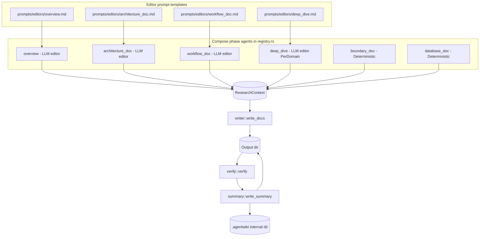
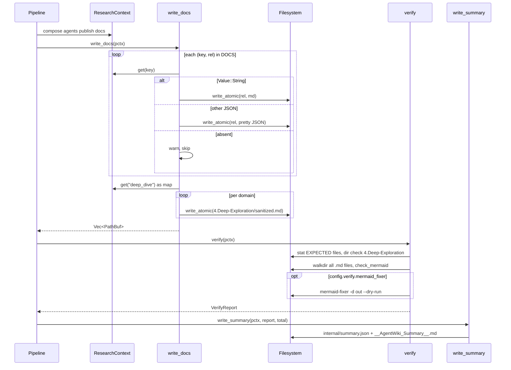

I'll quickly verify the module structure against the actual code before writing.# Documentation Composition & Output — Module Deep Dive

## 1. Purpose

The output module (`src/output`, plus the editor prompt assets under `prompts/editors/`) is the **Compose stage** of the agentwiki pipeline. It consumes the structured JSON research reports stored in the `ResearchContext` by the research-phase agent DAG and materializes them into the final C4-style Markdown document tree:

```
<output_dir>/
  1.Overview.md
  2.Architecture.md
  3.Workflow.md
  4.Deep-Exploration/<Domain>.md   (one file per detected domain)
  5.Boundary-Interfaces.md
  6.Database-Overview.md
  __AgentWiki_Summary__.md
<internal_dir>/summary.json
```

The module's defining architectural property is a **hybrid composition strategy**: only four of the six document types are produced by LLM-driven "editor" agents; the boundary and database documents are rendered by **pure, deterministic Rust functions** executed in-process. A post-write verification pass checks file integrity and Mermaid block syntax without ever failing the pipeline, and a summary writer emits human- and machine-readable run reports.

## 2. Internal Structure



### Files

| File | Role |
|---|---|
| `src/output/mod.rs` | Module root; re-exports `boundary_doc`, `database_doc`, `write_docs`, `write_summary`, `verify`, `VerifyReport`. |
| `src/output/boundary.rs` | Deterministic renderer: `BoundaryAnalysisReport` → `5.Boundary-Interfaces.md`. |
| `src/output/database.rs` | Deterministic renderer: `DatabaseOverviewReport` → `6.Database-Overview.md`. |
| `src/output/writer.rs` | Doc-tree writer: maps context keys → numbered output paths via the `DOCS` table; handles the `deep_dive` map. |
| `src/output/verify.rs` | Post-write integrity + Mermaid heuristic checks; optional `mermaid-fixer` subprocess. |
| `src/output/summary.rs` | Emits `summary.json` (internal) and `__AgentWiki_Summary__.md` (output dir). |
| `prompts/editors/*.md` | Four embedded prompt templates driving the LLM editor agents. |

## 3. Two Composition Strategies

### 3.1 LLM editor agents

`compose_specs()` in `src/agent/registry.rs` declares six compose-phase DAG nodes. Four are `ExecKind::Llm` agents whose prompts live under `prompts/editors/` and are resolved through `PromptLoader` (disk override via `config.prompts_dir`, fallback to `include_str!` embedded copies):

- `overview` → `editors/overview.md` (C4 SystemContext-level document)
- `architecture_doc` → `editors/architecture_doc.md`
- `workflow_doc` → `editors/workflow_doc.md`
- `deep_dive` → `editors/deep_dive.md`, fan-out `PerDomain` (one instance per domain from the `domain_modules` report; results aggregated into a `{domain: markdown}` map)

Each editor template embeds a shared Mermaid safety contract (ASCII-only node IDs, standard diagram headers, plain-text edge labels) and injects upstream research via `{{materials}}` / `{{custom}}` placeholders rendered by `src/prompt.rs`.

### 3.2 Deterministic renderers

`boundary_doc` and `database_doc` use `ExecKind::Deterministic(DetFn)` — pure functions with signature `(ScanData, Config, dep: serde_json::Value) -> Result<String>` that run inside `run_spec` with no backend call:

- **`boundary_doc`** deserializes `BoundaryAnalysisReport` and renders sections via `std::fmt::Write` helpers: `cli_section` (commands, arguments, options, examples), `api_section` (method/endpoint/request/response/auth), `router_section` (paths + params), `integration_section`, plus an "Analysis Confidence" footer.
- **`database_doc`** deserializes `DatabaseOverviewReport` and renders a summary metric table, then per-object sections (projects, tables with column matrices, views, stored procedures, functions), an `erDiagram` Mermaid block for `table_relationships` — identifiers sanitized by `mermaid_id` (non-`[A-Za-z0-9_]` → `_`), a relationships table, and data-flow entries.

This split is deliberate: boundary and database reports are already fully structured, so an LLM re-write would add cost and hallucination risk without adding prose value. The deterministic path guarantees the output faithfully reflects the research JSON.

## 4. Key Interfaces

```rust
// Deterministic renderers (registered as DetFn in compose_specs)
pub fn boundary_doc(_scan: &ScanData, _config: &Config, dep: &Value) -> Result<String>;
pub fn database_doc(_scan: &ScanData, _config: &Config, dep: &Value) -> Result<String>;

// Doc-tree writer: (ctx key, relative path) pairs drive output
const DOCS: &[(&str, &str)] = &[
    ("overview",         "1.Overview.md"),
    ("architecture_doc", "2.Architecture.md"),
    ("workflow_doc",     "3.Workflow.md"),
    ("boundary_doc",     "5.Boundary-Interfaces.md"),
    ("database_doc",     "6.Database-Overview.md"),
];
pub async fn write_docs(pctx: &PipelineCtx) -> Result<Vec<PathBuf>>;

// Verification — never fails the pipeline
pub struct VerifyReport {
    pub missing: Vec<String>,          // EXPECTED files absent
    pub empty: Vec<String>,            // present but zero-byte
    pub mermaid_blocks: usize,
    pub mermaid_issues: Vec<String>,   // "path: line N: ..."
    pub fixer_available: bool,
    pub fixer_output: String,
}
pub async fn verify(pctx: &PipelineCtx) -> Result<VerifyReport>;

// Run summary
pub struct SummaryJson { generated_at, project, output, total_secs,
    cli_calls, cache_hits, quota_used_today, spec_timings, verify }
pub async fn write_summary(pctx: &PipelineCtx, verify: &VerifyReport, total: Duration) -> Result<()>;
```

## 5. Control Flow



### Writer details

`write_docs` iterates the `DOCS` table, pulling each context key. A `Value::String` is written verbatim; any other JSON value is pretty-serialized as a fallback (so a malformed-but-structured editor result still lands on disk rather than vanishing). Missing keys are warned and skipped — a partially failed compose phase degrades the doc set instead of aborting. The `deep_dive` object map becomes `4.Deep-Exploration/<Domain>.md` files with `sanitize_filename` mapping `/ \ : * ? " < > |` to `-`.

All writes go through `crate::util::write_atomic` (named temp file in the same directory + rename), so interrupted runs never leave truncated documents.

### Verification details

`verify` runs three checks:

1. **Integrity** — every `EXPECTED` top-level doc exists and is non-empty; `4.Deep-Exploration/` must exist as a directory (presence-only; individual deep-dive files are not enumerated).
2. **Mermaid heuristics** — a `walkdir` pass over every `.md` file feeds `check_mermaid`, which scans ```` ```mermaid ```` fences and validates: known diagram header against `MERMAID_HEADERS` (including `c4*` and `*-beta` variants), non-empty body (≥2 lines), and proper termination. Issues are reported as `"<path>: line <N>: <problem>"`.
3. **External fixer** — when `config.verify.mermaid_fixer` is enabled and the `mermaid-fixer` binary is on PATH, it runs `mermaid-fixer -d <out> --dry-run` for a real parser pass; output is captured via `backend::tail` (last 2000 chars).

Crucially, verification is **non-fatal**: all findings are collected into `VerifyReport` and logged via `tracing::warn!`, never propagated as errors. The report is embedded into `summary.json` and rendered into the human summary's "Mermaid issues" section.

## 6. Notable Implementation Decisions

- **Docs-as-data via `ResearchContext`.** Editor agents store Markdown strings directly under their spec name; deterministic renderers do the same. The writer is then a trivial key→path mapping (`DOCS`), decoupling generation order from output layout.
- **Graceful degradation.** Missing or non-string context values never abort the write; the pipeline produces the best partial doc set it can, and `verify` surfaces the gaps in `missing`/`empty`.
- **Fail-soft verification.** Mermaid issues and missing docs are warnings, not errors — appropriate for a documentation tool where imperfect output is still useful and strictness belongs to the separate `drift` command.
- **Cost asymmetry.** Deterministic renderers make `boundary_doc`/`database_doc` free (no CLI call, no cache/quota interaction), while the four prose-heavy docs keep LLM quality where it matters.
- **Mermaid defense in depth.** Safety rules are enforced in prompt text (`prompts/editors/*`), in deterministic emission (`mermaid_id` sanitization), and post-hoc by `check_mermaid` + optional `mermaid-fixer`.
- **Port heritage.** Both renderers are ported from deepwiki-rs `BoundaryEditor`/`DatabaseEditor`, keeping the numbered C4 doc layout compatible with the original tool.
- **Summary duality.** `summary.json` (internal, machine-readable, embeds the full `VerifyReport`) vs `__AgentWiki_Summary__.md` (human-readable run stats: timings, CLI calls, cache hits, quota usage, issue lists).

## 7. Known Limitations

- `4.Deep-Exploration` is verified only by directory presence — a run where `deep_dive` produced zero domains still passes verification if the directory exists.
- The C4 structure of LLM-authored docs (overview/architecture/workflow/deep-dive) is enforced only by prompt text; nothing validates that the generated prose actually follows C4 semantics.
- The built-in Mermaid check is header/body/termination heuristics only; real syntax validation requires the optional external `mermaid-fixer`.

## 8. Associated Files

- `src/output/mod.rs`, `writer.rs`, `verify.rs`, `summary.rs`, `boundary.rs`, `database.rs`
- `prompts/editors/overview.md`, `architecture_doc.md`, `workflow_doc.md`, `deep_dive.md`
- Upstream: `src/agent/registry.rs` (`compose_specs`), `src/agent/spec.rs` (`ExecKind::Deterministic`, `DetFn`), `src/agent/context.rs`, `src/prompt.rs`, `src/pipeline/mod.rs`, `src/util.rs` (`write_atomic`)