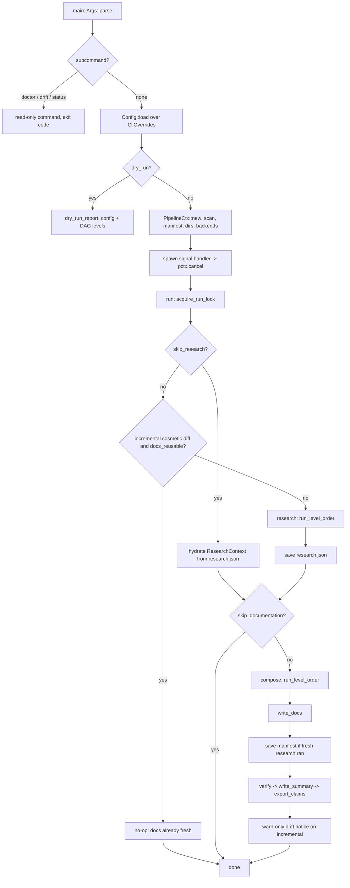
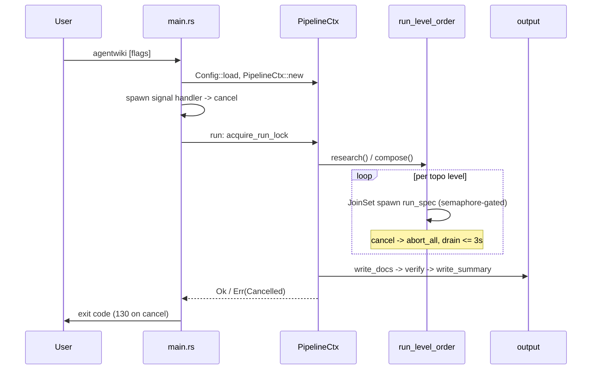

# Documentation Generation Pipeline — Module Deep-Dive

## Purpose

The Documentation Generation Pipeline is agentwiki's core business domain. It orchestrates the end-to-end run that turns a source repository into verified, C4-style architecture documentation: **Preprocess → Research → Compose → Write → Verify**. The module owns the shared `PipelineCtx` — the `Arc`-wrapped bag of state handed to every agent spec instance — plus the concurrency budget (a `Semaphore`), cooperative cancellation (`CancellationToken`), the single-instance run lock, and per-run statistics (`RunStats`).

The domain also includes the CLI entry surface (`main.rs` / `cli.rs`) and the deterministic output layer (`src/output/`), which renders non-LLM documents, writes the doc tree, and verifies the artifacts. All paid work (subprocess calls to `devin` / `claude` / `codex`) is delegated to the Agent Orchestration and Backend domains; this module sequences them and enforces the cost, locking, and incrementality contracts.

**Associated files**

| File | Role |
|---|---|
| `src/pipeline/mod.rs` | Orchestrator: `PipelineCtx`, `run`, `run_pipeline`, `run_level_order`, run lock, incremental gate, `dry_run_report` |
| `src/main.rs` | Tokio binary entry: arg parse, tracing, read-only subcommand dispatch, signal handling |
| `src/cli.rs` | `Args` / `Command` / `Lang` definitions and `Args → CliOverrides` conversion |
| `src/output/writer.rs` | Doc-tree writer: `DOCS` table, `write_docs`, written-docs bookkeeping, stale deep-dive cleanup |
| `src/output/verify.rs` | Post-write `VerifyReport`: expected-doc integrity + heuristic/optional real Mermaid checks |
| `src/output/summary.rs` | `__AgentWiki_Summary__.md` + `<internal>/summary.json` |
| `src/output/boundary.rs` | Deterministic `5.Boundary-Interfaces.md` renderer (`DetFn`) |
| `src/output/database.rs` | Deterministic `6.Database-Overview.md` renderer (`DetFn`) |

## Internal structure

### `PipelineCtx` — shared run context

Constructed once per run by `PipelineCtx::new(config, backends)` and shared via `Arc`:

- **Phase-0 output**: `scan: ScanData` is produced synchronously by `scanner::scan` — deterministic, no LLM calls.
- **Lazy manifest**: `manifest: Option<Manifest>` is built only when `config.incremental` or `mode == Mode::Agentic` demands it. Building it costs a read+hash of every file plus the import graph, so plain embedded runs skip it.
- **Governance handles**: `cache` (content-hash result cache), `quota` (daily cap + `calls.jsonl` audit), `prompts` (template loader), `semaphore` (`config.max_parallels` bound on concurrent CLI calls).
- **Execution plumbing**: `ctx: ResearchContext` (typed result store shared by all specs), `stats: Mutex<RunStats>` (cache hits, CLI calls, saved seconds, per-spec timings), `progress` (hidden on non-TTY), `cancel: CancellationToken`.
- **Backends**: `HashMap<BackendKind, Arc<dyn AgentBackend>>`, injectable for tests. `default_backends` constructs real CLI backends for the kinds referenced by `models.efficient` / `models.powerful` via `BackendKind::parse` + `backend::for_kind`; lookup misses surface as `Error::BackendNotAvailable`.
- **`empty_cwd`**: a sanitized directory under `<internal>/` used as the working directory for embedded-mode backend calls, so agent CLIs don't see the target repo unless running agentic.

### CLI entry & command surface

`cli.rs` is a thin clap layer. `generate` is **not** a `Command` variant — it is the default action implied by top-level flags (`PROFILE` positional, `-p`, `-o`, `--incremental`, `--dry-run`, `--skip-research`, `--agentic`, model overrides, etc.). The three `Command` variants — `Doctor`, `Drift`, `Status` — are all read-only. `From<&Args> for CliOverrides` feeds the `CLI > agentwiki.toml > defaults` precedence chain.

`main.rs` (tokio `#[tokio::main]`):

1. `Args::parse` + `init_tracing` (`-v` → info/debug/trace, `RUST_LOG` overrides via `EnvFilter`).
2. Dispatches read-only subcommands **before** any locking — they must not take the run lock or install the cancel handler — and exits with their status code.
3. `Config::load(&CliOverrides, config_path)`.
4. `--dry-run`: scans, prints `dry_run_report` (resolved config + per-phase DAG), exits.
5. `PipelineCtx::new`, then a signal task: first SIGINT/SIGTERM cancels `pctx.cancel`; a second signal `exit(130)`. `run(&pctx)` result maps to the process exit code (130 on cancellation).

## Control flow



### Run lock

`acquire_run_lock` creates `<internal>/run.lock` with `create_new` (O_EXCL semantics) containing the pid. Two attempts: an `AlreadyExists` lock whose pid is alive (checked via `crate::sys::pid_alive`) fails fast with `Error::AlreadyRunning`; a stale or unreadable lock is reclaimed by deleting it. `RunLock`'s `Drop` removes the file, so the lock auto-releases on any exit path. Read-only subcommands never touch it.

### Incremental gate

When `--incremental` is set and both a current and a prior manifest exist, `prev.diff(cur)` is classified:

- **`Significance::Cosmetic`** *and* `docs_reusable()` → 0-call no-op. The manifest is deliberately **not** advanced, so the pending cosmetic delta stays visible to `agentwiki status`.
- **`Cosmetic` without reusable docs** → full run (artifacts missing or stale).
- **`Structural(reasons)`** → full run.

`docs_reusable` is strict: the output dir must exist, `research.json` and the `written-docs-<key>.json` list must both exist with `research.mtime <= written.mtime` (a newer `research.json` means a run was interrupted mid-compose), the recorded list must be non-empty, and every listed file must still be on disk. Any doubt fails open to a real run.

### DAG scheduling — `run_level_order`

Both phases share one executor: `research()` runs `registry::research_specs()`, `compose()` runs `registry::compose_specs()`. `topo_levels` groups specs into dependency levels; each level's specs are spawned into a `JoinSet` and run in parallel (each `run_spec` acquires the semaphore internally for backend calls). A **biased** `tokio::select!` between `set.join_next()` and `pctx.cancel.cancelled()` means cancellation is checked first on every wakeup: on cancel, `abort_all` drops in-flight futures — killing child CLIs (`kill_on_drop`) — with a bounded 3-second drain before returning `Error::Cancelled`. Any spec failure propagates immediately (`??`), aborting the level and the pipeline.

### Compose → Write → Verify

After compose, `write_docs` (in `output/writer.rs`) renders the doc tree:

- `DOCS` maps ctx keys to top-level files: `overview → 1.Overview.md`, `architecture_doc → 2.Architecture.md`, `workflow_doc → 3.Workflow.md`, `boundary_doc → 5.Boundary-Interfaces.md`, `database_doc → 6.Database-Overview.md`. Non-string values are serialized to pretty JSON.
- The `deep_dive` ctx map fans out to `4.Deep-Exploration/<sanitized domain>.md`.
- **Bounded stale-doc cleanup**: deep-dives present in the previous written list but absent this run are deleted. Deletion is scoped to paths the tool itself wrote — hand-added docs are never touched.
- `written-docs-<output_key>.json` is recorded **last** via `util::write_atomic`: its presence and mtime are the proof-of-completion the incremental gate depends on.

The manifest is saved only when `research_ran` — a `--skip-research` compose over older research must not claim the tree — and only *after* `write_docs` completes, so an interrupted compose can't leave a manifest asserting state the docs never reached.

`verify` is non-fatal by design: it checks the five expected top-level docs for presence/non-emptiness plus `4.Deep-Exploration/` existence, heuristically validates every ` ```mermaid ` block (known header from a 20-entry allowlist, non-empty body, terminated fence), and — when `config.verify.mermaid_fixer` is set and the binary exists — runs `mermaid-fixer -d <out> --dry-run` for a real syntax pass. All findings land in `VerifyReport` and are logged as warnings.

`write_summary` emits `__AgentWiki_Summary__.md` next to the docs and `summary.json` under `<internal>/` (timings, cli_calls, cache_hits, quota used, embedded `VerifyReport`). `drift::claims::export_claims` then copies `agentwiki.claims.json` next to the docs — non-fatal — so CI's `drift --strict` finds claims without needing `--export-claims`. On incremental runs, `drift_verify_notice` re-analyzes the fresh claims against the import graph and prints a warn-only count of gating (phantom/reversed) findings; strict gating is left to CI.

### Deterministic renderers

`boundary_doc` and `database_doc` are `DetFn` functions invoked as `ExecKind::Deterministic` compose specs — they consume typed reports (`BoundaryAnalysisReport`, `DatabaseOverviewReport`) from `ResearchContext` and render Markdown with zero LLM calls. `database_doc` emits an `erDiagram` for table relationships, sanitizing schema/table names through `mermaid_id` (non-`[A-Za-z0-9_]` → `_`) to keep node IDs ASCII-safe.

## Key interfaces

```text
PipelineCtx::new(config, Option<backends>) -> Result<Arc<PipelineCtx>>
PipelineCtx::backend(kind) -> Result<Arc<dyn AgentBackend>>
run(pctx) -> Result<()>                  // lock + progress settlement
run_pipeline(pctx) -> Result<()>         // internal: gating + phases
run_level_order(specs, pctx) -> Result<()>
dry_run_report(config, scan) -> String

write_docs(pctx) -> Result<Vec<PathBuf>>
verify(pctx) -> Result<VerifyReport>
write_summary(pctx, &VerifyReport, Duration) -> Result<()>
boundary_doc / database_doc(scan, config, dep: &Value) -> Result<String>
```

Errors flow through `crate::error::{Error, Result}`; cancellation surfaces as `Error::Cancelled`, which `main` maps to exit code 130. Progress is settled in `run` (`done` / `cancel` / `fail`) regardless of outcome.

## Notable implementation decisions

- **Pay-for-what-you-use manifest**: the fingerprint (read+hash of every file plus import graph) is skipped entirely on plain embedded runs — only `--incremental` and agentic mode (which mixes it into cache keys) pay for it.
- **Fail-open artifact checks**: `docs_reusable` treats any missing/corrupt bookkeeping as "rewrite everything" — correctness of freshness over cache cleverness.
- **Manifest ordering invariant**: save manifest only after `write_docs` and only when fresh research ran, so the manifest always asserts a state actually on disk; interrupted runs cannot poison the incremental gate.
- **Cooperative, bounded cancellation**: biased select + `abort_all` + 3s drain guarantees shutdown can't hang on a task stuck in a sync poll, and child CLI processes die via `kill_on_drop`.
- **Injected backends**: `PipelineCtx::new` accepts a backend map so `MockBackend` can drive full offline pipeline tests without real CLI calls.
- **Verification that can't be polluted**: `verify` and the post-run drift notice are warn-only in the pipeline; hard gating is deliberately a separate `drift --strict` CI step with deterministic exit codes.
- **Self-scoped cleanup**: stale deep-dive deletion is bounded by the tool's own written-docs list, never by filesystem scanning — user-authored files in the output dir are safe.

