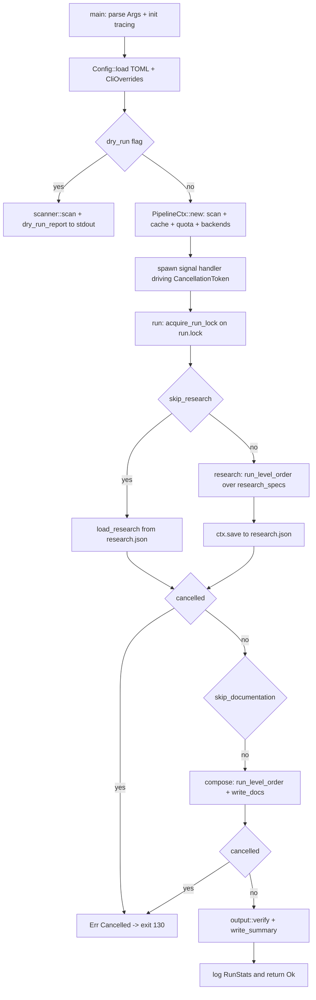
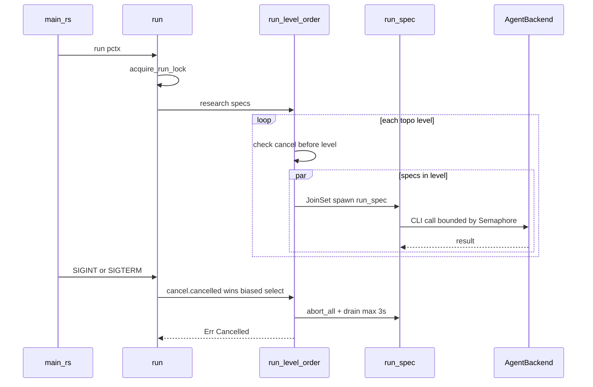

# Documentation Pipeline Orchestration — Module Deep-Dive

## 1. Purpose

`src/pipeline/mod.rs` is the **orchestration bounded context** of agentwiki. It decides *when* and *in what order* work happens; the `agent` module decides *how* each task runs. Its responsibilities:

- Assemble the shared `PipelineCtx` handed to every agent spec.
- Prevent concurrent runs against the same output directory via `run.lock`.
- Execute the research and compose DAGs as parallel topological levels (`JoinSet` + `Semaphore`).
- Provide cooperative cancellation (SIGINT/SIGTERM) and a `--dry-run` report.
- Sequence the fixed stages: Research → Compose → Write → Verify → Summary.

It is deliberately thin: no LLM logic, no JSON parsing, no Markdown rendering lives here.

## 2. Internal Structure

| Sub-module | Items | Role |
|---|---|---|
| `PipelineCtx` | `config`, `scan`, `ctx`, `cache`, `quota`, `prompts`, `semaphore`, `stats`, `empty_cwd`, `progress`, `cancel`, `backends` | Shared context, passed as `Arc<PipelineCtx>` to every spec instance |
| `RunStats` | `cache_hit()`, `cli_call()`, `record()` | Bookkeeping for the summary report (`calls`, `hits`, per-spec timings) |
| DAG scheduler | `run()`, `run_pipeline()`, `research()`, `compose()`, `run_level_order()` | Topological level execution with parallel fan-out |
| Run lock | `RunLock` (Drop guard), `acquire_run_lock()` | Mutual exclusion via `<internal>/run.lock` containing the pid |
| Resume support | `PipelineCtx::load_research()` | Hydrates `ResearchContext` from `research.json` for `--skip-research` |
| Dry-run | `dry_run_report()` | Renders effective config + DAG levels without spending calls |
| Entry glue | `main.rs`, `lib.rs` | CLI parse, tracing, signal handler, public re-exports |

`lib.rs` exposes the module as the crate's public API surface: `pub use pipeline::{PipelineCtx, RunStats, dry_run_report, run}`.

## 3. Key Interfaces

```rust
pub async fn PipelineCtx::new(
    config: Config,
    backends: Option<HashMap<BackendKind, Arc<dyn AgentBackend>>>,
) -> Result<Arc<PipelineCtx>>

pub fn PipelineCtx::backend(&self, kind: BackendKind) -> Result<Arc<dyn AgentBackend>>

pub async fn run(pctx: &Arc<PipelineCtx>) -> Result<()>

pub fn dry_run_report(config: &Config, scan: &ScanData) -> String
```

- `PipelineCtx::new` runs `scanner::scan` itself (Phase 0 is part of context construction), creates `.agentwiki/` and the sanitized `empty-cwd` directory, and either accepts injected backends (tests inject `MockBackend` through this) or builds real ones via `default_backends` — which parses `config.models.efficient`/`powerful` (`<backend>:<model>`) and constructs one backend per referenced `BackendKind`.
- `backend()` fails with `Error::BackendNotAvailable` when a spec's model references a kind that was never configured.
- `run` acquires the lock, runs `run_pipeline`, then settles the progress bar (`done`/`cancel`/`fail`) before returning.
- `dry_run_report` is pure: it walks `Phase::Research` and `Phase::Compose`, prints each spec as `name [deterministic|llm|tier]×fan <- [deps]` per topo level, and returns the text — no side effects, no backend construction.

## 4. Control Flow



Level-ordered execution within a phase:



## 5. Notable Implementation Decisions

**Lock via `create_new` + pid liveness.** `acquire_run_lock` uses `OpenOptions::create_new` (atomic O_EXCL) writing the pid. On `AlreadyExists` it reads the pid and checks `/proc/<pid>` — a live process yields `Error::AlreadyRunning{pid}`; a dead pid or unreadable/truncated lock is reclaimed (up to 2 attempts). `RunLock` is an RAII guard that deletes the file on drop, including panic paths. Caveat: `/proc` makes stale-lock detection Linux-only in practice; on platforms without `/proc` every existing lock is treated as reclaimable.

**Biased `select!` cancellation.** Inside each level the loop runs `tokio::select! { biased; r = set.join_next() => ..., () = cancel.cancelled() => ... }`. `biased` polls `join_next` first so completed work is harvested deterministically before cancellation is observed. On cancel: `abort_all()` drops task futures, which kills child CLIs because backends spawn with `kill_on_drop(true)` — the cancellation propagates all the way to subprocesses without extra plumbing. The drain is bounded by a 3-second timeout so a task stuck in a synchronous poll cannot hang shutdown.

**Two-stage signal handler in `main.rs`.** First SIGINT/SIGTERM triggers `cancel.cancel()` (cooperative: finish or kill in-flight work, clean up lock, exit 130). A second signal calls `std::process::exit(130)` immediately — the operator always has a force-quit.

**Semaphore-based parallelism.** `Semaphore::new(config.max_parallels)` (default 2) bounds concurrent CLI calls globally, not per level — fan-out instances (`dir_summary` PerDir, `key_module`/`deep_dive` PerDomain) compete for the same permits, protecting the daily CLI quota.

**Cancellation checkpoints.** Beyond the per-level check, `run_pipeline` tests `cancel.is_cancelled()` between phases so a cancel during compose skips verify/summary cleanly.

**Research persistence.** After the research phase the full `ResearchContext` is serialized to `.agentwiki/research.json` via `write_atomic`; `--skip-research` hydrates it back through `load_research`. This decouples the expensive LLM phase from the cheap write/verify phase for iteration.

**Backend injection seam.** `PipelineCtx::new` accepts `Option<backends>` specifically so tests inject `MockBackend` keyed by `BackendKind::Mock` — the entire pipeline (lock, cancel, retry, quota, cache) is exercised in-process with no real CLI.

**Progress settlement.** `run` owns the terminal outcome mapping — `Ok` → `done()`, `Cancelled` → `cancel()`, other errors → `fail(e)` — keeping presentation concerns out of `run_pipeline`.

## 6. Error Surface

| Error | Raised when |
|---|---|
| `Error::AlreadyRunning{pid}` | Live pid found in `run.lock` |
| `Error::Pipeline(msg)` | Lock unreclaimable after 2 attempts, or `JoinSet` join failure |
| `Error::Cancelled` | Cancel before/between levels, or between phases |
| `Error::BackendNotAvailable` | `backend()` lookup misses |
| `Error::io` | Internal dir / lock file I/O |

`main` maps cancellation to exit code 130, matching SIGINT convention.

## 7. Known Risks

- `pipeline/mod.rs` (~350 lines) concentrates context, scheduler, lock, and dry-run in one file — flagged in the architecture review as the primary refactor candidate (`context.rs`/`lock.rs` split) if it grows.
- `dry_run_report` recomputes `topo_levels` twice; fine for a report but would need care if spec construction ever became expensive.
- Stale-lock detection depends on `/proc`, so on non-Linux platforms a live second process is not blocked by the pid check (the `create_new` race still protects while the first holder lives, since the lock file exists until its drop).

## 8. Associated Files

- `src/pipeline/mod.rs` — all of the above (349 lines)
- `src/main.rs` — CLI entry, signal handler, `--dry-run` short-circuit, tracing init
- `src/lib.rs` — public re-exports: `PipelineCtx`, `RunStats`, `run`, `dry_run_report`
- Collaborators: `src/agent/registry.rs` (`research_specs`, `compose_specs`, `topo_levels`), `src/agent/runner.rs` (`run_spec`), `src/scanner/mod.rs` (`scan`, `ScanData`), `src/output/{writer,verify,summary}.rs`, `src/{cache,quota,prompt,progress,error}.rs`