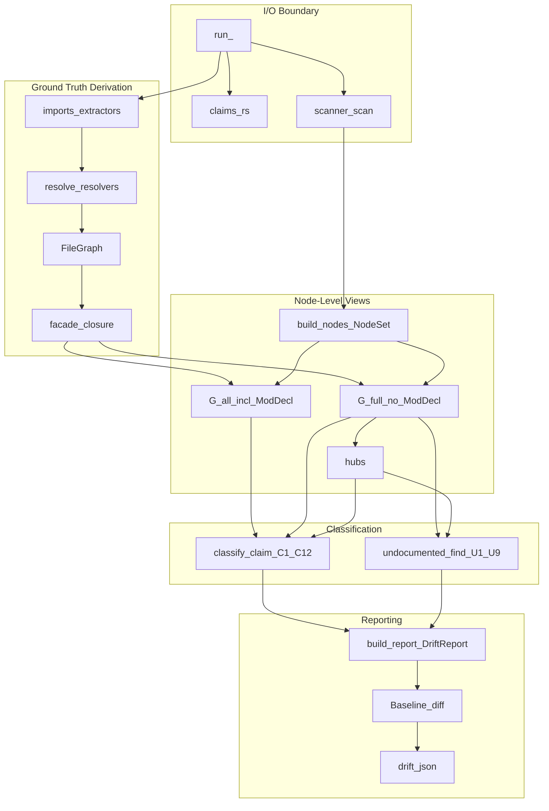

# Drift Detection & Claim Verification — Module Deep-Dive

## 1. Purpose

`agentwiki drift` is the verification layer of the documentation pipeline. The compose stage produces architecture documents whose dependency claims (`relationships.core_dependencies`) are LLM-generated and therefore susceptible to hallucination and staleness. The drift module re-derives ground truth — the repository's real import graph — without any LLM involvement, then classifies every claimed edge as `confirmed`, `structural`, `unverifiable`, `reversed`, or `phantom`, and independently surfaces real code edges that the documentation never mentioned (`undocumented`).

Key properties:

- **Read-only toward the target repo** — no LLM calls, no pipeline writes, no run lock. Its only outputs are `<internal>/drift.json`, an optional baseline file, and stdout.
- **CI-friendly** — deterministic exit codes: `0` = ok or warnings only, `1` = `--strict` found new gating findings (phantom/reversed), `2` = claims missing or invalid.
- **Conservative by design** — import extraction is regex/heuristic-based (no full AST parsing), so the module compensates with guard-first verdict chains and asymmetric evidence policies that prefer `unverifiable` over a false `phantom`.

## 2. Internal Structure

The module lives entirely under `src/drift/` and is organized as a strict pipeline:

| Sub-module | Files | Role |
|---|---|---|
| Orchestration | `mod.rs` | CLI entry `run()`, pure core `analyze()`, report assembly |
| Claim I/O | `claims.rs` | Claim loading/export, endpoint normalization (`Endpoint`) |
| Configuration | `config.rs` | `DriftConfig` thresholds, `[drift]` TOML merge, path resolution |
| Import extraction | `imports/{mod,sanitize,rust,python,js}.rs` | Comment/string sanitization + per-language `RawImport` extraction |
| Resolution | `resolve/{mod,rust,python,js}.rs` | `ImportSpec` → repo files; builds `FileGraph` |
| Graph lifting | `graph.rs` | `NodeSet`, `FileEdge` → `NodeGraph` lift, `reachable`, `hubs`, `facade_closure` |
| Claim classification | `compare.rs` | `normalize_claims`, `classify_claim` — the C1–C12 verdict chain |
| Undocumented edges | `undocumented.rs` | `find` — the U1–U9 suppression chain over strong evidence |
| Findings/report/baseline | `findings.rs`, `report.rs`, `baseline.rs` | `Finding`/`FindingClass`, versioned `DriftReport`, baseline diffing |



## 3. Key Interfaces

### Entry points (`src/drift/mod.rs`)

```rust
pub async fn run(
    project_path: Option<PathBuf>,
    config_path: Option<PathBuf>,
    args: &DriftArgs,
    verbose: bool,
) -> i32

pub fn analyze(
    cfg: &DriftConfig,
    root: &Path,
    scan: &ScanData,
    claims: &[CoreDependency],
    test_globs: &[glob::Pattern],
) -> Outcome
```

`run` owns all process-level concerns (config loading with a fall-back-to-defaults policy so a broken `agentwiki.toml` can't block a read-only check, path resolution, baseline I/O, `drift.json` write via `util::write_atomic`, rendering, exit code). `analyze` is the pure core — claims + `ScanData` → `Outcome` — deliberately separated so tests drive it with hand-rolled graphs and no filesystem IO.

`DriftArgs` (clap) exposes: `--claims`, `--baseline`, `--max-depth`, `--strict`, `--update-baseline`, `--export-claims <PATH>`, `--json`. `--export-claims` is a standalone action that copies `relationships` out of `<internal>/research.json` into a commit-able file — needed because `.agentwiki/` is gitignored, while CI needs claims on a bare checkout. The pipeline also writes `<output>/agentwiki.claims.json` (`claims::CLAIMS_FILENAME`) next to the docs for the same reason.

### Claims (`src/drift/claims.rs`)

`load_claims` accepts three JSON shapes: a full `research.json` map, a trimmed `{relationships: …}` export, or a bare `{core_dependencies: […]}`. It is deliberately strict (parse errors become `Error::Parse`, not "no claims") because silently swallowing a corrupt claims file would turn every check into a false pass.

`normalize_endpoint` maps raw LLM endpoint strings to `Endpoint::{Empty, File, Dir, Unknown}`: trim, strip backticks, `\`→`/`, drop `./` and trailing `/`, drop free-text `( … )` suffixes; then exact file match → exact dir match → unique path-suffix match → on-disk existence check → `Unknown`. There is no fuzzy matching — ambiguity resolves to `Unknown`, which the C-chain turns into `unverifiable` rather than guessing.

### Import extraction (`src/drift/imports/`)

`sanitize.rs` blanks comments and string literals per language while preserving byte offsets, so regex-based extraction can't be fooled by commented-out code and every `RawImport` carries an accurate 1-based `line`. `extract_imports` dispatches on `Lang` (`Rust | Python | Js | UnsupportedCode | Other`) producing `RawImport { spec: ImportSpec, kind: EvidenceKind, test_only, line }`.

- **Rust** (`imports/rust.rs`): expands `use` trees, `mod x;` declarations (`EvidenceKind::ModDecl`), inline `crate::`/`self::`/`super::`/`<crate_name>::` paths in expressions (`InlinePath`), and `pub use` re-exports (`ReExport`). `#[cfg(test)]` regions are marked `test_only` when `exclude_cfg_test` is set.
- **Python** (`imports/python.rs`): absolute and relative `import`/`from` forms including parenthesized and `as`-aliased names; `from x import y` inside `__init__.py` is tagged `ReExport`.
- **JS/TS** (`imports/js.rs`): regex-matches five import forms (ESM `import`, `export … from`, CJS `require`, dynamic `import()`, `export *`).

This extractor is intentionally separate from `scanner::insights::extract`, which is tuned for prompt materials (capped, regex-only) and cannot be reused without invalidating prompt caches.

### Resolution (`src/drift/resolve/`)

`build_file_graph(cfg, root, scan, test_globs) -> FileGraph` iterates scanned code files, sanitizes, extracts, and resolves each `ImportSpec` to `Resolution::{Internal(Vec<PathBuf>), External, Unresolved}`:

- **Rust**: builds a `RustIndex` (package root via `Cargo.toml`, module path per `.rs`), then resolves `crate`/`self`/`super`/named roots with module descent.
- **Python**: `level > 0` climbs directories from the importer; `level = 0` matches module-path suffixes to `x.py` or `x/__init__.py`.
- **JS/TS**: normalizes `./`/`..` specifiers, tries the literal path, extension substitution (including `.js`→`.ts`), and `index.*` children.

The resulting `FileGraph` carries `edges: Vec<FileEdge>` plus per-file `total_imports`/`unresolved` counters that feed the C10 resolver-confidence guard. `graph::facade_closure` then appends weak `Facade` edges: for every `X → F` where `F` is a facade file (`lib.rs`, `mod.rs`, `__init__.py`, `index.*`), it follows `F`'s `ReExport` edges transitively (facade→facade, depth ≤ 3) so that `import {Foo} from './pkg'` is evidence for `X → pkg/inner.ts`.

### Node graph (`src/drift/graph.rs`)

`build_nodes` constructs a `NodeSet` from claim endpoints plus scanned code files: `File`/`Dir` nodes for claimed endpoints, `Hidden` nodes for unclaimed parent dirs (they participate in reachability but never appear in findings), and per-node `code_files`/`supported_files` counts — counted both for the owning node and every claimed ancestor dir, so a dir whose code all lives in claimed subdirs isn't mislabeled `non_code_endpoint`.

`lift(file_edges, &nodes, include_mod) -> NodeGraph` maps file edges onto node edges, dropping intra-node self-loops. It is run twice:

- **`G_all`** (`include_mod = true`) — widest view; used *only* for containment evidence.
- **`G_full`** (`include_mod = false`) — used for direct/transitive/reached verdicts, hub detection, and undocumented detection. `mod x;` edges are excluded here deliberately: otherwise `lib.rs` would make every node reachable and nothing could ever be a phantom.

`NodeGraph::hubs` flags nodes whose file-level fan-in ≥ `hub_in_degree_ratio × total_nodes` (gated by `hub_min_nodes`). `NodeGraph::reachable` is a uniform-cost search ordered by `(depth, path)` returning the shortest, lexicographically smallest path — deterministic for stable reports — with hubs blocked as intermediates.

## 4. Control Flow

```mermaid
sequenceDiagram
    participant CLI as run
    participant CFG as Config/DriftConfig
    participant CLM as claims.rs
    participant SCN as scanner
    participant RES as resolve::build_file_graph
    participant GPH as graph.rs
    participant CMP as compare.rs
    participant UND as undocumented.rs
    participant RPT as report/baseline
    CLI->>CFG: load config, claims path
    CLI->>CLM: load_claims
    CLI->>SCN: scan project
    CLI->>CMP: normalize_claims (dedupe endpoints)
    CLI->>GPH: build_nodes (File/Dir/Hidden)
    CLI->>RES: extract+resolve per file
    RES-->>CLI: FileGraph (edges, unresolved)
    CLI->>GPH: lift -> G_all, G_full; hubs
    loop each ClaimedEdge
        CLI->>CMP: classify_claim (C1-C12)
        CMP-->>CLI: Finding
    end
    CLI->>UND: find (U1-U9 over G_strict)
    UND-->>CLI: undocumented findings + filtered counts
    CLI->>RPT: build_report, baseline diff
    RPT-->>CLI: DriftReport, exit code
```

End-to-end pipeline inside `run`/`analyze`:

1. **Setup** — load `Config` (fallback to defaults on failure), canonicalize `project_path`, apply `--max-depth` override (clamped ≥ 1). Handle `--export-claims` early as a standalone action.
2. **Claims** — resolve the claims path (`--claims` > `[drift].claims_path` > `<internal>/research.json` > `<output>/agentwiki.claims.json`) and `load_claims`; failure → exit 2 with a hint.
3. **Scan** — `scanner::scan(&cfg)` reuses the deterministic Phase-0 scanner; `test_globs` compile to `glob::Pattern`s.
4. **Analyze** — `normalize_claims` dedupes on `(from, to)` keeping the highest-importance duplicate; `build_nodes`, `build_file_graph` + `facade_closure`, double `lift`, `hubs`; then `classify_claim` per edge and `undocumented::find`. Findings sort by id for determinism.
5. **Report** — `build_report` computes per-class counts and coverage (`(confirmed+reversed+phantom) / non-undocumented findings`); baseline load marks `in_baseline`, computes `known/new/stale`; `--update-baseline` persists gating ids and marks everything known so strict never fires on the same run.
6. **Emit** — `<internal>/drift.json` via atomic write (all failures are `warn`, never fatal); stdout gets `report::render` or `--json`. Exit `1` iff `--strict` and `strict_failures()` is non-empty.

## 5. The C1–C12 Verdict Chain

`classify_claim` runs an ordered, first-verdict-wins chain. Order is load-bearing: **endpoint sanity → checkability guards → positive evidence → negatives**.

| Step | Check | Verdict |
|---|---|---|
| C1/C2 | `Empty` or `Unknown` endpoint | `unverifiable` (`empty_endpoint` / `unknown_endpoint`) |
| C3 | `from == to` after normalization | `structural` (`self_loop`) |
| C7 | `dependency_type` is `data_flow` or not in `checkable_kinds` | `unverifiable` (`kind_not_checkable`) |
| C8 | Either endpoint owns zero scanned code files | `unverifiable` (`non_code_endpoint`) |
| C9 | `supported_files / code_files < min_language_coverage` at either end | `unverifiable` (`language_coverage`) |
| C10 | Source node unresolved-import ratio > `max_unresolved_ratio`, or zero internal edges repo-wide | `unverifiable` (`resolver_confidence`) |
| C4 | Endpoint ancestry (containment) | `confirmed` if `G_all` has the edge, else `structural` |
| C5 | Direct edge on `G_full` | `confirmed` (`direct_evidence`) |
| C6 | Transitive path within `max_transitive_depth`, hubs blocked | `confirmed` (`transitive`, detail shows the path) |
| C11 | Backward edge `to → from` on `G_full` | `reversed` |
| C12 | Nothing matched | `phantom` |

Guards run *before* evidence on purpose: an uncheckable claim is `unverifiable` regardless of what the code shows — a `data_flow` claim into a fixture dir is containment-shaped but still not import-checkable. Containment (C4) sits after the guards but before direct evidence: parent↔child claims can never be phantom, and `mod` decls count as evidence only in this view.

## 6. The U1–U9 Undocumented-Edge Chain

`undocumented::find` iterates `G_full` node edges not already claimed (the C-chain owns those) and applies suppression filters; each drop is counted in `filtered` so the report shows how much noise was suppressed:

- **U1** — both ends must be claimed `File`/`Dir` nodes (`u1_unclaimed_end`)
- **U2** — parent↔child containment is structural, not drift (`u2_containment`)
- **U3** — requires *strong* evidence: `Import`/`InlinePath`/`ReExport`, non-`test_only` (`u3_weak_evidence`)
- **U4** — `ignore_nodes`/`ignore_files` glob suppression (`u4_ignored`)
- **U5** — edges into hub nodes are mostly mechanical fan-in (`u5_hub_target`)
- **U6** — the reverse edge is already claimed; the claim side flags it `reversed`, so don't double-report (`u6_reverse_claimed`)
- **U7** — claims already connect a⇝b through a chain of distance ≥ `MIN_COVERING_PATH = 3` via BFS `claim_distance`; `None` (no claims path at all) is *more* undocumented, not less — only an existing deep chain suppresses (`u7_claimed_path`)
- **U8** — requires ≥ `min_undocumented_imports` distinct `(importer, target)` file pairs (`u8_thin`)
- **U9** — report cap `max_undocumented_reported` (`u9_capped`)

## 7. Notable Implementation Decisions

- **Asymmetric evidence is deliberate.** Phantom/reversed verdicts use the widest graph (test imports, inline paths, facade-weak edges) — a claim only fails when *nothing* supports it. Undocumented detection uses the strictest graph (strong, non-test evidence, multiple import sites) — a missing claim is only reported when the evidence is solid. This trades recall for precision exactly where each error is cheapest.
- **`mod` decls are quarantined.** `EvidenceKind::ModDecl` edges exist only in `G_all` to confirm parent→child containment claims; including them in `G_full` would make `lib.rs` a universal connector.
- **Facade closure.** Re-export facades (`lib.rs`, `__init__.py`, `index.*`) would otherwise hide real consumers→implementation edges; `facade_closure` synthesizes weak `Facade` edges through up to 3 hops of re-export chains.
- **Kind-free finding ids.** `finding_id` is `class:from->to` — an LLM relabeling `dependency_type` never mints a new finding, which keeps the baseline stable across regenerations.
- **Gating classes.** Only `phantom`, `reversed`, and `undocumented` are `is_gating()` — recorded in the baseline and counted by `--strict`. `confirmed`/`structural`/`unverifiable` ids would only churn the file.
- **Fail-open diagnostics, fail-closed input.** Broken config falls back to defaults and `drift.json` write failures only warn, but missing/unparseable claims exit `2` — a corrupt claims file must never look like a clean bill of health.
- **Determinism.** `BTreeMap`/`BTreeSet` throughout, lexicographically-smallest shortest paths, id-sorted findings — reports are diff-stable for CI.

## 8. Configuration (`[drift]` in `agentwiki.toml`)

`DriftConfig` defaults: `max_transitive_depth = 3`, `checkable_kinds = {import, function_call, inheritance, composition, module}`, `min_language_coverage = 0.8`, `max_unresolved_ratio = 0.25`, `hub_in_degree_ratio = 0.5`, `hub_min_nodes = 10`, `min_undocumented_imports = 3`, `max_undocumented_reported = 20`, plus `ignore_files` (utility-file globs like `**/utils.*`, `**/types.*`), `test_globs` (`tests/**`, `**/*.test.*`, `conftest.py`, …), and `exclude_cfg_test = true`. `DriftPartial` merges an all-optional TOML section with clamping (ratios to `[0,1]`, depths/counts ≥ 1).

## 9. Associated Files

```
src/drift/
├── mod.rs            # run() entry, analyze() pure core, DriftArgs, Outcome, build_report
├── claims.rs         # load/export claims, Endpoint normalization, CLAIMS_FILENAME
├── config.rs         # DriftConfig, DriftPartial, claims/baseline path resolution
├── findings.rs       # FindingClass (is_gating), Finding, EvidenceRef, finding_id
├── compare.rs        # ClaimedEdge, CompareCtx, normalize_claims, classify_claim (C1–C12)
├── graph.rs          # NodeSet/NodeGraph, lift, reachable, hubs, facade_closure
├── undocumented.rs   # find() — U1–U9 suppression chain, claim_distance BFS
├── report.rs         # DriftReport schema, render(), strict_failures
├── baseline.rs       # Baseline load/save for --strict/--update-baseline
├── imports/
│   ├── mod.rs        # Lang, EvidenceKind, ImportSpec, RawImport, extract_imports
│   ├── sanitize.rs   # comment/string blanking, offset-preserving
│   ├── rust.rs       # use-trees, mod decls, inline paths, cfg(test)
│   ├── python.rs     # absolute/relative import/from, __init__ re-exports
│   └── js.rs         # ESM/CJS/dynamic import forms
└── resolve/
    ├── mod.rs        # build_file_graph, Resolution, RepoIndex
    ├── rust.rs       # RustIndex, crate/self/super/module descent
    ├── python.rs     # relative climbs, module suffix matching
    └── js.rs         # specifier normalization, extension/index probing
```

External touchpoints: `scanner::scan` (file set), `agent::reports::CoreDependency`/`DependencyType` (claim schema), `util::write_atomic` (report/baseline writes), `Config`/`CliOverrides` (config precedence).