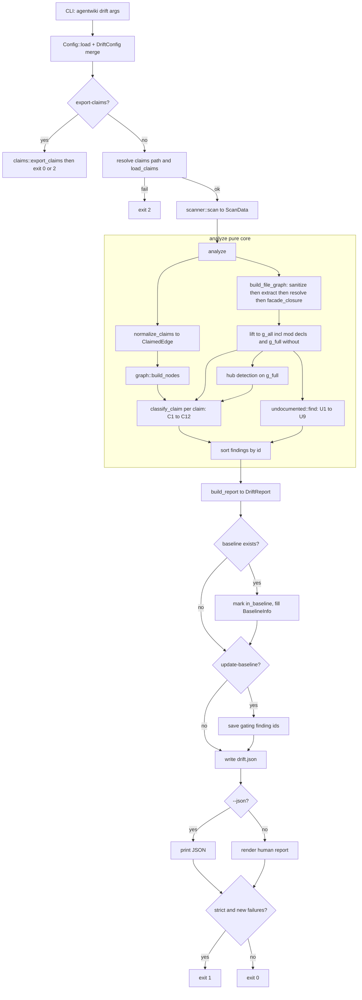
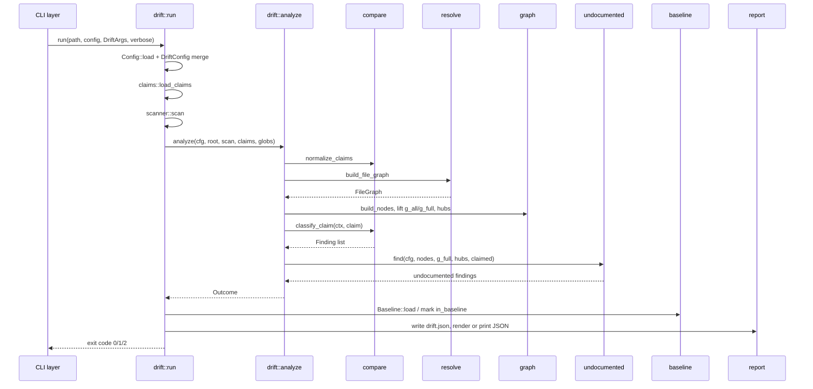

# Drift Verification (`src/drift`)

Deep-dive documentation for the read-only verification domain behind `agentwiki drift`.

## 1. Purpose

The generation pipeline asks an LLM to describe which parts of a repository depend on which other parts, producing a claim list at `relationships.core_dependencies`. Documentation drifts silently when those claims stop matching the code. The Drift Verification module is the corrective loop: it statically extracts the repository's **real import graph** and classifies every claimed edge against it, then runs the mirror-image check — real edges the claims never mention — to catch *undocumented* dependencies.

Design constraints:

- **Read-only.** No LLM calls, no pipeline writes, no run lock. The only side effects are writing `<internal>/drift.json` and an optional baseline update.
- **Bounded static analysis.** Regex-based import extraction (Rust, Python, JS/TS), not full AST parsing. Dynamic imports and macro-generated code surface as `unverifiable` rather than wrong verdicts.
- **CI-friendly.** Three exit codes (`0` ok, `1` strict failure on new findings, `2` claims missing/invalid) plus a baseline file so `--strict` only fires on *new* phantom/reversed findings.
- **Low false-positive rate.** Two ordered filter chains — C1–C12 for claim classification and U1–U9 for undocumented-edge suppression — tuned so that weak evidence and structural noise never reach the report.

## 2. Internal Structure

| File | Responsibility |
|---|---|
| `src/drift/mod.rs` | `DriftArgs` CLI surface, `run()` process entry point, pure `analyze()` core, `build_report()` |
| `src/drift/config.rs` | `DriftConfig` (`[drift]` TOML section): thresholds, checkable kinds, ignore lists, test globs |
| `src/drift/claims.rs` | `load_claims` / `export_claims`, `Endpoint` enum, `normalize_endpoint` path normalization |
| `src/drift/claims.rs` + `compare.rs` | `normalize_claims` dedup; `classify_claim` runs the C1–C12 chain |
| `src/drift/findings.rs` | `Finding`, `FindingClass`, `EvidenceRef`, stable `finding_id` |
| `src/drift/graph.rs` | `NodeSet`, `FileGraph`, `NodeGraph` lift, reachability, hub detection, `facade_closure` |
| `src/drift/imports/{mod,sanitize,rust,python,js}.rs` | Language detection, offset-preserving comment/string blanking, per-language raw-import extraction |
| `src/drift/resolve/{mod,rust,python,js}.rs` | `RepoIndex`, per-language import→file resolution, `build_file_graph` |
| `src/drift/undocumented.rs` | U1–U9 filter chain over `G_full` strong evidence |
| `src/drift/baseline.rs` | `.agentwiki-drift-baseline.json` load/save of known finding ids |
| `src/drift/report.rs` | `DriftReport` (schema v2), `Coverage`, `BaselineInfo`, `render()` human output, `strict_failures()` |

Note: `graph.rs` sits at `src/drift/graph.rs`, a sibling of `resolve/` — it is shared by both the claim-classification and undocumented-detection paths.

## 3. Data Flow



The critical split is `analyze()` vs `run()`: `analyze(cfg, root, scan, claims, test_globs) -> Outcome` is a **pure, IO-free function** — all file reading happens in `scanner::scan` and `build_file_graph` upstream — so the whole classification core is unit-testable with hand-built graphs (and the code's tests do exactly that).

## 4. Stage Details

### 4.1 Claim loading and endpoint normalization (`claims.rs`, `compare::normalize_claims`)

Claims come from `CoreDependency` records (`from`, `to`, `dependency_type`, `importance`). `load_claims` accepts three shapes: a full `research.json` map, a trimmed `{relationships: …}` export, or a bare `{core_dependencies: […]}` — deliberately strict parsing, because `ResearchContext::get_typed` swallows parse errors and would silently turn a corrupt claims file into "no claims".

`normalize_endpoint` turns free-text endpoints (`"src/agent/"`, `` `src` ``, `"src (config.rs, cli.rs)"`, `"./agent"`) into a tree position via a fixed cascade: trim/backtick-strip → `\`→`/` → strip `./` and trailing `/` → drop `" (…)"` suffixes → exact file match → exact dir match → unique path-suffix match → on-disk dir/file check → `Unknown`. No fuzzy name matching — ambiguity resolves to `Unknown`, which the C-chain then reports as `unverifiable` rather than guessing.

`normalize_claims` dedupes `(from, to)` pairs, keeping the highest-importance variant.

### 4.2 Import extraction (`imports/`)

- `Lang::from_extension` buckets files: `Rust`, `Python`, `Js` (incl. ts/tsx/mjs/cjs/vue/svelte), `UnsupportedCode` (go, java, …), `Other`.
- `sanitize` blanks comments and string/char literals **with byte-offset preservation** — every non-code byte becomes a space except `\n`, so line numbers survive. This kills doc-comment bait like `crate::config::Config` and code-looking string literals. Rust handles nested `/* */`, raw strings `r#"…"#`, and char-vs-lifetime disambiguation; Python handles triple-quoted strings; JS keeps `'…'`/`"…"` contents because import specifiers *are* string literals (template literals are blanked — a dynamic `import()` inside `${}` is a known accepted miss).
- Per-language `extract` produces `RawImport { spec: ImportSpec, kind: EvidenceKind, test_only, line }`. Rust additionally tracks `mod x;` declarations, `pub use` re-exports, inline `crate::x::y` qualified paths in expressions, `mod x { }` inline regions for `super::` resolution, and `#[cfg(test)]` regions (when `exclude_cfg_test`).

`EvidenceKind` grades evidence: `Import`, `InlinePath`, `ReExport`, `ModDecl` (containment evidence only), `Facade` (synthesized through re-export closures).

### 4.3 Resolution and graph construction (`resolve/`, `graph.rs`)

`RepoIndex::build` precomputes the file set, a `.py` set for suffix matching, and a `RustIndex` (crate roots from `Cargo.toml` layout, module→file map, `file_mod` context). `resolve()` maps each `RawImport` to `Internal(Vec<PathBuf>)`, `External` (third-party/stdlib — not evidence, not counted as unresolved), or `Unresolved` (looked internal but couldn't be pinned, e.g. `@/`/`~/` aliases).

`build_file_graph` runs sanitize → extract → resolve over every supported file, producing a `FileGraph` of `FileEdge`s plus per-file `total_imports`/`unresolved` counters (used by the C10 resolver-confidence guard). It finishes with `facade_closure`: for every edge `X → F` where `F` is a facade file (`lib.rs`, `mod.rs`, `__init__.py`, `index.*`), it BFS-follows `F`'s `ReExport` edges (facade→facade, depth ≤ 3) and adds weak `X → T` `Facade` edges — an import of a facade reaches what it re-exports.

`build_nodes` maps claim endpoints to a `NodeSet`: `File`/`Dir` endpoints become claimed nodes; every scanned code file lifts to itself (if a file node), else the deepest claimed ancestor dir, else a `Hidden` parent node (joins reachability, never appears in findings). Code/supported-file counts propagate up claimed ancestor dirs so a dir whose code lives in claimed subdirs isn't misjudged as `non_code_endpoint`.

`lift` then produces **two node graphs**:

- `g_all` — includes `mod x;` (`ModDecl`) edges; used only for containment evidence.
- `g_full` — excludes `ModDecl`; used for direct/transitive/reversed/undocumented reasoning. Keeping `mod` decls out is essential: `lib.rs` declaring every module would make every node reachable and nothing could be phantom.

Hubs are detected on `g_full`: nodes whose in-degree (counted in *distinct importer files*, not node-edge count) ≥ `hub_in_degree_ratio × total_nodes`, gated by `hub_min_nodes`. Hubs are blocked as intermediates in transitive reachability — otherwise fan-in hotspots like `util` would spuriously "confirm" almost anything.

`reachable` is a `(depth, path)`-ordered uniform-cost search returning the shortest, lexicographically smallest simple path — deterministic for stable reports.

### 4.4 Claim classification — the C1–C12 chain (`compare::classify_claim`)

First verdict wins. Ordering is deliberate: endpoint sanity → checkability guards → positive evidence → negatives.

| Filter | Check | Verdict |
|---|---|---|
| C1/C2 | Empty or unknown endpoint | `unverifiable` (`empty_endpoint` / `unknown_endpoint`) |
| C3 | Both ends normalize to the same node | `structural` (`self_loop`) |
| C7 | `data_flow` kind or kind not in `checkable_kinds` — never import-checkable | `unverifiable` (`kind_not_checkable`) |
| C8 | Endpoint owns zero scanned code files | `unverifiable` (`non_code_endpoint`) |
| C9 | Supported-language coverage < `min_language_coverage` | `unverifiable` (`language_coverage`) |
| C10 | Source node's unresolved-import ratio > `max_unresolved_ratio`, or repo has zero internal edges (broken resolver → everything would look phantom) | `unverifiable` (`resolver_confidence`) |
| C4 | Containment (one endpoint is ancestor of the other): `g_all` edge → `confirmed`, else `structural` — never phantom | `confirmed`/`structural` (`containment`) |
| C5 | Direct edge on `g_full` | `confirmed` (`direct_evidence`) |
| C6 | Transitive path within `max_transitive_depth`, hubs blocked | `confirmed` (`transitive`) |
| C11 | Code has `B → A` when docs claim `A → B` | `reversed` |
| C12 | No evidence at all | `phantom` |

Guards run *before* evidence on purpose: an uncheckable claim is `unverifiable` regardless of what the code shows (e.g. a `data_flow` claim into a fixture dir is containment-shaped but not import-checkable).

### 4.5 Undocumented edges — the U1–U9 chain (`undocumented::find`)

The mirror check iterates every `g_full` node edge not already claimed and filters candidates. Every drop is counted per filter so the report can show how much noise was suppressed.

| Filter | Drops when |
|---|---|
| U1 `u1_unclaimed_end` | Either end isn't a claimed `File`/`Dir` node |
| U2 `u2_containment` | Parent→child ancestry (structural, not drift) |
| U3 `u3_weak_evidence` | No strong non-test evidence (`Import`/`InlinePath`/`ReExport` only — `Facade`/`ModDecl`/test edges excluded) |
| U4 `u4_ignored` | Endpoint in `ignore_nodes`, or *all* strong evidence touches `ignore_files` globs (default: error/config/util/types/prelude files) |
| U5 `u5_hub_target` | Target is a hub (mechanical fan-in) |
| U6 `u6_reverse_claimed` | Reverse pair already claimed — the C-chain reports it as `reversed`; don't double-report |
| U7 `u7_claimed_path` | Claims already connect `a ⇝ b` via a path of length ≥ `MIN_COVERING_PATH` (3) — a genuinely implied dependency. A 2-hop layer-skip still reports; **no claims path is *more* undocumented, not less** |
| U8 `u8_thin` | Fewer than `min_undocumented_imports` (default 3) distinct importer→target file pairs |
| U9 `u9_capped` | Report cap `max_undocumented_reported` (default 20) reached |

Survivors become `undocumented` findings with import-site count and up to 3 evidence samples.

### 4.6 Baseline and reporting (`baseline.rs`, `report.rs`, `mod.rs`)

- `finding_id` = `<class>:<from>-><to>` — kind-free so an LLM relabel of `dependency_type` never mints a new finding; stable across runs.
- `Baseline` is a sorted `BTreeSet<String>` of finding ids at `<project>/.agentwiki-drift-baseline.json` (leading dot keeps it out of the scanner). Only gating classes are recorded (`phantom`, `reversed`, `undocumented` — confirmed/structural/unverifiable ids would only churn the file).
- `run()` marks `in_baseline` on matching findings and fills `BaselineInfo {known, new, stale}`. `--update-baseline` writes current gating ids and marks everything known, so strict never fires on that run.
- `DriftReport` (schema v2) carries `claims_source`, `claims_total`, per-class `counts`, `coverage` (claims that got a real verdict — confirmed/phantom/reversed — over all normalized claims), `hubs`, `filtered` U-filter counts, and sorted `findings`. It's written atomically to `<internal>/drift.json` (non-fatal on failure) and printed via `--json` or `report::render` (`-v` lists structural/unverifiable edges individually).
- `strict_failures()` = phantom + reversed findings not in baseline. Exit code: `1` iff `--strict` and that list is non-empty, else `0` (or `2` on claims/scan failure).



## 5. Notable Implementation Decisions

- **Asymmetric evidence policy.** Phantom/reversed verdicts run on the widest graph (test imports, inline paths, facade-weak edges) so a claim is only called phantom when *no* evidence exists; undocumented detection runs on the strictest (strong, non-test evidence) so real but weak links don't spam the report.
- **`mod` decls are containment-only evidence.** `lib.rs` would otherwise connect everything to everything — they confirm parent→child claims (C4, via `g_all`) but are excluded from reachability, reversed, and undocumented reasoning (`g_full`).
- **Hub blocking.** Transitive `confirmed` paths may not pass through hub intermediates, preventing fan-in hotspots from laundering weak claims into confirmations.
- **Strict claim parsing, lenient elsewhere.** Claims input is deliberately strict (silent "no claims" is worse than a loud error), while a broken `agentwiki.toml` falls back to defaults — a read-only check should never be blocked by config.
- **Determinism everywhere.** BTreeMap/BTreeSet ordering, lexicographically-smallest shortest paths, sorted stable `finding_id`s — the report and baseline diff cleanly in version control.
- **Claims committed with docs.** `.agentwiki/` is gitignored, so the pipeline also writes `agentwiki.claims.json` next to the docs; `drift` searches `research.json` first, then the committed copy, so it works on a bare checkout in CI.
- **Separate extractor from `scanner::insights`.** The scanner's regex extraction is tuned for prompt materials (capped, cache-sensitive) and is intentionally not reused.

## 6. Key Interfaces

```rust
// Process entry point — returns exit code 0/1/2.
pub async fn run(project_path: Option<PathBuf>, config_path: Option<PathBuf>,
                 args: &DriftArgs, verbose: bool) -> i32;

// Pure core: claims + scan → findings. IO-free, unit-testable.
pub fn analyze(cfg: &DriftConfig, root: &Path, scan: &ScanData,
               claims: &[CoreDependency], test_globs: &[glob::Pattern]) -> Outcome;
```

Supporting signatures: `claims::load_claims(&Path) -> Result<Vec<CoreDependency>>`, `claims::export_claims(&Path, &Path) -> Result<usize>`, `claims::normalize_endpoint(&str, &files, &dirs, root) -> Endpoint`, `resolve::build_file_graph(&DriftConfig, &root, &scan, &globs) -> FileGraph`, `graph::{build_nodes, lift, facade_closure}`, `NodeGraph::{has, edge, strong_evidence, hubs, reachable}`, `compare::{normalize_claims, classify_claim}`, `undocumented::find`, `baseline::Baseline::{load, save, from_ids}`, `report::render(&DriftReport, verbose)`.

Inputs: `ScanData` from `crate::scanner`, `CoreDependency`/`DependencyType` from `crate::agent::reports`, `Config`/`CliOverrides` from `crate::config`, `write_atomic` from `crate::util`. Outputs: `DriftReport` JSON, human report on stdout, optional baseline file.

## 7. Associated Files

- `src/drift/mod.rs` — orchestration, `DriftArgs`, `run`, `analyze`, `build_report`
- `src/drift/config.rs` — `DriftConfig`, `DriftPartial`, defaults and clamps
- `src/drift/claims.rs` — claim IO and endpoint normalization
- `src/drift/compare.rs` — `ClaimedEdge`, `CompareCtx`, C1–C12 chain
- `src/drift/findings.rs` — `Finding`, `FindingClass`, `EvidenceRef`, `finding_id`
- `src/drift/graph.rs` — node/file graphs, lift, reachability, hubs, facade closure
- `src/drift/imports/{mod,sanitize,rust,python,js}.rs` — extraction pipeline
- `src/drift/resolve/{mod,rust,python,js}.rs` — `RepoIndex`, resolvers, `build_file_graph`
- `src/drift/undocumented.rs` — U1–U9 filter chain
- `src/drift/baseline.rs` — baseline persistence
- `src/drift/report.rs` — `DriftReport`, `Coverage`, `BaselineInfo`, `render`
- Consumed upstream: `src/scanner/` (`ScanData`), `src/agent/reports/` (`CoreDependency`), `src/config.rs`, `src/util.rs`