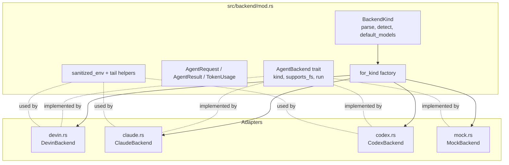
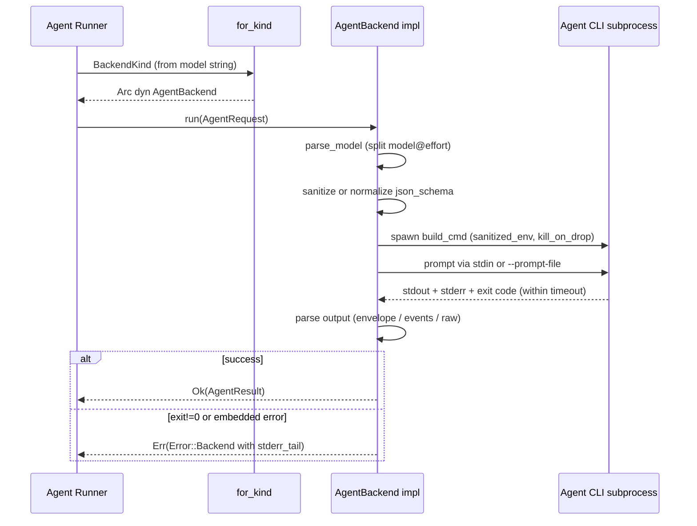

# LLM Backend Integration (`src/backend`)

## 1. Purpose

The `src/backend` module is agentwiki's substitute for a conventional LLM HTTP API client. Because the tool deliberately performs no inference of its own and manages no API keys, every model call is delegated to a locally installed, subscription-authenticated agent CLI — `devin` (Cognition), `claude` (Anthropic), or `codex` (OpenAI) — spawned as a subprocess. The module hides the three heterogeneous CLIs behind a single async trait, `AgentBackend`, so the agent runner in `src/agent/runner.rs` can treat "invoke the model" as one uniform operation regardless of which CLI is configured.

Responsibilities concentrated here:

- **Backend selection** — parsing `"<backend>:<model>"` strings, PATH auto-detection, and a single factory (`for_kind`).
- **Command construction** — one `build_cmd` per adapter assembles the full CLI invocation (flags, cwd, stdio piping).
- **Prompt delivery** — via stdin (`claude`, `codex`) or a temp `--prompt-file` (`devin`, to stay under argv limits).
- **Output normalization** — three different wire formats (JSON envelope, JSONL event stream, raw stdout) are parsed into the same `AgentResult`.
- **Schema adaptation** — schemars-produced JSON Schemas are rewritten into whatever subset each CLI accepts (`sanitize_schema`, `normalize_schema`).
- **Environment sanitization** — billing/session-related env vars are stripped so spawned CLIs can't silently switch to metered API auth.
- **Offline testing** — `MockBackend` provides a scripted in-process backend so the whole pipeline runs without any CLI installed.

## 2. Internal Structure



| File | Adapter | CLI invocation | Prompt channel | Output format |
|---|---|---|---|---|
| `devin.rs` | `DevinBackend` | `devin -p --prompt-file <tmp> --respect-workspace-trust false --permission-mode auto [--model m]` | Temp file | Raw stdout |
| `claude.rs` | `ClaudeBackend` | `claude -p --output-format json --no-session-persistence --permission-mode bypassPermissions --setting-sources local [--model m] [--effort e] [--json-schema s]` | stdin | Single JSON envelope |
| `codex.rs` | `CodexBackend` | `codex exec --skip-git-repo-check -s read-only --color never --ephemeral --disable hooks -c project_doc_max_bytes=0 --json -o <out> [-m m] [-c model_reasoning_effort=...] [--output-schema f] -` | stdin | JSONL event stream + `-o` file |
| `mock.rs` | `MockBackend` | none (in-process) | n/a | Handler-closure return |

Each adapter file is self-contained: model-string extension parsing (`model@effort`), `build_cmd`, the `run` implementation, and its output parser all live together. `for_kind` in `mod.rs` is the **only** `match` on `BackendKind` in the codebase — adding a backend is one new file plus one factory arm.

## 3. Key Interfaces

### `AgentBackend` (`src/backend/mod.rs`)

```rust
#[async_trait]
pub trait AgentBackend: Send + Sync {
    fn kind(&self) -> BackendKind;
    fn supports_fs(&self) -> bool;              // can the agent read files in cwd?
    async fn run(&self, req: AgentRequest) -> Result<AgentResult>;
}
```

- `supports_fs()` distinguishes **agentic mode** (the CLI can read the repo itself because `cwd` is the project root) from **embedded mode** (all materials must be inlined into the prompt). All real CLIs return `true`; `MockBackend` returns `false`, which lets tests exercise the embedded-materials path.
- Backends are held as `Arc<dyn AgentBackend>` inside `PipelineCtx` and resolved per call via `PipelineCtx::backend(kind)`.

### `AgentRequest`

```rust
pub struct AgentRequest {
    pub prompt: String,                 // fully rendered prompt
    pub model: Option<String>,          // passthrough model id (may carry @effort)
    pub cwd: PathBuf,                   // empty-cwd (embedded) or project root (agentic)
    pub timeout: Duration,              // per-call timeout
    pub agent: String,                  // agent name for span/log correlation
    pub json_schema: Option<Value>,     // enforced by codex/claude, ignored by devin
}
```

### `AgentResult`

```rust
pub struct AgentResult {
    pub text: String,                   // final message / stdout text
    pub backend: BackendKind,
    pub model: Option<String>,
    pub duration: Duration,             // wall-clock
    pub usage: Option<TokenUsage>,      // None when the CLI doesn't report it (devin, mock)
    pub stderr_tail: String,            // last 500 chars of stderr, kept even on success
}
```

### `BackendKind`

```rust
pub enum BackendKind { Devin, Claude, Codex, Mock }
```

- `BackendKind::parse("claude:sonnet@high")` → `(Claude, Some("sonnet@high"))`; bare `"claude"` → `(Claude, None)`. Unknown prefixes produce `Error::BackendNotAvailable`. `"mock"` and `"test"` both map to `Mock`.
- `BackendKind::detect()` probes PATH in preference order **devin → codex → claude** via `sys::find_on_path`, feeding profile defaults.
- `default_models()` returns the `(efficient, powerful)` pair per backend, e.g. `("claude:sonnet@low", "claude:sonnet@high")`, `("devin:swe-2-medium", "devin:swe-2-medium")`.
- `as_str()` gives the stable lowercase id used in logs, cache keys, and the `calls.jsonl` audit log.

## 4. Control Flow



Every real adapter shares the same spawn skeleton:

1. Parse `model@effort` — validation happens **before** spawn so a typo fails fast with a clear message rather than inside the CLI.
2. Prepare prompt/schema side-channels (temp files for devin/codex).
3. `build_cmd(...)` → `tokio::process::Command` with piped stdio, `current_dir(cwd)`, `kill_on_drop(true)`, `sanitized_env`.
4. Spawn; write the prompt to stdin and `shutdown()` it (claude/codex) or write the prompt file up front (devin).
5. `tokio::time::timeout(req.timeout, wait_with_output())` → `Error::Timeout` on expiry.
6. Parse stdout, check both the exit status **and** in-band error flags — both `claude` and `codex exec` can exit 0 on a failed turn.
7. Return `AgentResult`, or `Error::Backend { backend, message, stderr_tail }` where the parsed error text beats a bare exit code.

## 5. Adapter Details

### 5.1 Devin (`devin.rs`) — reference adapter

The minimal implementation. The prompt is written to a `NamedTempFile` and passed via `--prompt-file` because argv has length limits and the prompt can be tens of KB; stdin is explicitly `Stdio::null()`. Flags `--respect-workspace-trust false` and `--permission-mode auto` let read-only tools auto-approve while any edit attempt still prompts — and a print-mode prompt failure surfaces as a nonzero exit, which is preferred over a silent hang. There is no output envelope: trimmed stdout is the result text, `usage` is `None`.

### 5.2 Claude (`claude.rs`) — JSON envelope

- **Model strings:** `claude:<model>@<effort>` maps to `--model` + `--effort`; `EFFORTS = [low, medium, high, xhigh, max]` is validated in `parse_model` (`rsplit_once('@')`).
- **Invocation:** `-p` (print mode) with `--output-format json`, `--no-session-persistence`, `--permission-mode bypassPermissions`, and `--setting-sources local` so user/project `CLAUDE.md` and settings don't contaminate the prompt.
- **Structured output:** `req.json_schema` is passed inline via `--json-schema` after `sanitize_schema` recursively strips `$schema` keys — the CLI rejects the JSON Schema draft URI that schemars emits at the root.
- **`parse_envelope(stdout)` → `(text, usage, error)`:** prefers `structured_output` (present when `--json-schema` was given) over the `result` string. Token usage merges `input_tokens + cache_creation_input_tokens + cache_read_input_tokens` so `input` means total prompt tokens, matching codex semantics. `is_error` is checked explicitly — claude exits 0 on failed turns — with `errors[]` joined, falling back to `result`, prefixed by a non-success `subtype` (e.g. `error_max_turns: hit the turn limit`).
- **Fallback:** if the envelope is unparseable, raw stdout is used as the text, keeping plain-text output usable for downstream JSON extraction.

### 5.3 Codex (`codex.rs`) — event stream + strict schema normalization

- **Model strings:** `codex:<model>@<effort>` maps to `-m` + `-c model_reasoning_effort="..."`; accepts an extra `ultra` level claude lacks.
- **Invocation:** `codex exec` hardened for one-shot calls: `--skip-git-repo-check`, `-s read-only`, `--ephemeral` (no session files), `--disable hooks` (user `SessionStart` hooks would fire once per call), `-c project_doc_max_bytes=0` (keeps the repo's `AGENTS.md` out — prompt materials are agentwiki's job), `--json` for the event stream, `-o <file>` to capture the final message, and `-` to read the prompt from stdin.
- **`--output-schema`** takes a **file**, so the normalized schema is written to a `NamedTempFile` that must outlive the child.
- **`normalize_schema`** rewrites schemars output into codex's strict subset:
  - `$schema` removed; a `$ref` must stand alone (sibling keywords dropped, `allOf` banned).
  - `oneOf` is rejected — const-variants collapse to a plain `enum` (with a unified `type` when all variants share one), otherwise downgraded to `anyOf`.
  - Every object is closed: `additionalProperties: false` and `required` listing **all** properties; originally-optional fields stay optional by becoming nullable (`anyOf: [orig, {type: "null"}]`, skipped when `is_nullable` shows null already allowed).
- **`parse_events(stdout)`** scans the JSONL stream: last `item.completed` with `item.type == "agent_message"` is the text fallback; `turn.completed.usage` gives tokens (`output = output_tokens + reasoning_output_tokens`); `turn.failed`/`error` carry failure detail — again surfaced explicitly because exec exits 0 on failed turns.
- **Result text** prefers the `-o` file; the event stream's last agent message is the fallback.

### 5.4 Mock (`mock.rs`) — offline testing

`MockBackend` runs in-process behind the same trait:

- `MockBackend::new(handler)` takes a `Fn(&AgentRequest) -> Result<String, String>` closure — `Err` strings simulate a failing CLI.
- `MockBackend::canned(&[(agent, body)])` matches `req.agent` exactly, then by `name@target` prefix (so one entry covers a fan-out spec's instances), defaulting to `"{}"`.
- `with_delay(d)` injects a `tokio::time::sleep`, so cancellation still interrupts mid-flight — letting tests exercise cancel paths.
- `calls: Mutex<Vec<String>>` records every agent name seen for assertions.
- Wired in via `"mock:<anything>"` model strings plus backend injection into `PipelineCtx::new`. `for_kind(Mock)` yields `canned(&[])`.

## 6. Cross-Cutting Concerns

### Environment sanitization (`sanitized_env`)

```rust
const BANNED_PREFIXES: &[&str] = &[
    "ANTHROPIC_", "OPENAI_", "CLAUDE_API", "CODEX_API", "DEVIN_API", "OPENHANDS_",
];
```

Applied to every spawned command. If the operator's shell exports a metered API key (e.g. `ANTHROPIC_API_KEY`), an unsanitized child could silently switch from subscription auth to pay-per-token billing, or pick up session-confusing variables. The strip is prefix-based and opt-out-by-default.

### Process lifecycle

- `kill_on_drop(true)` on every `Command`: when a timeout fires or the pipeline's `CancellationToken` drops the `FuturesUnordered` future holding the `Child`, the CLI process is killed rather than orphaned — an orphan would keep spending calls with nobody to cache the result.
- Per-call timeout wraps `wait_with_output()`, producing `Error::Timeout { agent, secs }`.
- `tail(stderr, 500)` keeps the last 500 chars of stderr in `AgentResult.stderr_tail` even on success, and inside `Error::Backend` on failure — the primary diagnostic channel when a CLI misbehaves.

### Error mapping

All failures funnel into `crate::error::Error` variants: `BackendNotAvailable` (unknown backend string), `Backend { backend, message, stderr_tail }` (spawn failure, nonzero exit, in-band turn error), `Timeout { agent, secs }`. The runner's retry-with-feedback loop and Powerful-tier fallback consume these uniformly.

## 7. Notable Implementation Decisions

1. **Subprocesses over HTTP.** No HTTP client crate exists in the dependency tree — a deliberate design boundary. Auth (the hard part) is owned by the CLIs; agentwiki pays for it by owning three output-format parsers, which is the module's core complexity.
2. **In-band errors are first-class.** Both `claude` and `codex exec` return exit 0 on failed turns, so adapters parse `is_error` / `turn.failed` explicitly. Treating exit status alone as authoritative would silently accept failed calls.
3. **Fail-fast model validation.** `model@effort` is split and validated before spawn, so config typos produce `Error::Backend` with the valid effort list instead of a CLI-side failure after seconds of latency.
4. **Schema is best-effort, prompt carries the contract.** `json_schema` is enforced where supported (codex strictly, claude via `--json-schema`) and ignored by devin; the prompt's schema block remains the primary contract, and the runner's lenient parsing absorbs residual nonconformance.
5. **Single-point flag ownership.** Each adapter keeps the entire CLI invocation in one `build_cmd` — upstream flag changes are a single-point fix, which matters because CLI output-format/flag drift is the main external stability risk.
6. **Prompt channels differ deliberately.** Devin uses a temp file (argv limits), claude/codex use stdin (their natural print/exec modes). Stdin writers ignore write errors (`let _ =`) since a closed pipe will surface as a nonzero exit anyway.
7. **Usage semantics normalized.** Claude's input includes cache tokens; codex's output includes reasoning tokens — both so `TokenUsage` is comparable across backends for quota/audit reporting. Devin reports none (`usage: None`).

## 8. Associated Files

| File | Role |
|---|---|
| `src/backend/mod.rs` | `AgentBackend` trait, `AgentRequest`/`AgentResult`/`TokenUsage`, `BackendKind` (parse/detect/defaults), `for_kind` factory, `sanitized_env`, `tail` |
| `src/backend/devin.rs` | `DevinBackend` — `devin -p` via `--prompt-file`, raw stdout, reference adapter |
| `src/backend/claude.rs` | `ClaudeBackend` — `claude -p` JSON envelope, `--json-schema` + `sanitize_schema`, `model@effort` |
| `src/backend/codex.rs` | `CodexBackend` — `codex exec` JSONL events, `--output-schema` + `normalize_schema`, `-o` result file |
| `src/backend/mock.rs` | `MockBackend` — scripted handler, canned per-agent replies, simulated latency/errors, call recording |

Consumers: `src/agent/runner.rs` (issues `AgentRequest`s through cache/quota), `src/pipeline/mod.rs` (constructs the backend map from `models.efficient`/`powerful` config strings), `src/config.rs` (model strings and profiles), `src/doctor.rs` (probes CLI availability), `src/sys.rs` (`find_on_path` for `BackendKind::detect`).