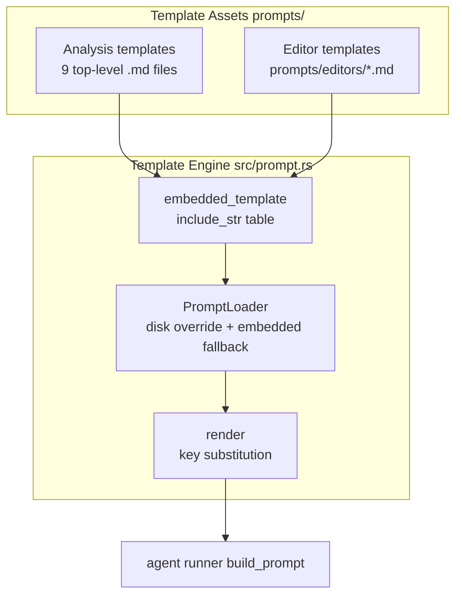
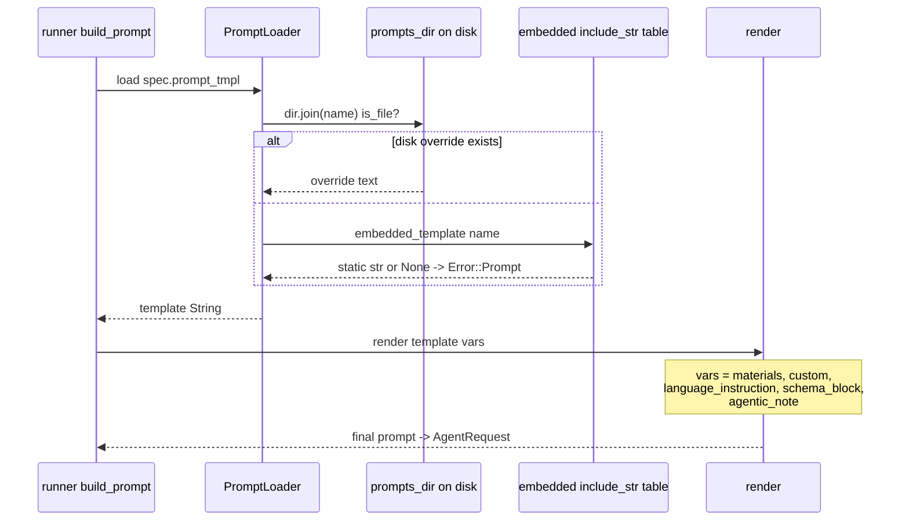

# Prompt Engineering Assets — Module Deep-Dive

**Code paths:** `prompts/`, `src/prompt.rs`
**Domain type:** Supporting domain — the instruction layer of the analysis pipeline.

## 1. Purpose

The Prompt Engineering Assets module is the textual contract between agentwiki's orchestration machinery and the external agent CLIs it drives. It consists of two halves:

1. **Template assets** — thirteen Markdown files under `prompts/` that define analyst personas ("You are a professional software analyst…"), output contracts (field names, scoring ranges, section structures, C4 standards), and shared Mermaid safety rules.
2. **A minimal template engine** — `src/prompt.rs`, which loads templates by relative name (preferring a disk override directory, falling back to `include_str!`-embedded copies compiled into the binary) and performs `{{key}}` placeholder substitution.

Because agentwiki owns no LLM inference, these templates are the entire "instruction surface" of the product: they must be precise about the JSON schemas agents must emit, terse enough to control cost, and robust enough that rendered output survives downstream verification (especially Mermaid linting in `output/verify.rs`).

## 2. Internal Structure



### 2.1 Analysis prompt templates (`prompts/*.md`)

Nine top-level templates, one per research-phase agent declared in `src/agent/registry.rs`:

| Template | Persona / role | Contract highlights |
|---|---|---|
| `dir_summary.md` | Directory summarizer | Importance scoring rubric (backend dirs rated above frontend at equal value); per-file insights with `code_purpose` enum, interfaces, dependencies |
| `relationships.md` | Dependency analyst | Emits `core_dependencies` — the claim set later consumed by `agentwiki drift` |
| `system_context.md` | System context analyst | Business value, external systems, system boundary |
| `domain_modules.md` | Domain/DDD analyst | Module decomposition, domain relations; also seeds `PerDomain` fan-out targets |
| `architecture.md` | Architecture analyst | Free-form architecture narrative (Powerful tier, no JSON schema) |
| `workflow.md` | Workflow analyst | Free-form business-flow narrative |
| `key_module.md` | Key-module analyst | Per-domain deep analysis (fan-out per domain) |
| `boundary.md` | Boundary detector | API/CLI/integration surface extraction |
| `database.md` | Database schema analyst | Tables, relationships, `erDiagram` material |

### 2.2 Editor prompt templates (`prompts/editors/*.md`)

Four templates drive the compose-phase editor agents that turn structured research into prose documents: `overview.md` (C4 SystemContext), `architecture_doc.md`, `workflow_doc.md`, `deep_dive.md`. Each embeds the shared **Mermaid Diagram Safety Rules** block — ASCII-only node IDs (`[A-Za-z0-9_]`), localized text only inside labels, node IDs defined before edge use, standard headers only (`graph TD`, `flowchart TD`, `sequenceDiagram`, `erDiagram`), no smart quotes or zero-width characters — which is the upstream counterpart to `verify::check_mermaid`'s heuristics.

The remaining two compose outputs (`boundary_doc`, `database_doc`) are deterministic `DetFn` renderers and therefore have **no** templates — their "prompt" is Rust formatting code in `src/output/boundary.rs` / `database.rs`.

### 2.3 Template engine (`src/prompt.rs`)

Deliberately tiny — about 90 lines:

- `render(template, vars)` — iterates a `HashMap<&str, String>` and does plain `String::replace` on `{{key}}`. Unknown placeholders are **left in place**, so JSON examples embedded in templates (e.g. `{{"a": 1}}`-style braces) survive rendering. This is a documented, tested invariant (`render_replaces_known_leaves_unknown`).
- `embedded!` macro — generates `embedded_template(name) -> Option<&'static str>`, a `match` table binding all 13 template names to `include_str!("../prompts/…")` contents, so the shipped binary is self-contained.
- `PromptLoader` — constructed once with `config.prompts_dir` (may be `None`). `load(name)` checks `dir.join(name).is_file()` first and reads the disk copy; otherwise falls back to the embedded table; unknown names return `Error::Prompt { name, message: "unknown template" }`.

## 3. Key Interfaces

```rust
pub fn render(template: &str, vars: &HashMap<&str, String>) -> String;

pub struct PromptLoader { dir: Option<PathBuf> }
impl PromptLoader {
    pub fn new(dir: Option<PathBuf>) -> Self;
    pub fn load(&self, name: &str) -> Result<String>;  // e.g. "system_context.md", "editors/overview.md"
}
```

Callers are `src/agent/runner.rs` (`build_prompt`) and the pipeline wiring in `src/pipeline/mod.rs`, which stores `PromptLoader::new(config.prompts_dir.clone())` on `PipelineCtx.prompts`.

## 4. Data & Control Flow



The standard placeholder slots the runner substitutes (visible across the templates) are:

- `{{materials}}` — rendered `ScanData` blocks plus upstream dependency results (`#### <display_name>` sections), character-capped by materials assembly.
- `{{custom}}` — per-instance block (e.g., the specific directory or domain a fan-out instance targets).
- `{{schema_block}}` — the JSON schema for structured-output agents (absent in free-form templates like `architecture.md`/`workflow.md`).
- `{{language_instruction}}` — output-language directive.
- `{{agentic_note}}` — embedded-mode agents get scan materials injected; agentic mode relies on the repo-as-cwd instead.

## 5. Notable Implementation Decisions

- **String replacement, not a template engine.** Handlebars/tera would choke on or mangle the JSON examples and Mermaid braces inside prompts. Plain `{{key}}` substitution with "unknown keys pass through" is both sufficient and safer; the unit test locks this in.
- **Embedded defaults with disk overrides.** `include_str!` keeps the single binary self-contained for end users, while `config.prompts_dir` lets contributors iterate on prompt wording without recompiling — a deliberate contributor-experience feature.
- **One template per agent spec.** `AgentSpec.prompt_tmpl` is a stable name resolved through `PromptLoader`, keeping the registry (`src/agent/registry.rs`) free of prompt text.
- **Shared Mermaid rules duplicated into each editor template.** Rather than a shared include (the engine has no include mechanism), the safety-rule block is repeated verbatim — a small redundancy traded for a trivially simple engine, with `verify::check_mermaid` as the downstream enforcement net.
- **Deterministic docs bypass the module entirely.** `boundary_doc` and `database_doc` render in Rust (including their own `mermaid_id` ASCII sanitizer), so not every pipeline output flows through templates.
- **Failure modes are narrow:** unknown template → `Error::Prompt`; unreadable disk override → `Error::io(path, …)`. There is no caching of template reads — each `load()` re-reads the override file, which keeps override edits live mid-development.

## 6. Associated Files

- `src/prompt.rs` — `render`, `PromptLoader`, `embedded!` table, unit test
- `prompts/dir_summary.md`, `prompts/relationships.md`, `prompts/system_context.md`, `prompts/domain_modules.md`, `prompts/architecture.md`, `prompts/workflow.md`, `prompts/key_module.md`, `prompts/boundary.md`, `prompts/database.md`
- `prompts/editors/overview.md`, `prompts/editors/architecture_doc.md`, `prompts/editors/workflow_doc.md`, `prompts/editors/deep_dive.md`
- Consumers: `src/agent/runner.rs` (`build_prompt`), `src/pipeline/mod.rs` (loader construction), `src/agent/registry.rs` (`prompt_tmpl` names), `src/config.rs` (`prompts_dir`)