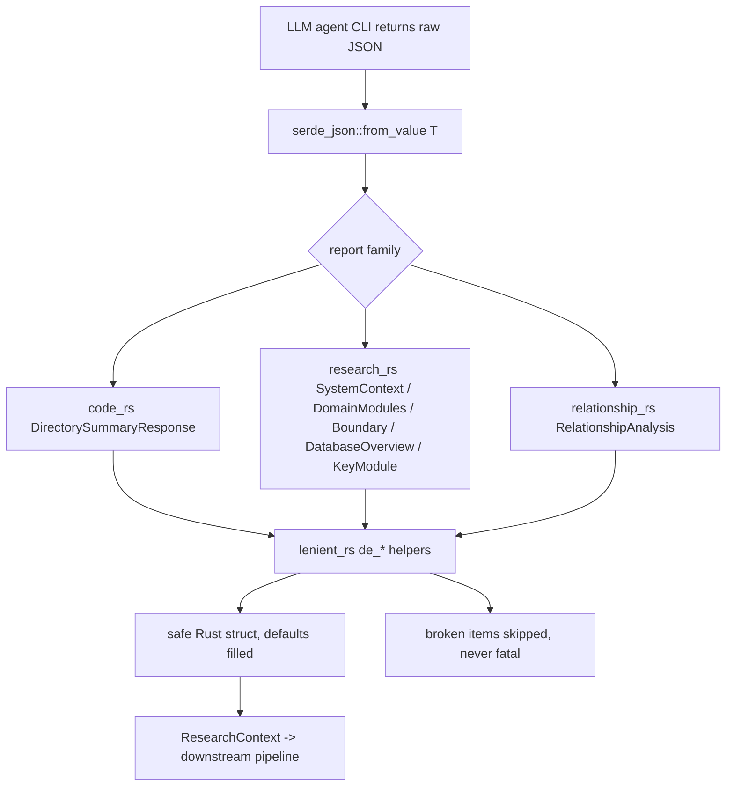
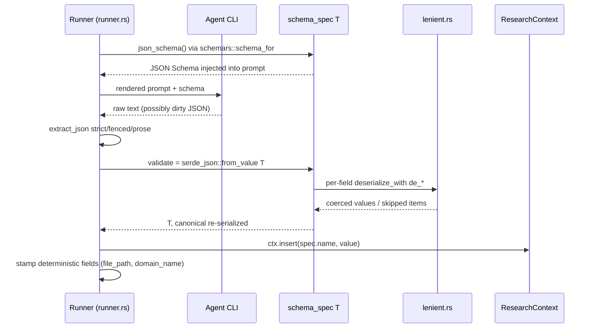

# Module Deep-Dive: `agent::reports` — Report Contracts & Anti-Corruption Layer

## 1. Purpose

`src/agent/reports` is the anti-corruption layer (ACL) between untrusted LLM output and the otherwise pure-Rust pipeline. Agent CLIs (`devin`, `claude`, `codex`) are asked to return JSON conforming to declared schemas, but in practice they return "dirty" JSON: numbers serialized as strings (`"8"`), objects where strings are expected (`{"name": ...}`), bare strings inside object arrays, enum labels in arbitrary free text, or a whole object embedded as a JSON-encoded string. Rather than rejecting this output — which would burn retry attempts and quota — the module coerces every value into well-typed structs.

The module has two faces:

1. **Schema contracts** — every report type derives `serde::Deserialize` *and* `schemars::JsonSchema`, so the same type both (a) generates the JSON Schema injected into prompts via `schema_spec::<T>()` and (b) validates/normalizes the response.
2. **Lenient deserialization** — a shared toolkit in `lenient.rs` of `de_*` helpers, wired into fields via `#[serde(deserialize_with = ...)]`, that never fails on type mismatches.

## 2. Internal Structure

| File | Lines | Role |
|---|---|---|
| `src/agent/reports.rs` | 22 | Façade: declares submodules and re-exports ~30 public types so consumers write `agent::reports::X` |
| `src/agent/reports/lenient.rs` | 206 | Pure coercion helpers (`de_string`, `de_f64`, `de_bool`, `de_vec_obj`, …) shared by all schemas |
| `src/agent/reports/code.rs` | 442 | `dir_summary` fan-out schema: `DirectorySummaryResponse`, `FileInsight`, `InterfaceInfo`, `Dependency`, `ParameterInfo`, `DirectoryDossier`, enums `CodePurpose` (25 variants) and `DirectoryPurpose` |
| `src/agent/reports/research.rs` | 1097 | The four large research reports — `SystemContextReport`, `DomainModulesReport`, `BoundaryAnalysisReport`, `DatabaseOverviewReport` — plus `KeyModuleReport` and ~25 child structs (`UserPersona`, `BusinessFlow`, `CLIBoundary`, `DatabaseTable`, `DataFlow`, …) |
| `src/agent/reports/relationship.rs` | 154 | `RelationshipAnalysis` (`CoreDependency`, `ArchitectureLayer`) and `DependencyType` enum |

## 3. Key Interfaces

### 3.1 Lenient deserializer toolkit (`lenient.rs`)

All helpers are pure functions over `serde_json::Value`:

- `any_to_string(v)` — flatten any JSON value to text (arrays/objects are re-serialized).
- `json_value_to_string(v)` — like `any_to_string`, but for objects it digs through a priority list of text-ish keys (`name`, `module`, `path`, `summary`, `description`, `title`, `value`, `text`, `id`) recursively before falling back to re-serialization.
- `de_string` / `de_opt_string` — any value → `String` / `Option<String>` (blank → `None`).
- `de_f64`, `de_usize`, `de_u8` — accept numbers, numeric strings, or bools; `usize` clamped ≥ 0, `u8` clamped to `0..=255`.
- `de_bool` — accepts `bool`, nonzero numbers, and `"true"/"yes"/"y"/"1"` strings.
- `de_vec_string` — array → `Vec<String>` (each element via `any_to_string`, blanks dropped); a bare scalar becomes a one-element vector.
- `de_vec_obj<T, F>(fallback)` — the workhorse: parse each array element with `serde_json::from_value::<T>`; elements that fail are **skipped**, and non-object scalars (e.g. plain strings) are given a second chance through the caller-supplied `fallback` closure that builds a `T` (typically stuffing the string into a `name`-like field). A lone object is wrapped as a single-element vector.

### 3.2 Schema façade (`reports.rs`)

Single import surface: `pub use code::{...}`, `relationship::{...}`, `research::{...}`.

### 3.3 Label-mapping helpers

- `CodePurpose::map_from_raw(&str)` — normalizes a free-text label (lowercase, strip non-alphanumerics) then substring-matches ~25 keyword rules to the closest enum variant; falls back to `Other`.
- `DependencyType::map_from_raw` / `as_str` — same idea for 6 edge kinds; `as_str` emits stable labels (`"function_call"`, …) for prompts/reports.
- `ProjectType::map_from_raw` — exact-match table for 9 project kinds.
- `classify_directory_purpose(name)` — deterministic (non-LLM) heuristic mapping directory names (`src`, `db`, `tests`, `docs`, …) to `DirectoryPurpose`.

## 4. Data & Control Flow

Three integration points matter:

1. **Prompt contract**: `schema_spec::<T>()` (in `spec.rs`) produces the JSON Schema that tells the model exactly what shape to emit — the schema and the parser cannot drift apart because they come from the same type.
2. **Canonicalization**: `schema_spec`'s `validate` deserializes then **re-serializes**, so what lands in `ResearchContext` is always clean canonical JSON regardless of input dirtiness. It also retries a sole-element array wrap (`[T]` → `T`) since models sometimes wrap the root object in an array.
3. **Deterministic enrichment**: some fields are filled by the runner, not the model — `FileInsight::file_path` is assigned after parse, `DirectoryDossier` is assembled from `DirectorySummaryResponse` + scanner metadata (`path`, `file_count`, `subdirectory_count`, `purpose` via `classify_directory_purpose`), and `KeyModuleReport::domain_name` is stamped because models don't echo it reliably.

## 5. Report Schema Inventory

| Agent spec | Report type | Key children |
|---|---|---|
| `dir_summary` (PerDir fan-out) | `DirectorySummaryResponse` | `FileInsight` → `InterfaceInfo`, `Dependency`, `ParameterInfo`; aggregated into `DirectoryDossier` |
| `system_context` | `SystemContextReport` | `UserPersona`, `ExternalSystem`, `SystemBoundary`, `ProjectType` |
| `domain_modules` | `DomainModulesReport` | `DomainModule` → `SubModule`; `DomainRelation`; `BusinessFlow` → `BusinessFlowStep` |
| `key_module` (PerDomain fan-out) | `KeyModuleReport` | flat struct incl. `flowchart_mermaid`, `sequence_diagram_mermaid` |
| `boundary` | `BoundaryAnalysisReport` | `CLIBoundary` → `CLIArgument`/`CLIOption`; `APIBoundary`; `RouterBoundary` → `RouterParam`; `IntegrationSuggestion` |
| `database` | `DatabaseOverviewReport` | `DatabaseProject`, `DatabaseTable` → `TableColumn`, `DatabaseView`, `StoredProcedure`/`DatabaseFunction` → `ProcedureParameter`, `TableRelationship`, `DataFlow` |
| `relationships` | `RelationshipAnalysis` | `CoreDependency` (`DependencyType`), `ArchitectureLayer` |

Every struct uses `#[serde(default)]` at both the struct level and on each field, so any subset of missing fields still yields a usable value.

## 6. Notable Implementation Decisions

- **Never-fail parsing is deliberate.** The design trades silent data loss (a malformed array element is skipped) for pipeline resilience — a partial report is more useful than a retry loop. Broken items are filtered, not surfaced as errors. One exception: `de_system_boundary` *can* return an error, but only for shapes it cannot salvage; it even accepts a JSON-encoded string containing the object (a real observed LLM failure mode) and re-parses it.
- **`de_vec_obj` fallback closures encode domain judgment.** Most `de_vec_*` wrappers salvage a bare string into the most meaningful field — `DomainModule::name`, `CLIBoundary::command`, `APIBoundary::endpoint`, `RouterBoundary::path`, `IntegrationSuggestion::description`, `ExternalSystem::name` (with `interaction_type: "unknown"`). Where no meaningful salvage exists (`DomainRelation`, `CoreDependency`, `ArchitectureLayer`, `TableRelationship`), the fallback is `|_| None` — the entry is dropped rather than invented.
- **`de_vec_flow_step` is specialized**: bare-string steps aren't dropped; they become `BusinessFlowStep { step: idx + 1, operation }` preserving order.
- **Enum deserialization goes through `map_from_raw`, not serde's derive.** LLMs emit labels like `"function call"`, `"Backend Service"`, `"entry point"` — substring/alias matching maps them to variants deterministically, defaulting to `Other`/`Module` rather than failing.
- **`DirectoryDossier` does not derive `JsonSchema`** — it's a runner-side aggregate, not an LLM contract; same for `file_path` being excluded from lenient coercion (runner-assigned).
- **Ported from deepwiki-rs** — the coercion strategy and `CodePurpose` taxonomy are ports, keeping behavioral parity with the original tool.
- **Per-file unit tests** verify dirty-JSON handling (mixed types, stringified numbers, objects-instead-of-strings, garbage entries filtered) — e.g. `dir_summary_lenient_parse`, `lenient_parse_mixed_types`, `system_context_lenient`, `boundary_lenient_shapes`.

## 7. Consumers

- `agent::registry` — `schema_spec::<reports::X>()` for `dir_summary`, `relationships`, `system_context`, `domain_modules`, `database`, `key_module`, `boundary` specs.
- `agent::runner` — `serde_json::from_value::<DirectorySummaryResponse>` (dir fan-out), `RelationshipAnalysis`, plus `dossiers()` building `DirectoryDossier`.
- `agent::materials` — formats `FileInsight`/`DirectoryDossier`/relationship data into prompt blocks.
- `output::boundary` / `output::database` — `serde_json::from_value` into `BoundaryAnalysisReport`/`DatabaseOverviewReport` for deterministic Markdown rendering.
- `agent::context` — `get_typed::<DomainModulesReport>` etc. when downstream agents read prior results.

## 8. Associated Files

- `src/agent/reports.rs`
- `src/agent/reports/code.rs`
- `src/agent/reports/research.rs`
- `src/agent/reports/relationship.rs`
- `src/agent/reports/lenient.rs`