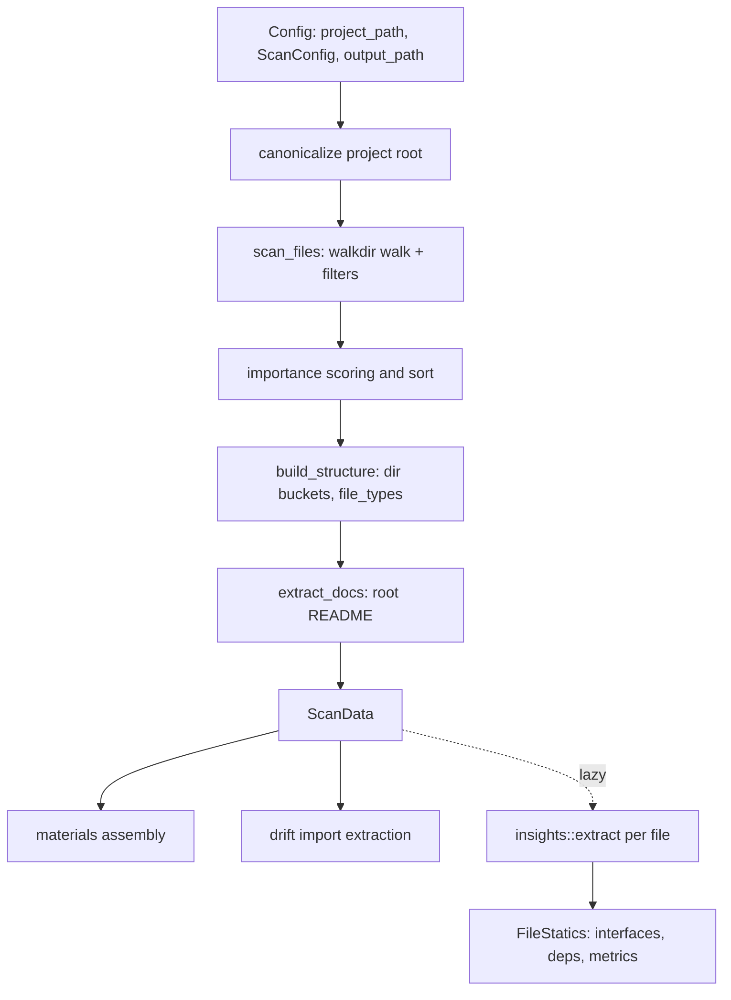
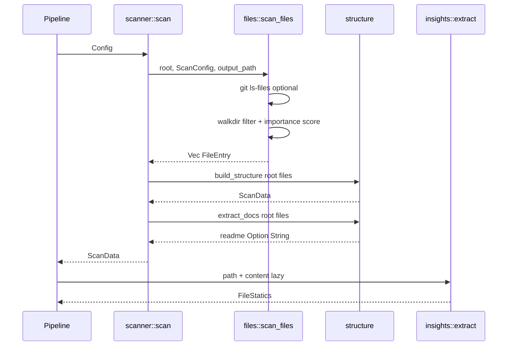

# Repository Scanning & Preprocessing — `src/scanner`

## 1. Purpose

The scanner is **Phase 0** of the agentwiki pipeline — a fully deterministic preprocessing stage that makes **no AI calls**. It walks the target repository under configurable exclusion rules, builds the project's structural model, detects the file inventory and README material, and produces the `ScanData` aggregate consumed downstream by:

- **Prompt materials assembly** (`src/agent/materials.rs`) — project structure trees, README excerpts, per-directory dossiers for `dir_summary` fan-out.
- **Drift verification** (`src/drift/`) — the file inventory feeds static import extraction and file-graph construction.
- **Deterministic compose renderers** (`boundary_doc`, `database_doc`) — receive `ScanData` directly as part of the `DetFn` signature.



## 2. Internal Structure

| File | Responsibility |
|---|---|
| `src/scanner/mod.rs` | Orchestration entry point `scan(config) -> Result<ScanData>`; re-exports the public API. |
| `src/scanner/files.rs` | Filesystem walk: exclusion rules, git-tracked filter, binary detection, importance scoring. Produces `Vec<FileEntry>`. |
| `src/scanner/structure.rs` | Groups files into `DirectoryInfo` buckets, builds `ScanData`, extracts README, renders prompt trees, `read_capped`. |
| `src/scanner/insights.rs` | Regex-based, language-aware per-file statics (interfaces, imports, metrics), computed lazily during prompt building. |

## 3. Key Types and Interfaces

### Public API (re-exported from `scanner::mod`)

```rust
pub fn scan(config: &Config) -> Result<ScanData>          // Phase-0 entry point
pub fn scan_files(root, cfg: &ScanConfig, output_path) -> Result<Vec<FileEntry>>
pub fn build_structure(root, files) -> ScanData
pub fn extract(path: &Path, content: &str) -> FileStatics // insights
```

### `ScanData` (structure.rs)

The immutable artifact handed to the rest of the pipeline:

- `project_name`, `root` — identity of the scanned repo
- `files: Vec<FileEntry>` — all included files, **sorted by descending importance_score** then `rel_path`
- `directories: Vec<DirectoryInfo>` — directories containing ≥1 included file; these become the `PerDir` fan-out targets for `dir_summary`
- `file_types: HashMap<String, usize>` — extension histogram
- `readme: Option<String>` — root-level README content

### `FileEntry` (files.rs)

`rel_path`, `abs_path`, `name`, `size`, lowercase `extension`, and a heuristic `importance_score` in 0.0–1.0.

### `FileStatics` (insights.rs)

Per-file extraction result: `interfaces` (`ExtractedInterface` with name/`interface_type`/single-line signature capped at 160 chars), `dependencies` (`ExtractedDependency` with `is_external` heuristic), and `metrics` (`FileMetrics`: non-empty LOC, function/class counts, cyclomatic complexity).

## 4. The Scan Pipeline

`scanner::scan` (`mod.rs`) is deliberately thin:

1. **Canonicalize** `config.project_path` (errors surface as `Error::io` with path context).
2. **`scan_files`** — WalkDir walk bounded by `cfg.max_depth`, no symlink following.
3. **`build_structure`** — bucket files into directories, count extension histogram.
4. **`extract_docs`** — find a root-level file whose name starts with `readme` and read it.
5. Emit `tracing::info!` with file/dir counts.

### 4.1 File filtering (files.rs)

A `filter_entry` closure prunes directories before descent; surviving files pass a filter chain:

| Filter | Detail |
|---|---|
| Always-excluded dirs | `.agentwiki`, `.git`, `.hg`, `.svn` — regardless of config |
| Hidden entries | skipped unless `cfg.include_hidden` (dirs and files) |
| User exclusions | `cfg.excluded_dirs` (case-insensitive name match); `cfg.excluded_files` glob patterns matched against lowercased file names |
| Output dir | anything under canonicalized `output_path` is skipped — agentwiki never ingests its own output |
| Binary extensions | `BINARY_EXTENSIONS` list (images, archives, objects, fonts, …) |
| Git-tracked | when `cfg.git_tracked_only`, `git ls-files -z` builds a `HashSet<PathBuf>`; empty result logs a warning and falls back to scanning all files |
| Size cap | `size > cfg.max_file_size` skipped |
| NUL sniff | first 4096 bytes checked for a NUL byte — catches extensionless binaries |

### 4.2 Importance scoring (files.rs)

`importance()` is a heuristic ported from deepwiki-rs, capped at 1.0:

- **Path keywords**: `cmd`/`internal`/`pkg` +0.3; `main`/`index` +0.15; `config`/`setup` +0.1; `database`/`schema`/`migrations` +0.15
- **Size band**: 1–50 KB files +0.15 (large enough to matter, small enough to be a unit)
- **Extension tiers**: systems languages (rs/py/go/java/…) +0.4; sql +0.3; jsx/tsx/vue/svelte and csproj/sln +0.2; js/ts and gradle/pom +0.15; config formats +0.1; css/html +0.05

The descending-score sort means prompt builders that truncate file lists keep the most significant files.

### 4.3 Structure building (structure.rs)

`build_structure` buckets `FileEntry` clones into a `BTreeMap<PathBuf, Vec<FileEntry>>` keyed by parent dir (root files key on the empty path). `subdirectory_count` counts **direct** children only. Empty on-disk directories are intentionally invisible — `dir_summary` only needs directories with content. Directories are sorted by `rel_path` for deterministic output.

### 4.4 Prompt formatting helpers (structure.rs)

- `format_as_tree` — full file tree via a `PathNode` trie (`BTreeMap` children, directories-first ordering, `└──`/`├──` glyphs).
- `format_as_directory_tree` — directories-only variant used when file counts exceed prompt limits.
- `read_capped(path, max_chars)` — reads a file for prompt embedding, truncating by **chars** (not bytes) and appending `\n[truncated]`.

## 5. Code Insight Collection (insights.rs)

A lightweight, regex-based stand-in for deepwiki-rs's `language_processors` — no AST, deliberately bounded scope. Statics are computed **lazily** during prompt building (`FileStatics::for_entry`), not during `scan()`.

`rules_for(ext)` maps extensions to `LangRules { funcs, types, imports, branches }`:

| Language family | Extensions |
|---|---|
| Rust | `rs` |
| Python | `py`, `pyw` |
| JS/TS | `js`, `mjs`, `cjs`, `jsx`, `ts`, `tsx` |
| Go | `go` |
| JVM | `java`, `kt`, `scala` |
| C-family | `c`, `h`, `cpp`, `cc`, `hpp`, `cs` |
| Scripting/SQL | `rb`, `php`, `swift`, `dart`, `m`, `sh`, `sql` |
| Default | everything else (branch keywords only) |

Extraction details:

- **Regex memoization**: `cached_regex` stores compiled patterns in a global `LazyLock<Mutex<HashMap>>` so each pattern compiles once per process.
- **Dedup & caps**: a `HashSet` keys results as `f:`/`t:`/`d:`; caps are 60 functions, 40 types, 40 imports per file.
- **Signatures**: `signature_line` extracts the full line containing the match start, capped at 160 chars.
- **`is_external`**: true unless the import starts with `.`, `crate`, `self`, or `super`.
- **Cyclomatic complexity**: sum of literal branch-keyword occurrences (`if `, `for `, `match `, `?`, …) — an approximation, not a real CFG metric.

## 6. Data and Control Flow



## 7. Notable Implementation Decisions

- **Deterministic and synchronous**: the whole stage is plain std/fs code — no async, no AI — so it is cheap, testable, and safe to rerun for both the pipeline and the read-only `drift` command.
- **Self-exclusion**: both `.agentwiki` state and the configured output dir are excluded, preventing the tool from feeding its own generated docs back into analysis.
- **Git-tracked filtering degrades gracefully**: `git ls-files` failure or an empty result produces a warning and a full scan rather than an error.
- **Two-layer binary detection**: extension blocklist plus NUL-byte sniffing handles extensionless binaries without external dependencies.
- **Laziness for statics**: `FileStatics` extraction runs only for files actually embedded in prompts, keeping Phase-0 latency proportional to repo size, not analysis breadth.
- **Bounded heuristics over correctness**: regex extraction, literal-keyword complexity, and substring path scoring trade precision for zero-dependency speed — acceptable because the output seeds LLM prompts rather than driving verification. (Drift's *own* import extraction lives separately under `src/drift/imports/` with stricter sanitization.)
- **Deterministic ordering everywhere**: importance-then-path file sort, `BTreeMap` directory bucketing, sorted directory list — downstream prompts and fan-out targets are stable across runs.

## 8. Associated Files

- `src/scanner/mod.rs` — `scan()` orchestration, public re-exports
- `src/scanner/files.rs` — walk, filters, `FileEntry`, importance scoring
- `src/scanner/structure.rs` — `ScanData`, `DirectoryInfo`, tree formatters, `read_capped`
- `src/scanner/insights.rs` — `FileStatics`, `LangRules`, regex extraction

**Consumers**: `src/pipeline/mod.rs` (invokes `scan` inside `PipelineCtx::new`), `src/agent/materials.rs` (prompt blocks), `src/agent/spec.rs` (`PerDir` fan-out over `scan.directories`), `src/drift/mod.rs` (file inventory for the import graph), `src/output/boundary.rs` / `database.rs` (`DetFn` renderers).