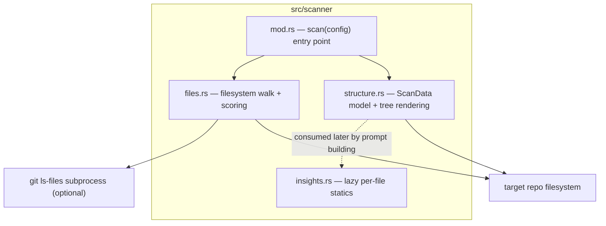
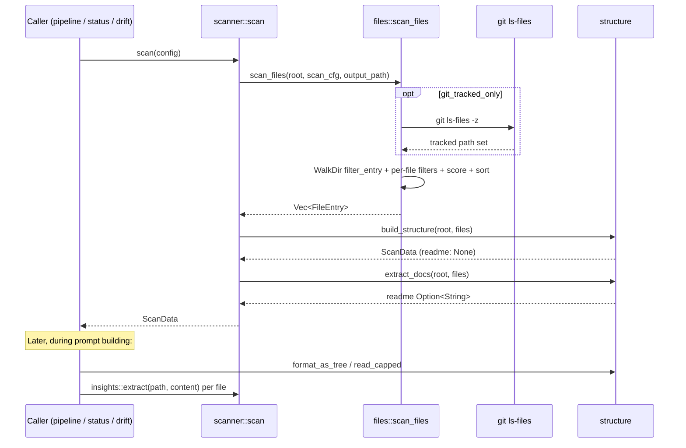

# Repository Scanning — Module Deep Dive

**Module path:** `src/scanner/` · **Domain type:** Supporting · **Pipeline position:** Phase 0 (deterministic, no LLM calls)

## 1. Purpose

The scanner is agentwiki's Phase-0 preprocessing stage. Before any LLM backend is invoked, it deterministically walks the target repository and produces `ScanData` — the structured model of the codebase (file set, directory tree, README extract, extension histogram) that every downstream stage consumes:

- The **pipeline orchestrator** uses `ScanData.directories` as the fan-out axis for `dir_summary` research agents.
- **Prompt building** (`src/agent/materials.rs`) renders the tree view via `format_as_tree` / `format_as_directory_tree` and lazily computes per-file `FileStatics` to seed prompts with symbol names.
- The **drift engine** reuses the file set as the universe over which import extraction and claim verification run.
- The **manifest** fingerprints scan inputs to gate incremental regeneration.

Because it is entirely deterministic and free (no AI calls, no network), it also serves `agentwiki status` and `agentwiki drift` as a cheap, read-only view of the repo.

## 2. Internal Structure



| File | Responsibility |
|---|---|
| `src/scanner/mod.rs` | Re-exports the public surface; `scan(&Config)` orchestrates walk → structure → README extraction. |
| `src/scanner/files.rs` | `FileEntry`, exclusion constants, `scan_files` traversal, git-tracked filter, `importance` scoring heuristic. |
| `src/scanner/structure.rs` | `ScanData` / `DirectoryInfo` model, `build_structure`, `extract_docs`, `format_as_tree`, `format_as_directory_tree`, `read_capped`. |
| `src/scanner/insights.rs` | `FileStatics`, `FileMetrics`, `ExtractedInterface`, `ExtractedDependency`; per-language regex rule table and `extract`. |

## 3. Key Interfaces

### `scan(config: &Config) -> Result<ScanData>` — `mod.rs:20`

The single entry point. Canonicalizes `config.project_path`, then runs `scan_files` → `build_structure` → `extract_docs` in sequence. Emits a `tracing::info!` with file/dir counts. Note the doc comment: `FileStatics` are **not** computed here — they are produced lazily by `FileStatics::for_entry`/`extract` inside prompt building.

### Core data types

```rust
// files.rs — one scannable file
pub struct FileEntry {
    pub rel_path: PathBuf,          // repo-relative path
    pub abs_path: PathBuf,
    pub name: String,
    pub size: u64,
    pub extension: Option<String>,  // lowercased
    pub importance_score: f64,      // heuristic 0.0–1.0
}

// structure.rs — a dir_summary fan-out target
pub struct DirectoryInfo {
    pub path: PathBuf,
    pub rel_path: PathBuf,          // "." / empty for root
    pub name: String,
    pub files: Vec<FileEntry>,      // direct children only
    pub subdirectory_count: usize,  // immediate subdirs containing files
}

// structure.rs — the Phase-0 output
pub struct ScanData {
    pub project_name: String,       // root dir basename
    pub root: PathBuf,
    pub files: Vec<FileEntry>,      // importance-sorted, descending
    pub directories: Vec<DirectoryInfo>,
    pub file_types: HashMap<String, usize>, // ext → count histogram
    pub readme: Option<String>,
}
```

### `extract(path: &Path, content: &str) -> FileStatics` — `insights.rs:175`

Per-file heuristic static analysis. Returns `interfaces` (functions/types with single-line signatures), `dependencies` (imports classified `is_external`), and `metrics` (non-empty LOC, function/type counts, branch-keyword cyclomatic complexity).

### Rendering / reading helpers (public, not re-exported through `mod.rs`)

- `format_as_tree(&ScanData)` — file-level tree wrapped in a `### Project Structure Information` markdown block.
- `format_as_directory_tree(&ScanData)` — directories-only variant used when file count exceeds a prompt limit.
- `read_capped(path, max_chars)` — reads file content for prompt embedding, truncating by **char count** with a `\n[truncated]` marker.

## 4. Control Flow



### File acceptance pipeline (`scan_files`, `files.rs:42`)

Each file must survive this ordered filter chain:

1. **Directory pruning** via `WalkDir::filter_entry`: `ALWAYS_EXCLUDED_DIRS` (`.agentwiki`, `.git`, `.hg`, `.svn`), hidden dirs unless `include_hidden`, and `cfg.excluded_dirs` (case-insensitive). Pruning at the directory level avoids descending into excluded trees at all.
2. **Output-path exclusion**: files whose canonicalized path sits under `config.output_path` are skipped — the tool never ingests its own generated docs.
3. **Hidden files** (name starts with `.`) unless `include_hidden`.
4. **Glob exclusions**: `cfg.excluded_files` compiled to `glob::Pattern`s, matched against the lowercased file name.
5. **Binary extension denylist**: `BINARY_EXTENSIONS` (~40 entries: images, archives, binaries, fonts, `pyc`, `db`, …).
6. **Git-tracked filter**: when `cfg.git_tracked_only`, a `git ls-files -z` subprocess produces a `HashSet<PathBuf>` of tracked rel-paths. If git is unavailable or the set is empty, the filter degrades gracefully to "scan everything" with a warning (`files.rs:48`).
7. **Size cap**: `size > cfg.max_file_size` → skip.
8. **NUL-byte sniffing**: `is_binary_by_content` reads the first 4096 bytes and rejects files containing a `0x00` — catches extensionless binaries that evade the denylist.

Traversal settings: `max_depth` from `ScanConfig`, `follow_links(false)` (symlinks never followed, preventing cycles and escapes from the project root).

### Importance scoring (`importance`, `files.rs:192`)

An additive heuristic ported from deepwiki-rs, capped at 1.0:

| Signal | Score |
|---|---|
| Path contains `cmd`/`internal`/`pkg` | +0.30 |
| Path contains `main`/`index` | +0.15 |
| Path contains `config`/`setup` | +0.10 |
| Size in (1 KiB, 50 KiB) | +0.15 |
| Compiled-language ext (`rs`, `py`, `go`, `java`, `cpp`, …) | +0.40 |
| `sql`/`sqlproj` | +0.30 |
| Frontend component ext (`jsx`/`tsx`/`vue`/`svelte`) | +0.20 |
| `js`/`ts`/`mjs`/`cjs` | +0.15 |
| Data/config ext (`toml`/`yaml`/`json`/`xml`/`ini`) | +0.10 |
| Markup ext (`css`/`html`/…) | +0.05 |
| Path contains `database`/`schema`/`migrations` | +0.15 |

Files are sorted descending by score with `rel_path` as the deterministic tiebreak (`files.rs:139`), so downstream prompt truncation keeps the most architecturally significant files first.

### Structure building (`build_structure`, `structure.rs:42`)

- Files are bucketed by parent rel-path in a `BTreeMap` → one `DirectoryInfo` per directory **that contains at least one included file**. Empty directories are invisible by design — `dir_summary` only needs directories with content.
- `subdirectory_count` counts distinct immediate children among the *populated* dir set (not the raw filesystem).
- `project_name` is the root basename, falling back to `"project"`; `file_types` is an extension histogram used in prompts/status.

### README extraction (`extract_docs`, `structure.rs:113`)

Finds the first root-level file (empty parent path) whose name starts with `readme` (case-insensitive), reads it, and rejects empty/whitespace-only content. Only the repo root is considered — nested READMEs are not surfaced.

## 5. Lazy File Statics (`insights.rs`)

`extract` is a regex-based stand-in for deepwiki-rs's language processors — explicitly **not** an AST parser (matching the system boundary: "no full AST parsing").

- **Language dispatch**: `rules_for(ext)` selects a `LangRules` table of regex patterns for functions, types, imports, and branch keywords. Covered: Rust, Python, JS/TS family, Go, Java/Kotlin/Scala, C-family/C#, and a grab-bag (`rb`/`php`/`swift`/`dart`/`m`/`sh`/`sql` — note the same table also matches `CREATE TABLE` in SQL). Unknown extensions get an empty-rule fallback with generic branch keywords.
- **Regex cache**: patterns compile once through a global `LazyLock<Mutex<HashMap<String, Regex>>>` (`cached_regex`, `insights.rs:161`) — compiled regexes are cloned per use, so the lock is held only for the lookup.
- **Dedup & caps**: a `seen` HashSet keyed `f:`/`t:`/`d:` deduplicates symbols across overlapping patterns; captures are capped at 60 functions and 40 types/imports per file to bound prompt size on pathological inputs.
- **Externality heuristic**: an import is internal iff it starts with `.`, `crate`, `self`, or `super`; everything else is `is_external = true`. Trailing `.*` (Java wildcard imports) is stripped.
- **Signatures**: `signature_line` extracts the full source line containing the match offset, trimmed and capped at 160 chars — a `name(a: T) -> R`-style one-liner for prompt display.
- **Cyclomatic complexity** is a plain substring count of branch keywords (`if `, `for `, `match `, `?`, …) — intentionally approximate, cheap, and good enough for ranking.

## 6. Notable Implementation Decisions

- **Determinism as a contract**: every ordering is stable (`BTreeMap` bucketing, `rel_path` tiebreaks, dirs-first tree sort), which makes manifest fingerprints and test fixtures reproducible.
- **Cost boundary hygiene**: the only subprocess spawned is `git ls-files` — and only when configured. Everything else is pure filesystem work; cache/quota governance in the runner never has to reason about scan costs.
- **Lazy statics**: `FileStatics` extraction is deferred to prompt building rather than computed eagerly in `scan()`, so a scan that feeds only `status`/`drift` or manifest diffing pays zero regex cost.
- **Graceful degradation everywhere**: missing git → scan all files; uncanonicalizable output path → lexical fallback; unreadable README → `None`; uncompilable regex → pattern skipped. The scan phase is designed to never be the reason a run fails.
- **Heuristic over precision**: binary detection, importance scoring, and cyclomatic complexity all trade accuracy for speed and zero dependencies — appropriate for prompt material, though it bounds fidelity (e.g., regex function extraction can miss macro-generated code or match commented-out signatures).
- **Self-exclusion**: `.agentwiki` and the configured output directory are both excluded, keeping the tool's own state out of its input — important because generated Markdown would otherwise pollute subsequent scans.

## 7. Associated Files

- `src/scanner/mod.rs` — orchestration entry point and re-exports
- `src/scanner/files.rs` — traversal, filters, git integration, scoring
- `src/scanner/structure.rs` — `ScanData`/`DirectoryInfo`, tree rendering, `read_capped`
- `src/scanner/insights.rs` — `FileStatics` extraction rule tables
- Depends on: `src/config.rs` (`Config`, `ScanConfig`), `src/error.rs` (`Error`, `Result`)
- External crates: `walkdir`, `glob`, `regex`, `tracing`
- Consumers: `src/pipeline/` (Phase-0 input), `src/agent/materials.rs` (tree + statics for prompts), `src/drift/` (file set for import extraction), `src/manifest.rs` / `src/status.rs` (incremental diffing)