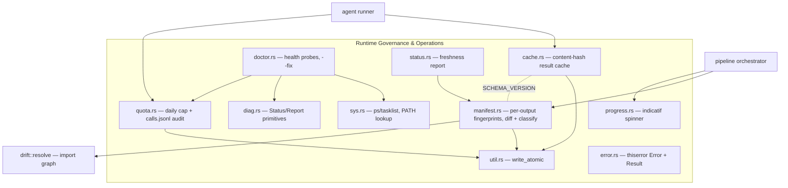
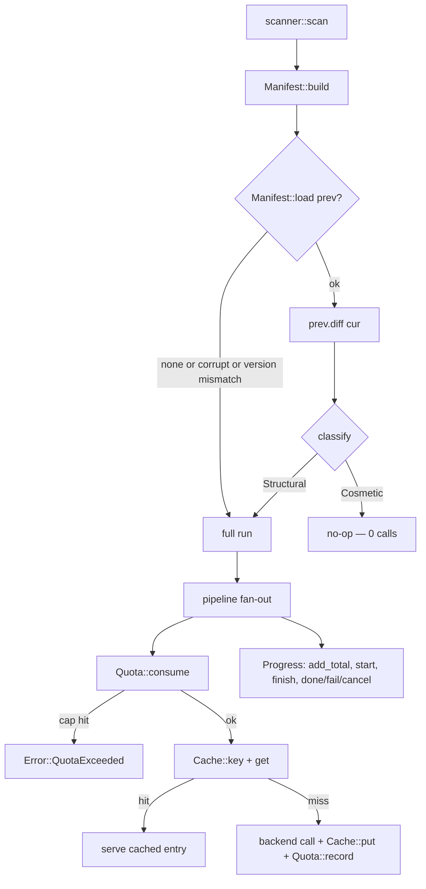
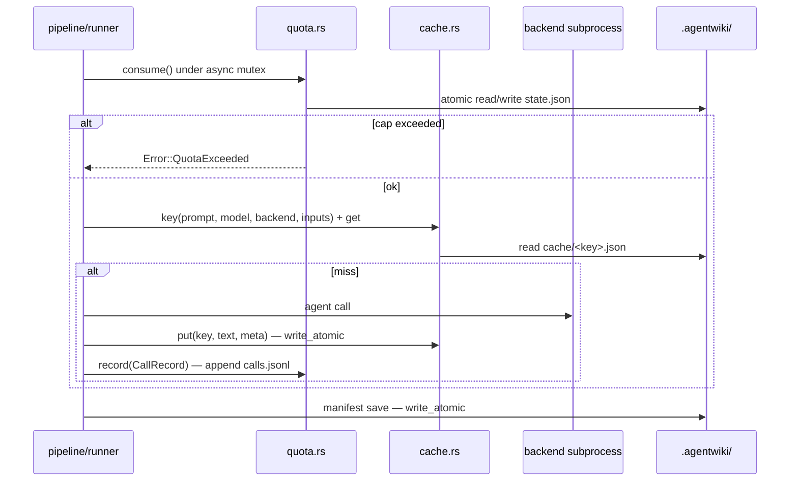
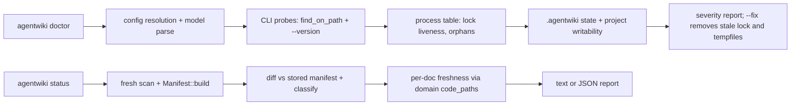

# Runtime Governance & Operations — Module Deep-Dive

## 1. Module Purpose

This module is the cross-cutting **run-state layer** of agentwiki: everything that makes a `generate` run cheap, bounded, resumable, and inspectable lives here. It sits exactly on the boundary between *free deterministic work* (scanning, diffing, rendering) and *paid work* (subprocess calls to the `devin`/`claude`/`codex` agent CLIs), and enforces three cost-control guarantees:

1. **Never pay twice for the same call** — a content-hash result cache (`cache.rs`).
2. **Never spend more than a configured daily cap** — a quota gate plus a permanent audit log (`quota.rs`).
3. **Never run the pipeline when nothing meaningful changed** — an incremental-regeneration manifest with a fail-open classifier (`manifest.rs`).

Around those controls it provides the operational surface: `agentwiki doctor` (environment health probes, `--fix` cleanup) and `agentwiki status` (freshness/regeneration prediction), plus shared primitives — diagnostic severity reporting (`diag.rs`), a TTY-aware progress spinner (`progress.rs`), dependency-free process-table access (`sys.rs`), atomic file writes (`util.rs`), and the crate-wide error taxonomy (`error.rs`).

All persistent state lives under the project's `.agentwiki/` directory; the target repository itself is only ever read.

## 2. Internal Structure



Key design note: `manifest.rs` and `cache.rs` share `SCHEMA_VERSION = 3` — bumping prompt/schema semantics invalidates both layers in lockstep. `MANIFEST_VERSION = 1` independently gates manifest format compatibility; version-mismatched or corrupt state files are *ignored*, never migrated.

## 3. Component Details

### 3.1 Result Cache — `src/cache.rs`

A flat file cache at `.agentwiki/cache/<sha256>.json`. The key is:

```
sha256( prompt ‖ \0 ‖ model ‖ \0 ‖ backend ‖ \0 ‖ inputs ‖ \0 ‖ SCHEMA_VERSION )
```

`inputs` is a content fingerprint of whatever the agent may read beyond the prompt itself — in agentic mode this is `Manifest::subtree_fingerprint(dir)` for `dir_summary` agents and `fingerprint_all()` for repo-wide agents; in embedded mode it is `""`. `Cache` has two policy flags: `disabled` (`--no-cache`, skips reads and writes) and `no_read` (`--force-regenerate`, skips reads but still writes). Entries carry `CacheMeta` provenance (agent, backend, model, RFC3339 timestamp, call duration). `CacheStats` accumulates hits/misses/saved wall-time for the run summary. All lookups are fail-soft (`Option`, `.ok()?`) and all writes go through `util::write_atomic`.

### 3.2 Change Manifest — `src/manifest.rs`

The manifest is a **fingerprint store, not a content store** — results still live in the content cache; the manifest only decides whether the run is needed at all. One manifest per output directory: `manifest-<sha12(abs output path)>.json`, so a repo emitting `docs/en` and `docs/vi` tracks each tree independently.

`Manifest::build(&ScanData, &Config)` captures:

- `files`: `rel_path → sha256(content)` for every scanned file (one read per file, paid once per run).
- `dirs`: `rel_dir → hash("path:filehash" members)` — a signature of each directory's direct members.
- `edges`: resolved **internal import edges** `(importer, target)` from `drift::resolve::build_file_graph` — the architectural signal.
- `env`: `env_fingerprint(config)` — schema + binary version, mode, language, output path, model tiers, all limits and scan settings, excluded dirs/files, and the **resolved content of every prompt template** in the registry (covering both embedded edits and `prompts_dir` overrides).
- `git_head`: `git rev-parse HEAD` when available.

`Manifest::load` returns `Option` — missing, corrupt, or version-mismatched files all mean "no usable prior state" → full run.

**Classification** (`classify`, `Significance`): fail-open — env changes, added/removed dirs, added/removed files, and added/removed edges are all **Structural** (with human-readable reasons); only pure content edits inside existing files are **Cosmetic**, which lets an `--incremental` run no-op at 0 calls. `ManifestDiff::cosmetic_dirs()` derives the pending-edit directory set surfaced by `status`.

Notable detail: `stable_abs()` normalizes output paths by lexically resolving `.`/`..` and canonicalizing the deepest *existing* ancestor — a plain `canonicalize` would return different strings before vs. after the output dir is created, forking the manifest slot and firing a spurious `env_changed`.

### 3.3 Quota & Audit — `src/quota.rs`

Two files under `.agentwiki/`:

- `state.json` — `{date, count}` for today (UTC). `Quota::consume()` does **check-and-increment under a `tokio::sync::Mutex`** so semaphore-parallel agents cannot overrun the cap; it returns `Err(Error::QuotaExceeded{cap})` once `count >= cap`, resets the counter on date rollover, and persists via `write_atomic`.
- `calls.jsonl` — one `CallRecord` per *real* backend call: RFC3339 timestamp, agent instance name (e.g. `dir_summary@src`), backend, model, prompt size, wall seconds, `ok|error|timeout` status, and optional token usage. `record()` is deliberately **best-effort** — an audit failure must never fail the pipeline.

Helpers `today()` and `now_rfc3339()` are shared by the manifest and doctor.

### 3.4 Operational Commands — `src/doctor.rs`, `src/status.rs`, `src/diag.rs`

**`diag.rs`** is the shared vocabulary: `Status` (`Info < Ok < Warn < Fail`, ordered so `max` yields a section verdict), `Report` (accumulates `(Status, line)` pairs, `worst`, and applied `fixes`), and `print_section` for `[name]:`-prefixed check lists. Both `doctor` and `drift` render through it.

**`agentwiki doctor`** (`doctor::run` → exit `0`/`1`, `1` if any section reaches `Fail`) runs five sections:

| Section | Checks |
|---|---|
| `config` | `Config::load` success (falls back to defaults so later checks still run), config source list, `models.{efficient,powerful}` parse via `BackendKind::parse` |
| `agent CLIs` | `find_on_path` for devin/claude/codex; `Fail` only when a *required* backend is missing; `probe_version` (`<cli> --version`, 5 s timeout, first non-empty stdout/stderr line); optional `mermaid-fixer` |
| `processes` | `sys::list_processes` filtered through `sys::agent_name`; live `agentwiki` pid → "concurrent run" warning; other agent pids → orphan warnings with `kill` hint |
| `state` | `run.lock` liveness (parse pid → `pid_alive`), `state.json` quota usage vs. cap, cache entry count/bytes, `research.json` presence (enables `--skip-research`), `calls.jsonl` record count + last record |
| `project` | project path is a directory, git-repo/`git_tracked_only` interplay, writability probe (tempfile in nearest existing ancestor), output path existence |

`--fix` removes a **stale** `run.lock` and `agentwiki-*` tempfiles in the temp dir — but tempfile cleanup is explicitly skipped while a run is active, since a live run may own them. Only *files* named `agentwiki-*` are removed; directories are user output, not debris.

**`agentwiki status`** (`status::run` → exit `0`, or `2` when the scan itself fails) performs a fresh `scanner::scan` + `Manifest::build`, diffs against the stored manifest, and emits a `StatusReport` (human-readable or `--json`): classification (`cosmetic|structural|no-baseline`) with reasons, file/dir/edge counts, `commits_since` via `git rev-list --count <head>..HEAD`, `research.json` age, pending cosmetic dirs, and **per-doc freshness** — global docs go stale on any input delta, while deep-dive docs go stale only when the domain's `code_paths` (read back from `research.json`'s `DomainModulesReport`) intersect the changed paths, or when classification is structural. Doc filenames are mapped back to domains via `output::writer::sanitize_filename`, the same transform the writer applied.

### 3.5 Platform & UX Utilities

- **`progress.rs`** — a single `indicatif` spinner (`{spinner} [{pos:>3}/{len:3}] {elapsed} {msg}`) tracking agent instances. `add_total` grows the length as fan-out targets are discovered; `start`/`finish` maintain a `BTreeSet` of in-flight keys rendered as the bar message, truncated to 72 chars with `… +N`. `done`/`fail`/`cancel` leave terminal states ("cancelled — rerun resumes from cache"). Hidden automatically off-TTY — callers never check.
- **`sys.rs`** — dependency-free process table: `ps -eo pid=,etime=,args=` on Unix (with a no-`etime` fallback), `tasklist /FO CSV /NH` on Windows. `ProcInfo` carries a normalized `name` (argv[0] basename, lowercased, `.exe` stripped) and `script` — the basename of argv[1] when argv[0] is a known interpreter (`node`, `bun`, `python`, …), which is how a node-installed `codex` is still detected. `agent_name` matches both fields against `AGENT_PROCS`; `pid_alive` backs lock validation; `find_on_path` does platform-correct executable lookup (`exe`/`cmd`/`bat` candidates on Windows, mode-bit check on Unix).
- **`util.rs`** — `write_atomic(path, bytes)`: `tempfile::NamedTempFile` in the same directory + `persist` (rename), so a crash leaves either the old or the new file, never a torn one. Used by `cache.put`, `manifest.save`, and `quota.consume`.
- **`error.rs`** — the crate-wide `thiserror` taxonomy: `Config`, `Io{path,source}`, `Backend{backend,message,stderr_tail}`, `BackendNotAvailable`, `Parse`, `Validation`, `QuotaExceeded{cap}`, `Timeout`, `Prompt`, `DepFailed`, `Cancelled`, `AlreadyRunning{pid}`, `Pipeline`. `Error::io(path, source)` keeps IO errors path-annotated; `Result<T>` is the shared alias.

## 4. Data & Control Flow

### 4.1 Incremental gate + governed call loop



### 4.2 Per-call governance sequence



### 4.3 Read-only operational commands



## 5. Notable Implementation Decisions

- **Fail-open everywhere it is safe, fail-closed where money is spent.** Cache misses, corrupt manifests, unreadable `state.json`, and probe failures all degrade to "do the work"; the only hard stop at this layer is `QuotaExceeded`, which guards real spend.
- **Mutex-scoped check-and-increment.** The quota counter's race window (parallel agent instances) is closed inside `consume()` rather than relying on the file as a lock — `state.json` is persistence, not coordination.
- **Manifest ⊆ cache invalidation, by construction.** `env_fingerprint` hashes everything `Cache::key` cannot see (binary version, config, prompt contents); conversely `SCHEMA_VERSION` is baked into both, so a semantics bump invalidates coherently.
- **Audit must not break the pipeline.** `record()` swallows all IO errors — observability is sacrificed before correctness.
- **Interpreter-aware process detection.** Matching `argv[0]` alone misses `node /path/codex`; checking argv[1] for known interpreters keeps orphan detection honest on npm-installed CLIs.
- **Atomic writes as the only write path.** All state files are written via `write_atomic`, so a SIGKILL mid-run can leave stale locks (reclaimed by `doctor --fix`/next run) but never a half-written manifest, cache entry, or quota file.
- **`status` is a dry-run predictor.** Reusing `Manifest::build` + `classify` means the freshness report is computed with exactly the same logic the gate applies — no drift between "what status says" and "what the next run does".

## 6. Associated Files

| File | Role |
|---|---|
| `src/cache.rs` | Content-hash result cache; `SCHEMA_VERSION`, `CacheEntry`/`CacheMeta`, `Cache::{key,get,put}`, `CacheStats` |
| `src/manifest.rs` | Per-output fingerprints, `Manifest::{build,load,save,diff}`, `subtree_fingerprint`, `classify`, `output_key`/`manifest_path`, `stable_abs`, git helpers, `env_fingerprint` |
| `src/quota.rs` | Daily cap (`consume`), `calls.jsonl` audit (`record`, `CallRecord`), `today`/`now_rfc3339` |
| `src/doctor.rs` | `doctor` command: config/CLI/process/state/project checks, `probe_version`, `--fix` cleanup, exit codes |
| `src/status.rs` | `status` command: `StatusReport`, per-doc staleness via domain `code_paths`, `--json` output |
| `src/diag.rs` | `Status` severity ordering, `Report` accumulator, `print_section` |
| `src/progress.rs` | `Progress` spinner: `new`/`add_total`/`start`/`finish`/`done`/`fail`/`cancel` |
| `src/sys.rs` | `list_processes`/`pid_alive`/`find_on_path`/`agent_name`; `AGENT_PROCS`, interpreter awareness |
| `src/util.rs` | `write_atomic` (tempfile + rename) |
| `src/error.rs` | `Error` enum (12 variants), `Result<T>`, `Error::io` |

**State artifacts under `.agentwiki/`**: `cache/<sha256>.json`, `manifest-<sha12>.json`, `state.json`, `calls.jsonl`, `run.lock`, `research.json`, plus `agentwiki-*` tempfiles in the OS temp dir.