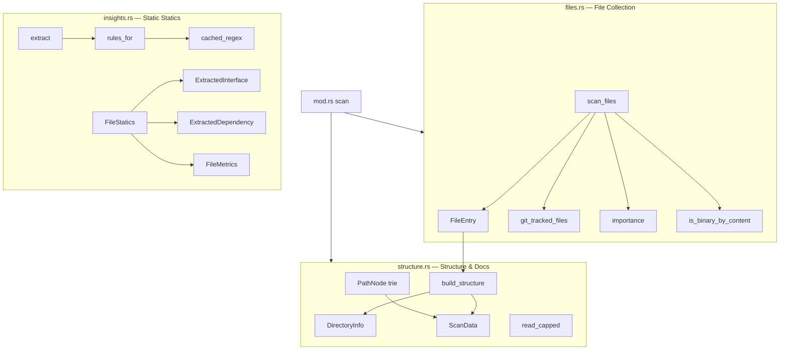
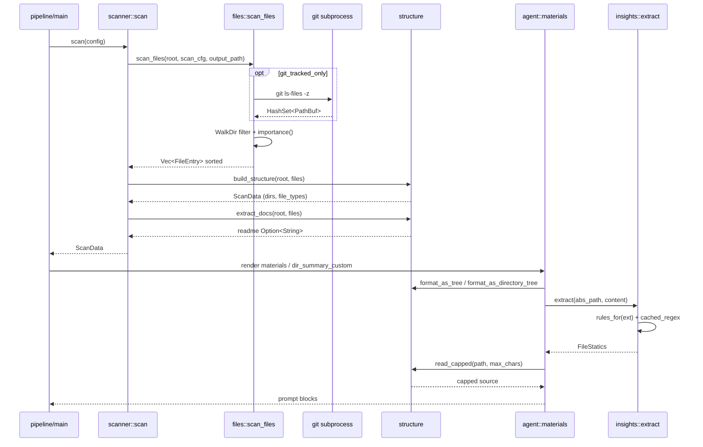

# Module Deep-Dive: `scanner` — Source Scanning & Extraction

## 1. Purpose

`src/scanner/` is the **preprocessing bounded context (Phase 0)** of the agentwiki pipeline — it runs fully **deterministically, with no AI calls**. Its job: turn an arbitrary on-disk repository into `ScanData` — a compact structure holding the filtered file list, importance scores, the directory tree, extension statistics, the README, and (on demand) per-file statics extracted with regexes.

This is the single "ground truth" source of the whole pipeline: every research agent prompt (system_context, dir_summary, domain_modules, boundary, database…) is built from `ScanData` via `agent::materials`. The module replaces deepwiki-rs's `language_processors` with a lightweight per-language regex set — good enough to seed symbol names into prompts without an AST.

**Component files:**

| File | Role |
|---|---|
| `src/scanner/mod.rs` | Entry point `scan(config) -> Result<ScanData>`; re-exports the public API |
| `src/scanner/files.rs` | Walkdir + exclusion filtering + git-tracked + importance scoring |
| `src/scanner/structure.rs` | Group files by directory, read README, render the tree for prompts, `read_capped` |
| `src/scanner/insights.rs` | Regex-based interface/dependency/metrics extraction per extension |

## 2. Internal structure & data types

Core types:

- **`FileEntry`** (`files.rs`): `rel_path`, `abs_path`, `name`, `size`, `extension` (lowercase), `importance_score` (0.0–1.0).
- **`ScanData`** (`structure.rs`): `project_name`, `root`, `files` (sorted by descending importance), `directories: Vec<DirectoryInfo>` (fan-out target for `dir_summary`), `file_types` (extension → count), `readme: Option<String>`.
- **`FileStatics`** (`insights.rs`): `interfaces` (symbol + one-line signature), `dependencies` (name + `is_external`), `metrics` (non-empty LOC, function/class counts, cyclomatic complexity).

## 3. Control flow

`scan()` does 4 things sequentially: canonicalize `project_path` → `scan_files` → `build_structure` → `extract_docs` (README). Statics are **not** computed here — they are called **lazily** from `agent::materials` when building prompts (`dir_summary_custom`), via `scanner::extract`.

## 4. Implementation details

### 4.1 `files.rs` — collection & filtering

- **Directory pruning** via `WalkDir::filter_entry` (efficient: never descends): `ALWAYS_EXCLUDED_DIRS` = `.agentwiki/.git/.hg/.svn`; hidden dirs when `include_hidden=false`; `cfg.excluded_dirs` compared case-insensitively.
- **File filtering** via a condition chain: inside the canonicalized `output_path` (never swallows its own output); hidden names; matches `cfg.excluded_files` (compiled `glob::Pattern`, lowercase); extension in `BINARY_EXTENSIONS` (~40 types); absent from `git ls-files -z` when `git_tracked_only` is on (empty result → warn and fall back to full scan); exceeds `max_file_size`; or a **NUL byte in the first 4096 bytes** (`is_binary_by_content`) for extension-less files.
- **`importance()`** — additive heuristic: path containing `cmd/internal/pkg` +0.3; `main/index` +0.15; `config/setup` +0.1; `database/schema/migrations` +0.15; size 1–50KB +0.15; extension score table (rs/py/java/go… +0.4, sql +0.3, jsx/tsx +0.2, js/ts +0.15, config +0.1…), clamped to 1.0.
- **Sorting** by descending score, tie-broken by `rel_path` — stable output, important for prompt caching.

### 4.2 `structure.rs` — tree & docs

- `build_structure` groups files into `BTreeMap<PathBuf, Vec<FileEntry>>` by parent dir → `DirectoryInfo` whose `subdirectory_count` counts **direct children that contain files** (empty dirs don't appear — acceptable since `dir_summary` only needs dirs with content).
- `extract_docs` only looks for files whose name starts with `readme` at **root**, reading via `abs_path` with a `root.join(rel_path)` fallback.
- `PathNode` is a `BTreeMap` trie that renders `├──`/`└──` trees, **directories before files**; two public functions `format_as_tree` (full) and `format_as_directory_tree` (dirs only, used for large repos).
- `read_capped` truncates content by **character count** (not bytes) and appends a `[truncated]` suffix.

### 4.3 `insights.rs` — regex statics

- `rules_for(ext)` returns `LangRules { funcs, types, imports, branches }` for ~10 language groups: Rust, Python, JS/TS/JSX/TSX, Go, Java/Kotlin/Scala, C/C++/C#, Ruby/PHP/Swift/Dart/sh/SQL; unknown extensions get an empty rule set (branch counting only).
- `cached_regex` caches compiled `Regex`es in a `LazyLock<Mutex<HashMap>>` — compiled once per scan.
- `extract()` caps captures: at most **60 functions + 40 types + 40 imports**, deduplicated with a `HashSet` keyed by `f:`/`t:`/`d:` prefixes; the signature is **the whole line containing the match** (max 160 chars) via `signature_line`; `is_external=false` when the import starts with `.`/`crate`/`self`/`super`.
- `cyclomatic_complexity` = total occurrences of branch-keyword **strings** (`if `, `for `, `case `, `?`…) — it is `str::matches`, not a regex, so the metric is rough and biased high.

## 5. Notable design decisions

1. **No AST** — regexes are enough to seed symbol names into prompts at minimal implementation cost; the trade-off is accuracy (e.g. the JS/Java method regex accepts false positives).
2. **Lazy statics** — `scan()` never calls `extract()`; only `materials.rs` does when needed, avoiding CPU spent on files that never reach a prompt. (Note: the doc comment in `mod.rs` mentions `FileStatics::for_entry` but that method **does not exist** — minor drift between docs and code.)
3. **Importance sorting** keeps the file order in prompts stable → improves cache hits for agent calls.
4. **Git-tracked is soft**: an empty or failing `git ls-files` → fall back to a full scan with a warning; the pipeline does not fail.
5. **Hard capture caps** (60/40/40) prevent prompt blow-ups on minified/generated files.

## 6. Dependencies & consumers

- **Depends on**: `walkdir`, `glob`, `regex`, `std::process::Command` (git), `crate::config::{Config, ScanConfig}`, `crate::error`.
- **Consumed by**: `agent::materials` (tree, `read_capped`, `extract`, `filtered_insights`), `agent::spec`/`registry` (`ScanData`, `DirectoryInfo` as PerDir fan-out targets for `dir_summary`), `output::{boundary, database}` (receives `ScanData` for DetFn), `pipeline::dry_run_report`.

## 7. Related files

- `src/scanner/mod.rs` — façade + `scan()`
- `src/scanner/files.rs` — `FileEntry`, `scan_files`, `importance`
- `src/scanner/structure.rs` — `ScanData`, `DirectoryInfo`, `PathNode`, `read_capped`
- `src/scanner/insights.rs` — `FileStatics`, `extract`, `rules_for`
- `src/agent/materials.rs` — main consumer rendering prompt materials
- `src/config.rs` — `ScanConfig` (git_tracked_only, excluded_dirs/files, max_depth, max_file_size, include_hidden)
