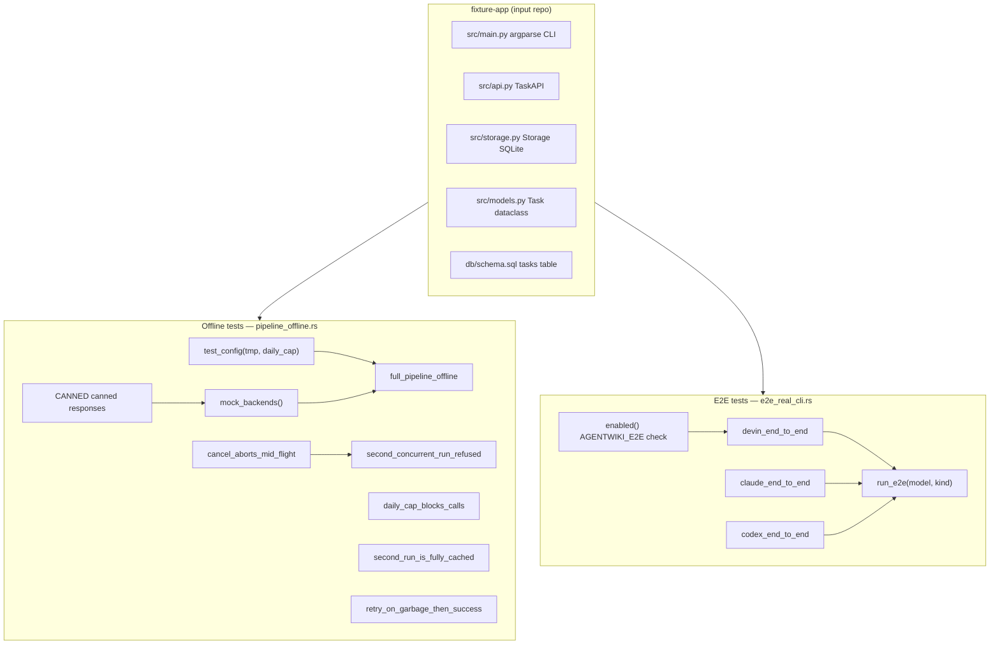
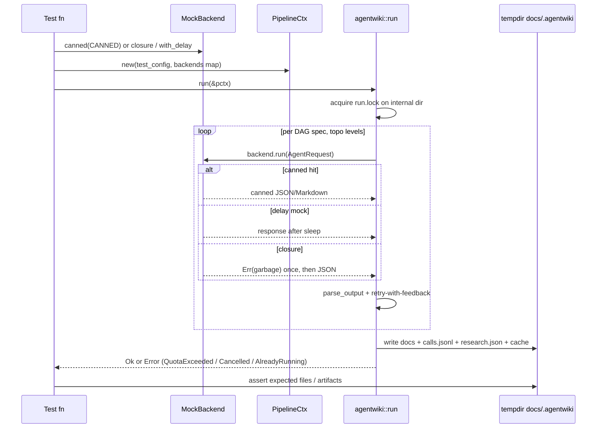

# Testing & Fixture — Deep Dive

## 1. Purpose

The `tests/` domain is agentwiki's quality-assurance harness. Because the entire pipeline delegates LLM reasoning to external authenticated CLIs (`devin`, `claude`, `codex`), running the real pipeline in CI would spend real subscription quota and depend on network/machine state. This module solves that with two complementary test layers:

- **Offline integration tests** (`tests/pipeline_offline.rs`) — exercise the *entire* pipeline end-to-end using an in-process `MockBackend`, so `cargo test` stays green on machines with no agent CLI installed. They verify cache behavior, the daily-call cap, cooperative cancellation, mutual exclusion via `run.lock`, and retry-with-feedback on garbage output.
- **Real-CLI E2E tests** (`tests/e2e_real_cli.rs`) — run the pipeline against the actual CLIs, gated behind `#[ignore]` plus the `AGENTWIKI_E2E=1` environment variable, so quota is spent only on explicit request.
- **Fixture app** (`tests/fixture-app/`) — a small, deterministic Python/SQLite CLI task manager used as the fixed input repository for both layers.

The design hinges on the ports-and-adapters property of the `AgentBackend` trait: because `PipelineCtx::new` accepts an injected `HashMap<BackendKind, Arc<dyn AgentBackend>>`, tests can substitute `MockBackend` for real subprocess backends without touching any pipeline code.

## 2. Internal Structure



### 2.1 `tests/pipeline_offline.rs`

The file is built around four shared pieces:

- **`CANNED: &[(&str, &str)]`** — a table mapping agent names to canned responses covering every spec the DAG can request: `dir_summary`, `relationships`, `system_context`, `domain_modules`, `database`, `key_module`, `boundary` (JSON strings), and `architecture`, `workflow`, `overview`, `architecture_doc`, `workflow_doc`, `deep_dive` (Markdown strings). `MockBackend::canned` matches on `req.agent` by exact name or `name@` prefix (fan-out instance keys like `dir_summary@src`), falling back to `"{}"`.
- **`fixture_dir()`** — resolves `CARGO_MANIFEST_DIR/tests/fixture-app`.
- **`test_config(tmp, daily_cap)`** — builds a `Config` pointing `project_path` at the fixture and `output_path`/`internal_path` into a `tempfile::TempDir`, sets both model tiers to `"mock"` (so `BackendKind::parse` routes everything to the mock), disables `git_tracked_only`, and sets the daily cap.
- **`mock_backends(mock)`** — wraps the `Arc<MockBackend>` in the `HashMap<BackendKind, Arc<dyn AgentBackend>>` that `PipelineCtx::new` accepts.

All six tests are `#[tokio::test(flavor = "multi_thread")]` — required because the pipeline schedules DAG nodes via `JoinSet`/`FuturesUnordered` on a multi-threaded runtime.

| Test | Mechanism exercised | Key assertion |
|---|---|---|
| `full_pipeline_offline` | Whole research → compose → write → verify flow | `1.Overview.md`, `2.Architecture.md`, `3.Workflow.md`, `5.Boundary-Interfaces.md`, `6.Database-Overview.md`, `__AgentWiki_Summary__.md`, and `4.Deep-Exploration/Task Management.md` exist; `calls.jsonl`, `research.json`, `cache/` exist; mock saw >5 calls |
| `daily_cap_blocks_calls` | `Quota::consume` enforcing `daily_cap` | `Err(Error::QuotaExceeded)` when cap=1 and the fixture yields 3 `dir_summary` fan-out instances |
| `second_run_is_fully_cached` | sha256 content cache across runs | A second `run()` with a fresh `PipelineCtx` on the same internal dir adds zero new mock calls |
| `cancel_aborts_mid_flight` | `CancellationToken` + `abort_all` on JoinSet | A 30s-delayed mock is cancelled ~200ms in; `run` returns `Err(Error::Cancelled)` within a 5s timeout |
| `second_concurrent_run_refused` | `run.lock` mutual exclusion + lock reaping | A second run on the same internal dir fails with `Error::AlreadyRunning`; after the first run's guard drops, a fresh run succeeds |
| `retry_on_garbage_then_success` | Retry-with-feedback loop | A closure-backed `MockBackend` fails `system_context` once, then returns valid JSON; the pipeline completes |

The deep-dive filename assertion (`4.Deep-Exploration/Task Management.md`) is noteworthy: it proves the end-to-end link between the `domain_modules` canned JSON (which names domain "Task Management") and the writer's `sanitize_filename` for dynamically generated docs.

### 2.2 `tests/e2e_real_cli.rs`

Three tests — `devin_end_to_end` (`devin:swe-2-medium`), `claude_end_to_end` (`claude:sonnet`), `codex_end_to_end` (`codex`) — share the `run_e2e(model, kind)` helper. Protection is two-layered:

1. `#[ignore]` on each test, so plain `cargo test` never runs them.
2. An `enabled()` check on `AGENTWIKI_E2E=1` inside each test body, so even `-- --ignored` runs require the explicit env opt-in.

`run_e2e` builds real backends via `for_kind(kind)` (subprocess CLIs, not mock), with cost caps deliberately small for the tiny fixture: `daily_cap = 20`, `call_timeout_s = 300`. It asserts only the first two docs (`1.Overview.md`, `2.Architecture.md`) — a smoke check rather than full structural verification, since real LLM output is nondeterministic. Invocation example from the file header:

```
AGENTWIKI_E2E=1 cargo test --test e2e_real_cli devin -- --ignored
```

### 2.3 `tests/fixture-app/`

A minimal but *structurally complete* application — deliberately chosen so every research spec has something real to analyze:

- `src/main.py` — argparse CLI `taskman` with `add`/`list`/`done` commands (exercises `boundary` detection of CLI boundaries).
- `src/api.py` — `TaskAPI` wrapper (`add`/`list`/`done`) delegating to storage.
- `src/models.py` — `Task` dataclass (`id: int | None`, `title: str`, `done: bool`).
- `src/storage.py` — `Storage` over SQLite: `SCHEMA` DDL, `insert`, `all`, `mark_done`.
- `db/schema.sql` — `tasks` table (`id INTEGER PK AUTOINCREMENT`, `title TEXT NOT NULL`, `done INTEGER DEFAULT 0`) plus index `idx_tasks_done` — gives the `database` spec a real schema to find.
- `README.md` — feeds `extract_docs` in the scanner.

The fixture's three directories (root, `src/`, `db/`) matter quantitatively: they produce exactly 3 `dir_summary` PerDir fan-out instances, which is what makes `daily_cap=1` reliably fail.

## 3. Key Interfaces

| Symbol | Kind | Role |
|---|---|---|
| `PipelineCtx::new(config, Option<backends>)` | constructor | Injection point: `Some(map)` for tests, `None` builds real backends from `config.models.*` |
| `agentwiki::run(&Arc<PipelineCtx>)` | entry | Full pipeline under test; returns `Result<()>` with typed errors (`QuotaExceeded`, `Cancelled`, `AlreadyRunning`) |
| `MockBackend::canned(CANNED)` | factory | Table-driven responses keyed by agent name / `name@instance` prefix |
| `MockBackend::new(closure)` | factory | Programmatic responses — used for the retry test's fail-once-then-succeed behavior |
| `MockBackend::with_delay(d)` | builder | Adds async sleep per call — used to keep calls in flight for cancel/lock tests |
| `mock.calls` | `Mutex<Vec<String>>` | Records every `AgentRequest.agent` — used to assert call counts (cache test) |
| `for_kind(BackendKind)` | factory | Real backend construction for E2E tests |

## 4. Control Flow



## 5. Notable Implementation Decisions

- **Test-doubling at the trait boundary, not via feature flags.** The mock is injected through `PipelineCtx::new`'s `backends` parameter and selected by the model string `"mock"` — the same `BackendKind::parse`/`for_kind` path used for real backends. This means offline tests exercise identical runner logic (cache lookup → quota → backend → parse → retry) as production.
- **Canned data mirrors real report schemas.** Each `CANNED` JSON is a valid input for the corresponding lenient deserializer (`SystemContextReport`, `DomainModulesReport`, etc.), so tests validate the *parse path*, not just the transport. The `key_module` canned entry even leaves `domain_name` empty, matching the known behavior where the runner stamps it post-hoc.
- **Cancellation tested by wall-clock bound, not state inspection.** `cancel_aborts_mid_flight` wraps `run` in `tokio::time::timeout(5s)` against a 30s-delayed backend — it verifies the *property* "cancel unwinds fast" rather than internal scheduling details. Dropped futures rely on `kill_on_drop` semantics propagating correctly.
- **Lock test covers both exclusion and reaping.** `second_concurrent_run_refused` asserts `AlreadyRunning` while the first run holds the lock, then aborts the first run and proves a third run proceeds — exercising the `RunLock` drop-guard cleanup path.
- **E2E double gate (`#[ignore]` + env var).** `#[ignore]` alone can be bypassed accidentally by `-- --ignored`; the `AGENTWIKI_E2E=1` runtime check prevents quota spend on blanket `--ignored` invocations (e.g., in CI matrices running other ignored tests).
- **Determinism of the fixture.** The fixture app is intentionally tiny (~5 files, no external deps beyond stdlib `sqlite3`), has no tests/build steps of its own, and `git_tracked_only` is disabled in tests — so scan results are stable regardless of git state.
- **Cost guardrails inside E2E.** Even when enabled, `daily_cap = 20` and `call_timeout_s = 300` bound the spend and hang risk of each real-CLI test.

## 6. Associated Files

| Path | Role |
|---|---|
| `tests/pipeline_offline.rs` | Six offline integration tests + `CANNED` response table + `test_config`/`mock_backends` helpers |
| `tests/e2e_real_cli.rs` | Three `#[ignore]`d E2E tests gated by `AGENTWIKI_E2E=1`, `run_e2e` helper |
| `tests/fixture-app/src/main.py` | Fixture CLI entry (`taskman add/list/done`) |
| `tests/fixture-app/src/api.py` | `TaskAPI` — high-level task operations |
| `tests/fixture-app/src/storage.py` | `Storage` — SQLite persistence layer |
| `tests/fixture-app/src/models.py` | `Task` dataclass |
| `tests/fixture-app/db/schema.sql` | `tasks` table + `idx_tasks_done` index |
| `tests/fixture-app/README.md` | Fixture description (scanned by `extract_docs`) |

Cross-module dependencies: `agentwiki::backend::{MockBackend, for_kind, BackendKind, AgentBackend}` (test double + real factories), `agentwiki::{PipelineCtx, run}` (system under test), `agentwiki::error::Error` (typed assertions), `tempfile` (isolated output/internal dirs per test).