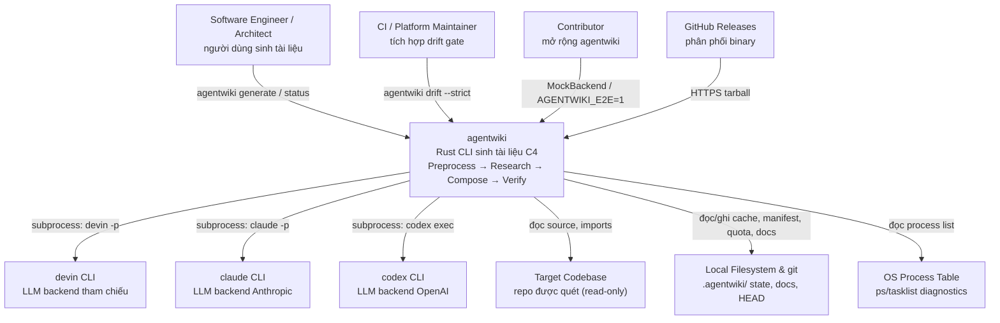

# System Context Overview — Project Overview

## 1. Giới thiệu dự án

**agentwiki** (v0.5.0) là một công cụ dòng lệnh (CLI) viết bằng Rust, có nhiệm vụ tự động sinh tài liệu kiến trúc theo mô hình C4 cho một codebase mục tiêu. Dự án là bản viết lại của `deepwiki-rs`.

### Mục tiêu cốt lõi

- **Tự động hóa việc sản xuất tài liệu kiến trúc** — loại tài liệu vốn tốn kém để viết thủ công và nhanh chóng trở nên lỗi thời.
- **Loại bỏ quản lý API key** — thay vì gọi trực tiếp LLM API, agentwiki ủy quyền toàn bộ suy luận mô hình cho các agent CLI đã xác thực sẵn trên máy local (`devin`, `claude`, `codex`).
- **Kiểm soát chi phí** — thông qua cache theo content-hash, hạn ngạch gọi theo ngày (daily quota), và tái sinh gia tăng dựa trên manifest fingerprint.
- **Tầng kiểm chứng (verification)** — engine `drift` đối chiếu các khẳng định phụ thuộc (dependency claims) do LLM sinh ra với đồ thị import trích xuất tĩnh, phát hiện hallucination và tài liệu lệch pha (drift) — chế độ thất bại chính của tài liệu do LLM tạo.

### Đặc điểm kỹ thuật

- Pipeline 4 giai đoạn: **Preprocess → Research → Compose → Verify**.
- Điều phối đa agent qua DAG nhiệm vụ khai báo (AgentSpec), lập lịch theo tầng topo, fan-out theo thư mục/domain.
- Trừu tượng hóa backend qua trait `AgentBackend` với 3 triển khai thật (devin, claude, codex) và `MockBackend` cho kiểm thử offline.
- Trích xuất import đa ngôn ngữ (Rust / Python / JS-TS) bằng regex/heuristic trên source đã sanitize — không cần AST đầy đủ.
- Quyền ghi giới hạn vào `.agentwiki/` và thư mục docs; target repo chỉ được đọc.
- Mã thoát xác định (0/1/2) phục vụ CI scripting.

## 2. Người dùng mục tiêu

| Nhóm người dùng | Mô tả | Nhu cầu chính |
|---|---|---|
| **Software engineers & architects** | Developer cần tài liệu C4 cập nhật cho codebase sở hữu hoặc đang onboard | Sinh overview, deep-dive, workflow docs từ source; chạy gia tăng chỉ tái sinh phần thay đổi; phát hiện drift giữa docs và code |
| **CI/platform maintainers** | Team tích hợp kiểm tra độ tươi của tài liệu vào pipeline | `agentwiki drift --strict` làm CI gate; export claims (`agentwiki.claims.json`) cho kiểm chứng tự động; exit code xác định |
| **Contributors** | Developer mở rộng chính agentwiki | Test offline qua MockBackend; e2e suite tùy chọn (`AGENTWIKI_E2E=1`); convention clippy-clean, no-unwrap |

## 3. Ranh giới hệ thống

**Phạm vi**: agentwiki sở hữu toàn bộ hành trình từ quét target repo đến xuất Markdown docs đã kiểm chứng, cùng trạng thái local (cache, manifest, quota, drift baseline) giúp các lần chạy gia tăng và có thể audit. Hệ thống **không** tự thực hiện suy luận LLM — mọi lời gọi mô hình được ủy quyền cho agent CLI bên ngoài.

### Thuộc phạm vi hệ thống

- **CLI surface**: pipeline `generate` cùng các subcommand `doctor`/`drift`/`status` (clap)
- **Configuration layer**: `agentwiki.toml`, global config, profiles, model tiers, precedence CLI > TOML > default
- **Scanner/Preprocess**: sinh `ScanData` (cấu trúc repo, files, README)
- **Agent orchestration core**: registry DAG AgentSpec, topo scheduling, fan-out theo directory/domain, `ResearchContext` shared store
- **Agent runner**: assembly prompt, kiểm tra cache/quota, gọi backend, trích JSON, retry-with-feedback, fallback model tier
- **Backend abstraction**: trait `AgentBackend` + triển khai devin/claude/codex + `MockBackend`
- **Structured report schemas** với lenient deserializers cho output LLM "bẩn"
- **Prompt template system**: embedded defaults, disk overrides, render `{{key}}`
- **Compose stage**: sinh tài liệu C4 (overview, architecture, deep-dive, workflows) qua editor prompts
- **Drift engine**: trích import Rust/Python/JS-TS, resolve thành file graph, phân loại claim C1–C12, lọc undocumented edge U1–U9, baseline & report
- **State management**: content-hash cache, manifest fingerprints, daily quota counter, audit log `calls.jsonl`, run lock
- **Diagnostics**: doctor probes, drift report, status/freshness report, progress display

### Nằm ngoài phạm vi

- **Suy luận LLM và hosting model** — ủy quyền hoàn toàn cho agent CLI bên ngoài
- **Authentication/credential management** — dựa vào trạng thái login sẵn có của từng agent CLI
- **Target codebase** — là đầu vào, không phải thành phần hệ thống
- **Doc hosting/rendering** — chỉ xuất Markdown; không có web UI hay bước publish
- **Full AST parsing** — trích import chỉ ở mức regex/heuristic
- **Quyền ghi lên target repo** — chỉ đọc; mọi output đi vào `.agentwiki/` và thư mục docs

## 4. Tương tác với hệ thống bên ngoài

| Hệ thống ngoài | Kiểu tương tác | Vai trò |
|---|---|---|
| **devin CLI** | Subprocess `devin -p`; prompt truyền vào, output parse lại | Backend LLM tham chiếu (Cognition) |
| **claude CLI** | Subprocess `claude -p`, prompt qua stdin; parse JSON envelope lấy text, token usage, lỗi; hỗ trợ `claude:<model>@<effort>` | Backend LLM (Anthropic) |
| **codex CLI** | Subprocess `codex exec`, prompt qua stdin, `-o` output file; parse JSONL event stream; normalize JSON schema theo yêu cầu chặt của codex | Backend LLM (OpenAI) |
| **GitHub Releases** | `install.sh` tải tarball release theo platform qua HTTPS | Phân phối binary |
| **Local filesystem & git** | Đọc source để scan/trích import; đọc git HEAD cho manifest diff; ghi cache, `research.json`, manifests, `calls.jsonl`, docs | Input/Output và state persistence |
| **OS process table** | Parse `ps`/`tasklist` trong `sys.rs` | Phát hiện agent process chạy/mồ côi, kiểm chứng liveness của run lock |

## 5. System Context Diagram

### Thông tin chính của sơ đồ

- **agentwiki** là hệ thống trung tâm: nhận lệnh từ người dùng, điều phối agent subprocess, đọc repo mục tiêu, ghi state và docs vào filesystem.
- **Ba agent CLI** là external systems đóng vai trò LLM provider; chúng tự quản authentication — agentwiki chỉ spawn subprocess và normalize output.
- **Target codebase** là đầu vào thuần đọc; mọi hiệu ứng ghi nằm trong `.agentwiki/` và docs directory.
- **GitHub Releases** chỉ xuất hiện trong luồng cài đặt, không tham gia runtime.
- **OS process table** phục vụ chẩn đoán: liveness check của run lock và phát hiện process mồ côi qua `doctor`.

## 6. Tổng quan kiến trúc kỹ thuật

agentwiki theo kiến trúc **pipeline phân tầng nghiêm ngặt** với một bounded context kiểm chứng song song:

- **Documentation Generation Pipeline** (core): điều phối Preprocess → Research → Compose → Write → Verify qua `PipelineCtx`, semaphore giới hạn concurrency, và cooperative cancellation.
- **Agent Orchestration & Analysis** (core): DAG khai báo các AgentSpec (phase, fan-out, model tier, dependencies), runner thực thi với retry/fallback, kết quả trao đổi qua `ResearchContext` typed store.
- **Agent Backend Integration** (supporting): trait `AgentBackend` thống nhất devin/claude/codex + mock; normalize envelope/event stream của từng CLI.
- **Drift Detection & Claim Verification** (core, read-only): trích import đa ngôn ngữ → resolve FileGraph → chuỗi verdict C1–C12 và bộ lọc U1–U9 → baseline & report có exit code cho CI. Không gọi LLM.
- **Repository Scanning** (supporting): Phase-0 deterministic, không dùng AI — sinh `ScanData` cho cả pipeline lẫn drift.
- **Configuration & Prompt Management** (infrastructure): layered config (defaults → TOML → CLI), profiles/model tiers, engine template `{{key}}` với disk-override.
- **Runtime Governance & Operations** (infrastructure): content-hash cache, change manifest, daily quota + audit `calls.jsonl`, `doctor`/`status`, progress, run lock — giữ các lần chạy gia tăng, giới hạn chi phí, và resume được.

### Luồng nghiệp vụ chính

1. **Generate Documentation Run** (`agentwiki generate`, importance 10.0): parse args → scan repo → manifest diff → topo scheduling → runner gọi backend (cache/quota/retry) → ghi doc tree → verify.
2. **Drift Verification** (`agentwiki drift [--strict]`, importance 8.5): scan → extract imports → build FileGraph → classify claims (confirmed/structural/reversed/phantom) → undocumented edges → diff baseline → report + exit code.
3. **Operational Health & Freshness** (`doctor`/`status`, importance 6.5): probe agent CLIs, process, state dir; manifest diff; dự đoán regeneration — hoàn toàn read-only đối với pipeline state.

### Điểm sáng kiến trúc

- **Không quản credential**: mượn phiên xác thực sẵn có của agent CLI → giảm attack surface và độ phức tạp.
- **Cost governance first-class**: cache/quota/audit nằm ngay trong runner path, không phải add-on.
- **Trust-but-verify**: tách riêng tầng sinh (LLM) khỏi tầng kiểm chứng (static, deterministic) — drift engine là cơ chế chống hallucination cốt lõi.
- **Deterministic boundaries**: scanner và output renderer không dùng AI, đảm bảo phần khung pipeline tái lập được.