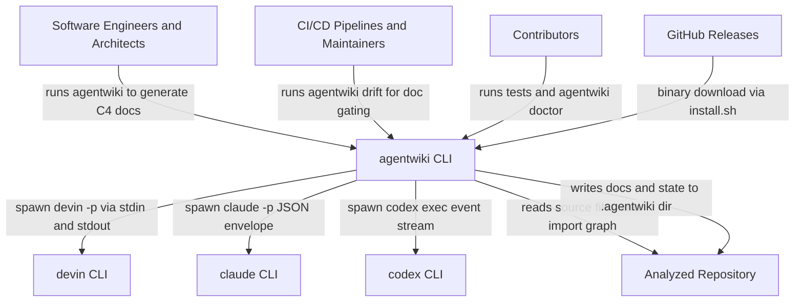

# System Context Overview — Project Overview

## 1. Project Introduction

**agentwiki** là một công cụ CLI viết bằng Rust, có nhiệm vụ tự động sinh tài liệu kiến trúc theo mô hình C4 cho bất kỳ repository mã nguồn nào. Thay vì gọi một HTTP LLM API trực tiếp, agentwiki điều phối một DAG (đồ thị có hướng, không chu trình) gồm các agent phân tích LLM, được vận hành thông qua các agent CLI cài đặt sẵn trên máy và đã xác thực bằng subscription của người dùng (`devin`, `claude`, `codex`).

Pipeline của hệ thống gồm bốn giai đoạn chính:

1. **Preprocess** — quét repository mục tiêu (cấu trúc thư mục, file inventory, README) thành `ScanData`.
2. **Research** — thực thi DAG các agent phân tích, fan-out theo thư mục và domain, sinh các báo cáo JSON có cấu trúc (dossier, quan hệ, system context, domain modules, boundary, database).
3. **Compose** — các editor agent và writer biến báo cáo nghiên cứu thành bộ tài liệu C4 Markdown (Overview, Architecture, Workflow, Boundary, Deep-dive, Data).
4. **Verify** — kiểm tra tính hợp lệ của tài liệu (ví dụ cú pháp Mermaid) trước khi xuất.

Ngoài pipeline sinh tài liệu, agentwiki còn cung cấp lệnh **`agentwiki drift`** — một bộ kiểm tra read-only đối chiếu các dependency edge mà tài liệu khẳng định (`core_dependencies`) với đồ thị import thật được trích xuất tĩnh từ mã nguồn (Rust, Python, JS/TS), nhằm phát hiện tài liệu bị trôi (drift) so với code. Đây là điểm khác biệt cốt lõi: tài liệu được sinh ra có thể được **kiểm chứng trong CI** thay vì trôi dạt âm thầm.

**Giá trị kinh doanh**: tự động hóa công việc viết tài liệu C4 vốn tốn kém thủ công; drift checker đảm bảo các khẳng định về dependency trong tài liệu khớp với import thực tế; việc tái sử dụng agent CLI có sẵn loại bỏ nhu cầu quản lý API key và tận dụng xác thực subscription mà người dùng đã có. Dự án là bản rewrite/port của deepwiki-rs (Litho).

## 2. Target Users

### 2.1 Software engineers / architects

Lập trình viên và kiến trúc sư cần tài liệu kiến trúc chính xác, cập nhật cho repository họ sở hữu hoặc đang onboarding.

- Sinh tài liệu theo các mức C4 (context, container, component, workflow, data) trực tiếp từ source code.
- Chọn backend và model tier theo từng project (`devin`/`claude`/`codex`; `efficient`/`powerful`).
- Cache kết quả theo content-hash và giới hạn số lượt gọi agent mỗi ngày để kiểm soát chi phí.
- Theo dõi tiến trình (progress spinner) và chẩn đoán trong các lần chạy kéo dài.

### 2.2 CI/CD pipelines và maintainers

Các đội chạy `agentwiki drift` trong CI để phát hiện documentation drift.

- Drift check read-only đối chiếu claimed edges với import graph thật.
- Kết quả machine-readable (`drift.json`) kèm exit code để gating ở strict mode.
- File baseline cho phép suppress các findings đã biết.
- Tỉ lệ false-positive thấp nhờ chuỗi filter C1–C12 (phân loại claim) và U1–U9 (lọc edge chưa được tài liệu hóa).

### 2.3 Contributors

Lập trình viên chỉnh sửa chính agentwiki.

- Test suite offline hoàn toàn nhờ `MockBackend`; e2e với CLI thật là opt-in.
- Kiểm tra sức khỏe môi trường qua `agentwiki doctor`.
- Override prompt template trên đĩa mà không cần compile lại.

## 3. System Boundaries

agentwiki là một **CLI đơn binary, self-contained**. Nó đọc repository mục tiêu, điều phối các agent CLI bên ngoài cho toàn bộ công việc LLM, ghi tài liệu và state vào thư mục `.agentwiki/` của repo mục tiêu, và thực hiện drift check ở chế độ read-only. Toàn bộ LLM inference diễn ra **bên trong các CLI bên ngoài** — agentwiki chỉ orchestrate, validate và render.

### 3.1 Nằm trong phạm vi hệ thống

- Giao diện CLI và merge cấu hình (clap args, `agentwiki.toml`, profiles, model tiers).
- Repository scanner và prompt material builders.
- DAG điều phối agent (`AgentSpec` registry, fan-out runner, `ResearchContext` chia sẻ).
- Lớp adapter backend (trait `AgentBackend`; adapter `devin`/`claude`/`codex`/`mock`).
- Parsing structured output với lenient deserializer, retry-with-feedback, model fallback.
- Prompt template engine (template nhúng sẵn, hỗ trợ override từ đĩa).
- Cache theo content-hash, quota hằng ngày và audit log `calls.jsonl`.
- Compose stage sinh bộ tài liệu C4 Markdown.
- Drift checker: import extractor (Rust/Python/JS), resolver, file→node graph, phân loại claim C1–C12, filter U1–U9 cho undocumented edge, baseline, report.
- Diagnostics (`doctor`) và hiển thị tiến trình.
- Script cài đặt và đóng gói crates.io.

### 3.2 Nằm ngoài phạm vi hệ thống

- Bản thân LLM inference (ủy quyền cho agent CLI bên ngoài).
- Xác thực với LLM provider (do subscription auth của từng CLI đảm nhiệm).
- Truy cập OpenAI-compatible HTTP API (explicit non-goal của thiết kế).
- Sửa/chỉnh repository được phân tích (agent chạy read-only).
- Hosted service, UI, hoặc daemon chạy dài hạn.
- Phân tích semantic/AST đầy đủ vượt quá import extraction dựa trên regex (static analysis giới hạn phạm vi).

## 4. External System Interactions

| Hệ thống bên ngoài | Vai trò | Cách tương tác |
|---|---|---|
| **devin CLI** | LLM backend (Cognition Devin agent CLI) | Spawn subprocess `devin -p`, prompt qua stdin, capture stdout/stderr dạng plain text |
| **claude CLI** | LLM backend (Anthropic Claude Code CLI) | Spawn subprocess `claude -p`, prompt qua stdin, parse JSON envelope chứa text, structured output và token usage |
| **codex CLI** | LLM backend (OpenAI Codex CLI) | Spawn subprocess `codex exec`, prompt qua stdin, parse event stream từng dòng; JSON schema truyền qua `--output-schema` |
| **GitHub Releases** | Host binary agentwiki đã build sẵn | Tải HTTP qua `curl` trong `install.sh`, platform được map sang Rust target triple |
| **Analyzed repositories** | Codebase tùy ý của người dùng, là input phân tích | Quét filesystem read-only và trích xuất import tĩnh (Rust, Python, JS/TS) |

Điểm cần lưu ý: agentwiki **không gọi LLM API trực tiếp**. Mọi tương tác với LLM đều đi qua subprocess của các agent CLI do người dùng cài và xác thực sẵn, qua lớp trừu tượng `AgentBackend` (factory `for_kind` + auto-detect trên PATH).

## 5. System Context Diagram

**Thông tin chính của diagram:**

- **Trung tâm hệ thống** là `agentwiki` — CLI đơn binary.
- **Con người**: ba nhóm actor (engineers/architects, CI maintainers, contributors) gọi các lệnh `agentwiki`, `agentwiki drift`, `agentwiki doctor`.
- **Phụ thuộc bên ngoài**: ba agent CLI đóng vai trò LLM backend thay thế cho nhau, được chọn qua cấu hình; `GitHub Releases` chỉ liên quan tới phân phối/cài đặt; repository được phân tích vừa là input (đọc) vừa là nơi chứa output (`.agentwiki/`).

## 6. Technical Architecture Overview

Bên trong boundary của hệ thống, agentwiki được tổ chức thành các domain module sau (chi tiết sẽ được trình bày ở các tài liệu C4 mức sâu hơn):

- **Agent Orchestration** (`src/agent`) — domain cốt lõi: registry `AgentSpec` khai báo DAG, scheduler topological-level, runner thực thi fan-out instance với retry/fallback, `ResearchContext` (RwLock key-value store) trung gian trao đổi kết quả giữa các agent, materials assembly, và bộ schema báo cáo có cấu trúc với lenient deserializer.
- **LLM Backend Integration** (`src/backend`) — trait `AgentBackend` với adapter cho `devin`, `claude`, `codex` và `mock`; xử lý parse model string, dựng command, parse envelope/event stream, normalize schema, sanitize env.
- **Drift Verification** (`src/drift`) — domain kiểm chứng read-only: import extraction theo ngôn ngữ, resolution thành file/node graph với evidence level, phân loại claim C1–C12, phát hiện undocumented edge U1–U9, baseline và report `drift.json` kèm exit code cho CI.
- **Repository Scanning & Preprocessing** (`src/scanner`) — quét repo thành `ScanData`, phục vụ cả pipeline sinh tài liệu lẫn drift check.
- **Documentation Composition & Output** (`src/output`, `prompts/editors`) — biến báo cáo nghiên cứu thành bộ tài liệu C4 Markdown và verify output.
- **Prompt Engineering Assets** (`prompts`, `src/prompt.rs`) — template Markdown định nghĩa persona analyst, output contract và Mermaid safety rules; engine render `{{key}}` với disk override.
- **CLI & Runtime Infrastructure** (`src/main.rs`, `src/cli.rs`, `src/config.rs`, `src/cache.rs`, `src/quota.rs`, `src/doctor.rs`, ...) — dispatch subcommand, merge config nhiều lớp, cache/quota/audit, diagnostics, progress, atomic write.

**Luồng nghiệp vụ chính:**

1. **Documentation Generation Pipeline** (`agentwiki`): parse args → scan repo → tính topological levels của research specs → chạy từng spec qua backend (sau cache/quota) → compose tài liệu C4 → verify → ghi Markdown.
2. **Documentation Drift Check** (`agentwiki drift`): quét file inventory → trích xuất import → dựng file/node graph → load và phân loại claims → phát hiện edge chưa tài liệu hóa → apply baseline → xuất report + exit code.
3. **Environment Health Check** (`agentwiki doctor`): probe agent CLI trên PATH, kiểm tra state `.agentwiki/` (lock, quota, cache), validate config, tùy chọn `--fix`, exit nonzero khi có lỗi.

Thiết kế này giữ pipeline testable hoàn toàn offline nhờ `MockBackend`, trong khi mọi đường đi tới LLM thật đều tập trung tại một lớp adapter duy nhất — giúp việc thêm backend mới hoặc thay đổi CLI không ảnh hưởng tới domain orchestration.