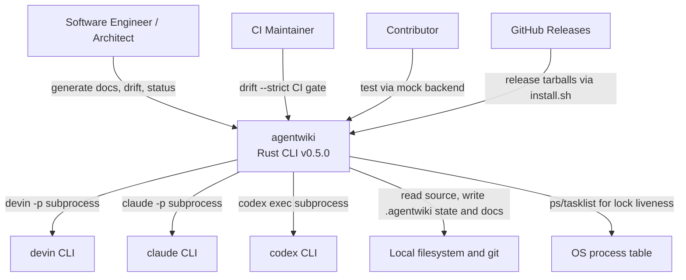

# Tổng quan Hệ thống (Project Overview)

## 1. Giới thiệu Dự án

**agentwiki** (v0.5.0) là một công cụ dòng lệnh (CLI) viết bằng Rust — được viết lại từ `deepwiki-rs` — có nhiệm vụ tự động sinh tài liệu kiến trúc theo mô hình C4 cho một codebase mục tiêu.

### Giá trị cốt lõi

Tài liệu kiến trúc thường đắt đỏ để viết và nhanh chóng lỗi thời. agentwiki giải quyết vấn đề này qua bốn trụ cột:

- **Không quản lý API key**: thay vì gọi trực tiếp LLM API, hệ thống shell-out tới các agent CLI đã xác thực sẵn trên máy (`devin`, `claude`, `codex`) — mỗi CLI tự chịu trách nhiệm về credential của nó.
- **Kiểm soát chi phí**: cache theo content-hash, quota số lượt gọi mỗi ngày, và tái sinh tăng trưởng (incremental regeneration) dựa trên manifest fingerprint.
- **Kiểm chứng (verification)**: tầng `drift` kiểm tra các khẳng định phụ thuộc (dependency claims) do LLM sinh ra đối chiếu với đồ thị import tĩnh thực tế — phát hiện hallucination và docs bị lệch — đây là chế độ lỗi chính của tài liệu do LLM tạo.
- **Pipeline 4 giai đoạn**: `Preprocess → Research → Compose → Verify` — quét repo, fan-out các tác vụ phân tích theo thư mục/domain, biên soạn tài liệu Markdown kèm sơ đồ Mermaid, và kiểm chứng kết quả.

Ngoài pipeline sinh docs, hệ thống còn cung cấp các lệnh read-only: `doctor` (kiểm tra môi trường), `drift` (phát hiện lệch tài liệu), `status` (báo cáo độ tươi của docs).

## 2. Người dùng Mục tiêu

| Nhóm người dùng | Mô tả | Nhu cầu chính |
|---|---|---|
| **Kỹ sư phần mềm & Kiến trúc sư** | Cần tài liệu C4 cập nhật cho codebase họ sở hữu hoặc đang onboarding | Sinh overview, deep-dive, workflow docs từ source; chỉ tái sinh phần thay đổi; phát hiện drift |
| **CI/Platform maintainers** | Tích hợp kiểm tra độ tươi tài liệu vào pipeline | `agentwiki drift --strict` làm CI gate; export claims (`agentwiki.claims.json`); exit code deterministic (0/1/2) cho scripting |
| **Contributor của agentwiki** | Phát triển/mở rộng công cụ | Test offline qua `MockBackend` (model string `mock:*`) mà không cần CLI thật; e2e suite tùy chọn qua `AGENTWIKI_E2E=1`; quy ước clippy-clean, no-unwrap |

## 3. Ranh giới Hệ thống

### Phạm vi

agentwiki sở hữu toàn bộ quá trình từ lúc quét repo mục tiêu đến khi xuất tài liệu Markdown đã kiểm chứng, cùng trạng thái cục bộ (cache, manifest, quota, drift baseline) để các lần chạy mang tính tăng trưởng và audit được. **Hệ thống không tự thực hiện LLM inference** — mọi lời gọi model đều ủy quyền cho agent CLI bên ngoài.

### Thành phần nằm TRONG ranh giới

- **CLI surface**: lệnh `generate` (pipeline) cùng `doctor`/`drift`/`status` (clap)
- **Configuration layer**: `agentwiki.toml`, global config, profiles, model tiers; độ ưu tiên `CLI > TOML > default`
- **Scanner/Preprocess**: sinh `ScanData` (cấu trúc repo, files, README)
- **Agent orchestration core**: registry DAG `AgentSpec`, topo scheduling, fan-out theo directory/domain, `ResearchContext` shared store
- **Agent runner**: lắp ráp prompt, kiểm tra cache/quota, gọi backend, trích xuất JSON, retry-with-feedback, fallback theo model tier
- **Backend abstraction**: trait `AgentBackend` với implementation `devin`/`claude`/`codex` và `MockBackend`
- **Structured report schemas**: lenient deserializers chịu được output LLM xấu
- **Prompt template system**: mặc định nhúng sẵn, override qua disk, render `{{key}}`
- **Compose stage**: sinh tài liệu C4 (overview, architecture, deep-dive, workflows) qua editor prompts
- **Drift engine**: trích xuất import cho Rust/Python/JS-TS, resolve thành file graph, phân loại claim C1–C12, filter undocumented-edge U1–U9/C9, baseline + report
- **State management**: content-hash cache, manifest fingerprints, daily quota counter, audit log `calls.jsonl`, run lock
- **Diagnostics**: doctor probes, drift report, status/freshness report, progress display

### Thành phần nằm NGOÀI ranh giới

- **LLM inference & model hosting** — ủy quyền hoàn toàn cho agent CLI bên ngoài
- **Authentication/credential management** — dựa vào login state của từng agent CLI
- **Target codebase được document hóa** — là input, không phải một phần hệ thống
- **Doc hosting/rendering** — chỉ xuất Markdown; không có web UI hay bước publish
- **Full AST parsing** — trích xuất import là regex/heuristic trên source đã sanitize
- **Write access vào target repo** — công cụ chỉ đọc; mọi output đi vào `.agentwiki/` và thư mục docs

## 4. Tương tác với Hệ thống Bên ngoài

| Hệ thống ngoài | Kiểu tương tác | Chi tiết |
|---|---|---|
| **devin CLI** (Cognition) | Subprocess: `devin -p` | Prompt truyền vào, output parse ngược lại. Đây là backend tham chiếu (reference backend), implementation đơn giản nhất |
| **claude CLI** (Anthropic) | Subprocess: `claude -p`, prompt qua stdin | JSON envelope được parse để lấy result text, token usage, errors. Hỗ trợ model string dạng `claude:<model>@<effort>` |
| **codex CLI** (OpenAI) | Subprocess: `codex exec`, prompt qua stdin, `-o` output file | JSONL event stream được parse cho text, usage, turn failures. JSON schema được normalize theo yêu cầu chặt hơn của codex |
| **GitHub Releases** | HTTPS download | `install.sh` tải release tarball khớp platform |
| **Local filesystem & git** | Read/write cục bộ | Đọc source files cho scanning và import extraction; đọc `git HEAD` cho manifest diff; ghi cache, `research.json`, manifests, `calls.jsonl`, và docs đã sinh; đọc `~/.config` config files |
| **OS process table** | Đọc `ps`/`tasklist` | `sys.rs` parse để phát hiện agent process đang chạy/orphaned và validate run-lock liveness |

## 5. Sơ đồ System Context

**Điểm nhấn kiến trúc trong sơ đồ:**

- agentwiki là hệ thống trung tâm duy nhất; mọi LLM call đi qua abstraction `AgentBackend` → subprocess tới một trong ba agent CLI (hoặc `MockBackend` khi test).
- Target repo chỉ bị **đọc**; toàn bộ trạng thái và output ghi vào `.agentwiki/` + thư mục docs.
- Không có API key nào nằm trong agentwiki — authentication là trách nhiệm của từng agent CLI.

## 6. Tổng quan Kiến trúc Kỹ thuật

Hệ thống theo **layered pipeline nghiêm ngặt**: Scanner xác định (Phase 0, không AI) nuôi Pipeline Orchestrator, orchestrator thực thi DAG tác vụ multi-agent khai báo qua abstraction subprocess `AgentBackend` thống nhất, kết quả trao đổi qua `ResearchContext` typed store, và renderer deterministic xuất docs. Các dịch vụ governance xuyên suốt — content-hash cache, change manifest, daily quota/audit, progress, cancellation — giữ cho mỗi run tăng trưởng, giới hạn chi phí, và resumable. Song song là bounded context read-only **Drift Detection** trích xuất đồ thị import đa ngôn ngữ, resolve theo ngôn ngữ, và kiểm chứng claims qua verdict chain có thứ tự (C1–C12, U1–U9).

### Các domain chính

| Domain | Loại | Importance | Vai trò |
|---|---|---|---|
| **Documentation Generation Pipeline** (`src/pipeline`, `src/main.rs`, `src/cli.rs`, `src/output`) | Core | 9.5 | Điều phối Preprocess → Research → Compose → Write → Verify; `PipelineCtx`, giới hạn concurrency bằng semaphore, cooperative cancellation, run stats |
| **Agent Orchestration & Analysis** (`src/agent`) | Core | 9.5 | DAG `AgentSpec` khai báo (phase, fan-out, model tier, dependencies); runner với retry/fallback; `ResearchContext` store; prompt materials; structured report schemas |
| **Agent Backend Integration** (`src/backend`) | Supporting | 9.0 | Trait `AgentBackend` thống nhất devin/claude/codex + mock; parse `<backend>:<model>`; normalize envelope/event stream |
| **Drift Detection & Claim Verification** (`src/drift`) | Core | 8.5 | Import extractor Rust/Python/JS-TS → FileGraph → phân loại claim (confirmed/structural/unverifiable/reversed/phantom) + undocumented-edge detection + baseline cho `--strict` |
| **Repository Scanning** (`src/scanner`) | Supporting | 7.5 | Phase-0 deterministic: walk tree, `DirectoryInfo`, README/docs extraction, per-file statics |
| **Configuration & Prompt Management** (`src/config.rs`, `src/prompt.rs`, `prompts/`) | Infrastructure | 8.0 | Layered config (default → TOML → CLI), profiles/model tiers; template engine `{{key}}` với disk-override; thư viện prompt personas (research + editor) kèm Mermaid rules |
| **Runtime Governance & Operations** (`src/cache.rs`, `src/manifest.rs`, `src/quota.rs`, `src/doctor.rs`, `src/status.rs`, v.v.) | Infrastructure | 7.5 | Content-hash cache, manifest fingerprint (cosmetic vs structural), quota + `calls.jsonl` audit, doctor/status commands, progress, atomic writes, error taxonomy |

### Quan hệ domain chủ chốt

- **Pipeline → Agent Orchestration** (Orchestration, 10.0): pipeline duyệt các topo level từ registry và gọi `run_spec` cho từng node trong phase Research và Compose.
- **Agent Orchestration → Backend Integration** (Service Call, 9.0): runner gọi `AgentBackend` subprocess đã resolve.
- **Pipeline/Orchestration → Repository Scanning** (Data Dependency, 9.0/8.0): `ScanData` từ Phase 0 là input cho toàn pipeline và prompt materials.
- **Pipeline → Runtime Governance** (Service Composition, 8.0): cache, manifest, quota, progress, cancellation trong suốt run.
- **Drift → Scanning** (Data Dependency, 8.0) và **Drift → Agent Orchestration** (Data Dependency, 6.0): drift dùng cùng file set và tiêu thụ report types (`CoreDependency`, `DependencyType`) làm claim input — không có runtime call.
- **Backend Integration → Config** (Data Dependency, 6.0): backend selection, model strings, profiles đến từ `Config`.

### Luồng nghiệp vụ chính

**1. Generate Documentation Run** (importance 10.0) — `agentwiki generate`:
parse args → merge config → run lock → scan repo → build/diff manifest → topo scheduling spec DAG → runner (prompt render → cache/quota check → backend call → JSON parse → retry/fallback → store vào `ResearchContext`) → write doc tree + boundary/database/summary docs → verify artifacts → summary.

**2. Drift Verification** (importance 8.5) — `agentwiki drift [--strict] [--export-claims]`:
scan → extract imports → resolve FileGraph + facade closure → classify claims (C1–C12) → U1–U9 undocumented filters → diff baseline → render report → ghi `.agentwiki/drift.json` → exit code cho CI.

**3. Operational Health & Freshness** (importance 6.5) — `agentwiki doctor` / `agentwiki status`:
probe agent CLI versions/processes/state dirs (`--fix` dọn stale locks) → manifest diff → báo cáo doc ages + dự đoán documents sẽ regenerate ở run tiếp theo — hoàn toàn read-only.

### Đặc điểm kỹ thuật nổi bật

- **Deterministic scanning**: Phase 0 hoàn toàn không gọi AI — kết quả scan tái lập được, làm nền cho incremental diff.
- **Declarative agent DAG**: mỗi `AgentSpec` khai báo phase, fan-out axis (per-directory, per-domain), materials, output schema; scheduler tính topo levels.
- **Lenient deserialization**: report schemas chịu được JSON xấu từ LLM, kèm retry-with-feedback và model-tier fallback.
- **Read-only drift engine**: toàn bộ kiểm chứng claims chạy mà không cần LLM call nào — đủ rẻ để làm CI gate.
- **Auditability**: mọi call thật ghi vào `calls.jsonl` (RFC3339 stamp); run lock + process-table check chống concurrent run và nhận diện orphan processes.