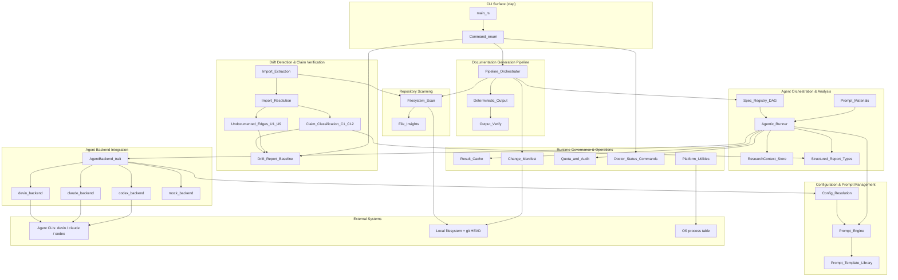
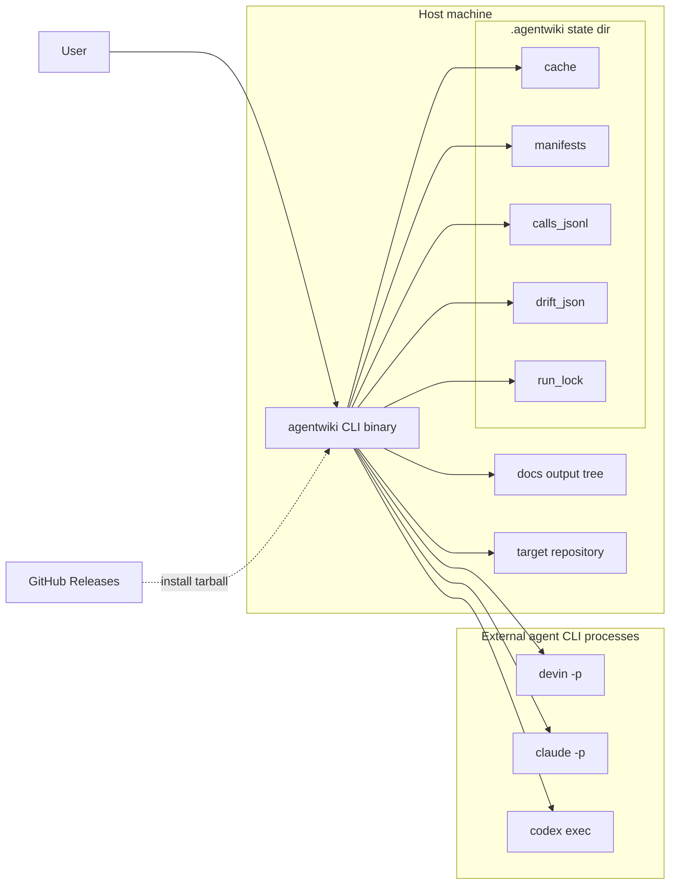
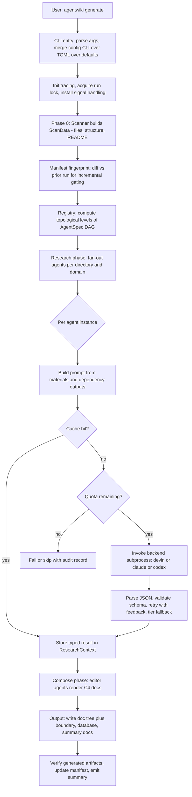
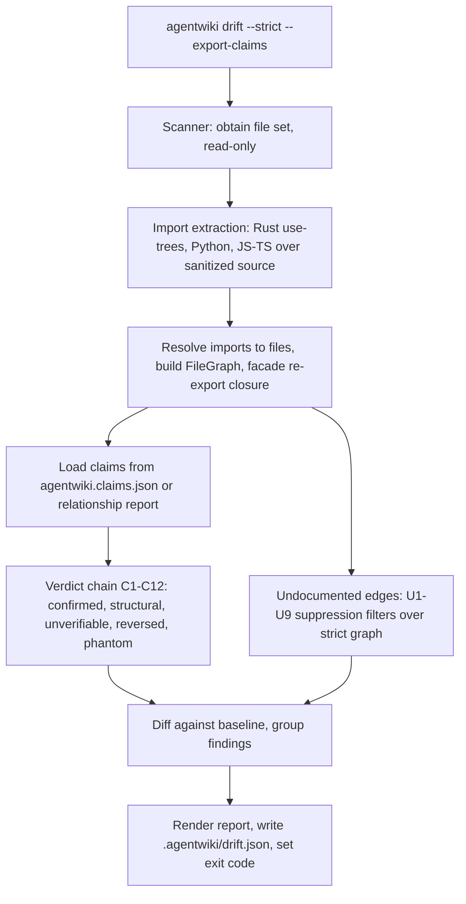
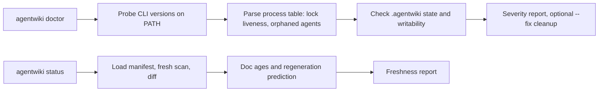
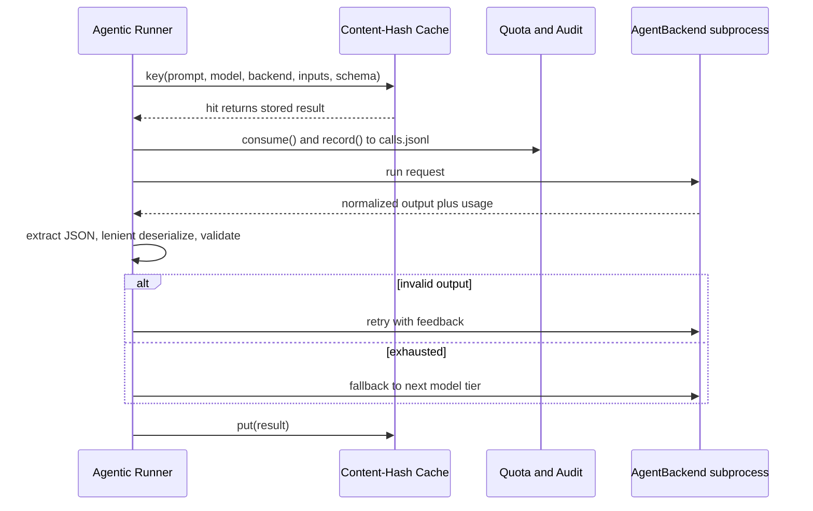

# System Architecture Documentation — agentwiki

## 1. Architecture Overview

**agentwiki** (v0.5.0) là một công cụ CLI viết bằng Rust dùng để sinh tài liệu kiến trúc theo mô hình C4 cho một repository mã nguồn mục tiêu. Điểm khác biệt cốt lõi: thay vì gọi trực tiếp LLM API, agentwiki **ủy quyền toàn bộ inference cho các agent CLI đã được xác thực sẵn trên máy local** (`devin`, `claude`, `codex`) thông qua subprocess — loại bỏ hoàn toàn bài toán quản lý API key.

Hệ thống vận hành theo pipeline bốn giai đoạn:

**Preprocess → Research → Compose → Verify**

1. **Preprocess (Phase 0)**: scanner deterministic duyệt cây thư mục, sinh `ScanData` (file set, cấu trúc thư mục, trích xuất README, file statics). Không có LLM call nào.
2. **Research (Phase 1)**: một DAG các `AgentSpec` được duyệt theo topological levels, fan-out theo thư mục/domain, gọi backend CLI, kết quả JSON trao đổi qua `ResearchContext`.
3. **Compose (Phase 2)**: các editor agent biến kết quả research thành tài liệu Markdown C4 kèm sơ đồ Mermaid.
4. **Verify**: output renderer ghi doc tree deterministic, sinh boundary/database/summary docs và kiểm tra artifacts.

Song song với pipeline sinh docs là một **bounded context độc lập — Drift Detection**: hoàn toàn read-only, không gọi LLM, tự trích xuất import graph tĩnh (Rust/Python/JS-TS) rồi đối chiếu với các dependency claim trong docs qua chuỗi verdict C1–C12 và bộ lọc U1–U9, nhằm phát hiện claim "ảo" (hallucinated) hoặc đã lạc hậu — chế độ failure phổ biến nhất của docs do LLM sinh.

### Các chất lượng kiến trúc chính

| Thuộc tính | Cơ chế |
|---|---|
| Cost-bounded | Content-hash cache, daily quota, manifest incremental regeneration |
| Verifiable | Drift engine kiểm chứng dependency claims bằng import graph tĩnh |
| Auditable | `calls.jsonl` audit log, exit code deterministic 0/1/2 cho CI |
| Read-only với target repo | Mọi state nằm trong `.agentwiki/` và docs directory |
| Resumable | Retry-with-feedback, model-tier fallback, lenient deserializers |

### Sơ đồ kiến trúc tổng thể

## 2. System Context

### 2.1 Vị trí hệ thống

agentwiki là một **CLI tool** — người dùng chạy trên máy local, trỏ vào một repository cần tài liệu hóa. Ranh giới hệ thống rất rõ:

**Trong phạm vi hệ thống:**
- CLI surface (`generate` mặc định + `doctor`/`drift`/`status` subcommands, dùng clap)
- Tầng cấu hình: `agentwiki.toml`, global config, profiles, model tiers, precedence CLI > TOML > defaults
- Scanner/preprocess sinh `ScanData`
- Agent orchestration core: registry `AgentSpec` DAG, topo scheduling, `ResearchContext`
- Agent runner: prompt assembly, cache/quota check, backend invocation, JSON extraction, retry-with-feedback, tier fallback
- Backend abstraction: trait `AgentBackend` + impls devin/claude/codex + `MockBackend`
- Report schemas với lenient deserializers
- Prompt template system: embedded defaults + disk overrides, render `{{key}}`
- Compose stage sinh C4 docs (overview, architecture, deep-dive, workflows)
- Drift engine: import extraction, FileGraph resolution, verdict chains, baseline/report
- State: cache, manifest, quota counter, `calls.jsonl`, run lock
- Diagnostics: doctor, drift report, status/freshness, progress display

**Ngoài phạm vi:**
- LLM inference và model hosting — ủy quyền hoàn toàn cho agent CLI bên ngoài
- Authentication/credential — dựa vào login state của từng CLI
- Target codebase — là input, không phải thành phần hệ thống
- Doc hosting/rendering — chỉ emit Markdown, không có web UI
- Full AST parsing — import extraction dùng regex/heuristic trên source đã sanitize
- Write access vào target repo — tool chỉ đọc; output đi vào `.agentwiki/` và docs dir

### 2.2 Người dùng

| Actor | Nhu cầu |
|---|---|
| Software engineers / architects | Sinh architecture overviews, deep-dives, workflow docs; regeneration incremental; phát hiện drift |
| CI/platform maintainers | `agentwiki drift --strict` làm CI gate; export `agentwiki.claims.json`; exit code 0/1/2 |
| Contributors | Test offline bằng `MockBackend`; e2e opt-in qua `AGENTWIKI_E2E=1`; conventions clippy-clean |

### 2.3 Hệ thống bên ngoài

| Hệ thống | Kiểu tương tác |
|---|---|
| `devin` CLI | Subprocess `devin -p`; reference backend, pass-through đơn giản nhất |
| `claude` CLI | Subprocess `claude -p`, prompt qua stdin; parse JSON envelope (result, usage, errors); hỗ trợ `claude:<model>@<effort>` |
| `codex` CLI | Subprocess `codex exec`, `-o` output file; parse JSONL event stream; schema normalize theo constraint chặt hơn của codex |
| GitHub Releases | `install.sh` tải release tarball qua HTTPS (distribution nằm ngoài crate) |
| Local filesystem + git | Đọc source để scan/extract imports; đọc git HEAD cho manifest diff; ghi cache, `research.json`, manifests, `calls.jsonl`, docs |
| OS process table | `sys.rs` parse `ps`/`tasklist` để detect agent processes và validate run-lock liveness |

## 3. Container View

Vì agentwiki là một binary duy nhất, "container" ở đây là các **tiến trình và vùng lưu trữ** tham gia vào một run.

### Các "container"

| Container | Vai trò | Công nghệ |
|---|---|---|
| `agentwiki` binary | Toàn bộ logic: CLI, pipeline, orchestration, drift, governance | Rust 2021+, async (tokio), clap, serde |
| `.agentwiki/` state dir | Content-hash cache, manifest fingerprints, `calls.jsonl`, `drift.json`, run lock | Filesystem, atomic writes qua `write_atomic` |
| Docs output tree | `docs/en/*.md`, `agentwiki.claims.json`, `__AgentWiki_Summary__.md`, locale khác (`docs/vi`) | Markdown + Mermaid + JSON |
| Agent CLI subprocesses | LLM backends đã xác thực sẵn | devin / claude / codex (external) |
| Target repository | Input read-only | Filesystem + git HEAD |

### Giao tiếp giữa containers

- **CLI → agent CLI**: spawn subprocess, prompt qua stdin/argv, output qua stdout hoặc `-o` file; parse envelope/JSONL theo từng backend; env được sanitize (`sanitized_env`).
- **CLI → filesystem**: đọc repo, ghi state/docs qua atomic write (write-temp-then-rename) để tránh partial artifacts.
- **CLI → process table**: `sys.rs` liệt kê processes để kiểm tra run lock còn sống không và phát hiện orphan agent processes (phục vụ `doctor`).

## 4. Component View

### 4.1 Bảng domain modules

| Domain | Loại | Importance | Vị trí | Vai trò |
|---|---|---|---|---|
| Documentation Generation Pipeline | Core | 9.5 | `src/pipeline/`, `src/main.rs`, `src/cli.rs`, `src/output/` | Điều phối Preprocess→Research→Compose→Write→Verify; `PipelineCtx`, semaphore concurrency, cancellation |
| Agent Orchestration & Analysis | Core | 9.5 | `src/agent/` | `AgentSpec` DAG khai báo, topo levels, fan-out per-directory/domain, retry/fallback |
| Drift Detection & Claim Verification | Core | 8.5 | `src/drift/` | Verdict chain C1–C12 + U1–U9 filter trên FileGraph, read-only |
| Agent Backend Integration | Supporting | 9.0 | `src/backend/` | Trait `AgentBackend`; impls devin/claude/codex + MockBackend |
| Repository Scanning | Supporting | 7.5 | `src/scanner/` | Phase-0 deterministic → `ScanData` |
| Configuration & Prompt Management | Infrastructure | 8.0 | `src/config.rs`, `src/prompt.rs`, `prompts/` | Precedence CLI>TOML>defaults; profiles, tiers, `{{key}}` templates |
| Runtime Governance & Operations | Infrastructure | 7.5 | `cache.rs`, `manifest.rs`, `quota.rs`, `doctor.rs`, `status.rs`, `sys.rs`, `util.rs` | Cache, manifest, quota/audit, health probes, atomic writes |

### 4.2 Chi tiết component

#### Documentation Generation Pipeline
- **Pipeline Orchestrator** (`src/pipeline/mod.rs`): `PipelineCtx` giữ config, scan data, cache, quota, backends; giới hạn concurrency bằng semaphore; cancellation cooperative. Lưu ý: enum `Phase` chỉ có `Research`/`Compose` — Preprocess là phase-0 input, Verify nằm trong `src/output/verify.rs`.
- **CLI Entry & Command Surface** (`src/main.rs`, `src/cli.rs`): `generate` là default action (top-level args, không phải `Command` variant); `Command::{Doctor, Drift, Status}` là subcommands.
- **Deterministic Output & Verification** (`src/output/`): `write_docs`, `boundary_doc`, `database_doc`, `write_summary`, `verify` — các docs này render không qua LLM.

#### Agent Orchestration & Analysis
- **Task DAG & Agent Specs** (`registry.rs`, `spec.rs`): khai báo specs với phase, fan-out axis, materials, output schema, model tier; `topo_levels`/`expand` sinh execution levels.
- **Agentic Runner** (`runner.rs`): `run_spec` → `run_instance` → `build_prompt` → gọi backend → `parse_output`/`extract_json` → retry với feedback → fallback tier → ghi `ResearchContext`.
- **Research Context Store** (`context.rs`): async key-value store typed JSON giữa các phase; `snapshot`/`save`/`load`.
- **Prompt Materials** (`materials.rs`): format ScanData, README, insights, relationship results thành markdown blocks có size cap.
- **Structured Report Types** (`reports/`): schemas cho dossiers, relationships, research reports; lenient deserializers chịu JSON xấu của LLM.

#### Agent Backend Integration
- **Backend Abstraction** (`backend/mod.rs`): `trait AgentBackend`, `enum BackendKind` parse `'<backend>:<model>'`, factory `for_kind`.
- **Claude** (`claude.rs`): `build_cmd`, `parse_envelope`, `sanitize_schema`; hỗ trợ `model@effort`.
- **Codex** (`codex.rs`): `build_cmd`, `parse_events` (JSONL), `normalize_schema`, reasoning-effort mapping.
- **Devin** (`devin.rs`): reference backend, `devin -p` pass-through.
- **Mock** (`mock.rs`): `canned`, `with_delay` — test offline đầy đủ qua `mock:*`.

#### Drift Detection & Claim Verification
- **Import Extraction** (`drift/imports/`): Rust use-trees/mod resolution, Python relative/absolute, JS/TS ESM/CJS/dynamic; chạy trên source đã `sanitize` (bỏ comment/string) với byte-exact offsets.
- **Import Resolution & Graph Building** (`drift/resolve/`): resolve theo từng ngôn ngữ (Cargo layout, Python module suffix, JS extension/index probing) → `FileGraph` + facade re-export closure.
- **Claim Classification** (`compare.rs`, `claims.rs`, `findings.rs`): chuỗi verdict C1–C12 theo thứ tự, guards trước evidence → confirmed/structural/unverifiable/reversed/phantom.
- **Undocumented Edge Detection** (`undocumented.rs`, `graph.rs`): U1–U9 suppression filters trên strict strong-evidence graph; `reachable`, `hubs`, `facade_closure`.
- **Drift Reporting & Baselining** (`report.rs`, `baseline.rs`, `config.rs`): versioned report schema, grouping, render, `Baseline::load/save` cho `--strict`.

#### Repository Scanning
- **Filesystem Scan** (`scanner/mod.rs`, `files.rs`, `structure.rs`): `scan`/`scan_files`/`build_structure`/`extract_docs`, tôn trọng scan config và output-path exclusion.
- **File Statics & Insights** (`insights.rs`): `FileStatics::for_entry` lazy, cung cấp material cho prompts.

#### Configuration & Prompt Management
- **Config Resolution** (`config.rs`): `load`, `apply_toml`, `model_for`, `find_profile`; merge CLI > TOML > defaults.
- **Prompt Engine** (`prompt.rs`): render `{{key}}`; `PromptLoader::load` ưu tiên disk override rồi mới embedded default.
- **Prompt Template Library** (`prompts/`, `prompts/editors/`): personas research (system_context, domain_modules, boundary, database, workflow, relationships, dir_summary, key_module) + editor personas (overview, architecture, deep-dive, workflow) với strict Mermaid rules.

#### Runtime Governance & Operations
- **Result Cache** (`cache.rs`): key = hash(prompt, model, backend, inputs, schema) → `.agentwiki/cache/`.
- **Change Manifest** (`manifest.rs`): fingerprint inputs + env per output dir; `diff` phân loại cosmetic vs structural.
- **Quota & Audit** (`quota.rs`): `daily_cap`, `consume`, `record` append RFC3339 records vào `calls.jsonl`.
- **Operational Commands** (`doctor.rs`, `status.rs`, `diag.rs`): probes PATH/versions/processes/state dir; `--fix` dọn stale lock; status report doc ages + regeneration prediction.
- **Platform & UX Utilities** (`progress.rs`, `sys.rs`, `util.rs`, `error.rs`): spinner, `list_processes`, `pid_alive`, `find_on_path`, `write_atomic`, error taxonomy.

## 5. Key Processes

### 5.1 Generate Documentation Run

Các bước chính:

1. **CLI entry & setup** (`main.rs`, `cli.rs`): parse args, merge config, acquire run lock, install cancellation.
2. **Repository scan** (`scanner`): deterministic walk → `ScanData`. Không có LLM call.
3. **Incremental gating** (`manifest.rs`): fingerprint + diff → chỉ regenerate phần stale.
4. **DAG scheduling** (`registry.rs`): `topo_levels` sinh levels thực thi được.
5. **Agentic execution** (`runner.rs`): render prompt → cache check → quota consume + audit → backend → lenient parse → retry/fallback.
6. **Backend dispatch** (`backend`): normalize 3 protocol subprocess khác nhau.
7. **Deterministic output & verification** (`output`): ghi doc tree, render non-LLM docs, verify, persist manifest/cache/snapshot.

### 5.2 Drift Verification (`agentwiki drift`)

Hoàn toàn read-only, không LLM call — phù hợp làm CI gate: exit code 0 (sạch), 1 (drift), 2 (lỗi).

### 5.3 Operational Health & Freshness

### 5.4 Governance Loop per paid call

Đây là điểm kiểm soát chi phí duy nhất: mọi paid CLI call đều đi qua bộ ba cache → quota → audit.

## 6. Technical Implementation

### Công nghệ & design patterns

- **Ngôn ngữ/runtime**: Rust, async (tokio), serde cho JSON, clap cho CLI; crate expose cả `lib.rs` lẫn `main.rs` nên tests import lib target.
- **Strategy pattern**: `AgentBackend` trait + `for_kind` factory; mỗi backend tự xử lý protocol riêng (envelope vs JSONL vs pass-through).
- **DAG scheduling**: `AgentSpec` khai báo dependencies; `topo_levels` cho phép chạy song song trong một level, semaphore bound parallelism.
- **Shared context**: `ResearchContext` là async KV store typed — decouples producer/consumer agents, hỗ trợ snapshot để resume/debug.
- **Defensive LLM handling**: lenient deserializers (`de_*`), `extract_json`, retry-with-feedback, tier fallback — giả định output LLM thường xấu.
- **Deterministic vs non-deterministic separation**: scanner, output renderers, drift là LLM-free và testable độc lập; chỉ runner vượt qua "cost boundary".

### Scalability / performance

- Concurrency giới hạn bằng semaphore trong `PipelineCtx`; fan-out theo directory/domain.
- Cache key gồm schema+inputs nên **sửa prompt template sẽ invalidate cache rộng** — input hashing mịn hơn là optimization tiềm năng.
- `ResearchContext` shared mutable store chưa biểu diễn key-coupling trong DAG — spec consume key không có producer chỉ fail lúc run.

### Security / reliability

- Không quản lý credential: dựa hoàn toàn vào login state của CLI ngoài; env sanitize khi spawn.
- Read-only với target repo; mọi write atomic.
- Run lock + `pid_alive` validation tránh concurrent run; `doctor --fix` dọn stale lock.
- Rủi ro: regex/heuristic import extraction giới hạn độ chính xác drift (có chủ đích — U-filters suppress low-confidence); format output của `claude`/`codex` thay đổi sẽ phá parsing âm thầm cho tới khi drift/tests bắt được.

## 7. Deployment Architecture

- **Phân phối**: binary prebuilt qua GitHub Releases; `install.sh` tải tarball theo platform qua HTTPS. Logic install nằm ngoài crate.
- **Runtime**: single-process CLI trên máy dev/CI; spawn subprocess cho từng backend call; state tại `.agentwiki/` trong target repo; global config ở `~/.config`.
- **Yêu cầu môi trường**: ít nhất một trong `devin`/`claude`/`codex` trên PATH và đã login (kiểm tra bằng `agentwiki doctor`).
- **CI integration**: `agentwiki drift --strict` + `--export-claims` cho gate kiểm chứng docs; `status` cho freshness prediction không tốn call.
- **Testing**: `MockBackend` + `mock:*` model strings cho offline suite (`tests/*_offline.rs`, fixtures `fixture-app`, `fixture-rs`); e2e thật opt-in qua `AGENTWIKI_E2E=1`.
- **Khuyến nghị vận hành**: chạy `doctor` trước run đầu; commit `agentwiki.claims.json` nếu muốn diff claims theo thời gian; dùng `status` như dry-run trước khi generate để tránh lãng phí quota.