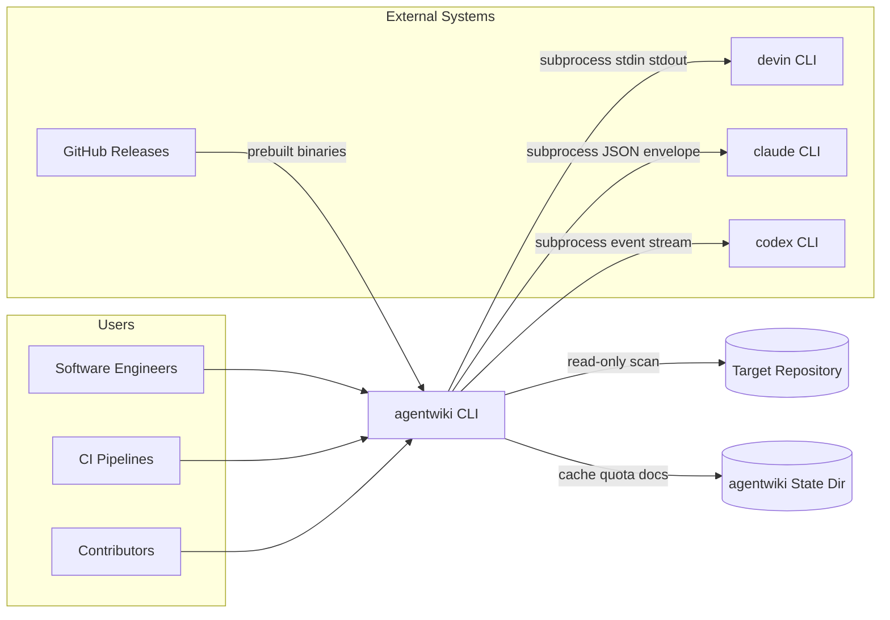
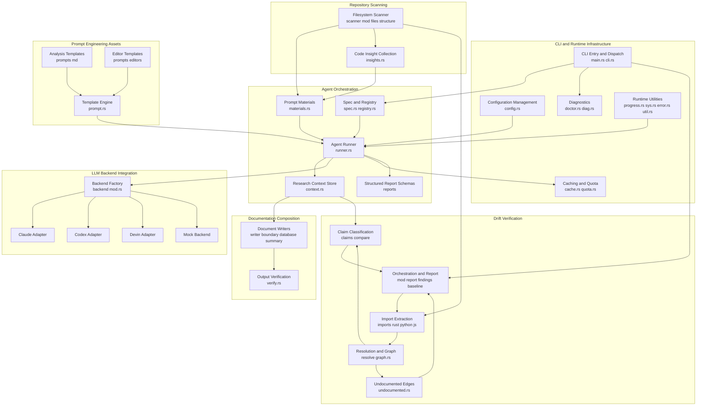
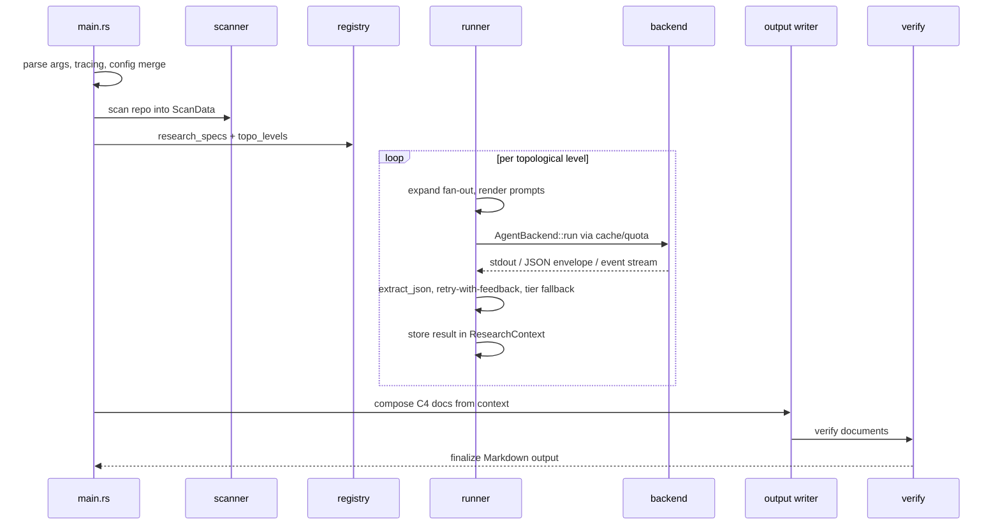
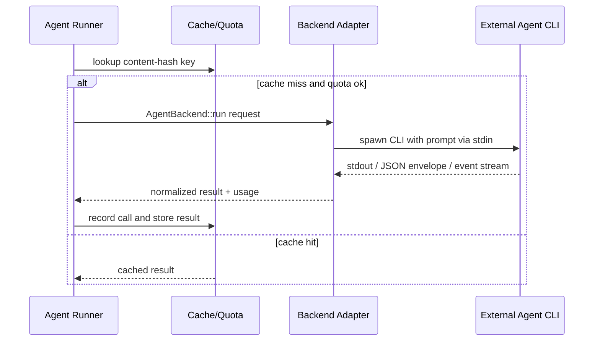
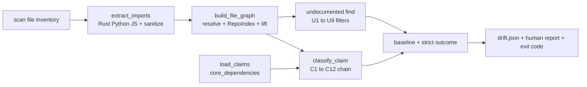

# Architecture Overview

## 1. Tổng quan kiến trúc

**agentwiki** (v0.5.0, Rust edition 2024) là một CLI đơn binary tạo tài liệu kiến trúc theo mô hình C4 cho bất kỳ repository nào. Quyết định kiến trúc quan trọng nhất của hệ thống: **toàn bộ suy luận LLM được ủy quyền cho các agent CLI cài sẵn trên máy, xác thực bằng subscription** (`devin`, `claude`, `codex`) — được spawn dưới dạng subprocess. Bên trong tool không có bất kỳ HTTP LLM API client nào. agentwiki chỉ điều phối (orchestrate), kiểm chứng (validate) và render; các CLI bên ngoài thực hiện "suy nghĩ".

Pipeline chính gồm 4 giai đoạn:

**Preprocess → Research → Compose → Verify**

Kèm theo hai luồng độc lập chỉ-đọc (read-only): **Drift** — kiểm tra chéo các dependency claim trong tài liệu với đồ thị import tĩnh thực tế; và **Doctor** — chẩn đoán môi trường.

Dự án là bản viết lại/port của deepwiki-rs (Litho).

### Nguyên tắc thiết kế cốt lõi

| Nguyên tắc | Ý nghĩa |
|---|---|
| Orchestrator, không phải LLM client | Không quản lý API key; auth nằm trong subscription của từng CLI |
| DAG khai báo + blackboard | Agent giao tiếp gián tiếp qua `ResearchContext`, không gọi trực tiếp lẫn nhau |
| Defense-in-depth cho output LLM | Lenient deserializer → multi-strategy JSON extraction → retry-with-feedback → model-tier fallback |
| Cost governance trong call path | Content-hash cache + daily quota + `calls.jsonl` audit log |
| Verification loop khép kín | Drift dùng chính claims của pipeline để đối chiếu ground truth tĩnh |

### Ranh giới hệ thống (system boundary)

**Bao gồm:** CLI/config merge, repo scanner, agent orchestration DAG, backend adapter layer, structured-output parsing với retry/fallback, prompt template engine, cache/quota/audit, compose stage, drift checker (C1–C12, U1–U9), `doctor`, installer script.

**Loại trừ (non-goals rõ ràng):** LLM inference, auth với LLM provider, OpenAI-compatible HTTP API, sửa repo được phân tích (read-only), hosted service/UI/daemon, phân tích AST đầy đủ (chỉ regex-based import extraction).

## 2. System Context



### External systems

| Hệ thống | Vai trò | Kiểu tương tác |
|---|---|---|
| `devin` CLI | LLM backend (Cognition Devin) | Subprocess `devin -p`, prompt qua stdin, plain stdout |
| `claude` CLI | LLM backend (Anthropic Claude Code) | Subprocess `claude -p`, JSON envelope output (text, structured output, usage) |
| `codex` CLI | LLM backend (OpenAI Codex) | Subprocess `codex exec`, line-based event stream, `--output-schema` |
| GitHub Releases | Phân phối binary | HTTP download qua `install.sh`, map platform → Rust target triple |
| Analyzed repositories | Input | Quét filesystem read-only + regex import extraction (Rust/Python/JS-TS) |

### Target users

- **Software engineers / architects**: sinh C4 docs, chọn backend/model tier, kiểm soát chi phí qua cache/quota.
- **CI/CD pipelines**: `agentwiki drift` read-only, `drift.json` machine-readable, baseline suppress findings, exit code gating.
- **Contributors**: `MockBackend` cho offline test, `agentwiki doctor` health check, prompt override không cần recompile.

## 3. Project Structure

```
src/
├── main.rs, cli.rs, config.rs       # CLI entry, clap args, config merge
├── lib.rs, error.rs, util.rs        # Crate root, Error enum, atomic writes
├── pipeline/mod.rs                  # Pipeline stage wiring
├── scanner/                         # Preprocess: ScanData
│   ├── mod.rs, files.rs, structure.rs, insights.rs
├── agent/                           # Agent orchestration DAG (core domain)
│   ├── spec.rs, registry.rs         # AgentSpec + topo_levels
│   ├── runner.rs                    # agentic loop engine
│   ├── context.rs                   # ResearchContext (RwLock blackboard)
│   ├── materials.rs                 # Prompt material assembly
│   └── reports/                     # Serde/schemars output contracts
│       ├── code.rs, relationship.rs, research.rs, lenient.rs
├── backend/                         # LLM adapter layer
│   ├── mod.rs                       # AgentBackend trait, BackendKind, for_kind
│   ├── claude.rs, codex.rs, devin.rs, mock.rs
├── drift/                           # Read-only verification domain
│   ├── mod.rs, report.rs, findings.rs, baseline.rs, config.rs
│   ├── claims.rs, compare.rs        # C1-C12 classification chain
│   ├── undocumented.rs              # U1-U9 filters
│   ├── graph.rs                     # Node graph (shared compare/undocumented)
│   ├── imports/                     # rust.rs python.rs js.rs sanitize.rs
│   └── resolve/                     # Per-language resolvers + RepoIndex
├── output/                          # Compose stage
│   ├── writer.rs, boundary.rs, database.rs, summary.rs, verify.rs
├── prompt.rs                        # {{key}} template engine (embedded + disk override)
├── cache.rs, quota.rs               # Content-hash cache, daily cap, calls.jsonl
├── doctor.rs, diag.rs               # Health-check probes
├── progress.rs, sys.rs              # indicatif spinner, process/PATH utils
prompts/                             # Analysis templates (9) + editors/ (4)
install.sh, Cargo.toml               # Installer + crates.io packaging
```

## 4. Container View



### Container responsibilities

| Container | Trách nhiệm | Module chính |
|---|---|---|
| CLI & Runtime Infrastructure | clap args, config merge (defaults → global → `agentwiki.toml` → CLI), profile/model-tier, tracing, cancellation, atomic writes | `main.rs`, `cli.rs`, `config.rs`, `util.rs` |
| Repository Scanning | Walk repo theo ignore rules → `ScanData` (structure, file inventory, README, code insights) | `src/scanner/` |
| Agent Orchestration | DAG declarative, topo scheduling, prompt render, backend call qua cache/quota, parse JSON, retry/fallback, shared context | `src/agent/` |
| LLM Backend Integration | `AgentBackend` trait, PATH auto-detect, per-CLI envelope/event parsing, schema normalization, env sanitization | `src/backend/` |
| Prompt Engineering | Markdown templates (persona + output contract + Mermaid rules), embedded `include_str!` + disk override | `prompts/`, `src/prompt.rs` |
| Documentation Composition | Editor agents + writers → C4 doc set; verify (Mermaid validity, completeness); atomic Markdown write | `src/output/` |
| Drift Verification | Import extraction → file/node graph → claim classification C1–C12 → undocumented U1–U9 → baseline → `drift.json` + exit code | `src/drift/` |
| Caching & Quota | Content-hash keyed cache, daily call cap, `calls.jsonl` audit dưới `.agentwiki/` | `cache.rs`, `quota.rs` |

## 5. Component View — các module then chốt

### 5.1 Agent Orchestration (core domain)

| Sub-module | Trách nhiệm | Key functions |
|---|---|---|
| Spec & Registry (`spec.rs`, `registry.rs`) | Khai báo mọi node research/compose: deps, fan-out axis, materials, model tier, output schema; tính topological levels | `all_specs`, `research_specs`, `compose_specs`, `topo_levels`, `expand`, `schema_spec` |
| Agent Runner (`runner.rs`) | Engine agentic loop: expand fan-out, render prompt, gọi backend qua cache/quota, multi-strategy `extract_json`, retry-with-feedback, tier fallback | `run_spec`, `run_instance`, `build_prompt`, `parse_output`, `extract_json`, `aggregate` |
| Research Context (`context.rs`) | Key-value store typed, RwLock-guarded; publish/consume JSON qua declared deps; snapshot/save/load ra disk | `insert`, `get`, `get_typed`, `snapshot`, `save`, `load` |
| Prompt Materials (`materials.rs`) | Render ScanData + upstream results → material blocks (project structure, README, code insights, dossiers) với caps + importance sort | `render_material`, `project_structure`, `code_insights_block`, `dossier_from` |
| Report Schemas (`reports/`) | Serde/schemars contracts cho dossier, relationships, system context, domain modules, boundary, database; lenient deserializers chịu JSON lỗi | `map_from_raw`, `de_string`, `de_vec_obj`, `str_list` |

### 5.2 LLM Backend Integration

- `AgentBackend` trait: interface thống nhất `run(request) → result + usage`.
- `BackendKind::parse` / `detect` (auto-detect trên PATH) → `for_kind` factory.
- `sanitized_env` cho subprocess.
- **Claude adapter**: `build_cmd` cho `claude -p`, `parse_envelope` (text + structured output + usage + errors), `sanitize_schema`.
- **Codex adapter**: `codex exec` với reasoning-effort + `--output-schema`, `normalize_schema` → codex-compatible, `parse_events` (line-based event stream).
- **Devin adapter**: reference adapter, `devin -p`, plain stdout — parsing surface tối thiểu.
- **Mock backend**: scripted replies, custom handlers, simulated latency/errors → offline test toàn pipeline.

### 5.3 Drift Verification

| Sub-module | Trách nhiệm |
|---|---|
| Orchestration & Reporting (`mod.rs`, `report.rs`, `findings.rs`, `baseline.rs`, `config.rs`) | Wire scan → claims → compare → undocumented → report; baseline, strict-mode outcome, exit code, render `drift.json` + human report |
| Claim Classification (`claims.rs`, `compare.rs`) | Load `core_dependencies` claims, normalize endpoints → paths, classify qua C1–C12 chain (endpoint sanity → checkability guards → positive evidence → negatives) |
| Import Extraction (`imports/`) | Language detection, offset-preserving comment/string blanking, raw-import extraction Rust/Python/JS |
| Resolution & Graph (`resolve/`, `graph.rs`) | Resolve imports → internal/external/unresolved; lift file edges → node graph với strong/wide evidence, reachability, hub detection, facade re-export closure |
| Undocumented Detection (`undocumented.rs`) | Tìm real strong-evidence edges chưa được claim, lọc U1–U9 với per-filter suppression counts |

## 6. Key Processes

### 6.1 Documentation Generation Pipeline



### 6.2 Backend Adapter Invocation (cross-cutting)



### 6.3 Drift Check (`agentwiki drift`)



### 6.4 Doctor (`agentwiki doctor`)

Probe battery read-only: CLI versions trên PATH, `.agentwiki/` state (locks, quota, cache), config validity, project shape; `--fix` dọn stale locks/temp files; exit nonzero khi thất bại.

## 7. Technical Implementation

### Design patterns

| Pattern | Vị trí | Ghi chú |
|---|---|---|
| Declarative DAG orchestration | `spec.rs`, `registry.rs` | Mỗi agent là `AgentSpec`; `topo_levels` schedule parallel theo level |
| Adapter / Strategy | `backend/*` | `AgentBackend` trait che giấu per-CLI invocation + parsing; `for_kind` + `BackendKind::detect` |
| Shared-context mediator (blackboard) | `context.rs` | RwLock typed KV store; giao tiếp chỉ qua declared deps |
| Pipeline ETL | scanner → agent → output | `ScanData` là immutable input artifact |
| Defense-in-depth validation | `runner.rs` + `reports/lenient.rs` | Multi-strategy JSON extraction, lenient deserializers, retry-with-feedback, tier fallback |
| Ordered filter chains | `drift/compare.rs`, `undocumented.rs` | C1–C12 claims, U1–U9 undocumented — tuning false-positive tập trung |
| Cost controls | `cache.rs`, `quota.rs` | Content-hash cache, daily cap, `calls.jsonl` audit |

### Code view — lớp/interface quan trọng

- **`AgentSpec`**: node DAG — `deps`, fan-out axis, materials, model tier, `output_schema` (schemars).
- **`AgentBackend` trait**: `run(BackendRequest) → BackendResult` (normalized text + usage).
- **`ResearchContext`**: `insert`/`get_typed` typed access; `snapshot`/`save`/`load` → replayable stages.
- **`Error` enum**: unified error surface; `write_atomic` đảm bảo output file integrity.
- **Lenient deserializers** (`de_string`, `de_vec_obj`, `str_list`): chịu đựng LLM JSON malformed (string thay vì object, object đơn thay vì array, v.v.).
- **`ScanData`**: immutable artifact chia sẻ giữa materials assembly và drift.

### Scalability / Performance

- **Parallelism**: DAG topo levels + fan-out per directory/domain → agents độc lập chạy song song.
- **Cost amplification risk**: DAG parallelism × fan-out × retry × fallback nhân số agent calls → quota/cache là guardrail, defaults quan trọng.
- **Bottleneck**: subprocess spawn latency của external CLIs; `runner.rs` tập trung complexity (fan-out, render, cache, quota, parse, retry, fallback trong 1 file) — candidate đầu tiên cho decomposition.

### Security

- Không có HTTP LLM client (không API key nào trong tool); auth thuộc về CLI subscription.
- `sanitized_env` khi spawn subprocess; analyzed repo hoàn toàn read-only.
- Drift/doctor là read-only, không cần run lock — an toàn chạy trong CI.
- `calls.jsonl` audit log cho khả năng kiểm toán chi phí.

## 8. Deployment Architecture

- **Distribution**: single binary qua GitHub Releases; `install.sh` map platform → Rust target triple, download qua `curl`. Packaging qua crates.io.
- **Runtime**: local CLI, không daemon/service/UI. State ghi dưới `.agentwiki/` của target repo (cache, quota, `calls.jsonl`, run lock, docs output).
- **Dependencies runtime**: một trong các agent CLI (`devin`/`claude`/`codex`) có trên PATH và đã đăng nhập.
- **CI deployment**: `agentwiki drift` với baseline file + strict-mode exit code gating; `drift.json` machine-readable.
- **Pre-flight**: `agentwiki doctor` (probe CLIs, state, config; `--fix` cleanup).
- **Testing**: `MockBackend` → offline test suite; e2e với real CLIs là opt-in.

### Extension points

- Backend mới: implement `AgentBackend` + đăng ký trong `for_kind`.
- Prompt thay đổi: disk overrides trong `prompts/` mà không cần recompile.
- Ngôn ngữ mới cho drift: thêm extractor + resolver trong `drift/imports/` và `drift/resolve/`.
- Document type mới: thêm editor template trong `prompts/editors/` + writer trong `output/`.

### Risks / watch items

- **Subprocess fragility**: parse per-CLI output envelopes (`claude` JSON envelope, `codex` event stream) — upstream format drift là rủi ro ổn định chính; lenient parser + retry giảm nhưng không loại bỏ.
- **Regex-based import extraction**: bounded scope có chủ đích; dynamic imports, macro-generated code, conditional imports sẽ thành unresolved/unverifiable.
- **Fan-out cost amplification**: cần theo dõi quota defaults khi repo lớn.