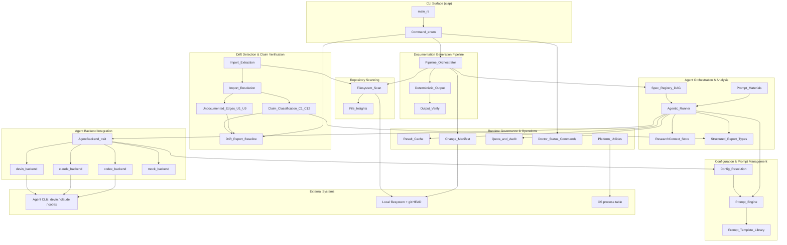
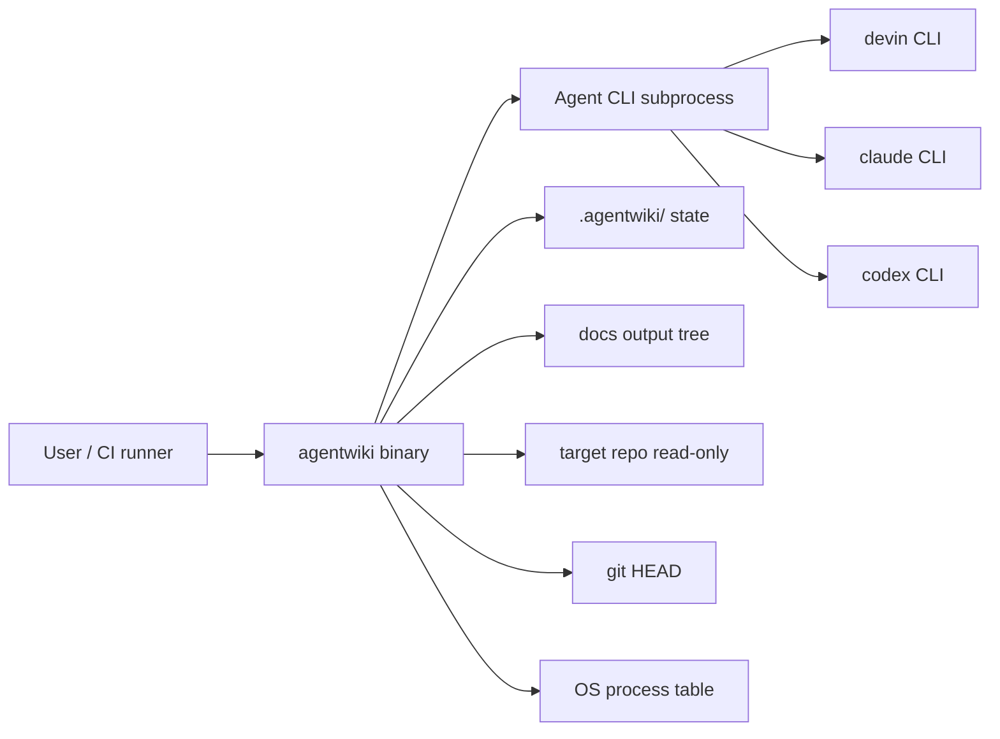
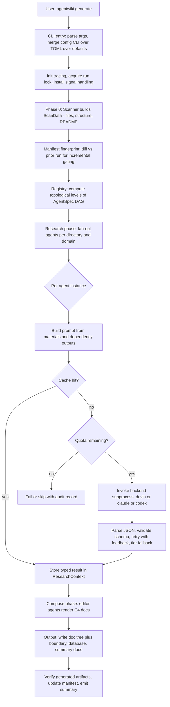
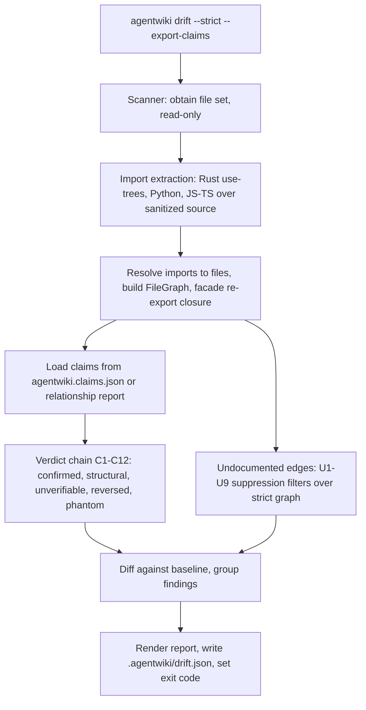
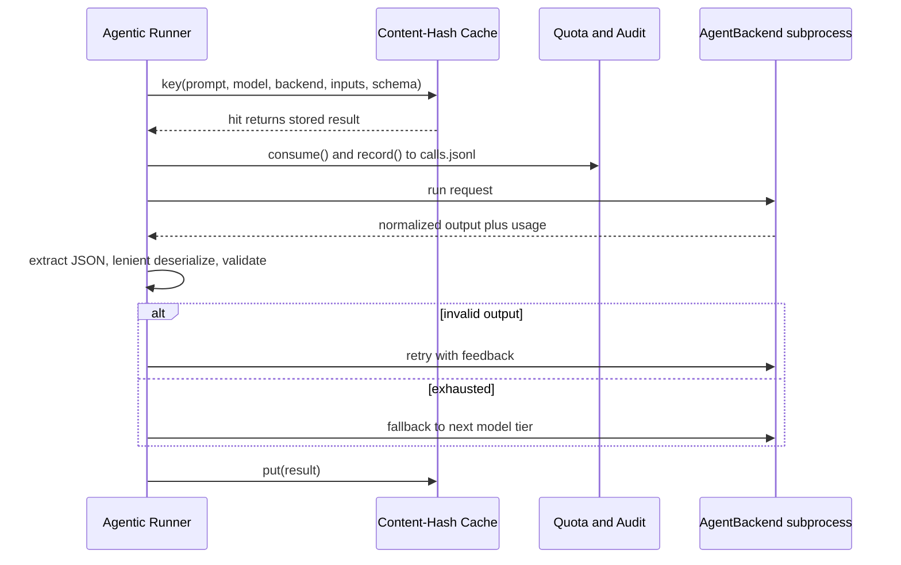
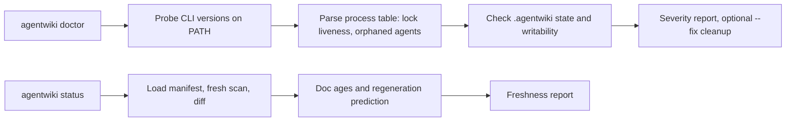

# Architecture Overview — agentwiki

## 1. Architecture Overview

**agentwiki** (v0.5.0) là một công cụ CLI viết bằng Rust, có nhiệm vụ tự động sinh tài liệu kiến trúc theo mô hình C4 cho một repository mục tiêu. Điểm khác biệt cốt lõi: thay vì gọi trực tiếp API của LLM, agentwiki điều phối các agent CLI đã được xác thực sẵn trên máy người dùng (`devin`, `claude`, `codex`) thông qua subprocess — loại bỏ hoàn toàn việc quản lý API key.

Pipeline chính gồm bốn giai đoạn: **Preprocess → Research → Compose → Verify**. Trong đó chỉ có hai giai đoạn tiêu tốn chi phí LLM (Research và Compose); còn lại là các bước xác định (deterministic) chạy hoàn toàn offline: quét repository, fingerprint manifest, trích xuất import graph, render đầu ra và verify.

Các đặc tính kiến trúc nổi bật:

- **Giới hạn chi phí (cost-bounded)**: cache theo content-hash, quota số lần gọi theo ngày, tái sinh gia tăng dựa trên manifest fingerprint.
- **Có thể kiểm chứng (verifiable)**: engine `drift` kiểm tra các dependency claim do LLM sinh ra so với import graph thực tế — đây là phương án chống lại failure mode chính của tài liệu do LLM tạo (hallucination).
- **Có thể audit**: log `calls.jsonl`, exit code xác định (0/1/2) cho CI gate.
- **Chỉ-đọc đối với repo mục tiêu**: toàn bộ state nằm trong `.agentwiki/` và thư mục docs đầu ra; tool không bao giờ ghi vào source tree của target.

### Sơ đồ kiến trúc tổng thể

## 2. System Context

agentwiki nằm ở ranh giới giữa "hệ thống phân tích tĩnh xác định" và "hệ thống điều phối LLM". Toàn bộ suy luận LLM được ủy quyền ra ngoài; phần còn lại — quét, fingerprint, verify, audit — là deterministic.

### Ranh giới hệ thống

**Bao gồm:**

- CLI surface: lệnh `generate` (mặc định) cùng `doctor`, `drift`, `status` (clap).
- Lớp cấu hình: `agentwiki.toml`, global config, profiles, model tiers, thứ tự ưu tiên CLI > TOML > mặc định.
- Scanner/Preprocess sinh `ScanData` (cấu trúc repo, files, README).
- Core điều phối agent: registry `AgentSpec` dạng DAG, topo scheduling, fan-out theo directory/domain, `ResearchContext` làm shared store có kiểu.
- Agent runner: ghép prompt, kiểm tra cache/quota, gọi backend, trích JSON, retry kèm feedback, fallback qua model tier.
- Abstraction `AgentBackend` với các implementation devin/claude/codex và `MockBackend`.
- Schema report có kiểu với deserializer "lenient" chịu được output LLM xấu.
- Hệ thống prompt template: mặc định embedded, cho phép override trên disk, render `{{key}}`.
- Compose stage sinh tài liệu C4 (overview, architecture, deep-dive, workflow) qua editor prompts.
- Drift engine: trích import cho Rust/Python/JS-TS, resolve thành file graph, phân loại claim C1–C12, filter undocumented edge U1–U9, baseline + report.
- Quản lý state: content-hash cache, manifest fingerprint, quota counter theo ngày, audit log `calls.jsonl`, run lock.
- Diagnostics: doctor probes, drift report, status/freshness report, progress display.

**Loại trừ:**

- LLM inference và hosting model — ủy quyền hoàn toàn cho agent CLI bên ngoài.
- Authentication/credential — dựa vào trạng thái login sẵn có của từng CLI.
- Codebase mục tiêu — là input, không phải thành phần của hệ thống.
- Hosting/render docs — chỉ emit Markdown; không có web UI.
- AST parsing đầy đủ — trích import bằng regex/heuristic trên source đã sanitize.
- Quyền ghi vào target repo — chỉ đọc; output đi vào `.agentwiki/` và thư mục docs.

### Hệ thống bên ngoài

| Hệ thống | Kiểu tương tác |
|---|---|
| `devin` CLI | Subprocess `devin -p`; prompt truyền vào, output parse ngược. Backend reference. |
| `claude` CLI | Subprocess `claude -p`, prompt qua stdin; parse JSON envelope lấy text, token usage, error. Hỗ trợ model string `claude:<model>@<effort>`. |
| `codex` CLI | Subprocess `codex exec`, prompt qua stdin, `-o` output file; parse JSONL event stream; schema được normalize theo ràng buộc chặt hơn của codex. |
| GitHub Releases | `install.sh` tải tarball nhị phân theo platform qua HTTPS. |
| Local filesystem + git | Đọc source để scan/trích import; đọc git HEAD cho manifest diff; ghi cache, `research.json`, manifest, `calls.jsonl`, docs. |
| OS process table | `ps`/`tasklist` được `sys.rs` parse để phát hiện agent process orphaned và validate liveness của run lock. |

### Người dùng mục tiêu

- **Kỹ sư/architect**: cần docs C4 luôn mới; tái sinh gia tăng chỉ phần thay đổi; phát hiện drift.
- **CI/platform maintainer**: `agentwiki drift --strict` làm CI gate; export `agentwiki.claims.json`; exit code 0/1/2.
- **Contributor**: test offline qua `MockBackend`; e2e opt-in qua `AGENTWIKI_E2E=1`.

## 3. Container View

Vì agentwiki là CLI đơn tiến trình, "container" ở đây là các tiến trình/subsystem runtime lớn và kho dữ liệu cục bộ.

| Container | Công nghệ | Trách nhiệm |
|---|---|---|
| `agentwiki` binary | Rust (clap, tokio, serde) | Toàn bộ pipeline, drift, diagnostics trong một process |
| Agent CLI subprocesses | `devin` / `claude` / `codex` binary | LLM inference thực tế, được spawn per request |
| `.agentwiki/` state dir | filesystem | `cache/`, `manifest`, `calls.jsonl`, `drift.json`, run lock, context snapshot |
| Docs output dir | filesystem | Cây Markdown C4, `agentwiki.claims.json`, `__AgentWiki_Summary__.md` |
| `prompts/` assets | Markdown templates | Persona prompts embedded vào binary, override được trên disk |

Mỗi lần gọi LLM là một subprocess riêng — không có daemon, không có connection pool; isolation và cleanup dựa vào process boundary.

## 4. Component View

Bảy domain module, phân theo DDD-lite (core / supporting / infrastructure):

| Domain | Loại | Vị trí | Vai trò |
|---|---|---|---|
| Documentation Generation Pipeline | Core | `src/pipeline/`, `src/main.rs`, `src/cli.rs`, `src/output/` | Orchestrate Preprocess→Research→Compose→Write→Verify; `PipelineCtx`, semaphore concurrency, cancellation |
| Agent Orchestration & Analysis | Core | `src/agent/` | `AgentSpec` DAG khai báo, topo levels, fan-out per-directory/domain, retry-with-feedback, model-tier fallback |
| Drift Detection & Claim Verification | Core | `src/drift/` | Verdict chain C1–C12 + filter U1–U9 trên FileGraph đã resolve; hoàn toàn read-only, không LLM |
| Agent Backend Integration | Supporting | `src/backend/` | Trait `AgentBackend`; impl devin/claude/codex + MockBackend |
| Repository Scanning | Supporting | `src/scanner/` | Phase-0 deterministic sinh `ScanData` — không LLM |
| Configuration & Prompt Management | Infrastructure | `src/config.rs`, `src/prompt.rs`, `prompts/` | Precedence CLI>TOML>default; profiles, model tiers, template `{{key}}` |
| Runtime Governance & Operations | Infrastructure | `src/cache.rs`, `manifest.rs`, `quota.rs`, `doctor.rs`, `status.rs`, `sys.rs`, `util.rs` | Cache, manifest, quota + audit, health probes, atomic write |

### Sub-component chi tiết

**Pipeline** (`src/pipeline/mod.rs`): `PipelineCtx` giữ config, ScanData, cache, quota, backends; `run_level_order` thực thi topo level; `Phase::{Research, Compose}` là hai phase duy nhất được model hóa — Preprocess và Verify nằm ngoài enum Phase (scan là input phase-0, verify ở `src/output/verify.rs`).

**Agent Orchestration**:
- `registry.rs` / `spec.rs`: khai báo spec — phase, dependencies, fan-out axis, model tier, output schema; `topo_levels()` trả các level thực thi được.
- `runner.rs`: `run_spec` → `run_instance` — build prompt từ materials + output upstream trong `ResearchContext`, check cache, consume quota, gọi backend, `extract_json` + lenient deserialize, retry kèm feedback, fallback tier.
- `context.rs`: async key-value store typed, hỗ trợ snapshot save/load.
- `materials.rs`: render scan data, README excerpt, code insights thành block markdown có size cap.
- `reports/`: schema backbone — dossier, relationship, research reports — với deserializer lenient (`de_*`).

**Backend**: `mod.rs` định nghĩa `trait AgentBackend`, `enum BackendKind`, `for_kind` factory, `sanitized_env`, parse chuỗi `<backend>:<model>`. Ba impl chuẩn hóa ba protocol khác nhau: devin pass-through, claude JSON envelope, codex JSONL events + `normalize_schema`. `mock.rs` cho phép `mock:*` chạy offline hoàn toàn.

**Drift**: `imports/` (rust use-tree + mod resolution, python relative/absolute, js ESM/CJS/dynamic, `sanitize.rs` bỏ comment/string với offset byte-exact) → `resolve/` (per-language resolver + `RepoIndex`, build `FileGraph`, facade re-export closure) → `compare.rs` (chain C1–C12, phantom/reversed) + `undocumented.rs` (U1–U9) → `report.rs`/`baseline.rs` (versioned report, strict failures, exit code).

**Governance**: `cache.rs` key = hash(prompt, model, backend, inputs, schema); `manifest.rs` fingerprint subtree phân loại cosmetic vs structural; `quota.rs` daily cap + append `calls.jsonl` RFC3339; `sys.rs` list process / `pid_alive` / `find_on_path` cho lock validation; `util.rs` `write_atomic`.

## 5. Key Processes

### 5.1 Generate Documentation Run

Lưu ý: `generate` là default action qua top-level args — `Command` enum chỉ có `Doctor`, `Drift`, `Status`; không có variant `Generate`.

### 5.2 Drift Verification

### 5.3 Governance loop per paid call

### 5.4 Doctor / Status

## 6. Technical Implementation

### Công nghệ & lựa chọn thiết kế

- **Rust + tokio**: concurrency bằng semaphore trong `PipelineCtx`; cancellation cooperative. Crate xuất cả `lib.rs` lẫn `main.rs` nên test/integration dùng lib target.
- **Subprocess thay vì SDK**: một trait `AgentBackend` duy nhất che đi ba wire-format khác nhau (pass-through, JSON envelope, JSONL events). Rủi ro: thay đổi format output của `claude`/`codex` sẽ phá parse một cách âm thầm — drift và test suite là lớp phòng thủ.
- **Lenient deserializers** (`reports/lenient.rs`): chịu JSON méo từ LLM — field thiếu, kiểu sai, text thừa — thay vì fail ngay.
- **DAG khai báo**: thêm spec mới vào registry không cần sửa orchestrator. Điểm yếu: coupling ngầm qua key của `ResearchContext` không được khai báo trong DAG — spec consume key không ai produce chỉ fail lúc build prompt.
- **Content-hash cache** ở đúng ranh giới chi phí: mọi deterministic work (scan, manifest, import extraction, classify, render) đều miễn phí; chỉ runner vượt qua cost boundary. Cache key chứa cả schema + inputs nên sửa prompt template sẽ invalidate rộng — điểm tối ưu khả dĩ là hash input mịn hơn.
- **Drift là bounded context riêng**: không gọi LLM, chỉ tái sử dụng `ScanData` và report types (`CoreDependency`, `DependencyType`). Verdict chain có thứ tự với guard trước evidence; U-filters cố tình conservative vì import extraction là heuristic chứ không phải full AST.
- **Precedence cấu hình**: CLI > `agentwiki.toml` > global config > default; profiles + model tiers resolve qua `model_for`/`find_profile`.

### Quan hệ giữa các domain

| Từ | Đến | Kiểu |
|---|---|---|
| Pipeline | Agent Orchestration | Orchestration — iterate topo levels, gọi `run_spec` |
| Agent Orchestration | Backend Integration | Service call — runner gọi `AgentBackend::run` |
| Agent Orchestration | Repository Scanning | Data dependency — materials/fan-out từ ScanData |
| Pipeline | Repository Scanning | Data dependency — ScanData trong `PipelineCtx` |
| Pipeline | Runtime Governance | Service composition — cache/manifest/quota/progress/cancel |
| Pipeline | Config & Prompt | Data dependency — Config + PromptLoader xuyên suốt run |
| Drift | Repository Scanning | Data dependency — cùng file set |
| Drift | Agent Orchestration | Data dependency — consume relationship report types, không gọi runtime |
| Agent Orchestration | Runtime Governance | Service call — cache check + quota/audit mỗi call thật |
| Backend | Config & Prompt | Data dependency — `BackendKind` parse khớp profile |
| Governance | Drift | Service call — status/doctor đọc drift state |

## 7. Deployment Architecture

- **Phân phối**: binary prebuilt qua GitHub Releases; `install.sh` tải tarball theo platform qua HTTPS. Không có code path install trong `src/` — distribution nằm ngoài crate.
- **Môi trường runtime**: máy dev hoặc CI runner; yêu cầu ít nhất một agent CLI (`devin`/`claude`/`codex`) trên PATH và đã login. `agentwiki doctor` là bước kiểm tra tiên quyết.
- **State cục bộ**: `.agentwiki/` (cache, manifest, `calls.jsonl`, `drift.json`, lock, snapshot) và thư mục docs. Run lock validate liveness qua PID trong process table; `doctor --fix` dọn stale lock.
- **CI integration**: `agentwiki drift --strict` exit 0/1/2; `--export-claims` sinh `agentwiki.claims.json` cho verification pipeline ngoài.
- **Test**: `MockBackend` + `mock:*` model cho offline suite (`tests/*_offline.rs`, fixtures `fixture-app`, `fixture-rs`); e2e thật opt-in qua `AGENTWIKI_E2E=1`. Convention: clippy-clean, không `unwrap`.
- **Điểm mở rộng chính**: thêm extractor ngôn ngữ mới trong `drift/imports/` + resolver tương ứng; thêm backend mới bằng impl `AgentBackend`; thêm agent spec vào registry; override prompt bằng file trên disk mà không rebuild.
- **Output contract**: cây `docs/` chứa tài liệu sinh ra (Overview → claims JSON → summary) và có thể chứa bản dịch đa locale — không được các báo cáo nghiên cứu nhắc tới nhưng tồn tại trong repo.

### Rủi ro / watch items

1. Độ chính xác của drift bị chặn trên bởi heuristic import extraction; U1–U9 là trade-off đúng nhưng khiến undocumented-edge detection conservative theo thiết kế.
2. Format output của agent CLI bên ngoài là dependency không kiểm soát — parse hỏng sẽ chỉ lộ qua test/drift.
3. `ResearchContext` coupling ngầm giữa các spec không nằm trong DAG — mở rộng spec cần kiểm tra key producer/consumer thủ công.