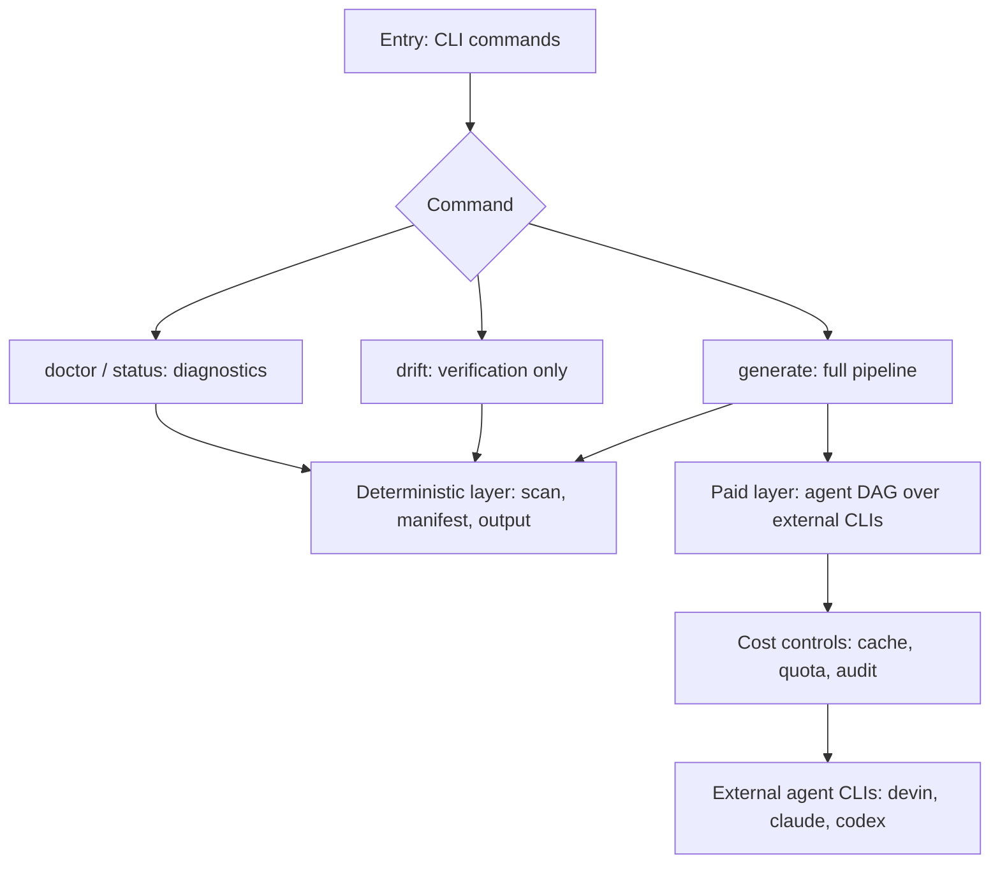
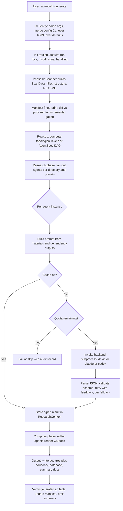
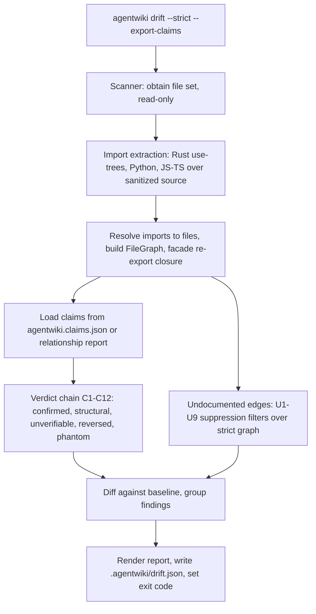
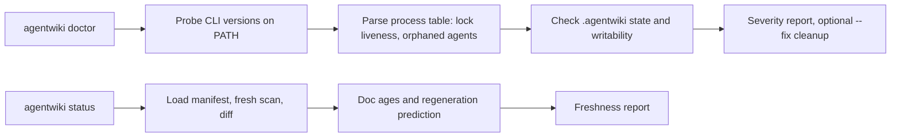
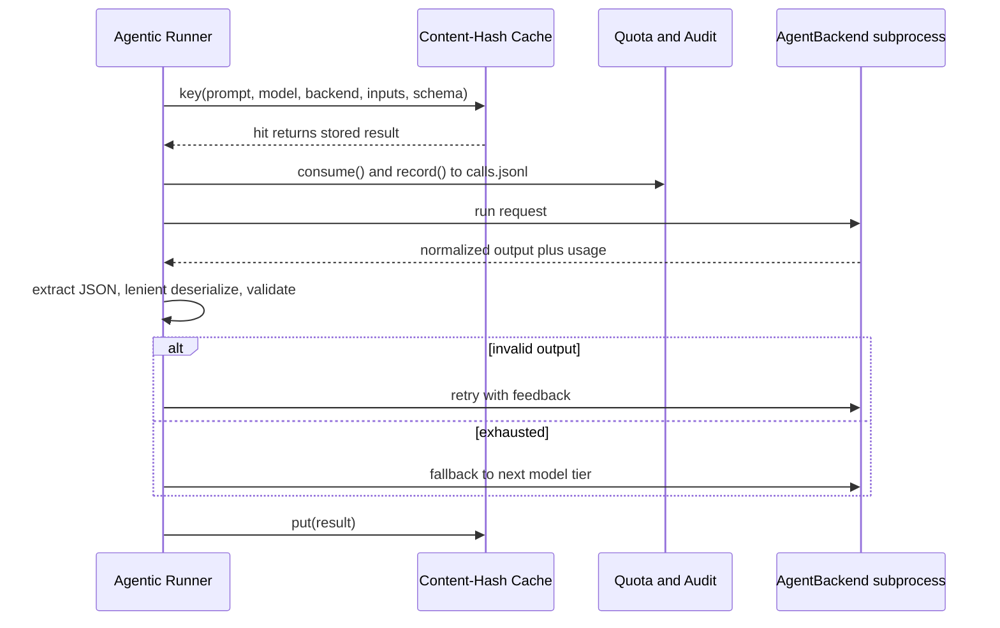
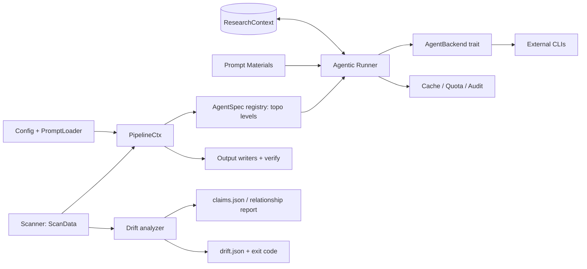

# Core Workflows

## 1. Workflow Overview

`agentwiki` là một công cụ CLI viết bằng Rust (v0.5.0) chuyển một repository nguồn thành bộ tài liệu kiến trúc theo phong cách C4. Điểm kiến trúc quan trọng nhất: **hệ thống không tự gọi LLM API** — mọi inference đều được ủy quyền cho các agent CLI đã xác thực sẵn trên máy người dùng (`devin`, `claude`, `codex`) thông qua cơ chế subprocess. Điều này loại bỏ hoàn toàn việc quản lý credential khỏi system boundary, nhưng đồng thời đưa sức khỏe của backend CLI thành một external dependency cần giám sát.

Hệ thống có ba nhóm workflow chính:

| Workflow | Entry point | Tính chất | Tầm quan trọng |
|---|---|---|---|
| Generate Documentation Run | `agentwiki generate` (mặc định) | Pipeline 4 giai đoạn, có LLM call, có ghi trạng thái | 10.0 |
| Drift Verification | `agentwiki drift` | Read-only, không LLM, exit-coded cho CI | 8.5 |
| Operational Health & Freshness | `agentwiki doctor`, `agentwiki status` | Read-only diagnostics | 6.5 |

Nguyên tắc xuyên suốt: **tách biệt cứng giữa công việc trả phí và miễn phí**. Scanning, manifest diff, import extraction, drift classification và output writing đều deterministic và không tốn chi phí; chỉ có agentic runner vượt qua ranh giới chi phí. Bộ ba cache / quota / audit được đặt chính xác tại ranh giới này.

---

## 2. Main Workflows

### 2.1 Generate Documentation Run (`agentwiki generate`)

Đây là workflow cốt lõi: pipeline `Preprocess → Research → Compose → Write → Verify`, được điều phối bởi Pipeline Orchestrator trong `src/pipeline/mod.rs`.

#### Bước 1 — CLI entry & thiết lập môi trường chạy

`src/main.rs::main` phân tích args qua clap, dispatch `Command::Generate`. Config resolution theo chuỗi precedence `CLI > agentwiki.toml > defaults` (`src/config.rs`), hỗ trợ named backend profiles và model tiers. Sau đó:

- Khởi tạo tracing/logging.
- **Acquire run lock** — tránh hai run đồng thời làm hỏng `.agentwiki/`; liveness của lock được kiểm chứng qua process table (`src/sys.rs::pid_alive`).
- Cài đặt signal handling cho cooperative cancellation (Ctrl+C dừng mềm thay vì giết giữa chừng).

#### Bước 2 — Phase 0: Repository Scanning

`src/scanner/mod.rs::scan` duyệt cây thư mục một cách deterministic, tôn trọng scan config và output-path exclusion, sinh `ScanData`:

- File set đầy đủ + `DirectoryInfo` structure.
- README/docs extracts (`extract_docs`).
- Per-file statics (`FileStatics::for_entry`) — lazy static analysis phục vụ prompt material.

Giai đoạn này hoàn toàn không gọi LLM và là input chung cho cả pipeline lẫn drift analyzer.

#### Bước 3 — Incremental gating qua Change Manifest

`src/manifest.rs::build/diff` fingerprint toàn bộ scan inputs và environment theo từng output subtree (`subtree_fingerprint`). Diff với manifest của run trước để phân loại thay đổi thành **cosmetic vs structural**, từ đó quyết định phần nào cần regenerate. Đây là cơ chế giúp incremental run chỉ trả tiền cho phần thay đổi thật sự.

#### Bước 4 — DAG scheduling

`src/agent/registry.rs` khai báo declaratively các `AgentSpec` (research specs + compose specs) với:

- `phase` (research / compose), `dependencies`, `model tier`.
- Fan-out axes: **per-directory** (mỗi thư mục một instance) và **per-domain**.
- `materials` (loại dữ liệu đưa vào prompt) và output schema.

`topo_levels` tính các level topo của DAG: các spec cùng level chạy song song, bounded bởi semaphore trong `PipelineCtx`.

#### Bước 5 — Agentic execution

`src/agent/runner.rs::run_spec` expand mỗi spec thành nhiều instance theo fan-out axis, rồi `run_instance` cho từng cái:

1. `build_prompt`: render template qua `PromptLoader` (`{{key}}` placeholders, disk-override over embedded defaults) với materials từ `src/agent/materials.rs` (scan data, README excerpts, code insights, relationship results — có size caps) và outputs của dependencies lấy từ `ResearchContext`.
2. Kiểm tra content-hash cache (`src/cache.rs::key(prompt, model, backend, inputs, schema)`).
3. Consume quota (`src/quota.rs::consume`) — enforce daily call cap; ghi audit vào `calls.jsonl` (RFC3339-stamped).
4. Gọi backend subprocess.
5. `extract_json` + lenient deserializers (`src/agent/reports/lenient.rs`) chịu được JSON méo từ LLM.
6. Invalid → retry với feedback (chèn lỗi vào prompt kế); hết retry → fallback sang model tier tiếp theo.
7. Kết quả typed được `insert` vào `ResearchContext` (`src/agent/context.rs`) — async KV store cho phép agent phase sau `get_typed` kết quả của agent trước; hỗ trợ `snapshot/save/load` để resume.

#### Bước 6 — Backend dispatch

`src/backend/mod.rs::for_kind` phân tích chuỗi `<backend>:<model>` (và `claude:<model>@<effort>`), trả về implementation của trait `AgentBackend`:

| Backend | Invocation | Output parsing | Ghi chú |
|---|---|---|---|
| devin | `devin -p` | Pass-through | Reference backend, đơn giản nhất |
| claude | `claude -p`, prompt qua stdin | JSON envelope → result text, usage, errors | `sanitize_schema`; hỗ trợ `model@effort` |
| codex | `codex exec`, `-o` output file | JSONL event stream → text, usage, turn failures | `normalize_schema` cho schema constraints chặt hơn |
| mock | `mock:*` model string | Scripted responses | `MockBackend` cho offline testing |

Mọi backend đều trả về normalized result (text + usage) để runner xử lý đồng nhất; `sanitized_env` chuẩn bị môi trường subprocess.

#### Bước 7 — Deterministic output & verification

`src/output/`:

- `write_docs`: ghi doc tree (atomic writes qua `util.rs::write_atomic`).
- Render các doc không cần LLM: `boundary_doc`, `database_doc`, `write_summary` (run summary).
- `verify`: kiểm chứng artifacts đã generate.
- Persist: manifest mới, cache entries, `ResearchContext` snapshot.

### 2.2 Drift Verification (`agentwiki drift`)

Bounded context riêng, **hoàn toàn read-only và không gọi LLM**: tái dựng ground truth (import graph) từ source, rồi verify các dependency claims mà LLM đã sinh trong docs. Đây là cơ chế đóng vòng lặp chống hallucination — failure mode chính của LLM-generated docs.

#### Các giai đoạn

1. **Import Extraction** (`src/drift/imports/`): sanitize source (loại comments/strings, giữ byte-exact offsets), rồi extractor theo ngôn ngữ:
   - Rust: `use`-tree expansion, `mod` resolution.
   - Python: relative/absolute imports.
   - JS/TS: ESM, CJS `require`, dynamic `import()`.
2. **Resolution & Graph Building** (`src/drift/resolve/`): resolve raw imports → repository files per language (Cargo crate layout; Python module suffix matching; JS extension/index probing). `RepoIndex::build` dựng index, `build_file_graph` sinh `FileGraph`, áp facade re-export closure.
3. **Claim Classification** (`src/drift/compare.rs::classify_claim`): claims (từ `agentwiki.claims.json` hoặc relationship report — `CoreDependency`, `DependencyType`) chạy qua **verdict chain có thứ tự C1–C12**, guards trước evidence. Verdicts: `confirmed`, `structural`, `unverifiable`, `reversed`, `phantom`. `phantom_and_reversed` phát hiện edge ngược chiều / không tồn tại; `finding_id` cho identity ổn định của finding.
4. **Undocumented Edge Detection** (`src/drift/undocumented.rs::find`): chuỗi suppression filters **U1–U9** chạy trên strict strong-evidence graph để lộ các dependency thật bị bỏ sót khỏi docs (dùng `reachable`, `hubs`, `facade_closure`).
5. **Reporting & Baselining**: `build_report`/`render` tạo versioned drift report, nhóm findings; `Baseline::load/save` phục vụ `--strict` (fail nếu có finding mới so với baseline); ghi `.agentwiki/drift.json`.

**Exit codes**: `0` sạch / `1` có findings / `2` strict-mode baseline violation — thiết kế cho CI gate (`agentwiki drift --strict`).

### 2.3 Operational Health & Freshness (`agentwiki doctor`, `agentwiki status`)

- **`doctor`** (`src/doctor.rs`): probe version của các agent CLI trên PATH (`find_on_path`, `probe_version`), parse process table (ps/tasklist qua `list_processes`) để phát hiện run lock chết và orphaned agent processes, kiểm tra `.agentwiki/` state và writability. `--fix` dọn stale locks. Vì backend health là external dependency, đây là điểm chẩn đoán đầu tiên khi run thất bại.
- **`status`** (`src/status.rs::build_report`): load stored manifest, diff với fresh scan, báo doc ages và **dự đoán documents nào sẽ được regenerate ở run kế tiếp** — một dry-run signal hữu ích trước khi tiêu quota.

---

## 3. Flow Coordination and Control

### 3.1 Governance loop của Agentic Runner

Vòng kiểm soát áp cho **mọi paid CLI call** — đây là pattern định nghĩa hành vi chi phí và độ tin cậy của tool:

Thứ tự cache-trước-quota-sau đảm bảo cache hit không tiêu quota. Audit record được ghi cho mọi real call (kể cả khi quota exhausted → skip/fail vẫn có dấu vết).

### 3.2 Data flow giữa các module

- **`PipelineCtx`**: shared run context (config, ScanData, cache, quota, backends), concurrency semaphore, cancellation token.
- **`ResearchContext`**: async typed KV store là kênh trao đổi duy nhất giữa các agent — research agents produce, compose agents consume. Không có IPC hay shared mutable state khác; snapshot cho phép resume.
- **Compose phase** chỉ bắt đầu sau khi topo level research tương ứng hoàn tất — coordination hoàn toàn qua DAG dependencies, không qua message passing.

### 3.3 Concurrency & cancellation

- Song song hóa ở hai mức: các spec trong cùng topo level, và các fan-out instance trong cùng spec — tất cả bounded bởi semaphore trong `PipelineCtx`.
- Cancellation cooperative: signal handler set token; runner kiểm tra giữa các instance/subprocess call để dừng sạch, tránh nửa-chừng ghi state.

---

## 4. Exception Handling and Recovery

| Failure mode | Cơ chế xử lý | Vị trí |
|---|---|---|
| LLM trả JSON méo/không đúng schema | Lenient deserializers (`de_*`) chấp nhận output lỗi nhẹ; `extract_json` tách JSON khỏi prose | `src/agent/reports/lenient.rs`, `runner.rs` |
| Output invalid sau parse | **Retry with feedback** — lỗi được chèn vào prompt kế | `runner.rs::run_instance` |
| Hết retries | **Model-tier fallback** — rơi xuống tier/model rẻ hơn hoặc mạnh hơn theo config | `runner.rs`, `config.rs::model_for` |
| Quota exhausted | Skip/fail instance + audit record trong `calls.jsonl` | `quota.rs::consume` |
| Backend CLI missing/broken | `doctor` probe (PATH, version, process); error taxonomy qua `src/error.rs` | `doctor.rs`, `sys.rs` |
| Run lock stale (process chết) | `pid_alive` validate; `doctor --fix` dọn lock | `sys.rs`, `doctor.rs` |
| Orphaned agent subprocess | Process-table parsing phát hiện, báo trong doctor | `sys.rs::list_processes` |
| Interrupted run | Cooperative cancellation + content-hash cache + context snapshot → rerun rẻ và resumable | `pipeline/mod.rs`, `cache.rs`, `context.rs` |
| Docs khỏi code thật | `drift` verdict chain + baseline `--strict` gate | `src/drift/` |

Thiết kế tổng thể: **fail có kiểm soát, không silent**. Mọi paid call đều có audit trail; mọi phán đoán về docs đều kiểm chứng được bằng deterministic layer.

---

## 5. Key Process Implementation

### 5.1 Claim classification — verdict chain C1–C12

`classify_claim` là ordered chain: mỗi claim (một cặp file→file + dependency type) đi qua các rule C1→C12, rule đầu tiên match quyết định verdict. Guards (claim hợp lệ? file tồn tại?) chạy trước evidence rules. Kết quả:

- `confirmed`: edge tồn tại trong strong-evidence graph.
- `structural`: edge chỉ tồn tại qua facade re-export closure (gián tiếp, hợp lệ).
- `unverifiable`: không đủ evidence để kết luận.
- `reversed`: edge thật tồn tại nhưng ngược chiều claim.
- `phantom`: claim hoàn toàn bịa — chỉ dấu hallucination điển hình.

`normalize_claims` chuẩn hóa input trước khi classify; `finding_id` đảm bảo finding ổn định giữa các run để baseline diff hoạt động.

### 5.2 Undocumented edges — U1–U9 filters

Chiều ngược lại của verification: duyệt strict graph, edge nào không nằm trong claims là candidate "undocumented". Chuỗi U1–U9 suppression lọc noise (ví dụ: hub nodes quá generic, edges qua facade đã được bao phủ, test/internal-only edges) để chỉ báo cáo dependencies thật sự đáng documented.

### 5.3 Content-hash cache key

`cache.rs::key` bao gồm: prompt rendered, model string, backend kind, inputs fingerprint, output schema. Hệ quả thực tế: **sửa prompt template hoặc schema invalidate cache diện rộng** — trade-off chấp nhận được vì nó đảm bảo tính đúng đắn, nhưng là điểm tối ưu tiềm năng (finer-grained input hashing).

### 5.4 Manifest fingerprinting

`subtree_fingerprint` hash scan inputs + environment theo từng output subtree. `diff` phân loại cosmetic (ví dụ: whitespace, comment) vs structural (file mới/xóa, signature thay đổi) để incremental regeneration chỉ chạy lại agents bị ảnh hưởng.

### 5.5 Schema normalization per backend

- `claude.rs::sanitize_schema`: làm sạch JSON schema cho `claude -p` output contract.
- `codex.rs::normalize_schema`: rewrite schema theo constraints chặt hơn của codex (ví dụ: yêu cầu additionalProperties, required fields).
- Đây là lý do `AgentBackend` abstraction tồn tại: mỗi CLI có output envelope và schema strictness riêng, runner chỉ thấy normalized result.

### 5.6 Deterministic docs

`boundary.rs`, `database.rs`, `summary.rs` render tài liệu trực tiếp từ typed reports (không qua LLM lần hai), đảm bảo phần cấu trúc cứng của doc tree reproducible; LLM chỉ sinh nội dung phân tích qua editor personas trong `prompts/editors/` (overview, architecture, deep-dive, workflow) với strict Mermaid rules.

### 5.7 Điểm tối ưu đã biết

- Cache key bao schema+inputs → template edits invalidate rộng; finer-grained hashing cải thiện hit rate.
- Drift extractors hiện hỗ trợ Rust/Python/JS-TS; mở rộng extractor là lever chính cho polyglot repos.
- `MockBackend` (`mock:*`) cho phép test pipeline hoàn toàn offline — giảm chi phí iterate prompts/schemas; e2e suite qua `AGENTWIKI_E2E=1`.