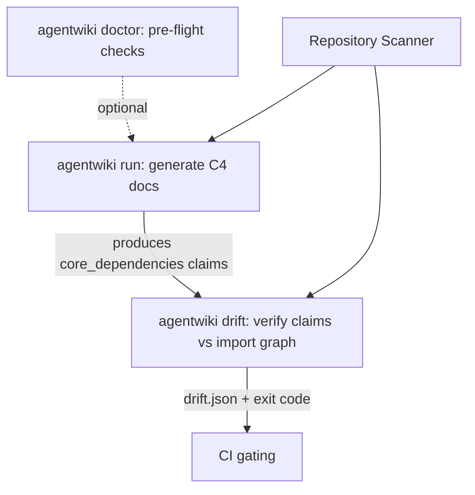
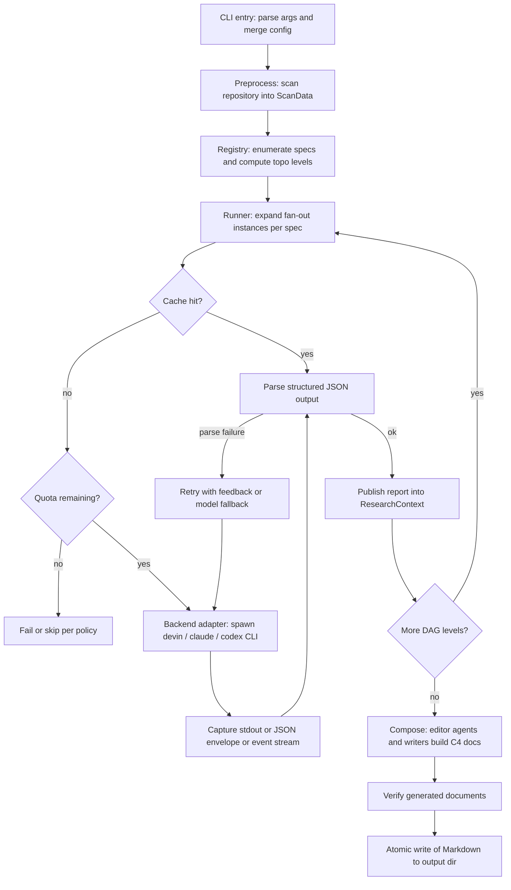
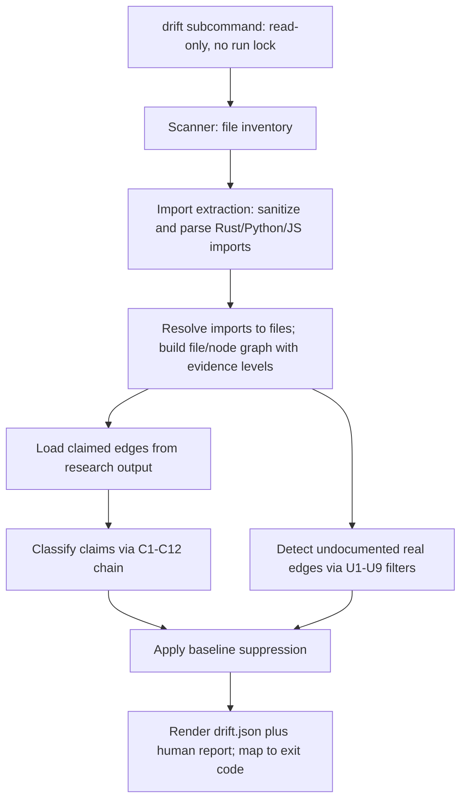
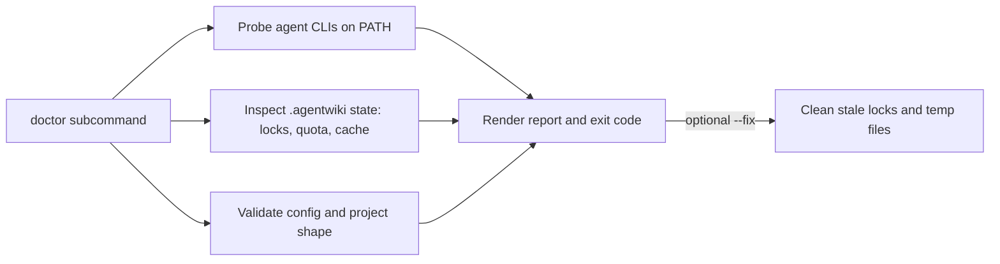
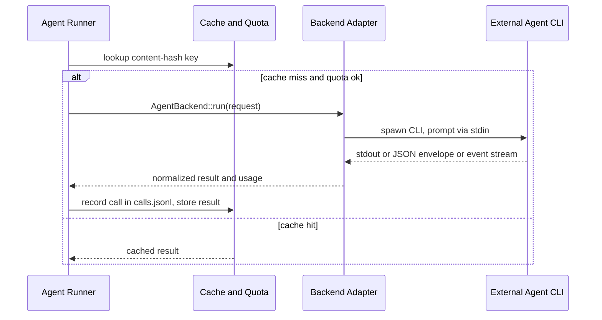

# Core Workflows

## 1. Workflow Overview

`agentwiki` là một CLI Rust dùng để sinh tài liệu kiến trúc theo mô hình C4 cho một repository bất kỳ. Hệ thống được tổ chức thành một pipeline bốn giai đoạn — **Preprocess → Research → Compose → Verify** — trong đó toàn bộ suy luận LLM được ủy quyền cho các agent CLI bên ngoài (`devin`, `claude`, `codex`) thông qua lớp adapter `AgentBackend`. Bản thân agentwiki chỉ đóng vai trò **orchestrator**: quét mã nguồn, điều phối DAG agent, chuẩn hóa output, kiểm chứng và render Markdown.

Hệ thống có ba workflow chính:

| Workflow | Lệnh | Tính chất | Mục đích |
|---|---|---|---|
| Documentation Generation Pipeline | `agentwiki` (mặc định) | Mutating (ghi `.agentwiki/`, dùng run lock) | Sinh bộ tài liệu C4 từ mã nguồn |
| Documentation Drift Check | `agentwiki drift` | Read-only | Đối chiếu dependency claims với import graph thật, gate CI bằng exit code |
| Environment Health Check | `agentwiki doctor` | Read-only (có `--fix` tuỳ chọn) | Kiểm tra CLI backends, trạng thái `.agentwiki/`, config |

Ngoài ra có một workflow xuyên suốt — **Backend Adapter Invocation** — mô tả đường đi thống nhất của mọi agent call qua cache → quota → adapter → subprocess CLI.

### Quan hệ giữa các workflow

- `doctor` độc lập, dùng làm pre-flight trước các run dài.
- `drift` phụ thuộc vào artifact của pipeline (`relationships.core_dependencies`) và tái sử dụng `ScanData` từ scanner.
- Pipeline là workflow duy nhất mutate state; `drift` và `doctor` không chiếm run lock.

## 2. Main Workflows

### 2.1 Documentation Generation Pipeline

Đây là workflow trung tâm, được kích hoạt bởi lệnh `agentwiki` mặc định, entry point `src/main.rs::main`.

#### Các bước chi tiết

| Bước | Module | Cơ chế thực thi |
|---|---|---|
| 1. CLI entry & dispatch | `src/main.rs`, `src/cli.rs`, `src/config.rs` | Clap parse args → init tracing → merge config layers theo thứ tự defaults → global → `agentwiki.toml` → CLI overrides → resolve named profile và model tier (`model_for`, `call_timeout`) → dispatch subcommand. |
| 2. Preprocess | `src/scanner/` | Walk repository tôn trọng ignore rules; build `ScanData` gồm project structure, file inventory, README, code insights (`scanner/insights.rs`). Đây là input cho mọi phân tích downstream. |
| 3. DAG scheduling | `src/agent/registry.rs` | `all_specs`/`research_specs`/`compose_specs` khai báo từng node DAG (deps, fan-out axis, materials, model tier, output schema); `topo_levels` tính các level topo để các agent độc lập chạy song song. |
| 4. Agent execution | `src/agent/runner.rs` | `run_spec` → `expand` fan-out instances (per directory/domain) → `build_prompt` render template + material blocks (`agent/materials.rs`) → gọi backend qua cache/quota → `parse_output`/`extract_json` → `aggregate` kết quả. |
| 5. Backend dispatch | `src/backend/mod.rs` | `BackendKind::detect`/`parse` → `for_kind` factory → `AgentBackend::run`. Spawn `devin -p`, `claude -p` hoặc `codex exec`, prompt qua stdin, env được sanitize (`sanitized_env`). |
| 6. Structured parsing & resilience | `runner.rs` + `agent/reports/` | Multi-strategy JSON extraction; lenient deserializers (`de_string`, `de_vec_obj`, `str_list`) chịu được malformed LLM output; retry-with-feedback; fallback giữa model tiers. Kết quả hợp lệ publish vào `ResearchContext`. |
| 7. Compose | `src/output/` | Editor agents (prompts trong `prompts/editors/`) + document writers (`boundary.rs`, `database.rs`, `summary.rs`, `writer.rs`) biến research reports thành bộ docs C4: Overview, Architecture, Workflow, Boundary, Deep-dive, Data. |
| 8. Verify & write | `src/output/verify.rs`, `src/util.rs` | Kiểm tra post-generation (vd. Mermaid validity, completeness) rồi `write_atomic` ghi Markdown. |

### 2.2 Documentation Drift Check

`agentwiki drift` là verification pass read-only đối chiếu claims trong tài liệu với import graph thật của repo.

#### Các bước chi tiết

1. **Dispatch** (`src/main.rs`): drift chạy read-only, không lấy run lock, chia sẻ diagnostics/error types với pipeline.
2. **File inventory** (`src/scanner/`): tái sử dụng scanner để lấy danh sách file.
3. **Import extraction** (`src/drift/imports/`): `Lang::from_extension` detect ngôn ngữ; `sanitize` blank comments/strings nhưng giữ nguyên offset; extractor per-language (`rust.rs` với `expand_use_tree`, `python.rs`, `js.rs`) trích raw imports bằng regex — bounded-scope, không phải AST.
4. **Resolution & graph** (`src/drift/resolve/`): `RepoIndex::build` lập index repo; resolver per-language phân loại import thành internal/external/unresolved; `build_file_graph` → `lift` file edges lên node graph với evidence levels (strong vs. wide), `reachable`, hub detection, `facade_closure` cho re-export.
5. **Claim classification** (`src/drift/claims.rs`, `compare.rs`): `load_claims` đọc `core_dependencies` từ research output → `normalize_claims` chuẩn hóa endpoint về path → `classify_claim` đẩy từng edge qua filter chain C1–C12 theo thứ tự (endpoint sanity → checkability guards → positive evidence → negatives), phân loại confirmed / unverifiable / reversed / phantom.
6. **Undocumented edges** (`src/drift/undocumented.rs`): `find` tìm real strong-evidence edges mà docs chưa claim, qua noise-suppression chain U1–U9 (`claim_distance`, `is_ancestor`) với per-filter suppression counts.
7. **Reporting** (`src/drift/mod.rs`, `report.rs`, `baseline.rs`): apply baseline để suppress findings đã biết → `build_report`/`render` sinh `drift.json` + human report → `strict_failures` map outcome sang exit code cho CI gating.

### 2.3 Environment Health Check

`agentwiki doctor` chạy một battery of probes trước khi user khởi chạy pipeline tốn kém.

- **CLI probes** (`src/doctor.rs::probe_version`): kiểm tra presence/version của `devin`, `claude`, `codex` trên PATH; `src/sys.rs` cung cấp `list_processes` và `find_on_path` dependency-free.
- **State inspection**: đọc `.agentwiki/` — locks, quota state (`quota_state`), cache.
- **Config & project validation**: config hợp lệ, repo có shape phù hợp, output dir writable.
- **Remediation**: `--fix` dọn stale locks và temp files; exit nonzero khi có failure.

### 2.4 Backend Adapter Invocation (cross-cutting)

Mọi agent call đều đi qua cùng một đường ống bất kể backend:

| Adapter | Invocation | Output format | Đặc thù |
|---|---|---|---|
| Claude (`backend/claude.rs`) | `claude -p`, stdin prompt | JSON envelope → `parse_envelope` lấy text, structured output, usage, errors | `sanitize_schema` làm sạch JSON schema |
| Codex (`backend/codex.rs`) | `codex exec` + `--output-schema` + reasoning-effort | Line-based event stream → `parse_events` | `normalize_schema` biến schema tùy ý thành dạng codex-compatible |
| Devin (`backend/devin.rs`) | `devin -p`, stdin prompt | Plain stdout | Reference adapter, parsing surface tối thiểu |
| Mock (`backend/mock.rs`) | In-process | Canned replies/custom handlers | `with_delay`, simulated errors → offline test suite |

## 3. Flow Coordination and Control

### 3.1 DAG scheduling và blackboard communication

- **Declarative specs**: mỗi agent là một `AgentSpec` khai báo deps, fan-out axis, materials, model tier, output schema. Registry (`topo_levels`) sắp các spec thành topological levels; các spec trong cùng level chạy song song.
- **Fan-out**: `expand` sinh nhiều instance của một spec theo axis (per directory cho `dir_summary`, per domain cho `key_module`, …); `aggregate` gom kết quả.
- **ResearchContext** (`src/agent/context.rs`): key-value store typed, bảo vệ bằng `RwLock`, đóng vai trò blackboard. Agents không gọi trực tiếp nhau — data flow đi qua declared dependencies: upstream agent `insert` report, downstream agent `get_typed` khi render materials. Context hỗ trợ `snapshot`/`save`/`load` ra disk để resume hoặc debug.

### 3.2 Prompt material assembly

`src/agent/materials.rs` render `ScanData` + kết quả dependency thành các material blocks (`project_structure`, `code_insights_block`, `dossier_from`, `filtered_insights`), áp caps kích thước và sort theo importance. `src/prompt.rs` (`PromptLoader::load` + `render`) nạp template từ disk override hoặc embedded `include_str!` mặc định, thay `{{key}}` placeholders và giữ nguyên placeholder lạ — cho phép chỉnh prompt mà không cần recompile.

### 3.3 Config merge và lifecycle state

- Config merge theo thứ tự: defaults → global config → project `agentwiki.toml` → CLI overrides; named profiles chọn backend + model tier; `call_timeout` giới hạn thời gian mỗi agent call.
- Mọi state nằm dưới `.agentwiki/` của target repo: cache (keyed bằng content-hash), `calls.jsonl` audit log, quota counters, context snapshots, run lock.
- `write_atomic` (`src/util.rs`) đảm bảo output không bị corrupt nếu run bị hủy giữa chừng; mutating runs có cancellation handling.

## 4. Exception Handling and Recovery

Pipeline được thiết kế theo nguyên tắc **defense in depth** vì output của các CLI agent thường xuyên malformed:

| Tầng | Cơ chế | Vị trí |
|---|---|---|
| Lenient deserialization | `de_string`, `de_vec_obj`, `str_list` chấp nhận JSON thiếu chuẩn (string thay list, object lồng khác kiểu) | `src/agent/reports/lenient.rs` |
| Multi-strategy extraction | `extract_json` thử nhiều chiến lược bóc JSON từ text lẫn markdown fences/prose | `src/agent/runner.rs` |
| Retry with feedback | Parse failure → gửi lại prompt kèm feedback lỗi cho agent | `run_instance` |
| Model fallback | Hết retry → degrade sang model tier thấp hơn/rẻ hơn | `runner.rs` + `config.rs::model_for` |
| Quota guard | Daily call cap chặn runaway spend; policy quyết định fail hay skip | `src/quota.rs` |
| Auditability | Mọi call ghi vào `calls.jsonl` để truy vết chi phí | `src/quota.rs` |
| Cache | Content-hash key: rerun không tốn lại call cho input không đổi | `src/cache.rs` |
| Run lock & doctor | Lock ngăn concurrent mutating runs; `doctor --fix` dọn stale lock sau crash | `src/doctor.rs` |
| Read-only isolation | `drift`/`doctor` không lấy lock và không ghi state → an toàn chạy trong CI | `src/main.rs` |
| Error enum thống nhất | `src/error.rs::Error` hội tụ mọi failure mode; progress spinner (`src/progress.rs`) báo lỗi rõ ràng trong run dài | infrastructure |

### Drift-specific fault tolerance

- Import extraction là regex-based (không AST) → resolver phân loại `unresolved` thay vì fail.
- Claims không checkable được guard trong C1–C12 chain để tránh false positive.
- Baseline file cho phép suppress findings đã biết mà không sửa code; strict mode map violations sang exit code nonzero.

## 5. Key Process Implementation

### 5.1 `run_spec` — agentic loop engine

Trái tim của pipeline là `src/agent/runner.rs`:

1. `expand(spec, scan)` → danh sách instance (vd. mỗi directory một `dir_summary`).
2. Với mỗi instance: `build_prompt` = template (PromptLoader) + materials (ScanData + upstream reports từ ResearchContext).
3. `Cache::get(content_hash)` → hit thì bỏ qua backend.
4. `Quota::consume` → hết quota thì fail/skip theo policy.
5. `AgentBackend::run` → subprocess call; `Quota::record` ghi `calls.jsonl`.
6. `parse_output` → thành công thì `Cache::put` + `ResearchContext::insert`; thất bại → retry-with-feedback → model fallback → cuối cùng mới surface error qua `Error` enum.
7. `aggregate` gom output các instance thành report của spec.

### 5.2 Performance và concurrency

- **Parallel fan-out theo topo level**: các agent độc lập trong cùng level chạy đồng thời; dependency ordering được enforce bởi `topo_levels` thay vì thủ công.
- **Shared-nothing qua RwLock**: `ResearchContext` là điểm hội tụ duy nhất — agents đọc deps và publish kết quả, tránh shared mutable state rải rác.
- **Cost governance inline**: cache + quota nằm ngay trên call path, không phải tầng ngoài → mọi call đều được dedupe và audit.
- **Bounded static analysis**: drift dùng regex import extraction có giới hạn phạm vi, đổi lấy tốc độ và zero-dependency; trade-off được ghi nhận (có thể nâng cấp lên AST analysis).
- **Reuse cơ hội**: scanner output (`ScanData`) được tái dùng bởi pipeline và drift — một điểm tối ưu tiềm năng là chia sẻ `ScanData` giữa hai để tránh re-walk repo lớn.

### 5.3 External boundaries

Mọi side-effect ra ngoài hệ thống tập trung ở hai điểm:

1. **Subprocess spawn** vào agent CLIs — auth là subscription của chính các CLI (không có API-key management trong agentwiki); env được sanitize trước khi spawn.
2. **Filesystem** — đọc target repo (read-only đối với code) và ghi `.agentwiki/` (atomic writes).

LLM inference, provider auth, HTTP API access, và sửa repo đích đều nằm **ngoài** system boundary — agentwiki chỉ orchestrate, validate, render.