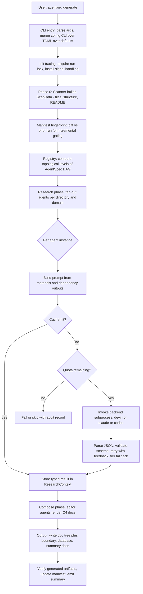
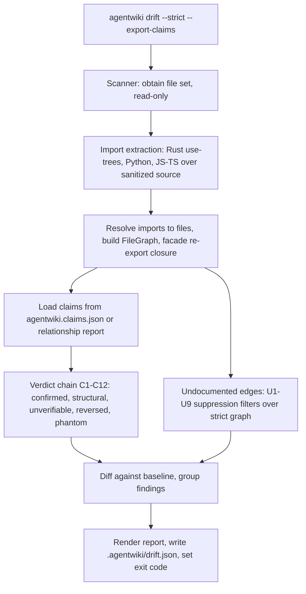
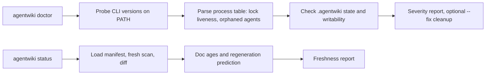
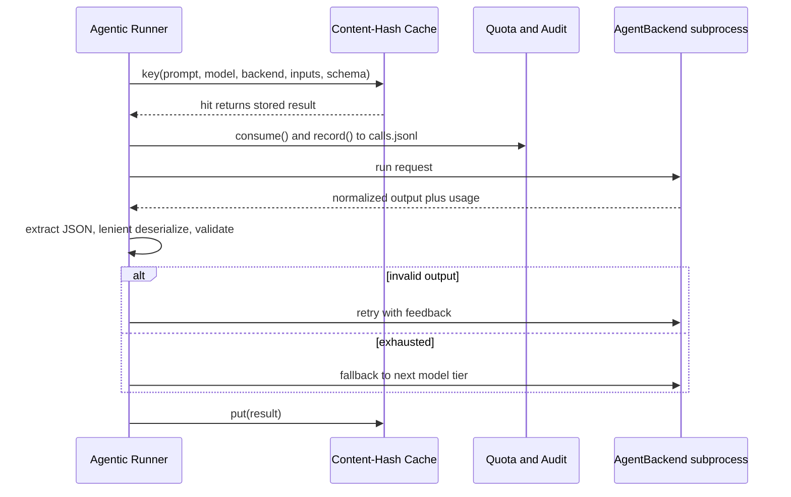

# Core Workflows

## 1. Workflow Overview

agentwiki là một CLI tool viết bằng Rust (v0.5.0) có nhiệm vụ sinh tài liệu kiến trúc kiểu C4 cho một codebase mục tiêu. Thay vì gọi trực tiếp API của LLM, hệ thống ủy quyền toàn bộ suy luận cho các agent CLI đã xác thực sẵn trên máy (`devin`, `claude`, `codex`) thông qua cơ chế subprocess. Điều này định hình toàn bộ workflow của hệ thống: **ranh giới chi phí nằm chính xác tại agentic runner** — mọi thứ trước và sau (scan, manifest diff, import extraction, drift classification, ghi file) đều là deterministic và miễn phí.

Hệ thống có ba nhóm workflow chính:

| Workflow | Entry point | Bản chất | LLM calls |
|---|---|---|---|
| Generate Documentation | `agentwiki generate` | Pipeline 4 giai đoạn: Preprocess → Research → Compose → Verify | Có (gated bởi cache/quota) |
| Drift Verification | `agentwiki drift` | Đối chiếu claims trong docs với import graph thật | Không (read-only) |
| Health & Freshness | `agentwiki doctor`, `agentwiki status` | Chẩn đoán môi trường, dự đoán regeneration | Không (read-only) |

Ba cơ chế governance xuyên suốt — **content-hash cache**, **daily quota + audit log**, **change manifest** — đảm bảo các run có thể incremental, giới hạn chi phí, và resumable. Drift engine đóng vai trò tầng verification độc lập, chống lại failure mode chính của LLM-generated docs: dependency claims bịa đặt hoặc đã lỗi thời.

## 2. Main Workflows

### 2.1 Generate Documentation Run (`agentwiki generate`)

Đây là workflow trung tâm (importance 10/10), biến một source repository thành cây tài liệu C4 đã được verify.

**Các bước thực thi:**

1. **CLI entry & setup** (`src/main.rs::main`, `src/cli.rs`): parse `Command::Generate`, áp dụng precedence chain `CLI > agentwiki.toml > defaults` (bao gồm profile và model-tier resolution qua `config.rs::model_for` / `find_profile`), init tracing, acquire run lock, install signal handler cho cooperative cancellation.

2. **Phase 0 — Repository scan** (`src/scanner/mod.rs::scan`): walk cây thư mục một cách deterministic, tuân thủ scan config và exclusion của output path. Sinh ra `ScanData`: file set, `DirectoryInfo`, README/docs extract, và `FileStatics` (lazy per-file statics qua `scanner/insights.rs`). Giai đoạn này hoàn toàn không dùng LLM.

3. **Incremental gating** (`src/manifest.rs::build/diff`): fingerprint scan inputs và environment theo từng output subtree (`subtree_fingerprint`). Diff với manifest đã lưu để phân loại thay đổi cosmetic vs structural → chỉ regenerate những vùng bị stale.

4. **DAG scheduling** (`src/agent/registry.rs::topo_levels`): registry khai báo các `AgentSpec` cho cả research phase (system context, domain modules, boundary, workflow, database, relationships, dir summary, key module) và compose phase (editor personas: overview, architecture, deep-dive, workflow). Mỗi spec định nghĩa phase, fan-out axis (per-directory, per-domain), model tier, dependencies, output schema. `topo_levels` sinh ra các level thực thi được — các node trong cùng level chạy song song, level sau phụ thuộc kết quả level trước.

5. **Agentic execution** (`src/agent/runner.rs::run_spec` → `run_instance`): mỗi instance trải qua governance loop (chi tiết ở §3.2) — render prompt từ `materials.rs` blocks + typed results của dependencies trong `ResearchContext` → check cache → consume quota + ghi audit `calls.jsonl` → gọi backend → `extract_json` + lenient deserialize → retry với feedback → fallback model tier → `insert` kết quả vào context.

6. **Backend dispatch** (`src/backend/mod.rs::for_kind` → `AgentBackend::run`): trait `AgentBackend` chuẩn hóa ba giao thức subprocess:
   - `devin -p`: reference backend, pass-through đơn giản nhất.
   - `claude -p`: prompt qua stdin, parse JSON envelope (result text, token usage, errors); hỗ trợ `claude:<model>@<effort>` và schema sanitization.
   - `codex exec`: prompt qua stdin + `-o` output file, parse JSONL event stream, `normalize_schema` cho yêu cầu chặt hơn về JSON schema.
   - `mock:*`: `MockBackend` scripted cho offline testing.

7. **Deterministic output & verification** (`src/output`): `write_docs` ghi doc tree; `boundary.rs`, `database.rs`, `summary.rs` render các tài liệu không cần LLM; `verify.rs` kiểm tra artifacts; manifest/cache/context snapshot được persist vào `.agentwiki/`.

### 2.2 Drift Verification (`agentwiki drift`)

Workflow read-only, hoàn toàn không gọi LLM, validate dependency claims trong docs đã generate đối chiếu với import graph thật. `--strict` biến nó thành CI gate qua exit code 0/1/2.

**Các giai đoạn:**

1. **Scan** (`scanner::scan`): lấy file set — tái sử dụng cùng Phase 0 của pipeline generate.
2. **Import extraction** (`drift/imports/`): sanitize source (loại comments/strings với byte-exact offsets), rồi extract imports per language: Rust `use`-tree expansion + `mod` resolution, Python relative/absolute imports, JS/TS ESM/CJS/dynamic forms.
3. **Resolution & graph building** (`drift/resolve/`): `RepoIndex::build` lập index repo; per-language resolvers ánh xạ import → file (Cargo crate layout, Python module suffix matching, JS extension/index probing); `build_file_graph` dựng `FileGraph` và áp facade re-export closure.
4. **Claim classification** (`drift/compare.rs::classify_claim`): load claims (`agentwiki.claims.json` hoặc relationship report — `CoreDependency`/`DependencyType`), chạy ordered verdict chain **C1–C12** với guards trước evidence, phân loại mỗi edge: `confirmed` / `structural` / `unverifiable` / `reversed` / `phantom`.
5. **Undocumented detection** (`drift/undocumented.rs::find`): filter chain **U1–U9** trên strict strong-evidence graph (dùng `reachable`, `hubs`, `facade_closure`) để lộ các dependency thật trong code nhưng vắng mặt trong claims.
6. **Reporting & baselining** (`drift/mod.rs::run`, `report.rs::render`, `baseline.rs`): diff với baseline đã persist, group findings (`finding_id`), render report, ghi `.agentwiki/drift.json`, set exit code deterministic cho scripting/CI.

### 2.3 Operational Health & Freshness (`agentwiki doctor`, `agentwiki status`)

- **`doctor`** (`src/doctor.rs::run`): probe version các agent CLI trên PATH (`probe_version`, `find_on_path`), parse process table (`sys.rs::list_processes`, `pid_alive`) để kiểm tra run-lock liveness và phát hiện agent process mồ côi, kiểm tra `.agentwiki/` state và writability. `--fix` dọn stale lock. Mọi kết quả đi qua severity/report primitives của `diag.rs`.
- **`status`** (`src/status.rs::build_report`): load stored manifest, chạy fresh scan, diff → báo tuổi của từng doc và **dự đoán** docs nào sẽ được regenerate ở run kế tiếp — một dry-run signal hữu ích trước khi tiêu quota.

## 3. Flow Coordination and Control

### 3.1 Orchestration: DAG + Fan-out + Bounded Concurrency

Pipeline Orchestrator (`src/pipeline/mod.rs`) giữ `PipelineCtx` — shared context chứa config, `ScanData`, cache, quota, backends, semaphore và cancellation token. Quan hệ điều phối chính:

- Pipeline → Registry: lặp qua `topo_levels`; trong mỗi level, `expand` mở rộng spec thành nhiều instance theo fan-out axis (per-directory, per-domain).
- Pipeline → Runner: gọi `run_spec` cho từng node; parallelism bị giới hạn bởi semaphore trong `PipelineCtx`; cancellation là cooperative (signal handler set flag, các instance check giữa các bước).
- Inter-agent data flow: `ResearchContext` (`src/agent/context.rs`) — async key-value store typed; agents ghi `insert`/`get_typed` JSON results; hỗ trợ `snapshot`/`save`/`load` để persist state giữa các run.

### 3.2 Governance Loop tại ranh giới chi phí

Control loop áp dụng cho **mọi** paid CLI call — đây là pattern định nghĩa cost & reliability behavior của tool:

- **Cache key** (`cache.rs::key`) = hash(prompt, model, backend, inputs, schema) → kết quả lưu dưới `.agentwiki/cache/`. Hệ quả: sửa prompt template sẽ invalidate cache rộng.
- **Quota** (`quota.rs`): `consume()` enforce daily cap; `record()` append RFC3339-stamped audit vào `calls.jsonl` — mỗi call thật đều có vết audit.
- **Prompt materials** (`materials.rs`): `render_material`, `dossier_from`, `filtered_insights` format ScanData/README/insights/relationship results thành markdown blocks có size cap; template render qua `prompt.rs` với `{{key}}` placeholders và disk-override trên embedded defaults.

### 3.3 Coordination giữa generate và drift

Drift là bounded context song song: tái dùng scanner (data dependency) và tiêu thụ report types của orchestration (`CoreDependency`, `DependencyType`) nhưng **không có runtime call** ngược lại. `doctor`/`status` inspect drift state (`.agentwiki/drift.json`) như một artifact. Hai workflow chia sẻ đúng một ground-truth source — file system — nên drift có thể re-derive import graph độc lập mà không phụ thuộc pipeline run.

## 4. Exception Handling and Recovery

| Tầng | Cơ chế | Chi tiết |
|---|---|---|
| Run-level | Run lock + signal handling | Lock acquire ở entry; `doctor` validate liveness qua `pid_alive`; `doctor --fix` dọn stale lock; cancellation cooperative qua `PipelineCtx` |
| Agent output | Retry-with-feedback | JSON extract/validate fail → error feedback được đưa vào prompt của retry kế tiếp |
| Model quality | Tier fallback | Hết retry ở tier hiện tại → fallback sang model tier kế tiếp (từ config `model_for`) |
| Malformed JSON | Lenient deserializers | `reports/lenient.rs` (`de_*`) chịu được LLM JSON xấu; `extract_json` tách JSON từ prose bọc ngoài |
| Cost overrun | Quota gate | `consume()` trước mỗi call; hết quota → fail/skip với audit record |
| Rerun cost | Content-hash cache | Rerun sau crash re-hit cache → resumable, rẻ |
| Backend failure | Error taxonomy | `error.rs` định nghĩa crate error types; backend envelopes/event streams được parse cho usage + turn failures; `tail` giữ phần output cuối cho diagnostics |
| Stale docs | Drift + manifest | Phantom/reversed claims → exit code ≠ 0 ở `--strict`; manifest diff phân loại cosmetic vs structural |
| File writes | Atomic writes | `util.rs::write_atomic` tránh corrupt `.agentwiki/` artifacts khi crash giữa chừng |

Nguyên tắc chung: **recover bằng determinism**. Vì mọi thứ ngoài agentic runner đều deterministic và cache làm rerun rẻ, chiến lược recovery ưu tiên là "chạy lại" thay vì checkpoint phức tạp.

## 5. Key Process Implementation

### 5.1 Phase 0 — Deterministic Scanning

`scanner::scan` → `scan_files` (walk honoring config + output exclusion) → `build_structure` (DirectoryInfo model) → `extract_docs` (README). `insights.rs` cung cấp `FileStatics::for_entry` lazy — statics chỉ tính khi prompt materials cần. ScanData được dùng bởi cả pipeline lẫn drift analyzer, đảm bảo hai context nhìn cùng một file set.

### 5.2 Prompt Assembly

`runner::build_prompt` kết hợp: (a) template từ `PromptLoader::load` (disk override > embedded `prompts/` assets — research personas và editor personas có strict Mermaid rules), (b) materials blocks có size cap, (c) typed outputs của dependencies lấy từ `ResearchContext::get_typed`. Đây là điểm duy nhất nơi ScanData biến thành LLM input.

### 5.3 Backend Normalization

`BackendKind::parse` xử lý chuỗi `<backend>:<model>` (và `claude:<model>@<effort>`); `for_kind` là factory; `sanitized_env` lọc env trước khi spawn subprocess. Ba implementations khác nhau chủ yếu ở **envelope parsing**: devin = pass-through, claude = JSON envelope (`parse_envelope` + `sanitize_schema`), codex = JSONL event stream (`parse_events` + `normalize_schema`). `MockBackend` (`canned`, `with_delay`) cho phép test toàn pipeline offline qua `mock:*` model strings.

### 5.4 Drift Verdict Chains

- **Claims → verdicts** (`compare.rs`): `normalize_claims` → ordered chain C1–C12, guards chạy trước evidence → verdict ∈ {confirmed, structural, unverifiable, reversed, phantom}. `finding_id` ổn định hóa identity của finding cho baseline diff.
- **Graph → undocumented** (`undocumented.rs`): chạy trên strict strong-evidence subgraph; U1–U9 filters loại bỏ edges không đáng báo (hub nodes, facade-reachable, v.v.) trước khi surface.

### 5.5 State Layout

Toàn bộ mutable state nằm trong `.agentwiki/`: `cache/` (content-hash results), `manifest` (per-output fingerprints), `calls.jsonl` (audit), `drift.json` (versioned report + baseline), context snapshot, run lock. Target repo chỉ được **đọc** — docs đi vào docs directory, state đi vào `.agentwiki/`, không có write access nào khác.

### 5.6 Performance Characteristics

- **Concurrency**: fan-out agents trong cùng topo level chạy song song, bounded bởi semaphore → throughput giới hạn bởi cả semaphore lẫn quota.
- **Cost control**: cache hit rate là lever chính; manifest fingerprints giới hạn scope regenerate; `status` cho preview trước khi tốn call.
- **Latency**: file statics lazy; scan deterministic một lần dùng cho cả generate lẫn drift.
- **Testability**: `AGENTWIKI_E2E=1` bật e2e suite; MockBackend cho offline iteration trên prompts/schemas — giảm chi phí phát triển.
- **Extensibility points**: thêm backend = implement `AgentBackend` + đăng ký `for_kind`; thêm ngôn ngữ cho drift = thêm extractor + resolver; thêm document type = thêm AgentSpec vào registry + editor persona trong `prompts/editors/`.